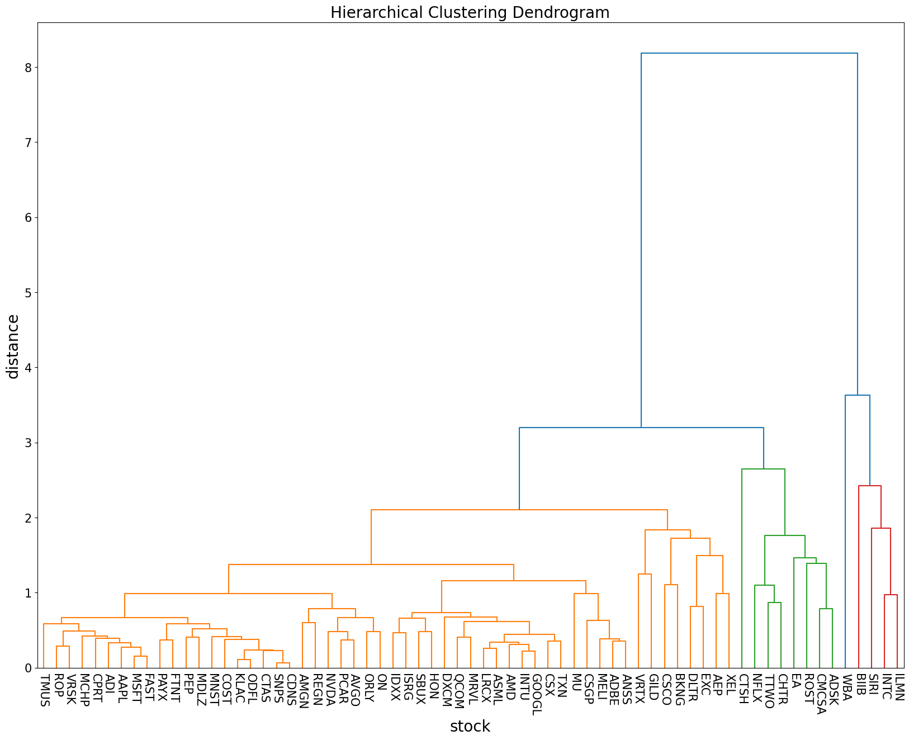
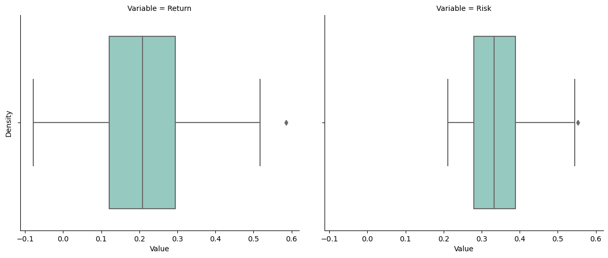
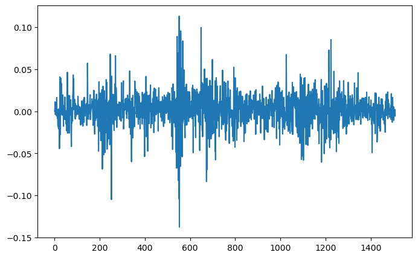
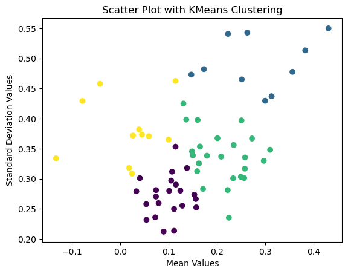
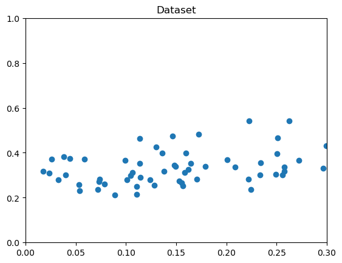
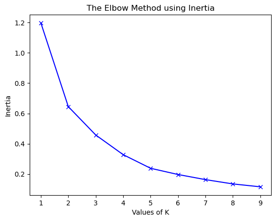
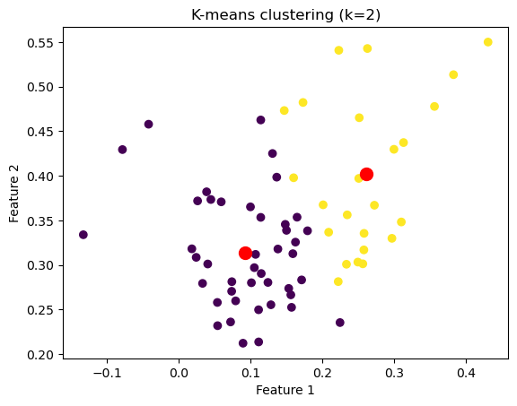
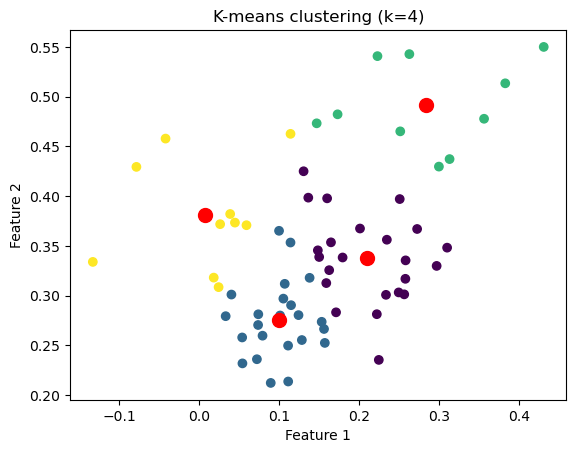

```python
tickerList = ["CPRT","COST","AAPL","AMGN","CMCSA","INTC","KLAC","PCAR","CTAS","PAYX","LRCX","ADSK","ROST","MNST","MSFT","ADBE","FAST","EA","CSCO","REGN","IDXX","VRTX","BIIB","ODFL","QCOM","GILD","SNPS","SBUX","SIRI","INTU","MCHP","ORLY","DLTR","ASML","ANSS","TTWO","CTSH","CSGP","NVDA","BKNG","ON","ISRG","MRVL","ILMN","ADI","AEP","AMD","CDNS","CSX","HON","MU","XEL","EXC","PEP","ROP","TXN","WBA","MDLZ","NFLX","GOOGL","DXCM","TMUS","MELI","AVGO","VRSK","FTNT","CHTR"]
```

```python
stockDf.corr()


```


    


```python
plt.figure(figsize=(20, 15))
labelsize=20
ticksize=15
plt.title('Hierarchical Clustering Dendrogram', fontsize=labelsize)
plt.xlabel('stock', fontsize=labelsize)
plt.ylabel('distance', fontsize=labelsize)
dendrogram(
    Z,
    leaf_rotation=90.,
    color_threshold=3,# rotates the x axis labels
    leaf_font_size=8.,  # font size for the x axis labels
    labels = corr.columns
)
pylab.yticks(fontsize=ticksize)
pylab.xticks(rotation=-90, fontsize=ticksize)

plt.show()
```


    



```python

```


```python

# code
# Visualizing The Close Price of all the stocks

# to set the plot size
plt.figure(figsize=(16, 8))

# using plot method to plot open prices.
# in plot method we set the label and color of the curve.

AAPL['SMA30'].plot(label='AAPL', color='orange')
CPRT['SMA30'].plot(label='CPRM')
AMGN['SMA30'].plot(label='AMGN')
PCAR['SMA30'].plot(label='PCAR')


# adding title to the plot
plt.title('Close Price Plot')

# adding Label to the x-axis
plt.xlabel('Years')

# adding legend to the curve
plt.legend()
```


    <matplotlib.legend.Legend at 0x22143366750>


    

    


```python
plt.figure(figsize=(8, 6))
sns.heatmap(correlation_matrix, annot=True, cmap='coolwarm', fmt=".2f")
plt.title('Correlation Matrix of Stock Prices')
plt.xlabel('Stocks')
plt.ylabel('Stocks')
plt.show()
```


    

    


```python

value_A =returnList
value_B =riskList


box_plot_data=[value_A,value_B]
plt.title(" Distribution")
plt.boxplot(box_plot_data,patch_artist=True,labels=['Return','Risk'])
plt.show()
```


    

    


```python
import matplotlib.pyplot as plt
import pandas as pd
import seaborn as sns

# Assuming returnList and riskList are already defined as lists of return and risk values

# Create a DataFrame for box plot data
box_plot_data = pd.DataFrame({"Return": tempdf["return"], "Risk": tempdf["risk"]})

# Melt the DataFrame for FacetGrid
melted_df = box_plot_data.melt(var_name="Variable", value_name="Value")

# Create a FacetGrid with two columns
g = sns.FacetGrid(melted_df, col="Variable", col_wrap=2)
g.map(sns.boxplot, "Value", palette="Set3")

# Set plot size
g.fig.set_size_inches(12, 6)

# Set labels
g.set_axis_labels("Value", "Density")

plt.show()

```
    
    


    

    


Return Distribution:

The returns exhibit a moderate spread, with the majority of returns concentrated between the 1st and 3rd quartiles (0.22 to 0.29).
The median return of approximately 0.288 suggests that half of the returns fall below this value, indicating a central tendency in the dataset.
The presence of outliers with return values around 0.5 indicates the presence of extreme positive returns, which may be attributed to exceptional performance or anomalies in specific stocks.

Risk Distribution:

The distribution of risk values shows a wider spread compared to returns, with the majority of risks concentrated between the 1st and 3rd quartiles (0.34 to 0.52).
The median risk value of approximately 0.42 suggests a central tendency in the dataset, indicating a moderate level of risk.
The presence of outliers with risk values around 0.8 indicates the presence of extreme risk levels, which may be associated with specific stocks or market conditions.
Risk-Return Relationship:

The moderate spread in returns and risks suggests a balanced risk-return relationship in the dataset, with returns generally commensurate with the level of risk.
However, the presence of outliers with significantly higher returns and risks indicates the presence of stocks with exceptional performance or elevated risk levels that may deviate from the overall trend.


```python
# Plotting the Simple Return series using matplotlib.pyplot
AAPL['Log Return'].plot(figsize=(8,5))
plt.show()
```


    

    


```python
daily_log_returns
```


    7.146578382434848e-05
```

    

```      

    
```python
kmeans = KMeans(n_clusters=2)
kmeans.fit(data)

plt.scatter(meanList,stdList, c=kmeans.labels_)
plt.title("Scattered plot with K-means Clustering")
plt.xlabel("Mean Values")
plt.ylabel("Standard deviation Values")
plt.show()
``` 

    


```python
kmeans = KMeans(n_clusters=3)
kmeans.fit(data)

plt.scatter(meanList,stdList, c=kmeans.labels_)
plt.title('Scatter Plot with KMeans Clustering')
plt.xlabel('Return')
plt.ylabel('Risk')
plt.show()
```

    

    

    


```python
# mean_std_df.head()
# print(mean_std_df)
rslt_df = mean_std_df[mean_std_df['sharpe_ratio'] > 0.6]
print(rslt_df)
```

       symbol      mean       std  sharpe_ratio
    0    CPRT  0.249181  0.303259      0.821677
    1    COST  0.224311  0.235421      0.952807
    2    AAPL  0.257537  0.316939      0.812576
    6    KLAC  0.299470  0.429754      0.696840
    8    CTAS  0.233289  0.300836      0.775468
    14   MSFT  0.256103  0.301306      0.849975
    16   FAST  0.170833  0.283254      0.603109
    20   IDXX  0.208499  0.336781      0.619095
    23   ODFL  0.257811  0.335484      0.768477
    26   SNPS  0.296634  0.329911      0.899134
    29   INTU  0.234364  0.356238      0.657886
    31   ORLY  0.221825  0.281369      0.788379
    33   ASML  0.250474  0.397122      0.630722
    38   NVDA  0.382430  0.513483      0.744777
    46    AMD  0.430561  0.550066      0.782743
    47   CDNS  0.309732  0.348257      0.889378
    60   DXCM  0.355940  0.477840      0.744894
    63   AVGO  0.272220  0.367037      0.741671
    64   VRSK  0.156801  0.252498      0.620997
    65   FTNT  0.312809  0.437311      0.715301
    


```python
kmeans = KMeans(n_clusters=4)
kmeans.fit(data)

plt.scatter(meanList,stdList, c=kmeans.labels_)
plt.title("Scatter Plot with KMeans Clustering")
plt.xlabel("Mean Values")
plt.ylabel("Standard Deviation Values")
plt.show()
```

   


    

    


```python
from sklearn.cluster import KMeans
from sklearn import metrics
from scipy.spatial.distance import cdist
```


```python
X = np.array(list(zip(meanList,stdList))).reshape(len(meanList), 2)

# Visualizing the data
plt.plot()
plt.xlim([0, .3])
plt.ylim([0, 1])
plt.title('Dataset')
plt.scatter(meanList,stdList)
plt.show()
```


    

    


```python

plt.plot(K, distortions, 'bx-')
plt.xlabel('Values of K')
plt.ylabel('Distortion')
plt.title('The Elbow Method using Distortion')
plt.show()
```


    

    


```python

for key, val in mapping2.items():
    print(f'{key} : {val}')
```

    1 : 1.19790143928499
    2 : 0.6448991333887291
    3 : 0.45758102926055133
    4 : 0.3277184175270954
    5 : 0.23769069293156792
    6 : 0.19663525677757665
    7 : 0.1628488271033225
    8 : 0.13440169622521064
    9 : 0.11537387731742338
    


```python

plt.plot(K, inertias, 'bx-')
plt.xlabel('Values of K')
plt.ylabel('Inertia')
plt.title('The Elbow Method using Inertia')
plt.show()
```


    

    


```python

import matplotlib.pyplot as plt

# Create a range of values for k
k_range = range(1, 5)

# Initialize an empty list to
# store the inertia values for each k
inertia_values = []

# Fit and plot the data for each k value
for k in k_range:
    kmeans = KMeans(n_clusters=k, \
                    init='k-means++', random_state=42)
    y_kmeans = kmeans.fit_predict(X)
    inertia_values.append(kmeans.inertia_)
    plt.scatter(X[:, 0], X[:, 1], c=y_kmeans)
    plt.scatter(kmeans.cluster_centers_[:, 0],\
                kmeans.cluster_centers_[:, 1], \
                s=100, c='red')
    plt.title('K-means clustering (k={})'.format(k))
    plt.xlabel('Feature 1')
    plt.ylabel('Feature 2')
    plt.show()

# Plot the inertia values for each k
plt.plot(k_range, inertia_values, 'bo-')
plt.title('Elbow Method')
plt.xlabel('Number of clusters (k)')
plt.ylabel('Inertia')
plt.show()
```

  


    

    


    


    

    


  


    

    


    

    


 
    


```python

```
