```python
import pandas as pd
import numpy as np
import yfinance as yahooFinance
import matplotlib.pyplot as plt
plt.style.use('default')
%matplotlib inline
import matplotlib.pyplot as plt
import matplotlib.pyplot as mp
import seaborn as sb

```


```python
tickerList = ["CPRT","COST","AAPL","AMGN","CMCSA","INTC","KLAC","PCAR","CTAS","PAYX","LRCX","ADSK","ROST","MNST","MSFT","ADBE","FAST","EA","CSCO","REGN","IDXX","VRTX","BIIB","ODFL","QCOM","GILD","SNPS","SBUX","SIRI","INTU","MCHP","ORLY","DLTR","ASML","ANSS","TTWO","CTSH","CSGP","NVDA","BKNG","ON","ISRG","MRVL","ILMN","ADI","AEP","AMD","CDNS","CSX","HON","MU","XEL","EXC","PEP","ROP","TXN","WBA","MDLZ","NFLX","GOOGL","DXCM","TMUS","MELI","AVGO","VRSK","FTNT","CHTR"]
```


```python
getInfo = yahooFinance.Ticker("CPRT")
data = getInfo.history(start="2018-01-01",
                                     end="2023-12-31")
# multi_data = yf.download(["AAPL", "MSFT"], start="2020-01-01", end="2021-01-01")
# print(multi_data)
# # pass the parameters as the taken dates for start and end
# print(GetFacebookInformation.history(start=startDate,
#                                      end=endDate))
```


```python
data.head()
data.info()
```

    <class 'pandas.core.frame.DataFrame'>
    DatetimeIndex: 1509 entries, 2018-01-02 00:00:00-05:00 to 2023-12-29 00:00:00-05:00
    Data columns (total 7 columns):
     #   Column        Non-Null Count  Dtype  
    ---  ------        --------------  -----  
     0   Open          1509 non-null   float64
     1   High          1509 non-null   float64
     2   Low           1509 non-null   float64
     3   Close         1509 non-null   float64
     4   Volume        1509 non-null   int64  
     5   Dividends     1509 non-null   float64
     6   Stock Splits  1509 non-null   float64
    dtypes: float64(6), int64(1)
    memory usage: 94.3 KB
    


```python
tickerClose = {"tickerName":[],"Close":[]}
stockDf = pd.DataFrame()
data = []
for i in tickerList:
  getInfo = yahooFinance.Ticker(i)
  data = getInfo.history(start="2018-01-01",
                                     end="2023-12-31")
  tickerClose["tickerName"].append(i)
  tickerClose["Close"].append(list(data["Close"]))
  stockDf[i] = list(data["Close"])
  data.to_csv("./{}.csv".format(i))
dataCol = data.index

stockDf.index = list(dataCol)


```


```python
stockDf.head()
```


<div>
<style scoped>
    .dataframe tbody tr th:only-of-type {
        vertical-align: middle;
    }

    .dataframe tbody tr th {
        vertical-align: top;
    }

    .dataframe thead th {
        text-align: right;
    }
</style>
<table border="1" class="dataframe">
  <thead>
    <tr style="text-align: right;">
      <th></th>
      <th>CPRT</th>
      <th>COST</th>
      <th>AAPL</th>
      <th>AMGN</th>
      <th>CMCSA</th>
      <th>INTC</th>
      <th>KLAC</th>
      <th>PCAR</th>
      <th>CTAS</th>
      <th>PAYX</th>
      <th>...</th>
      <th>MDLZ</th>
      <th>NFLX</th>
      <th>GOOGL</th>
      <th>DXCM</th>
      <th>TMUS</th>
      <th>MELI</th>
      <th>AVGO</th>
      <th>VRSK</th>
      <th>FTNT</th>
      <th>CHTR</th>
    </tr>
  </thead>
  <tbody>
    <tr>
      <th>2018-01-02 00:00:00-05:00</th>
      <td>10.9000</td>
      <td>170.348923</td>
      <td>40.670971</td>
      <td>146.429138</td>
      <td>35.479393</td>
      <td>39.740643</td>
      <td>95.263412</td>
      <td>38.056583</td>
      <td>147.219421</td>
      <td>56.006149</td>
      <td>...</td>
      <td>36.859428</td>
      <td>201.070007</td>
      <td>53.660500</td>
      <td>14.4975</td>
      <td>63.508636</td>
      <td>322.579987</td>
      <td>215.173996</td>
      <td>92.610535</td>
      <td>8.870</td>
      <td>348.970001</td>
    </tr>
    <tr>
      <th>2018-01-03 00:00:00-05:00</th>
      <td>10.8475</td>
      <td>172.393265</td>
      <td>40.663887</td>
      <td>149.192245</td>
      <td>34.909241</td>
      <td>38.391926</td>
      <td>96.376450</td>
      <td>38.520439</td>
      <td>148.693008</td>
      <td>56.813244</td>
      <td>...</td>
      <td>37.007168</td>
      <td>205.050003</td>
      <td>54.576000</td>
      <td>14.5200</td>
      <td>63.082207</td>
      <td>329.279999</td>
      <td>217.527039</td>
      <td>92.339935</td>
      <td>9.006</td>
      <td>353.029999</td>
    </tr>
    <tr>
      <th>2018-01-04 00:00:00-05:00</th>
      <td>10.9350</td>
      <td>171.054550</td>
      <td>40.852768</td>
      <td>148.563507</td>
      <td>35.133839</td>
      <td>37.687874</td>
      <td>96.547005</td>
      <td>39.010342</td>
      <td>151.274139</td>
      <td>57.345798</td>
      <td>...</td>
      <td>37.094093</td>
      <td>205.630005</td>
      <td>54.787998</td>
      <td>13.0625</td>
      <td>62.477264</td>
      <td>325.880005</td>
      <td>217.599609</td>
      <td>92.803787</td>
      <td>8.800</td>
      <td>349.790009</td>
    </tr>
    <tr>
      <th>2018-01-05 00:00:00-05:00</th>
      <td>10.8825</td>
      <td>169.833328</td>
      <td>41.317894</td>
      <td>149.448685</td>
      <td>35.453476</td>
      <td>37.950832</td>
      <td>98.611504</td>
      <td>39.140640</td>
      <td>151.715317</td>
      <td>57.171051</td>
      <td>...</td>
      <td>37.572102</td>
      <td>209.990005</td>
      <td>55.514500</td>
      <td>13.3150</td>
      <td>64.063988</td>
      <td>330.869995</td>
      <td>218.888992</td>
      <td>93.625229</td>
      <td>8.820</td>
      <td>350.880005</td>
    </tr>
    <tr>
      <th>2018-01-08 00:00:00-05:00</th>
      <td>10.8875</td>
      <td>170.493698</td>
      <td>41.164425</td>
      <td>149.407333</td>
      <td>34.969707</td>
      <td>37.950832</td>
      <td>98.880791</td>
      <td>39.015560</td>
      <td>151.959335</td>
      <td>56.813244</td>
      <td>...</td>
      <td>37.380901</td>
      <td>212.050003</td>
      <td>55.710499</td>
      <td>13.8600</td>
      <td>64.559845</td>
      <td>340.790009</td>
      <td>219.412811</td>
      <td>93.741203</td>
      <td>9.000</td>
      <td>356.549988</td>
    </tr>
  </tbody>
</table>
<p>5 rows × 67 columns</p>
</div>


```python
stockDf.corr()
# # plotting correlation heatmap
# dataplot = sb.heatmap(stockDf.corr(), cmap="YlGnBu", annot=True)

# # displaying heatmap
# mp.show()
```


<div>
<style scoped>
    .dataframe tbody tr th:only-of-type {
        vertical-align: middle;
    }

    .dataframe tbody tr th {
        vertical-align: top;
    }

    .dataframe thead th {
        text-align: right;
    }
</style>
<table border="1" class="dataframe">
  <thead>
    <tr style="text-align: right;">
      <th></th>
      <th>CPRT</th>
      <th>COST</th>
      <th>AAPL</th>
      <th>AMGN</th>
      <th>CMCSA</th>
      <th>INTC</th>
      <th>KLAC</th>
      <th>PCAR</th>
      <th>CTAS</th>
      <th>PAYX</th>
      <th>...</th>
      <th>MDLZ</th>
      <th>NFLX</th>
      <th>GOOGL</th>
      <th>DXCM</th>
      <th>TMUS</th>
      <th>MELI</th>
      <th>AVGO</th>
      <th>VRSK</th>
      <th>FTNT</th>
      <th>CHTR</th>
    </tr>
  </thead>
  <tbody>
    <tr>
      <th>CPRT</th>
      <td>1.000000</td>
      <td>0.920854</td>
      <td>0.943590</td>
      <td>0.814534</td>
      <td>0.597930</td>
      <td>-0.228064</td>
      <td>0.958541</td>
      <td>0.921291</td>
      <td>0.968794</td>
      <td>0.868238</td>
      <td>...</td>
      <td>0.936989</td>
      <td>0.406922</td>
      <td>0.891483</td>
      <td>0.853044</td>
      <td>0.882507</td>
      <td>0.811985</td>
      <td>0.933608</td>
      <td>0.951438</td>
      <td>0.883653</td>
      <td>0.391548</td>
    </tr>
    <tr>
      <th>COST</th>
      <td>0.920854</td>
      <td>1.000000</td>
      <td>0.967788</td>
      <td>0.846504</td>
      <td>0.456090</td>
      <td>-0.362040</td>
      <td>0.956321</td>
      <td>0.861290</td>
      <td>0.965077</td>
      <td>0.961047</td>
      <td>...</td>
      <td>0.929577</td>
      <td>0.194900</td>
      <td>0.899699</td>
      <td>0.841942</td>
      <td>0.895924</td>
      <td>0.685171</td>
      <td>0.912052</td>
      <td>0.910704</td>
      <td>0.941252</td>
      <td>0.305504</td>
    </tr>
    <tr>
      <th>AAPL</th>
      <td>0.943590</td>
      <td>0.967788</td>
      <td>1.000000</td>
      <td>0.848973</td>
      <td>0.538282</td>
      <td>-0.288615</td>
      <td>0.963051</td>
      <td>0.875483</td>
      <td>0.962189</td>
      <td>0.923972</td>
      <td>...</td>
      <td>0.925698</td>
      <td>0.317674</td>
      <td>0.927587</td>
      <td>0.884290</td>
      <td>0.929416</td>
      <td>0.787900</td>
      <td>0.907673</td>
      <td>0.924416</td>
      <td>0.942106</td>
      <td>0.400695</td>
    </tr>
    <tr>
      <th>AMGN</th>
      <td>0.814534</td>
      <td>0.846504</td>
      <td>0.848973</td>
      <td>1.000000</td>
      <td>0.386587</td>
      <td>-0.268312</td>
      <td>0.845058</td>
      <td>0.845813</td>
      <td>0.868228</td>
      <td>0.781030</td>
      <td>...</td>
      <td>0.838851</td>
      <td>0.151702</td>
      <td>0.708889</td>
      <td>0.759203</td>
      <td>0.895274</td>
      <td>0.653862</td>
      <td>0.790462</td>
      <td>0.802942</td>
      <td>0.742588</td>
      <td>0.297899</td>
    </tr>
    <tr>
      <th>CMCSA</th>
      <td>0.597930</td>
      <td>0.456090</td>
      <td>0.538282</td>
      <td>0.386587</td>
      <td>1.000000</td>
      <td>0.423297</td>
      <td>0.505874</td>
      <td>0.391132</td>
      <td>0.496548</td>
      <td>0.495857</td>
      <td>...</td>
      <td>0.514918</td>
      <td>0.677289</td>
      <td>0.695444</td>
      <td>0.604495</td>
      <td>0.546095</td>
      <td>0.811396</td>
      <td>0.414568</td>
      <td>0.628445</td>
      <td>0.488661</td>
      <td>0.868282</td>
    </tr>
    <tr>
      <th>...</th>
      <td>...</td>
      <td>...</td>
      <td>...</td>
      <td>...</td>
      <td>...</td>
      <td>...</td>
      <td>...</td>
      <td>...</td>
      <td>...</td>
      <td>...</td>
      <td>...</td>
      <td>...</td>
      <td>...</td>
      <td>...</td>
      <td>...</td>
      <td>...</td>
      <td>...</td>
      <td>...</td>
      <td>...</td>
      <td>...</td>
      <td>...</td>
    </tr>
    <tr>
      <th>MELI</th>
      <td>0.811985</td>
      <td>0.685171</td>
      <td>0.787900</td>
      <td>0.653862</td>
      <td>0.811396</td>
      <td>0.112641</td>
      <td>0.744519</td>
      <td>0.672682</td>
      <td>0.750353</td>
      <td>0.648764</td>
      <td>...</td>
      <td>0.710393</td>
      <td>0.689609</td>
      <td>0.794739</td>
      <td>0.838594</td>
      <td>0.820635</td>
      <td>1.000000</td>
      <td>0.649756</td>
      <td>0.819661</td>
      <td>0.677175</td>
      <td>0.725970</td>
    </tr>
    <tr>
      <th>AVGO</th>
      <td>0.933608</td>
      <td>0.912052</td>
      <td>0.907673</td>
      <td>0.790462</td>
      <td>0.414568</td>
      <td>-0.359270</td>
      <td>0.962227</td>
      <td>0.956437</td>
      <td>0.938914</td>
      <td>0.857789</td>
      <td>...</td>
      <td>0.897617</td>
      <td>0.213224</td>
      <td>0.830819</td>
      <td>0.718068</td>
      <td>0.807645</td>
      <td>0.649756</td>
      <td>1.000000</td>
      <td>0.871101</td>
      <td>0.857455</td>
      <td>0.139953</td>
    </tr>
    <tr>
      <th>VRSK</th>
      <td>0.951438</td>
      <td>0.910704</td>
      <td>0.924416</td>
      <td>0.802942</td>
      <td>0.628445</td>
      <td>-0.144662</td>
      <td>0.903809</td>
      <td>0.849688</td>
      <td>0.931125</td>
      <td>0.846175</td>
      <td>...</td>
      <td>0.907520</td>
      <td>0.448372</td>
      <td>0.868551</td>
      <td>0.871313</td>
      <td>0.857740</td>
      <td>0.819661</td>
      <td>0.871101</td>
      <td>1.000000</td>
      <td>0.838975</td>
      <td>0.483285</td>
    </tr>
    <tr>
      <th>FTNT</th>
      <td>0.883653</td>
      <td>0.941252</td>
      <td>0.942106</td>
      <td>0.742588</td>
      <td>0.488661</td>
      <td>-0.334661</td>
      <td>0.919306</td>
      <td>0.780501</td>
      <td>0.908700</td>
      <td>0.937412</td>
      <td>...</td>
      <td>0.893538</td>
      <td>0.239326</td>
      <td>0.924204</td>
      <td>0.862962</td>
      <td>0.854768</td>
      <td>0.677175</td>
      <td>0.857455</td>
      <td>0.838975</td>
      <td>1.000000</td>
      <td>0.332219</td>
    </tr>
    <tr>
      <th>CHTR</th>
      <td>0.391548</td>
      <td>0.305504</td>
      <td>0.400695</td>
      <td>0.297899</td>
      <td>0.868282</td>
      <td>0.558167</td>
      <td>0.291414</td>
      <td>0.136713</td>
      <td>0.299347</td>
      <td>0.311063</td>
      <td>...</td>
      <td>0.302020</td>
      <td>0.722713</td>
      <td>0.545876</td>
      <td>0.588932</td>
      <td>0.442633</td>
      <td>0.725970</td>
      <td>0.139953</td>
      <td>0.483285</td>
      <td>0.332219</td>
      <td>1.000000</td>
    </tr>
  </tbody>
</table>
<p>67 rows × 67 columns</p>
</div>


```python
import seaborn as sns
sns.heatmap(stockDf.corr())
plt.show()
```


    
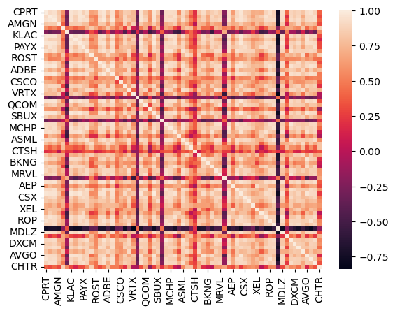
    


```python
# from dash import Dash, dcc, html, Input, Output
# import plotly.graph_objects as go
# import pandas as pd

# # # Load your stock data into a DataFrame
# # stockDf = pd.read_csv('your_stock_data.csv', index_col=0)  # Replace 'your_stock_data.csv' with your actual file path

# # Calculate the correlation matrix
# correlation_matrix = stockDf.corr()

# # Create a Dash app
# app = Dash(__name__)

# # Define the app layout
# app.layout = html.Div([
#     html.H4('Stock Correlation Heatmap'),
#     dcc.Graph(id='heatmap-graph')
# ])

# # Define callback to update the heatmap
# @app.callback(
#     Output('heatmap-graph', 'figure'),
#     [Input('heatmap-graph', 'clickData')]  # You can add more inputs if needed
# )
# def update_heatmap(clickData):
#     # Create the heatmap figure
#     fig = go.Figure(data=go.Heatmap(
#         z=correlation_matrix.values,
#         x=correlation_matrix.columns,
#         y=correlation_matrix.index,
#         colorscale='Viridis'))

#     fig.update_layout(
#         title='Correlation Heatmap of Stock Data',
#         xaxis_title='Stock Tickers',
#         yaxis_title='Stock Tickers'
#     )

#     return fig

# # Run the app
# if __name__ == '__main__':
#     app.run_server(debug=True)

```


```python
from dash import Dash, dcc, html, Input, Output
import plotly.graph_objects as go
import pandas as pd


# Calculate the correlation matrix
correlation_matrix = stockDf.corr()

# Create a Dash app
app = Dash(__name__)

# Define the options for the stock selection dropdown
stock_options = [{'label': stock, 'value': stock} for stock in correlation_matrix.columns]

# Define the app layout
app.layout = html.Div([
    html.H4('Stock Correlation Heatmap'),
    dcc.Dropdown(
        id='stock-selector',
        options=stock_options,
        value=correlation_matrix.columns[:2],  # Default selected stocks
        multi=True
    ),
    dcc.Graph(id='heatmap-graph')
])

# Define callback to update the heatmap
@app.callback(
    Output('heatmap-graph', 'figure'),
    [Input('stock-selector', 'value')]
)
def update_heatmap(selected_stocks):
    # Filter the correlation matrix based on selected stocks
    filtered_matrix = correlation_matrix.loc[selected_stocks, selected_stocks]

    # Create the heatmap figure
    fig = go.Figure(data=go.Heatmap(
        z=filtered_matrix.values,
        x=filtered_matrix.columns,
        y=filtered_matrix.index,
        colorscale='Viridis'))

    fig.update_layout(
        title='Correlation Heatmap of Selected Stocks',
        xaxis_title='Stock Tickers',
        yaxis_title='Stock Tickers'
    )

    return fig

# Run the app
if __name__ == '__main__':
    app.run_server(debug=True)

```


<iframe
    width="100%"
    height="650"
    src="http://127.0.0.1:8050/"
    frameborder="0"
    allowfullscreen

></iframe>


```python
# generating pairwise correlation
corr = stockDf.corr()

# Displaying dataframe as an heatmap
# with diverging colourmap as coolwarm
corr.style.background_gradient(cmap ='coolwarm')
```


<style type="text/css">
#T_f4384_row0_col0, #T_f4384_row1_col1, #T_f4384_row2_col2, #T_f4384_row3_col3, #T_f4384_row4_col4, #T_f4384_row5_col5, #T_f4384_row6_col6, #T_f4384_row7_col7, #T_f4384_row8_col8, #T_f4384_row9_col9, #T_f4384_row10_col10, #T_f4384_row11_col11, #T_f4384_row12_col12, #T_f4384_row13_col13, #T_f4384_row14_col14, #T_f4384_row15_col15, #T_f4384_row16_col16, #T_f4384_row17_col17, #T_f4384_row18_col18, #T_f4384_row19_col19, #T_f4384_row20_col20, #T_f4384_row21_col21, #T_f4384_row22_col22, #T_f4384_row23_col23, #T_f4384_row24_col24, #T_f4384_row25_col25, #T_f4384_row26_col26, #T_f4384_row26_col47, #T_f4384_row27_col27, #T_f4384_row28_col28, #T_f4384_row29_col29, #T_f4384_row30_col30, #T_f4384_row31_col31, #T_f4384_row32_col32, #T_f4384_row33_col33, #T_f4384_row34_col34, #T_f4384_row35_col35, #T_f4384_row36_col36, #T_f4384_row37_col37, #T_f4384_row38_col38, #T_f4384_row39_col39, #T_f4384_row40_col40, #T_f4384_row41_col41, #T_f4384_row42_col42, #T_f4384_row43_col43, #T_f4384_row44_col44, #T_f4384_row45_col45, #T_f4384_row46_col46, #T_f4384_row47_col26, #T_f4384_row47_col47, #T_f4384_row48_col48, #T_f4384_row49_col49, #T_f4384_row50_col50, #T_f4384_row51_col51, #T_f4384_row52_col52, #T_f4384_row53_col53, #T_f4384_row54_col54, #T_f4384_row55_col55, #T_f4384_row56_col56, #T_f4384_row57_col57, #T_f4384_row58_col58, #T_f4384_row59_col59, #T_f4384_row60_col60, #T_f4384_row61_col61, #T_f4384_row62_col62, #T_f4384_row63_col63, #T_f4384_row64_col64, #T_f4384_row65_col65, #T_f4384_row66_col66 {
  background-color: #b40426;
  color: #f1f1f1;
}
#T_f4384_row0_col1, #T_f4384_row0_col7, #T_f4384_row0_col30, #T_f4384_row0_col38, #T_f4384_row1_col0, #T_f4384_row2_col33, #T_f4384_row2_col54, #T_f4384_row6_col38, #T_f4384_row6_col40, #T_f4384_row6_col53, #T_f4384_row7_col0, #T_f4384_row8_col9, #T_f4384_row8_col30, #T_f4384_row8_col61, #T_f4384_row9_col2, #T_f4384_row10_col54, #T_f4384_row14_col30, #T_f4384_row16_col65, #T_f4384_row23_col10, #T_f4384_row23_col38, #T_f4384_row23_col40, #T_f4384_row23_col57, #T_f4384_row24_col46, #T_f4384_row26_col53, #T_f4384_row26_col64, #T_f4384_row29_col2, #T_f4384_row29_col41, #T_f4384_row30_col13, #T_f4384_row30_col14, #T_f4384_row30_col26, #T_f4384_row30_col47, #T_f4384_row33_col6, #T_f4384_row33_col23, #T_f4384_row33_col65, #T_f4384_row38_col0, #T_f4384_row38_col6, #T_f4384_row38_col23, #T_f4384_row40_col6, #T_f4384_row40_col23, #T_f4384_row40_col26, #T_f4384_row40_col63, #T_f4384_row41_col29, #T_f4384_row42_col24, #T_f4384_row44_col9, #T_f4384_row45_col51, #T_f4384_row46_col33, #T_f4384_row46_col54, #T_f4384_row47_col40, #T_f4384_row47_col64, #T_f4384_row48_col9, #T_f4384_row48_col16, #T_f4384_row48_col55, #T_f4384_row51_col45, #T_f4384_row53_col6, #T_f4384_row53_col26, #T_f4384_row54_col29, #T_f4384_row54_col57, #T_f4384_row55_col48, #T_f4384_row57_col2, #T_f4384_row57_col16, #T_f4384_row61_col8, #T_f4384_row63_col40, #T_f4384_row64_col2, #T_f4384_row64_col26, #T_f4384_row64_col46, #T_f4384_row64_col47, #T_f4384_row65_col33, #T_f4384_row65_col53 {
  background-color: #c43032;
  color: #f1f1f1;
}
#T_f4384_row0_col2, #T_f4384_row0_col16, #T_f4384_row0_col44, #T_f4384_row2_col0, #T_f4384_row6_col10, #T_f4384_row6_col31, #T_f4384_row7_col26, #T_f4384_row8_col13, #T_f4384_row10_col0, #T_f4384_row10_col6, #T_f4384_row13_col8, #T_f4384_row14_col33, #T_f4384_row14_col59, #T_f4384_row16_col33, #T_f4384_row16_col47, #T_f4384_row16_col64, #T_f4384_row20_col33, #T_f4384_row23_col31, #T_f4384_row23_col63, #T_f4384_row26_col7, #T_f4384_row26_col16, #T_f4384_row29_col16, #T_f4384_row29_col33, #T_f4384_row29_col46, #T_f4384_row30_col55, #T_f4384_row31_col6, #T_f4384_row31_col23, #T_f4384_row31_col40, #T_f4384_row31_col57, #T_f4384_row31_col63, #T_f4384_row33_col29, #T_f4384_row40_col31, #T_f4384_row42_col46, #T_f4384_row42_col59, #T_f4384_row44_col33, #T_f4384_row44_col55, #T_f4384_row44_col57, #T_f4384_row46_col29, #T_f4384_row47_col13, #T_f4384_row47_col16, #T_f4384_row55_col30, #T_f4384_row57_col31, #T_f4384_row59_col10, #T_f4384_row59_col42, #T_f4384_row63_col8, #T_f4384_row63_col23, #T_f4384_row63_col31, #T_f4384_row65_col1, #T_f4384_row65_col2 {
  background-color: #c0282f;
  color: #f1f1f1;
}
#T_f4384_row0_col3, #T_f4384_row0_col37, #T_f4384_row2_col20, #T_f4384_row3_col0, #T_f4384_row3_col54, #T_f4384_row6_col60, #T_f4384_row8_col21, #T_f4384_row8_col49, #T_f4384_row10_col31, #T_f4384_row10_col37, #T_f4384_row13_col29, #T_f4384_row13_col60, #T_f4384_row16_col15, #T_f4384_row16_col37, #T_f4384_row24_col6, #T_f4384_row24_col8, #T_f4384_row24_col23, #T_f4384_row27_col8, #T_f4384_row27_col14, #T_f4384_row27_col60, #T_f4384_row29_col31, #T_f4384_row33_col31, #T_f4384_row37_col16, #T_f4384_row37_col20, #T_f4384_row38_col59, #T_f4384_row38_col65, #T_f4384_row41_col1, #T_f4384_row41_col57, #T_f4384_row42_col47, #T_f4384_row47_col60, #T_f4384_row48_col60, #T_f4384_row49_col37, #T_f4384_row50_col30, #T_f4384_row50_col42, #T_f4384_row50_col59, #T_f4384_row51_col16, #T_f4384_row52_col57, #T_f4384_row53_col10, #T_f4384_row53_col21, #T_f4384_row53_col29, #T_f4384_row53_col46, #T_f4384_row53_col51, #T_f4384_row54_col3, #T_f4384_row55_col34, #T_f4384_row57_col21, #T_f4384_row57_col60, #T_f4384_row59_col53, #T_f4384_row60_col15, #T_f4384_row60_col53, #T_f4384_row62_col0, #T_f4384_row63_col39, #T_f4384_row63_col46, #T_f4384_row66_col4 {
  background-color: #d85646;
  color: #f1f1f1;
}
#T_f4384_row0_col4, #T_f4384_row1_col11, #T_f4384_row9_col11, #T_f4384_row11_col63, #T_f4384_row20_col21, #T_f4384_row25_col52, #T_f4384_row35_col13, #T_f4384_row36_col42, #T_f4384_row40_col15, #T_f4384_row46_col12, #T_f4384_row50_col36, #T_f4384_row52_col25, #T_f4384_row59_col12, #T_f4384_row60_col12, #T_f4384_row60_col32, #T_f4384_row60_col35 {
  background-color: #f7b599;
  color: #000000;
}
#T_f4384_row0_col5, #T_f4384_row3_col28, #T_f4384_row5_col23, #T_f4384_row22_col2, #T_f4384_row22_col20, #T_f4384_row22_col27, #T_f4384_row22_col44, #T_f4384_row28_col21, #T_f4384_row28_col47, #T_f4384_row57_col36 {
  background-color: #81a4fb;
  color: #f1f1f1;
}
#T_f4384_row0_col6, #T_f4384_row0_col64, #T_f4384_row1_col6, #T_f4384_row1_col9, #T_f4384_row1_col14, #T_f4384_row1_col16, #T_f4384_row1_col23, #T_f4384_row1_col47, #T_f4384_row1_col53, #T_f4384_row2_col47, #T_f4384_row6_col0, #T_f4384_row6_col1, #T_f4384_row6_col16, #T_f4384_row7_col63, #T_f4384_row8_col14, #T_f4384_row8_col16, #T_f4384_row8_col31, #T_f4384_row8_col44, #T_f4384_row8_col57, #T_f4384_row10_col14, #T_f4384_row10_col16, #T_f4384_row10_col30, #T_f4384_row10_col33, #T_f4384_row14_col1, #T_f4384_row14_col8, #T_f4384_row14_col46, #T_f4384_row16_col1, #T_f4384_row16_col6, #T_f4384_row16_col8, #T_f4384_row16_col23, #T_f4384_row16_col44, #T_f4384_row16_col46, #T_f4384_row16_col54, #T_f4384_row23_col1, #T_f4384_row23_col16, #T_f4384_row23_col44, #T_f4384_row26_col1, #T_f4384_row26_col31, #T_f4384_row29_col14, #T_f4384_row30_col10, #T_f4384_row31_col8, #T_f4384_row31_col26, #T_f4384_row31_col53, #T_f4384_row44_col16, #T_f4384_row44_col23, #T_f4384_row44_col47, #T_f4384_row46_col16, #T_f4384_row47_col2, #T_f4384_row47_col14, #T_f4384_row47_col31, #T_f4384_row47_col44, #T_f4384_row53_col1, #T_f4384_row53_col31, #T_f4384_row54_col16, #T_f4384_row54_col64, #T_f4384_row57_col8, #T_f4384_row63_col7, #T_f4384_row64_col54 {
  background-color: #bd1f2d;
  color: #f1f1f1;
}
#T_f4384_row0_col8, #T_f4384_row0_col26, #T_f4384_row0_col47, #T_f4384_row1_col2, #T_f4384_row2_col1, #T_f4384_row8_col0, #T_f4384_row8_col23, #T_f4384_row14_col0, #T_f4384_row23_col8, #T_f4384_row26_col0, #T_f4384_row26_col63, #T_f4384_row30_col44, #T_f4384_row44_col30, #T_f4384_row47_col0, #T_f4384_row53_col57, #T_f4384_row57_col53, #T_f4384_row63_col26, #T_f4384_row63_col47 {
  background-color: #ba162b;
  color: #f1f1f1;
}
#T_f4384_row0_col9, #T_f4384_row0_col19, #T_f4384_row1_col38, #T_f4384_row6_col48, #T_f4384_row7_col16, #T_f4384_row7_col53, #T_f4384_row7_col64, #T_f4384_row9_col63, #T_f4384_row10_col15, #T_f4384_row10_col62, #T_f4384_row11_col20, #T_f4384_row14_col24, #T_f4384_row15_col11, #T_f4384_row16_col20, #T_f4384_row19_col0, #T_f4384_row19_col57, #T_f4384_row19_col63, #T_f4384_row20_col44, #T_f4384_row20_col48, #T_f4384_row21_col31, #T_f4384_row23_col48, #T_f4384_row27_col33, #T_f4384_row27_col62, #T_f4384_row30_col20, #T_f4384_row31_col61, #T_f4384_row31_col64, #T_f4384_row33_col27, #T_f4384_row37_col60, #T_f4384_row38_col10, #T_f4384_row38_col16, #T_f4384_row39_col38, #T_f4384_row40_col0, #T_f4384_row40_col19, #T_f4384_row41_col23, #T_f4384_row42_col23, #T_f4384_row42_col44, #T_f4384_row42_col64, #T_f4384_row44_col19, #T_f4384_row44_col41, #T_f4384_row44_col60, #T_f4384_row46_col57, #T_f4384_row47_col59, #T_f4384_row48_col0, #T_f4384_row48_col20, #T_f4384_row48_col57, #T_f4384_row48_col61, #T_f4384_row48_col64, #T_f4384_row52_col1, #T_f4384_row52_col31, #T_f4384_row53_col30, #T_f4384_row54_col15, #T_f4384_row54_col63, #T_f4384_row55_col64, #T_f4384_row57_col19, #T_f4384_row57_col55, #T_f4384_row60_col0, #T_f4384_row60_col37, #T_f4384_row60_col44, #T_f4384_row61_col9, #T_f4384_row61_col31, #T_f4384_row61_col60, #T_f4384_row62_col27, #T_f4384_row64_col7, #T_f4384_row64_col30, #T_f4384_row64_col38, #T_f4384_row64_col61, #T_f4384_row65_col60, #T_f4384_row65_col61, #T_f4384_row65_col63 {
  background-color: #d1493f;
  color: #f1f1f1;
}
#T_f4384_row0_col10, #T_f4384_row0_col57, #T_f4384_row0_col63, #T_f4384_row1_col31, #T_f4384_row1_col65, #T_f4384_row2_col10, #T_f4384_row2_col46, #T_f4384_row2_col65, #T_f4384_row6_col13, #T_f4384_row8_col63, #T_f4384_row8_col64, #T_f4384_row9_col53, #T_f4384_row10_col2, #T_f4384_row10_col44, #T_f4384_row10_col59, #T_f4384_row13_col6, #T_f4384_row13_col26, #T_f4384_row13_col44, #T_f4384_row14_col65, #T_f4384_row16_col29, #T_f4384_row20_col41, #T_f4384_row23_col30, #T_f4384_row26_col13, #T_f4384_row26_col57, #T_f4384_row29_col10, #T_f4384_row30_col2, #T_f4384_row30_col16, #T_f4384_row30_col23, #T_f4384_row31_col1, #T_f4384_row33_col20, #T_f4384_row33_col41, #T_f4384_row38_col26, #T_f4384_row41_col20, #T_f4384_row41_col33, #T_f4384_row44_col1, #T_f4384_row44_col10, #T_f4384_row44_col13, #T_f4384_row44_col65, #T_f4384_row46_col2, #T_f4384_row46_col42, #T_f4384_row47_col57, #T_f4384_row54_col8, #T_f4384_row55_col16, #T_f4384_row57_col0, #T_f4384_row57_col26, #T_f4384_row57_col44, #T_f4384_row57_col47, #T_f4384_row59_col16, #T_f4384_row63_col0, #T_f4384_row64_col16, #T_f4384_row65_col14, #T_f4384_row65_col23, #T_f4384_row65_col44 {
  background-color: #c12b30;
  color: #f1f1f1;
}
#T_f4384_row0_col11, #T_f4384_row2_col18, #T_f4384_row3_col20, #T_f4384_row11_col47, #T_f4384_row12_col4, #T_f4384_row12_col55, #T_f4384_row12_col63, #T_f4384_row13_col45, #T_f4384_row18_col61, #T_f4384_row20_col17, #T_f4384_row24_col4, #T_f4384_row24_col35, #T_f4384_row30_col12, #T_f4384_row33_col4, #T_f4384_row33_col17, #T_f4384_row33_col45, #T_f4384_row35_col17, #T_f4384_row39_col48, #T_f4384_row39_col55, #T_f4384_row44_col11, #T_f4384_row44_col25, #T_f4384_row45_col33, #T_f4384_row50_col39, #T_f4384_row54_col4, #T_f4384_row59_col4, #T_f4384_row65_col39 {
  background-color: #f4987a;
  color: #000000;
}
#T_f4384_row0_col12, #T_f4384_row0_col50, #T_f4384_row3_col52, #T_f4384_row4_col12, #T_f4384_row7_col24, #T_f4384_row9_col62, #T_f4384_row18_col7, #T_f4384_row18_col15, #T_f4384_row18_col52, #T_f4384_row19_col20, #T_f4384_row21_col30, #T_f4384_row21_col60, #T_f4384_row23_col50, #T_f4384_row29_col39, #T_f4384_row30_col32, #T_f4384_row32_col7, #T_f4384_row32_col14, #T_f4384_row34_col19, #T_f4384_row38_col62, #T_f4384_row39_col9, #T_f4384_row39_col65, #T_f4384_row40_col24, #T_f4384_row42_col52, #T_f4384_row45_col13, #T_f4384_row45_col19, #T_f4384_row45_col21, #T_f4384_row46_col18, #T_f4384_row46_col52, #T_f4384_row50_col4, #T_f4384_row50_col35, #T_f4384_row54_col12, #T_f4384_row54_col39, #T_f4384_row55_col18, #T_f4384_row57_col39, #T_f4384_row58_col37, #T_f4384_row61_col32, #T_f4384_row63_col18, #T_f4384_row63_col62 {
  background-color: #f18f71;
  color: #f1f1f1;
}
#T_f4384_row0_col13, #T_f4384_row1_col44, #T_f4384_row1_col57, #T_f4384_row2_col13, #T_f4384_row2_col30, #T_f4384_row2_col53, #T_f4384_row2_col57, #T_f4384_row2_col61, #T_f4384_row2_col64, #T_f4384_row6_col7, #T_f4384_row6_col57, #T_f4384_row7_col6, #T_f4384_row7_col8, #T_f4384_row7_col31, #T_f4384_row8_col7, #T_f4384_row8_col54, #T_f4384_row9_col8, #T_f4384_row9_col44, #T_f4384_row9_col65, #T_f4384_row10_col23, #T_f4384_row10_col29, #T_f4384_row10_col46, #T_f4384_row10_col55, #T_f4384_row13_col0, #T_f4384_row13_col2, #T_f4384_row13_col23, #T_f4384_row13_col57, #T_f4384_row13_col61, #T_f4384_row14_col57, #T_f4384_row16_col30, #T_f4384_row16_col55, #T_f4384_row16_col57, #T_f4384_row16_col59, #T_f4384_row16_col61, #T_f4384_row23_col13, #T_f4384_row23_col65, #T_f4384_row26_col38, #T_f4384_row29_col42, #T_f4384_row29_col54, #T_f4384_row30_col0, #T_f4384_row30_col8, #T_f4384_row31_col7, #T_f4384_row33_col2, #T_f4384_row33_col46, #T_f4384_row38_col47, #T_f4384_row40_col47, #T_f4384_row42_col29, #T_f4384_row44_col53, #T_f4384_row46_col10, #T_f4384_row46_col59, #T_f4384_row46_col64, #T_f4384_row47_col38, #T_f4384_row47_col53, #T_f4384_row49_col55, #T_f4384_row53_col2, #T_f4384_row53_col9, #T_f4384_row53_col44, #T_f4384_row53_col47, #T_f4384_row55_col2, #T_f4384_row55_col10, #T_f4384_row55_col49, #T_f4384_row57_col1, #T_f4384_row57_col6, #T_f4384_row57_col13, #T_f4384_row57_col14, #T_f4384_row59_col2, #T_f4384_row59_col46, #T_f4384_row61_col2, #T_f4384_row61_col13, #T_f4384_row61_col16, #T_f4384_row64_col8, #T_f4384_row65_col9, #T_f4384_row65_col16 {
  background-color: #c32e31;
  color: #f1f1f1;
}
#T_f4384_row0_col14, #T_f4384_row1_col8, #T_f4384_row1_col26, #T_f4384_row2_col6, #T_f4384_row2_col8, #T_f4384_row2_col23, #T_f4384_row2_col26, #T_f4384_row6_col2, #T_f4384_row6_col14, #T_f4384_row6_col44, #T_f4384_row6_col63, #T_f4384_row8_col1, #T_f4384_row8_col2, #T_f4384_row9_col1, #T_f4384_row14_col6, #T_f4384_row14_col23, #T_f4384_row14_col26, #T_f4384_row14_col47, #T_f4384_row23_col2, #T_f4384_row23_col14, #T_f4384_row26_col2, #T_f4384_row26_col14, #T_f4384_row29_col59, #T_f4384_row31_col47, #T_f4384_row33_col10, #T_f4384_row33_col55, #T_f4384_row38_col63, #T_f4384_row44_col6, #T_f4384_row44_col8, #T_f4384_row46_col14, #T_f4384_row47_col63, #T_f4384_row55_col33, #T_f4384_row59_col29, #T_f4384_row63_col6, #T_f4384_row63_col38 {
  background-color: #bb1b2c;
  color: #f1f1f1;
}
#T_f4384_row0_col15, #T_f4384_row0_col62, #T_f4384_row3_col44, #T_f4384_row4_col11, #T_f4384_row4_col34, #T_f4384_row4_col62, #T_f4384_row6_col24, #T_f4384_row6_col49, #T_f4384_row8_col42, #T_f4384_row9_col7, #T_f4384_row10_col19, #T_f4384_row13_col21, #T_f4384_row14_col27, #T_f4384_row14_col37, #T_f4384_row15_col24, #T_f4384_row20_col6, #T_f4384_row20_col8, #T_f4384_row20_col13, #T_f4384_row24_col15, #T_f4384_row24_col26, #T_f4384_row24_col37, #T_f4384_row26_col42, #T_f4384_row29_col34, #T_f4384_row29_col62, #T_f4384_row31_col29, #T_f4384_row31_col33, #T_f4384_row33_col37, #T_f4384_row37_col14, #T_f4384_row38_col33, #T_f4384_row38_col53, #T_f4384_row41_col61, #T_f4384_row48_col27, #T_f4384_row48_col63, #T_f4384_row49_col53, #T_f4384_row49_col64, #T_f4384_row50_col20, #T_f4384_row50_col55, #T_f4384_row51_col1, #T_f4384_row51_col64, #T_f4384_row52_col26, #T_f4384_row52_col44, #T_f4384_row52_col47, #T_f4384_row54_col51, #T_f4384_row57_col49, #T_f4384_row59_col31, #T_f4384_row62_col29, #T_f4384_row63_col3, #T_f4384_row65_col24 {
  background-color: #dc5d4a;
  color: #f1f1f1;
}
#T_f4384_row0_col17, #T_f4384_row3_col12, #T_f4384_row3_col39, #T_f4384_row11_col38, #T_f4384_row21_col39, #T_f4384_row39_col37, #T_f4384_row40_col50, #T_f4384_row48_col17, #T_f4384_row52_col20, #T_f4384_row58_col33 {
  background-color: #f7b79b;
  color: #000000;
}
#T_f4384_row0_col18, #T_f4384_row4_col42, #T_f4384_row4_col50, #T_f4384_row4_col64, #T_f4384_row7_col62, #T_f4384_row12_col8, #T_f4384_row12_col41, #T_f4384_row14_col45, #T_f4384_row15_col9, #T_f4384_row15_col19, #T_f4384_row16_col18, #T_f4384_row17_col10, #T_f4384_row20_col3, #T_f4384_row23_col25, #T_f4384_row24_col40, #T_f4384_row26_col34, #T_f4384_row33_col52, #T_f4384_row35_col46, #T_f4384_row37_col31, #T_f4384_row39_col41, #T_f4384_row41_col4, #T_f4384_row41_col51, #T_f4384_row42_col3, #T_f4384_row45_col0, #T_f4384_row45_col6, #T_f4384_row46_col21, #T_f4384_row47_col32, #T_f4384_row49_col38, #T_f4384_row50_col63, #T_f4384_row51_col52, #T_f4384_row51_col62, #T_f4384_row57_col15, #T_f4384_row62_col38, #T_f4384_row63_col25, #T_f4384_row64_col45 {
  background-color: #ef886b;
  color: #f1f1f1;
}
#T_f4384_row0_col20, #T_f4384_row0_col42, #T_f4384_row3_col64, #T_f4384_row4_col15, #T_f4384_row4_col66, #T_f4384_row9_col19, #T_f4384_row13_col49, #T_f4384_row13_col59, #T_f4384_row16_col27, #T_f4384_row16_col51, #T_f4384_row16_col62, #T_f4384_row20_col23, #T_f4384_row21_col8, #T_f4384_row21_col53, #T_f4384_row21_col63, #T_f4384_row24_col41, #T_f4384_row24_col62, #T_f4384_row24_col65, #T_f4384_row26_col60, #T_f4384_row30_col19, #T_f4384_row33_col19, #T_f4384_row33_col38, #T_f4384_row34_col14, #T_f4384_row34_col42, #T_f4384_row37_col10, #T_f4384_row37_col55, #T_f4384_row41_col24, #T_f4384_row42_col34, #T_f4384_row46_col37, #T_f4384_row48_col31, #T_f4384_row49_col46, #T_f4384_row50_col24, #T_f4384_row50_col33, #T_f4384_row51_col54, #T_f4384_row52_col8, #T_f4384_row53_col60, #T_f4384_row54_col34, #T_f4384_row57_col27, #T_f4384_row61_col27, #T_f4384_row61_col59, #T_f4384_row61_col63, #T_f4384_row62_col14, #T_f4384_row62_col30, #T_f4384_row62_col49, #T_f4384_row63_col59, #T_f4384_row63_col61, #T_f4384_row64_col3, #T_f4384_row64_col34 {
  background-color: #d95847;
  color: #f1f1f1;
}
#T_f4384_row0_col21, #T_f4384_row2_col62, #T_f4384_row3_col51, #T_f4384_row6_col52, #T_f4384_row9_col45, #T_f4384_row11_col4, #T_f4384_row11_col35, #T_f4384_row13_col62, #T_f4384_row14_col51, #T_f4384_row20_col1, #T_f4384_row21_col23, #T_f4384_row23_col49, #T_f4384_row24_col11, #T_f4384_row27_col26, #T_f4384_row29_col7, #T_f4384_row29_col37, #T_f4384_row30_col3, #T_f4384_row30_col37, #T_f4384_row30_col50, #T_f4384_row31_col46, #T_f4384_row31_col59, #T_f4384_row34_col59, #T_f4384_row35_col62, #T_f4384_row37_col24, #T_f4384_row37_col57, #T_f4384_row38_col9, #T_f4384_row39_col30, #T_f4384_row40_col33, #T_f4384_row42_col13, #T_f4384_row42_col38, #T_f4384_row42_col63, #T_f4384_row44_col37, #T_f4384_row44_col62, #T_f4384_row45_col52, #T_f4384_row48_col51, #T_f4384_row50_col29, #T_f4384_row51_col9, #T_f4384_row55_col3, #T_f4384_row55_col15, #T_f4384_row57_col45, #T_f4384_row59_col34, #T_f4384_row59_col40, #T_f4384_row60_col9, #T_f4384_row61_col21, #T_f4384_row61_col40, #T_f4384_row62_col59, #T_f4384_row63_col48, #T_f4384_row65_col49 {
  background-color: #e0654f;
  color: #f1f1f1;
}
#T_f4384_row0_col22, #T_f4384_row15_col56, #T_f4384_row25_col56, #T_f4384_row30_col22, #T_f4384_row39_col43, #T_f4384_row43_col63 {
  background-color: #6f92f3;
  color: #f1f1f1;
}
#T_f4384_row0_col23, #T_f4384_row0_col54, #T_f4384_row2_col44, #T_f4384_row6_col30, #T_f4384_row7_col47, #T_f4384_row8_col53, #T_f4384_row13_col47, #T_f4384_row14_col10, #T_f4384_row14_col29, #T_f4384_row14_col44, #T_f4384_row14_col54, #T_f4384_row14_col64, #T_f4384_row16_col0, #T_f4384_row16_col10, #T_f4384_row16_col26, #T_f4384_row23_col0, #T_f4384_row26_col44, #T_f4384_row30_col6, #T_f4384_row30_col33, #T_f4384_row33_col14, #T_f4384_row33_col16, #T_f4384_row33_col30, #T_f4384_row33_col44, #T_f4384_row33_col59, #T_f4384_row44_col0, #T_f4384_row44_col2, #T_f4384_row44_col14, #T_f4384_row44_col26, #T_f4384_row47_col1, #T_f4384_row47_col7, #T_f4384_row53_col8, #T_f4384_row54_col0, #T_f4384_row54_col14, #T_f4384_row55_col44, #T_f4384_row59_col14, #T_f4384_row59_col33, #T_f4384_row64_col0, #T_f4384_row64_col14 {
  background-color: #be242e;
  color: #f1f1f1;
}
#T_f4384_row0_col24, #T_f4384_row2_col21, #T_f4384_row2_col37, #T_f4384_row7_col9, #T_f4384_row7_col39, #T_f4384_row8_col37, #T_f4384_row9_col38, #T_f4384_row9_col41, #T_f4384_row9_col51, #T_f4384_row9_col60, #T_f4384_row12_col27, #T_f4384_row13_col27, #T_f4384_row15_col55, #T_f4384_row18_col54, #T_f4384_row19_col10, #T_f4384_row20_col26, #T_f4384_row20_col47, #T_f4384_row20_col50, #T_f4384_row21_col1, #T_f4384_row21_col6, #T_f4384_row23_col20, #T_f4384_row24_col50, #T_f4384_row27_col23, #T_f4384_row27_col24, #T_f4384_row31_col48, #T_f4384_row33_col50, #T_f4384_row34_col2, #T_f4384_row34_col30, #T_f4384_row37_col33, #T_f4384_row37_col41, #T_f4384_row39_col26, #T_f4384_row39_col47, #T_f4384_row40_col64, #T_f4384_row42_col53, #T_f4384_row42_col61, #T_f4384_row44_col52, #T_f4384_row45_col9, #T_f4384_row46_col7, #T_f4384_row51_col8, #T_f4384_row51_col14, #T_f4384_row52_col2, #T_f4384_row52_col45, #T_f4384_row52_col63, #T_f4384_row53_col32, #T_f4384_row55_col19, #T_f4384_row55_col40, #T_f4384_row55_col63, #T_f4384_row59_col19, #T_f4384_row59_col62 {
  background-color: #df634e;
  color: #f1f1f1;
}
#T_f4384_row0_col25, #T_f4384_row3_col15, #T_f4384_row3_col34, #T_f4384_row9_col39, #T_f4384_row9_col50, #T_f4384_row11_col26, #T_f4384_row13_col50, #T_f4384_row17_col11, #T_f4384_row18_col24, #T_f4384_row24_col32, #T_f4384_row25_col2, #T_f4384_row25_col30, #T_f4384_row25_col61, #T_f4384_row32_col0, #T_f4384_row35_col54, #T_f4384_row35_col60, #T_f4384_row38_col34, #T_f4384_row39_col18, #T_f4384_row42_col4, #T_f4384_row45_col30, #T_f4384_row48_col21, #T_f4384_row50_col3, #T_f4384_row51_col11, #T_f4384_row53_col18, #T_f4384_row55_col17, #T_f4384_row58_col41, #T_f4384_row59_col21, #T_f4384_row60_col50, #T_f4384_row61_col50, #T_f4384_row62_col17, #T_f4384_row64_col50, #T_f4384_row66_col60 {
  background-color: #f49a7b;
  color: #000000;
}
#T_f4384_row0_col27, #T_f4384_row6_col41, #T_f4384_row6_col42, #T_f4384_row7_col10, #T_f4384_row10_col53, #T_f4384_row13_col46, #T_f4384_row14_col15, #T_f4384_row15_col16, #T_f4384_row15_col42, #T_f4384_row15_col60, #T_f4384_row19_col38, #T_f4384_row19_col60, #T_f4384_row21_col47, #T_f4384_row24_col9, #T_f4384_row26_col21, #T_f4384_row27_col16, #T_f4384_row27_col29, #T_f4384_row27_col41, #T_f4384_row27_col57, #T_f4384_row27_col61, #T_f4384_row27_col64, #T_f4384_row29_col13, #T_f4384_row29_col38, #T_f4384_row29_col49, #T_f4384_row29_col53, #T_f4384_row30_col27, #T_f4384_row30_col60, #T_f4384_row34_col33, #T_f4384_row40_col16, #T_f4384_row40_col52, #T_f4384_row41_col13, #T_f4384_row41_col47, #T_f4384_row42_col26, #T_f4384_row44_col24, #T_f4384_row46_col38, #T_f4384_row48_col13, #T_f4384_row49_col2, #T_f4384_row49_col14, #T_f4384_row49_col57, #T_f4384_row49_col59, #T_f4384_row51_col57, #T_f4384_row53_col33, #T_f4384_row54_col24, #T_f4384_row54_col38, #T_f4384_row54_col62, #T_f4384_row55_col62, #T_f4384_row57_col38, #T_f4384_row57_col48, #T_f4384_row59_col13, #T_f4384_row59_col57, #T_f4384_row59_col61, #T_f4384_row59_col63, #T_f4384_row60_col24, #T_f4384_row60_col30, #T_f4384_row60_col42, #T_f4384_row60_col47, #T_f4384_row60_col57, #T_f4384_row60_col59, #T_f4384_row61_col24, #T_f4384_row61_col48, #T_f4384_row62_col46, #T_f4384_row62_col55, #T_f4384_row62_col60, #T_f4384_row62_col64, #T_f4384_row64_col15, #T_f4384_row64_col19, #T_f4384_row64_col42, #T_f4384_row64_col48, #T_f4384_row64_col55, #T_f4384_row64_col65, #T_f4384_row65_col38, #T_f4384_row65_col52, #T_f4384_row66_col11 {
  background-color: #d65244;
  color: #f1f1f1;
}
#T_f4384_row0_col28, #T_f4384_row2_col22, #T_f4384_row16_col22, #T_f4384_row46_col56, #T_f4384_row57_col22 {
  background-color: #5d7ce6;
  color: #f1f1f1;
}
#T_f4384_row0_col29, #T_f4384_row1_col63, #T_f4384_row2_col31, #T_f4384_row2_col63, #T_f4384_row6_col54, #T_f4384_row6_col64, #T_f4384_row6_col65, #T_f4384_row7_col13, #T_f4384_row7_col38, #T_f4384_row9_col14, #T_f4384_row9_col26, #T_f4384_row10_col8, #T_f4384_row10_col47, #T_f4384_row11_col62, #T_f4384_row13_col14, #T_f4384_row13_col31, #T_f4384_row13_col53, #T_f4384_row14_col13, #T_f4384_row14_col53, #T_f4384_row16_col53, #T_f4384_row19_col23, #T_f4384_row19_col26, #T_f4384_row19_col31, #T_f4384_row20_col62, #T_f4384_row23_col9, #T_f4384_row23_col29, #T_f4384_row23_col54, #T_f4384_row23_col64, #T_f4384_row26_col19, #T_f4384_row26_col54, #T_f4384_row29_col1, #T_f4384_row29_col6, #T_f4384_row29_col64, #T_f4384_row31_col2, #T_f4384_row31_col13, #T_f4384_row31_col19, #T_f4384_row33_col54, #T_f4384_row33_col60, #T_f4384_row34_col62, #T_f4384_row41_col10, #T_f4384_row41_col46, #T_f4384_row41_col59, #T_f4384_row42_col10, #T_f4384_row42_col14, #T_f4384_row42_col16, #T_f4384_row44_col29, #T_f4384_row46_col0, #T_f4384_row47_col54, #T_f4384_row48_col2, #T_f4384_row48_col29, #T_f4384_row48_col44, #T_f4384_row53_col16, #T_f4384_row54_col6, #T_f4384_row54_col23, #T_f4384_row54_col47, #T_f4384_row55_col24, #T_f4384_row57_col64, #T_f4384_row59_col23, #T_f4384_row59_col55, #T_f4384_row60_col16, #T_f4384_row61_col44, #T_f4384_row61_col55, #T_f4384_row62_col34, #T_f4384_row63_col1, #T_f4384_row63_col2, #T_f4384_row63_col14, #T_f4384_row64_col1, #T_f4384_row64_col57, #T_f4384_row65_col8, #T_f4384_row65_col26, #T_f4384_row65_col47 {
  background-color: #c73635;
  color: #f1f1f1;
}
#T_f4384_row0_col31, #T_f4384_row1_col64, #T_f4384_row2_col9, #T_f4384_row2_col29, #T_f4384_row2_col55, #T_f4384_row2_col59, #T_f4384_row6_col9, #T_f4384_row6_col33, #T_f4384_row7_col23, #T_f4384_row9_col6, #T_f4384_row9_col16, #T_f4384_row9_col23, #T_f4384_row9_col48, #T_f4384_row10_col26, #T_f4384_row11_col34, #T_f4384_row13_col7, #T_f4384_row13_col16, #T_f4384_row13_col30, #T_f4384_row14_col63, #T_f4384_row16_col9, #T_f4384_row16_col13, #T_f4384_row16_col48, #T_f4384_row19_col47, #T_f4384_row20_col55, #T_f4384_row23_col7, #T_f4384_row23_col19, #T_f4384_row23_col33, #T_f4384_row23_col53, #T_f4384_row24_col42, #T_f4384_row24_col55, #T_f4384_row26_col30, #T_f4384_row26_col40, #T_f4384_row29_col0, #T_f4384_row29_col23, #T_f4384_row29_col44, #T_f4384_row31_col0, #T_f4384_row31_col44, #T_f4384_row33_col0, #T_f4384_row33_col42, #T_f4384_row38_col7, #T_f4384_row42_col33, #T_f4384_row44_col31, #T_f4384_row44_col54, #T_f4384_row44_col61, #T_f4384_row46_col24, #T_f4384_row47_col19, #T_f4384_row47_col30, #T_f4384_row53_col23, #T_f4384_row53_col65, #T_f4384_row54_col2, #T_f4384_row54_col10, #T_f4384_row54_col26, #T_f4384_row54_col44, #T_f4384_row54_col46, #T_f4384_row55_col14, #T_f4384_row55_col20, #T_f4384_row55_col61, #T_f4384_row57_col23, #T_f4384_row57_col54, #T_f4384_row59_col65, #T_f4384_row65_col6, #T_f4384_row65_col59 {
  background-color: #c53334;
  color: #f1f1f1;
}
#T_f4384_row0_col32, #T_f4384_row11_col9, #T_f4384_row12_col18, #T_f4384_row13_col18, #T_f4384_row20_col39, #T_f4384_row21_col55, #T_f4384_row24_col21, #T_f4384_row32_col29, #T_f4384_row32_col38, #T_f4384_row35_col2, #T_f4384_row39_col25, #T_f4384_row43_col66, #T_f4384_row48_col4, #T_f4384_row48_col12, #T_f4384_row57_col12, #T_f4384_row60_col18, #T_f4384_row61_col25, #T_f4384_row63_col45, #T_f4384_row66_col5, #T_f4384_row66_col51 {
  background-color: #f7a688;
  color: #000000;
}
#T_f4384_row0_col33, #T_f4384_row0_col46, #T_f4384_row1_col29, #T_f4384_row1_col54, #T_f4384_row2_col19, #T_f4384_row6_col29, #T_f4384_row8_col10, #T_f4384_row8_col65, #T_f4384_row9_col47, #T_f4384_row9_col57, #T_f4384_row10_col13, #T_f4384_row10_col41, #T_f4384_row10_col42, #T_f4384_row10_col64, #T_f4384_row14_col9, #T_f4384_row14_col55, #T_f4384_row14_col61, #T_f4384_row15_col34, #T_f4384_row16_col60, #T_f4384_row19_col2, #T_f4384_row20_col10, #T_f4384_row20_col29, #T_f4384_row23_col59, #T_f4384_row24_col16, #T_f4384_row26_col10, #T_f4384_row26_col65, #T_f4384_row27_col49, #T_f4384_row29_col8, #T_f4384_row29_col48, #T_f4384_row29_col55, #T_f4384_row29_col65, #T_f4384_row33_col48, #T_f4384_row34_col11, #T_f4384_row34_col15, #T_f4384_row40_col8, #T_f4384_row40_col53, #T_f4384_row41_col14, #T_f4384_row41_col54, #T_f4384_row42_col2, #T_f4384_row44_col48, #T_f4384_row44_col63, #T_f4384_row46_col1, #T_f4384_row46_col41, #T_f4384_row46_col60, #T_f4384_row47_col10, #T_f4384_row47_col61, #T_f4384_row47_col65, #T_f4384_row48_col14, #T_f4384_row48_col33, #T_f4384_row48_col49, #T_f4384_row48_col59, #T_f4384_row49_col27, #T_f4384_row49_col48, #T_f4384_row52_col9, #T_f4384_row53_col13, #T_f4384_row53_col14, #T_f4384_row54_col1, #T_f4384_row54_col33, #T_f4384_row55_col29, #T_f4384_row55_col59, #T_f4384_row57_col61, #T_f4384_row59_col1, #T_f4384_row59_col6, #T_f4384_row59_col41, #T_f4384_row59_col44, #T_f4384_row59_col48, #T_f4384_row60_col14, #T_f4384_row60_col33, #T_f4384_row60_col46, #T_f4384_row61_col14, #T_f4384_row61_col26, #T_f4384_row61_col47, #T_f4384_row61_col57, #T_f4384_row62_col20, #T_f4384_row62_col37, #T_f4384_row63_col44, #T_f4384_row63_col57, #T_f4384_row64_col6, #T_f4384_row64_col23, #T_f4384_row65_col29 {
  background-color: #c83836;
  color: #f1f1f1;
}
#T_f4384_row0_col34, #T_f4384_row1_col49, #T_f4384_row2_col15, #T_f4384_row2_col27, #T_f4384_row2_col52, #T_f4384_row7_col33, #T_f4384_row7_col46, #T_f4384_row8_col20, #T_f4384_row11_col55, #T_f4384_row13_col24, #T_f4384_row15_col4, #T_f4384_row15_col23, #T_f4384_row15_col30, #T_f4384_row20_col9, #T_f4384_row21_col61, #T_f4384_row21_col64, #T_f4384_row23_col52, #T_f4384_row25_col21, #T_f4384_row27_col11, #T_f4384_row27_col51, #T_f4384_row27_col59, #T_f4384_row32_col1, #T_f4384_row34_col44, #T_f4384_row37_col29, #T_f4384_row40_col29, #T_f4384_row40_col54, #T_f4384_row40_col59, #T_f4384_row42_col62, #T_f4384_row44_col51, #T_f4384_row45_col1, #T_f4384_row46_col51, #T_f4384_row50_col14, #T_f4384_row51_col44, #T_f4384_row51_col46, #T_f4384_row52_col48, #T_f4384_row55_col50, #T_f4384_row57_col37, #T_f4384_row62_col8, #T_f4384_row63_col55, #T_f4384_row64_col40 {
  background-color: #e26952;
  color: #f1f1f1;
}
#T_f4384_row0_col35, #T_f4384_row5_col58, #T_f4384_row7_col11, #T_f4384_row9_col17, #T_f4384_row17_col39, #T_f4384_row18_col25, #T_f4384_row32_col20, #T_f4384_row48_col25, #T_f4384_row54_col66, #T_f4384_row56_col22 {
  background-color: #f2c9b4;
  color: #000000;
}
#T_f4384_row0_col36, #T_f4384_row5_col24, #T_f4384_row5_col51, #T_f4384_row32_col36, #T_f4384_row35_col56, #T_f4384_row45_col35, #T_f4384_row58_col45 {
  background-color: #a3c2fe;
  color: #000000;
}
#T_f4384_row0_col39, #T_f4384_row1_col20, #T_f4384_row3_col37, #T_f4384_row9_col20, #T_f4384_row13_col42, #T_f4384_row15_col47, #T_f4384_row15_col48, #T_f4384_row18_col9, #T_f4384_row18_col14, #T_f4384_row21_col14, #T_f4384_row26_col27, #T_f4384_row30_col39, #T_f4384_row32_col31, #T_f4384_row34_col48, #T_f4384_row38_col61, #T_f4384_row39_col10, #T_f4384_row39_col44, #T_f4384_row45_col61, #T_f4384_row48_col37, #T_f4384_row49_col11, #T_f4384_row49_col15, #T_f4384_row50_col6, #T_f4384_row50_col15, #T_f4384_row50_col44, #T_f4384_row50_col49, #T_f4384_row53_col27, #T_f4384_row62_col4, #T_f4384_row62_col23, #T_f4384_row62_col48, #T_f4384_row63_col42 {
  background-color: #e46e56;
  color: #f1f1f1;
}
#T_f4384_row0_col40, #T_f4384_row0_col60, #T_f4384_row1_col3, #T_f4384_row2_col3, #T_f4384_row2_col41, #T_f4384_row3_col1, #T_f4384_row3_col2, #T_f4384_row3_col7, #T_f4384_row3_col26, #T_f4384_row6_col3, #T_f4384_row7_col3, #T_f4384_row9_col10, #T_f4384_row9_col64, #T_f4384_row10_col7, #T_f4384_row10_col9, #T_f4384_row10_col60, #T_f4384_row13_col38, #T_f4384_row15_col14, #T_f4384_row15_col64, #T_f4384_row16_col3, #T_f4384_row16_col38, #T_f4384_row19_col44, #T_f4384_row19_col65, #T_f4384_row20_col11, #T_f4384_row24_col30, #T_f4384_row24_col54, #T_f4384_row24_col61, #T_f4384_row26_col3, #T_f4384_row26_col55, #T_f4384_row27_col0, #T_f4384_row27_col44, #T_f4384_row29_col57, #T_f4384_row30_col38, #T_f4384_row31_col30, #T_f4384_row31_col54, #T_f4384_row32_col52, #T_f4384_row37_col54, #T_f4384_row38_col13, #T_f4384_row38_col44, #T_f4384_row41_col6, #T_f4384_row41_col8, #T_f4384_row41_col49, #T_f4384_row42_col6, #T_f4384_row42_col9, #T_f4384_row44_col38, #T_f4384_row47_col55, #T_f4384_row48_col26, #T_f4384_row48_col47, #T_f4384_row48_col53, #T_f4384_row49_col41, #T_f4384_row51_col61, #T_f4384_row52_col32, #T_f4384_row53_col55, #T_f4384_row54_col7, #T_f4384_row54_col27, #T_f4384_row54_col31, #T_f4384_row54_col37, #T_f4384_row54_col65, #T_f4384_row57_col33, #T_f4384_row60_col8, #T_f4384_row60_col10, #T_f4384_row60_col23, #T_f4384_row60_col65, #T_f4384_row63_col9, #T_f4384_row63_col65, #T_f4384_row64_col31, #T_f4384_row64_col33, #T_f4384_row64_col37, #T_f4384_row64_col41, #T_f4384_row64_col59 {
  background-color: #d24b40;
  color: #f1f1f1;
}
#T_f4384_row0_col41, #T_f4384_row0_col61, #T_f4384_row1_col13, #T_f4384_row1_col30, #T_f4384_row2_col7, #T_f4384_row2_col42, #T_f4384_row6_col55, #T_f4384_row7_col40, #T_f4384_row8_col33, #T_f4384_row8_col46, #T_f4384_row8_col55, #T_f4384_row10_col1, #T_f4384_row10_col48, #T_f4384_row10_col61, #T_f4384_row13_col1, #T_f4384_row13_col19, #T_f4384_row14_col19, #T_f4384_row16_col19, #T_f4384_row16_col31, #T_f4384_row16_col41, #T_f4384_row19_col6, #T_f4384_row19_col16, #T_f4384_row19_col21, #T_f4384_row19_col53, #T_f4384_row20_col54, #T_f4384_row23_col55, #T_f4384_row24_col10, #T_f4384_row24_col33, #T_f4384_row26_col46, #T_f4384_row30_col46, #T_f4384_row30_col57, #T_f4384_row30_col61, #T_f4384_row31_col16, #T_f4384_row33_col61, #T_f4384_row37_col34, #T_f4384_row38_col31, #T_f4384_row40_col2, #T_f4384_row40_col13, #T_f4384_row40_col38, #T_f4384_row40_col65, #T_f4384_row41_col15, #T_f4384_row41_col30, #T_f4384_row44_col7, #T_f4384_row46_col15, #T_f4384_row46_col30, #T_f4384_row46_col47, #T_f4384_row46_col48, #T_f4384_row48_col8, #T_f4384_row49_col44, #T_f4384_row53_col19, #T_f4384_row54_col30, #T_f4384_row54_col55, #T_f4384_row54_col59, #T_f4384_row54_col60, #T_f4384_row55_col0, #T_f4384_row55_col1, #T_f4384_row55_col60, #T_f4384_row57_col65, #T_f4384_row59_col20, #T_f4384_row59_col26, #T_f4384_row60_col2, #T_f4384_row60_col54, #T_f4384_row61_col0, #T_f4384_row65_col40, #T_f4384_row65_col46, #T_f4384_row65_col48 {
  background-color: #cc403a;
  color: #f1f1f1;
}
#T_f4384_row0_col43, #T_f4384_row5_col7, #T_f4384_row5_col8, #T_f4384_row5_col44, #T_f4384_row5_col47, #T_f4384_row22_col6, #T_f4384_row22_col14, #T_f4384_row22_col64, #T_f4384_row28_col27, #T_f4384_row28_col41, #T_f4384_row28_col65, #T_f4384_row32_col56, #T_f4384_row34_col22, #T_f4384_row39_col66, #T_f4384_row41_col28 {
  background-color: #84a7fc;
  color: #f1f1f1;
}
#T_f4384_row0_col45, #T_f4384_row7_col51, #T_f4384_row10_col12, #T_f4384_row12_col13, #T_f4384_row12_col34, #T_f4384_row12_col47, #T_f4384_row17_col14, #T_f4384_row18_col39, #T_f4384_row21_col10, #T_f4384_row21_col46, #T_f4384_row21_col52, #T_f4384_row25_col1, #T_f4384_row31_col18, #T_f4384_row33_col21, #T_f4384_row35_col41, #T_f4384_row38_col27, #T_f4384_row38_col37, #T_f4384_row39_col19, #T_f4384_row50_col7, #T_f4384_row51_col63, #T_f4384_row53_col62, #T_f4384_row57_col25, #T_f4384_row58_col66 {
  background-color: #f39475;
  color: #000000;
}
#T_f4384_row0_col48, #T_f4384_row1_col60, #T_f4384_row3_col13, #T_f4384_row3_col23, #T_f4384_row7_col61, #T_f4384_row8_col60, #T_f4384_row10_col34, #T_f4384_row10_col50, #T_f4384_row13_col3, #T_f4384_row13_col9, #T_f4384_row14_col40, #T_f4384_row15_col33, #T_f4384_row19_col64, #T_f4384_row23_col3, #T_f4384_row23_col41, #T_f4384_row23_col42, #T_f4384_row24_col49, #T_f4384_row24_col64, #T_f4384_row27_col30, #T_f4384_row29_col61, #T_f4384_row29_col63, #T_f4384_row31_col52, #T_f4384_row33_col15, #T_f4384_row34_col41, #T_f4384_row34_col54, #T_f4384_row34_col64, #T_f4384_row38_col19, #T_f4384_row38_col39, #T_f4384_row38_col54, #T_f4384_row38_col57, #T_f4384_row41_col26, #T_f4384_row41_col27, #T_f4384_row42_col0, #T_f4384_row42_col15, #T_f4384_row44_col20, #T_f4384_row47_col21, #T_f4384_row49_col0, #T_f4384_row49_col13, #T_f4384_row52_col65, #T_f4384_row54_col49, #T_f4384_row57_col29, #T_f4384_row59_col38, #T_f4384_row59_col60, #T_f4384_row61_col7, #T_f4384_row61_col37, #T_f4384_row61_col46, #T_f4384_row61_col49, #T_f4384_row62_col41, #T_f4384_row64_col9, #T_f4384_row65_col41 {
  background-color: #d55042;
  color: #f1f1f1;
}
#T_f4384_row0_col49, #T_f4384_row2_col49, #T_f4384_row11_col66, #T_f4384_row13_col41, #T_f4384_row13_col48, #T_f4384_row14_col49, #T_f4384_row16_col34, #T_f4384_row20_col65, #T_f4384_row21_col57, #T_f4384_row24_col0, #T_f4384_row24_col51, #T_f4384_row26_col41, #T_f4384_row27_col13, #T_f4384_row30_col62, #T_f4384_row31_col10, #T_f4384_row32_col53, #T_f4384_row34_col29, #T_f4384_row35_col34, #T_f4384_row37_col46, #T_f4384_row41_col37, #T_f4384_row41_col38, #T_f4384_row44_col3, #T_f4384_row46_col19, #T_f4384_row47_col41, #T_f4384_row49_col23, #T_f4384_row53_col45, #T_f4384_row55_col31, #T_f4384_row55_col51, #T_f4384_row57_col59, #T_f4384_row60_col27, #T_f4384_row60_col48, #T_f4384_row61_col62, #T_f4384_row62_col24, #T_f4384_row63_col33, #T_f4384_row64_col24, #T_f4384_row64_col27, #T_f4384_row64_col62 {
  background-color: #da5a49;
  color: #f1f1f1;
}
#T_f4384_row0_col51, #T_f4384_row1_col27, #T_f4384_row4_col37, #T_f4384_row14_col52, #T_f4384_row16_col52, #T_f4384_row18_col6, #T_f4384_row18_col10, #T_f4384_row18_col16, #T_f4384_row18_col57, #T_f4384_row18_col64, #T_f4384_row20_col53, #T_f4384_row23_col39, #T_f4384_row24_col3, #T_f4384_row25_col40, #T_f4384_row26_col39, #T_f4384_row27_col31, #T_f4384_row31_col25, #T_f4384_row32_col57, #T_f4384_row32_col65, #T_f4384_row33_col11, #T_f4384_row34_col8, #T_f4384_row34_col13, #T_f4384_row34_col66, #T_f4384_row35_col66, #T_f4384_row39_col13, #T_f4384_row41_col50, #T_f4384_row42_col31, #T_f4384_row42_col40, #T_f4384_row47_col62, #T_f4384_row48_col18, #T_f4384_row49_col63, #T_f4384_row50_col0, #T_f4384_row50_col54, #T_f4384_row51_col13, #T_f4384_row51_col26, #T_f4384_row51_col49, #T_f4384_row51_col65, #T_f4384_row54_col18, #T_f4384_row57_col20, #T_f4384_row58_col11, #T_f4384_row59_col3, #T_f4384_row59_col18, #T_f4384_row59_col37, #T_f4384_row60_col63, #T_f4384_row61_col34, #T_f4384_row62_col35, #T_f4384_row62_col57 {
  background-color: #e7745b;
  color: #f1f1f1;
}
#T_f4384_row0_col52, #T_f4384_row2_col50, #T_f4384_row6_col34, #T_f4384_row7_col27, #T_f4384_row11_col50, #T_f4384_row12_col62, #T_f4384_row13_col15, #T_f4384_row18_col2, #T_f4384_row18_col55, #T_f4384_row20_col31, #T_f4384_row24_col7, #T_f4384_row25_col6, #T_f4384_row29_col52, #T_f4384_row30_col21, #T_f4384_row31_col42, #T_f4384_row32_col23, #T_f4384_row34_col65, #T_f4384_row37_col19, #T_f4384_row39_col16, #T_f4384_row41_col3, #T_f4384_row44_col50, #T_f4384_row45_col14, #T_f4384_row45_col48, #T_f4384_row50_col13, #T_f4384_row50_col27, #T_f4384_row51_col30, #T_f4384_row52_col38, #T_f4384_row52_col51, #T_f4384_row63_col49, #T_f4384_row65_col15, #T_f4384_row65_col45, #T_f4384_row66_col20 {
  background-color: #ec8165;
  color: #f1f1f1;
}
#T_f4384_row0_col53, #T_f4384_row1_col19, #T_f4384_row1_col46, #T_f4384_row1_col61, #T_f4384_row2_col48, #T_f4384_row3_col61, #T_f4384_row6_col61, #T_f4384_row7_col57, #T_f4384_row8_col19, #T_f4384_row8_col40, #T_f4384_row9_col29, #T_f4384_row9_col31, #T_f4384_row9_col52, #T_f4384_row10_col20, #T_f4384_row13_col10, #T_f4384_row14_col31, #T_f4384_row14_col38, #T_f4384_row14_col42, #T_f4384_row14_col60, #T_f4384_row16_col42, #T_f4384_row19_col1, #T_f4384_row19_col8, #T_f4384_row20_col34, #T_f4384_row23_col46, #T_f4384_row24_col48, #T_f4384_row26_col9, #T_f4384_row26_col61, #T_f4384_row29_col9, #T_f4384_row29_col20, #T_f4384_row29_col26, #T_f4384_row29_col30, #T_f4384_row30_col29, #T_f4384_row31_col14, #T_f4384_row33_col8, #T_f4384_row34_col37, #T_f4384_row37_col62, #T_f4384_row38_col14, #T_f4384_row40_col1, #T_f4384_row40_col7, #T_f4384_row40_col44, #T_f4384_row41_col0, #T_f4384_row41_col16, #T_f4384_row44_col40, #T_f4384_row44_col46, #T_f4384_row44_col59, #T_f4384_row44_col64, #T_f4384_row46_col6, #T_f4384_row46_col23, #T_f4384_row46_col44, #T_f4384_row48_col24, #T_f4384_row48_col30, #T_f4384_row48_col46, #T_f4384_row49_col33, #T_f4384_row53_col0, #T_f4384_row53_col40, #T_f4384_row53_col61, #T_f4384_row55_col6, #T_f4384_row55_col8, #T_f4384_row55_col9, #T_f4384_row55_col23, #T_f4384_row55_col46, #T_f4384_row55_col65, #T_f4384_row57_col7, #T_f4384_row57_col9, #T_f4384_row57_col63, #T_f4384_row59_col0, #T_f4384_row59_col30, #T_f4384_row59_col54, #T_f4384_row61_col1, #T_f4384_row61_col3, #T_f4384_row61_col6, #T_f4384_row61_col53, #T_f4384_row62_col11, #T_f4384_row64_col29, #T_f4384_row65_col31, #T_f4384_row65_col55, #T_f4384_row65_col57 {
  background-color: #ca3b37;
  color: #f1f1f1;
}
#T_f4384_row0_col55, #T_f4384_row1_col7, #T_f4384_row7_col1, #T_f4384_row7_col30, #T_f4384_row8_col48, #T_f4384_row8_col59, #T_f4384_row9_col33, #T_f4384_row10_col38, #T_f4384_row10_col49, #T_f4384_row13_col65, #T_f4384_row15_col10, #T_f4384_row16_col7, #T_f4384_row21_col3, #T_f4384_row26_col59, #T_f4384_row27_col54, #T_f4384_row30_col31, #T_f4384_row30_col42, #T_f4384_row30_col53, #T_f4384_row31_col21, #T_f4384_row33_col57, #T_f4384_row37_col27, #T_f4384_row37_col64, #T_f4384_row38_col1, #T_f4384_row38_col64, #T_f4384_row40_col30, #T_f4384_row42_col1, #T_f4384_row42_col54, #T_f4384_row49_col16, #T_f4384_row49_col54, #T_f4384_row49_col61, #T_f4384_row50_col10, #T_f4384_row53_col7, #T_f4384_row53_col52, #T_f4384_row53_col54, #T_f4384_row54_col9, #T_f4384_row54_col20, #T_f4384_row54_col53, #T_f4384_row55_col26, #T_f4384_row57_col10, #T_f4384_row57_col40, #T_f4384_row60_col34, #T_f4384_row60_col61, #T_f4384_row61_col64, #T_f4384_row62_col10, #T_f4384_row63_col19, #T_f4384_row63_col54, #T_f4384_row64_col13, #T_f4384_row64_col53, #T_f4384_row64_col60, #T_f4384_row65_col19, #T_f4384_row65_col42, #T_f4384_row65_col54 {
  background-color: #d0473d;
  color: #f1f1f1;
}
#T_f4384_row0_col56, #T_f4384_row8_col56, #T_f4384_row19_col56, #T_f4384_row22_col18, #T_f4384_row25_col43 {
  background-color: #465ecf;
  color: #f1f1f1;
}
#T_f4384_row0_col58, #T_f4384_row5_col4, #T_f4384_row8_col35, #T_f4384_row14_col58, #T_f4384_row15_col43, #T_f4384_row22_col43, #T_f4384_row25_col24, #T_f4384_row39_col11, #T_f4384_row55_col58, #T_f4384_row61_col66 {
  background-color: #e4d9d2;
  color: #000000;
}
#T_f4384_row0_col59, #T_f4384_row0_col65, #T_f4384_row1_col10, #T_f4384_row1_col33, #T_f4384_row1_col48, #T_f4384_row2_col24, #T_f4384_row2_col38, #T_f4384_row2_col40, #T_f4384_row2_col60, #T_f4384_row3_col19, #T_f4384_row7_col2, #T_f4384_row7_col44, #T_f4384_row9_col30, #T_f4384_row9_col54, #T_f4384_row10_col24, #T_f4384_row10_col57, #T_f4384_row10_col63, #T_f4384_row13_col33, #T_f4384_row13_col40, #T_f4384_row13_col54, #T_f4384_row13_col55, #T_f4384_row15_col29, #T_f4384_row15_col41, #T_f4384_row15_col62, #T_f4384_row19_col13, #T_f4384_row19_col14, #T_f4384_row20_col16, #T_f4384_row20_col27, #T_f4384_row20_col42, #T_f4384_row20_col49, #T_f4384_row21_col19, #T_f4384_row24_col14, #T_f4384_row24_col29, #T_f4384_row26_col33, #T_f4384_row27_col37, #T_f4384_row29_col24, #T_f4384_row30_col7, #T_f4384_row30_col9, #T_f4384_row30_col49, #T_f4384_row31_col38, #T_f4384_row33_col24, #T_f4384_row34_col46, #T_f4384_row38_col2, #T_f4384_row38_col40, #T_f4384_row41_col42, #T_f4384_row41_col44, #T_f4384_row41_col55, #T_f4384_row41_col64, #T_f4384_row42_col20, #T_f4384_row42_col41, #T_f4384_row42_col65, #T_f4384_row46_col20, #T_f4384_row46_col65, #T_f4384_row47_col29, #T_f4384_row47_col33, #T_f4384_row47_col46, #T_f4384_row48_col6, #T_f4384_row49_col10, #T_f4384_row49_col20, #T_f4384_row52_col53, #T_f4384_row54_col13, #T_f4384_row54_col48, #T_f4384_row57_col30, #T_f4384_row59_col8, #T_f4384_row59_col47, #T_f4384_row59_col64, #T_f4384_row60_col20, #T_f4384_row60_col41, #T_f4384_row60_col55, #T_f4384_row60_col64, #T_f4384_row61_col10, #T_f4384_row61_col19, #T_f4384_row62_col15, #T_f4384_row63_col30, #T_f4384_row63_col64 {
  background-color: #cd423b;
  color: #f1f1f1;
}
#T_f4384_row0_col66, #T_f4384_row36_col5, #T_f4384_row36_col58, #T_f4384_row57_col35 {
  background-color: #d9dce1;
  color: #000000;
}
#T_f4384_row1_col4, #T_f4384_row11_col5, #T_f4384_row13_col35, #T_f4384_row17_col25, #T_f4384_row17_col36, #T_f4384_row25_col42, #T_f4384_row25_col45, #T_f4384_row36_col9, #T_f4384_row36_col54, #T_f4384_row36_col64, #T_f4384_row44_col35, #T_f4384_row59_col58 {
  background-color: #ead4c8;
  color: #000000;
}
#T_f4384_row1_col5, #T_f4384_row9_col5, #T_f4384_row29_col22, #T_f4384_row30_col56, #T_f4384_row63_col5 {
  background-color: #6384eb;
  color: #f1f1f1;
}
#T_f4384_row1_col12, #T_f4384_row16_col35, #T_f4384_row25_col41, #T_f4384_row31_col50, #T_f4384_row32_col27, #T_f4384_row35_col38, #T_f4384_row58_col17, #T_f4384_row60_col39 {
  background-color: #f5c0a7;
  color: #000000;
}
#T_f4384_row1_col15, #T_f4384_row3_col24, #T_f4384_row3_col59, #T_f4384_row5_col43, #T_f4384_row8_col34, #T_f4384_row11_col30, #T_f4384_row13_col52, #T_f4384_row15_col66, #T_f4384_row16_col45, #T_f4384_row18_col20, #T_f4384_row18_col49, #T_f4384_row19_col42, #T_f4384_row23_col34, #T_f4384_row25_col23, #T_f4384_row27_col3, #T_f4384_row31_col39, #T_f4384_row32_col26, #T_f4384_row32_col45, #T_f4384_row43_col5, #T_f4384_row44_col32, #T_f4384_row44_col45, #T_f4384_row45_col32, #T_f4384_row45_col55, #T_f4384_row45_col65, #T_f4384_row49_col40, #T_f4384_row50_col8, #T_f4384_row50_col26, #T_f4384_row50_col61, #T_f4384_row52_col29, #T_f4384_row52_col59, #T_f4384_row55_col45, #T_f4384_row55_col52, #T_f4384_row59_col51, #T_f4384_row61_col52 {
  background-color: #ec7f63;
  color: #f1f1f1;
}
#T_f4384_row1_col17, #T_f4384_row5_col66, #T_f4384_row12_col45, #T_f4384_row17_col51, #T_f4384_row21_col49, #T_f4384_row25_col59, #T_f4384_row32_col41, #T_f4384_row35_col7, #T_f4384_row35_col12, #T_f4384_row38_col45, #T_f4384_row39_col32, #T_f4384_row48_col35, #T_f4384_row50_col21, #T_f4384_row51_col18, #T_f4384_row59_col25, #T_f4384_row66_col17 {
  background-color: #f5c4ac;
  color: #000000;
}
#T_f4384_row1_col18, #T_f4384_row3_col41, #T_f4384_row4_col0, #T_f4384_row4_col14, #T_f4384_row6_col45, #T_f4384_row8_col18, #T_f4384_row8_col25, #T_f4384_row10_col4, #T_f4384_row12_col6, #T_f4384_row12_col20, #T_f4384_row17_col13, #T_f4384_row17_col15, #T_f4384_row17_col16, #T_f4384_row17_col20, #T_f4384_row19_col62, #T_f4384_row21_col51, #T_f4384_row25_col44, #T_f4384_row26_col45, #T_f4384_row27_col50, #T_f4384_row31_col20, #T_f4384_row34_col7, #T_f4384_row34_col38, #T_f4384_row35_col10, #T_f4384_row37_col4, #T_f4384_row37_col35, #T_f4384_row38_col24, #T_f4384_row39_col46, #T_f4384_row39_col53, #T_f4384_row41_col12, #T_f4384_row45_col46, #T_f4384_row47_col18, #T_f4384_row47_col45, #T_f4384_row49_col52, #T_f4384_row51_col41, #T_f4384_row52_col42, #T_f4384_row60_col45, #T_f4384_row63_col32, #T_f4384_row66_col24 {
  background-color: #f29072;
  color: #f1f1f1;
}
#T_f4384_row1_col21, #T_f4384_row1_col41, #T_f4384_row1_col51, #T_f4384_row3_col63, #T_f4384_row4_col20, #T_f4384_row6_col21, #T_f4384_row8_col24, #T_f4384_row8_col27, #T_f4384_row10_col40, #T_f4384_row11_col24, #T_f4384_row14_col34, #T_f4384_row14_col62, #T_f4384_row18_col29, #T_f4384_row19_col9, #T_f4384_row19_col30, #T_f4384_row19_col46, #T_f4384_row23_col24, #T_f4384_row27_col46, #T_f4384_row27_col48, #T_f4384_row29_col19, #T_f4384_row32_col9, #T_f4384_row34_col0, #T_f4384_row35_col11, #T_f4384_row37_col8, #T_f4384_row37_col49, #T_f4384_row39_col0, #T_f4384_row40_col10, #T_f4384_row40_col21, #T_f4384_row41_col9, #T_f4384_row42_col50, #T_f4384_row45_col57, #T_f4384_row49_col1, #T_f4384_row49_col26, #T_f4384_row49_col47, #T_f4384_row49_col65, #T_f4384_row51_col2, #T_f4384_row51_col55, #T_f4384_row51_col60, #T_f4384_row52_col6, #T_f4384_row53_col38, #T_f4384_row53_col59, #T_f4384_row57_col52, #T_f4384_row59_col50, #T_f4384_row60_col51, #T_f4384_row61_col20, #T_f4384_row62_col2, #T_f4384_row62_col13, #T_f4384_row64_col20, #T_f4384_row65_col7, #T_f4384_row65_col20 {
  background-color: #dd5f4b;
  color: #f1f1f1;
}
#T_f4384_row1_col22, #T_f4384_row51_col22, #T_f4384_row53_col56 {
  background-color: #4c66d6;
  color: #f1f1f1;
}
#T_f4384_row1_col24, #T_f4384_row3_col14, #T_f4384_row8_col41, #T_f4384_row9_col24, #T_f4384_row9_col49, #T_f4384_row14_col3, #T_f4384_row15_col0, #T_f4384_row16_col40, #T_f4384_row19_col54, #T_f4384_row20_col61, #T_f4384_row20_col64, #T_f4384_row21_col26, #T_f4384_row26_col48, #T_f4384_row27_col34, #T_f4384_row29_col27, #T_f4384_row33_col34, #T_f4384_row33_col63, #T_f4384_row34_col16, #T_f4384_row34_col27, #T_f4384_row34_col55, #T_f4384_row37_col0, #T_f4384_row37_col15, #T_f4384_row38_col29, #T_f4384_row38_col46, #T_f4384_row39_col7, #T_f4384_row42_col8, #T_f4384_row45_col53, #T_f4384_row46_col53, #T_f4384_row46_col62, #T_f4384_row46_col63, #T_f4384_row47_col48, #T_f4384_row49_col6, #T_f4384_row49_col62, #T_f4384_row51_col53, #T_f4384_row53_col48, #T_f4384_row54_col19, #T_f4384_row55_col37, #T_f4384_row57_col51, #T_f4384_row59_col49, #T_f4384_row60_col6, #T_f4384_row60_col13, #T_f4384_row60_col26, #T_f4384_row60_col62, #T_f4384_row61_col29, #T_f4384_row62_col16, #T_f4384_row62_col61, #T_f4384_row63_col21, #T_f4384_row63_col29 {
  background-color: #d75445;
  color: #f1f1f1;
}
#T_f4384_row1_col25, #T_f4384_row4_col61, #T_f4384_row7_col34, #T_f4384_row11_col1, #T_f4384_row12_col31, #T_f4384_row17_col26, #T_f4384_row17_col44, #T_f4384_row18_col62, #T_f4384_row21_col45, #T_f4384_row30_col25, #T_f4384_row34_col12, #T_f4384_row34_col31, #T_f4384_row37_col50, #T_f4384_row39_col49, #T_f4384_row40_col51, #T_f4384_row42_col17, #T_f4384_row42_col32, #T_f4384_row45_col10, #T_f4384_row46_col4, #T_f4384_row46_col39, #T_f4384_row47_col50, #T_f4384_row50_col40, #T_f4384_row53_col15, #T_f4384_row58_col4, #T_f4384_row59_col45, #T_f4384_row64_col12 {
  background-color: #f59f80;
  color: #000000;
}
#T_f4384_row1_col28, #T_f4384_row22_col39, #T_f4384_row28_col7, #T_f4384_row28_col12, #T_f4384_row28_col63, #T_f4384_row30_col28, #T_f4384_row50_col22, #T_f4384_row58_col32 {
  background-color: #799cf8;
  color: #f1f1f1;
}
#T_f4384_row1_col32, #T_f4384_row1_col45, #T_f4384_row6_col37, #T_f4384_row7_col55, #T_f4384_row8_col62, #T_f4384_row9_col27, #T_f4384_row11_col29, #T_f4384_row15_col61, #T_f4384_row18_col33, #T_f4384_row18_col65, #T_f4384_row26_col20, #T_f4384_row26_col37, #T_f4384_row27_col65, #T_f4384_row37_col6, #T_f4384_row39_col31, #T_f4384_row40_col39, #T_f4384_row40_col46, #T_f4384_row42_col27, #T_f4384_row44_col34, #T_f4384_row46_col40, #T_f4384_row47_col20, #T_f4384_row47_col37, #T_f4384_row48_col3, #T_f4384_row48_col50, #T_f4384_row51_col0, #T_f4384_row52_col19, #T_f4384_row55_col11, #T_f4384_row65_col51, #T_f4384_row66_col35 {
  background-color: #e57058;
  color: #f1f1f1;
}
#T_f4384_row1_col34, #T_f4384_row3_col27, #T_f4384_row6_col18, #T_f4384_row6_col25, #T_f4384_row11_col51, #T_f4384_row12_col7, #T_f4384_row12_col30, #T_f4384_row15_col7, #T_f4384_row18_col40, #T_f4384_row21_col9, #T_f4384_row23_col32, #T_f4384_row24_col45, #T_f4384_row25_col3, #T_f4384_row26_col25, #T_f4384_row26_col32, #T_f4384_row27_col19, #T_f4384_row31_col24, #T_f4384_row32_col48, #T_f4384_row34_col58, #T_f4384_row37_col9, #T_f4384_row38_col52, #T_f4384_row40_col49, #T_f4384_row52_col46, #T_f4384_row61_col11, #T_f4384_row62_col53, #T_f4384_row63_col20, #T_f4384_row64_col52, #T_f4384_row66_col43 {
  background-color: #f08a6c;
  color: #f1f1f1;
}
#T_f4384_row1_col35, #T_f4384_row3_col4, #T_f4384_row5_col34, #T_f4384_row11_col52, #T_f4384_row15_col5, #T_f4384_row36_col7, #T_f4384_row36_col18 {
  background-color: #dddcdc;
  color: #000000;
}
#T_f4384_row1_col36, #T_f4384_row5_col10, #T_f4384_row17_col22, #T_f4384_row40_col35, #T_f4384_row41_col5, #T_f4384_row42_col5, #T_f4384_row43_col61 {
  background-color: #abc8fd;
  color: #000000;
}
#T_f4384_row1_col37, #T_f4384_row3_col38, #T_f4384_row7_col25, #T_f4384_row7_col48, #T_f4384_row8_col15, #T_f4384_row10_col39, #T_f4384_row10_col51, #T_f4384_row15_col13, #T_f4384_row18_col8, #T_f4384_row18_col47, #T_f4384_row21_col25, #T_f4384_row24_col19, #T_f4384_row26_col15, #T_f4384_row26_col51, #T_f4384_row32_col8, #T_f4384_row34_col6, #T_f4384_row37_col7, #T_f4384_row37_col48, #T_f4384_row38_col55, #T_f4384_row38_col60, #T_f4384_row39_col14, #T_f4384_row45_col16, #T_f4384_row47_col51, #T_f4384_row51_col19, #T_f4384_row51_col23, #T_f4384_row51_col33, #T_f4384_row61_col45, #T_f4384_row62_col50, #T_f4384_row63_col60, #T_f4384_row66_col62 {
  background-color: #e9785d;
  color: #f1f1f1;
}
#T_f4384_row1_col39, #T_f4384_row3_col25, #T_f4384_row3_col42, #T_f4384_row4_col60, #T_f4384_row7_col20, #T_f4384_row9_col34, #T_f4384_row11_col23, #T_f4384_row12_col14, #T_f4384_row12_col15, #T_f4384_row12_col16, #T_f4384_row12_col26, #T_f4384_row12_col29, #T_f4384_row12_col33, #T_f4384_row17_col24, #T_f4384_row17_col37, #T_f4384_row17_col42, #T_f4384_row17_col46, #T_f4384_row17_col59, #T_f4384_row17_col60, #T_f4384_row19_col15, #T_f4384_row20_col66, #T_f4384_row23_col45, #T_f4384_row24_col52, #T_f4384_row29_col21, #T_f4384_row34_col63, #T_f4384_row35_col42, #T_f4384_row35_col64, #T_f4384_row37_col21, #T_f4384_row37_col38, #T_f4384_row38_col49, #T_f4384_row45_col29, #T_f4384_row45_col37, #T_f4384_row46_col45, #T_f4384_row51_col15, #T_f4384_row52_col49, #T_f4384_row55_col21, #T_f4384_row58_col20, #T_f4384_row65_col50 {
  background-color: #f39577;
  color: #000000;
}
#T_f4384_row1_col40, #T_f4384_row1_col59, #T_f4384_row6_col19, #T_f4384_row6_col46, #T_f4384_row6_col59, #T_f4384_row8_col29, #T_f4384_row8_col38, #T_f4384_row9_col55, #T_f4384_row9_col59, #T_f4384_row13_col63, #T_f4384_row14_col41, #T_f4384_row14_col48, #T_f4384_row15_col20, #T_f4384_row15_col46, #T_f4384_row16_col24, #T_f4384_row16_col63, #T_f4384_row20_col15, #T_f4384_row20_col46, #T_f4384_row20_col59, #T_f4384_row20_col60, #T_f4384_row23_col61, #T_f4384_row24_col2, #T_f4384_row26_col29, #T_f4384_row29_col47, #T_f4384_row30_col1, #T_f4384_row30_col48, #T_f4384_row30_col54, #T_f4384_row30_col59, #T_f4384_row30_col63, #T_f4384_row30_col65, #T_f4384_row31_col9, #T_f4384_row31_col65, #T_f4384_row33_col1, #T_f4384_row33_col13, #T_f4384_row33_col26, #T_f4384_row33_col47, #T_f4384_row33_col49, #T_f4384_row34_col20, #T_f4384_row38_col8, #T_f4384_row41_col60, #T_f4384_row42_col48, #T_f4384_row42_col55, #T_f4384_row46_col8, #T_f4384_row46_col26, #T_f4384_row46_col55, #T_f4384_row47_col9, #T_f4384_row48_col1, #T_f4384_row48_col10, #T_f4384_row48_col42, #T_f4384_row48_col54, #T_f4384_row48_col65, #T_f4384_row49_col30, #T_f4384_row54_col41, #T_f4384_row54_col61, #T_f4384_row55_col13, #T_f4384_row55_col42, #T_f4384_row55_col54, #T_f4384_row59_col9, #T_f4384_row61_col23, #T_f4384_row61_col54, #T_f4384_row63_col13, #T_f4384_row63_col16, #T_f4384_row64_col10, #T_f4384_row64_col44, #T_f4384_row65_col0, #T_f4384_row65_col30 {
  background-color: #cb3e38;
  color: #f1f1f1;
}
#T_f4384_row1_col42, #T_f4384_row1_col52, #T_f4384_row3_col6, #T_f4384_row3_col16, #T_f4384_row3_col31, #T_f4384_row3_col47, #T_f4384_row3_col53, #T_f4384_row3_col57, #T_f4384_row7_col54, #T_f4384_row9_col13, #T_f4384_row9_col42, #T_f4384_row9_col46, #T_f4384_row10_col27, #T_f4384_row14_col20, #T_f4384_row15_col37, #T_f4384_row15_col59, #T_f4384_row16_col49, #T_f4384_row19_col40, #T_f4384_row20_col0, #T_f4384_row20_col2, #T_f4384_row20_col37, #T_f4384_row23_col60, #T_f4384_row24_col1, #T_f4384_row24_col34, #T_f4384_row24_col44, #T_f4384_row24_col60, #T_f4384_row27_col10, #T_f4384_row30_col24, #T_f4384_row31_col3, #T_f4384_row33_col53, #T_f4384_row33_col62, #T_f4384_row34_col10, #T_f4384_row34_col24, #T_f4384_row37_col11, #T_f4384_row37_col61, #T_f4384_row38_col30, #T_f4384_row39_col63, #T_f4384_row40_col14, #T_f4384_row41_col34, #T_f4384_row41_col62, #T_f4384_row41_col65, #T_f4384_row42_col60, #T_f4384_row44_col27, #T_f4384_row44_col42, #T_f4384_row46_col9, #T_f4384_row46_col13, #T_f4384_row46_col61, #T_f4384_row47_col3, #T_f4384_row49_col8, #T_f4384_row49_col9, #T_f4384_row49_col24, #T_f4384_row49_col29, #T_f4384_row52_col40, #T_f4384_row53_col3, #T_f4384_row54_col42, #T_f4384_row57_col3, #T_f4384_row57_col46, #T_f4384_row59_col15, #T_f4384_row60_col1, #T_f4384_row60_col19, #T_f4384_row61_col51, #T_f4384_row61_col65, #T_f4384_row62_col33, #T_f4384_row62_col54, #T_f4384_row65_col64 {
  background-color: #d44e41;
  color: #f1f1f1;
}
#T_f4384_row1_col43, #T_f4384_row2_col28, #T_f4384_row7_col22, #T_f4384_row22_col1, #T_f4384_row24_col56, #T_f4384_row38_col5, #T_f4384_row61_col5 {
  background-color: #7295f4;
  color: #f1f1f1;
}
#T_f4384_row1_col50, #T_f4384_row12_col3, #T_f4384_row15_col17, #T_f4384_row15_col18, #T_f4384_row18_col19, #T_f4384_row19_col34, #T_f4384_row21_col37, #T_f4384_row25_col65, #T_f4384_row30_col17, #T_f4384_row32_col24, #T_f4384_row32_col54, #T_f4384_row32_col64, #T_f4384_row34_col17, #T_f4384_row37_col45, #T_f4384_row40_col20, #T_f4384_row45_col63, #T_f4384_row48_col39, #T_f4384_row52_col60, #T_f4384_row55_col4 {
  background-color: #f59d7e;
  color: #000000;
}
#T_f4384_row1_col55, #T_f4384_row3_col8, #T_f4384_row3_col21, #T_f4384_row7_col14, #T_f4384_row7_col19, #T_f4384_row7_col21, #T_f4384_row8_col3, #T_f4384_row9_col0, #T_f4384_row9_col40, #T_f4384_row9_col61, #T_f4384_row10_col65, #T_f4384_row11_col15, #T_f4384_row11_col37, #T_f4384_row13_col64, #T_f4384_row14_col7, #T_f4384_row15_col54, #T_f4384_row19_col3, #T_f4384_row19_col7, #T_f4384_row19_col61, #T_f4384_row20_col14, #T_f4384_row20_col24, #T_f4384_row20_col30, #T_f4384_row21_col7, #T_f4384_row24_col20, #T_f4384_row24_col59, #T_f4384_row27_col20, #T_f4384_row27_col55, #T_f4384_row29_col15, #T_f4384_row29_col60, #T_f4384_row30_col40, #T_f4384_row30_col41, #T_f4384_row30_col64, #T_f4384_row33_col9, #T_f4384_row33_col64, #T_f4384_row34_col60, #T_f4384_row40_col9, #T_f4384_row40_col57, #T_f4384_row41_col2, #T_f4384_row41_col48, #T_f4384_row42_col30, #T_f4384_row44_col49, #T_f4384_row46_col34, #T_f4384_row48_col23, #T_f4384_row48_col41, #T_f4384_row53_col63, #T_f4384_row53_col64, #T_f4384_row55_col27, #T_f4384_row55_col41, #T_f4384_row55_col47, #T_f4384_row55_col53, #T_f4384_row55_col57, #T_f4384_row59_col24, #T_f4384_row60_col29, #T_f4384_row61_col30, #T_f4384_row61_col33, #T_f4384_row63_col10, #T_f4384_row63_col53, #T_f4384_row64_col63, #T_f4384_row65_col10, #T_f4384_row65_col13 {
  background-color: #cf453c;
  color: #f1f1f1;
}
#T_f4384_row1_col56, #T_f4384_row19_col28, #T_f4384_row53_col5, #T_f4384_row54_col56, #T_f4384_row63_col56 {
  background-color: #4e68d8;
  color: #f1f1f1;
}
#T_f4384_row1_col58, #T_f4384_row11_col28, #T_f4384_row35_col32, #T_f4384_row43_col64, #T_f4384_row47_col66, #T_f4384_row66_col56 {
  background-color: #b3cdfb;
  color: #000000;
}
#T_f4384_row1_col62, #T_f4384_row2_col45, #T_f4384_row3_col49, #T_f4384_row4_col24, #T_f4384_row4_col59, #T_f4384_row6_col32, #T_f4384_row6_col50, #T_f4384_row7_col52, #T_f4384_row9_col37, #T_f4384_row10_col18, #T_f4384_row11_col2, #T_f4384_row12_col10, #T_f4384_row12_col64, #T_f4384_row13_col25, #T_f4384_row14_col18, #T_f4384_row19_col24, #T_f4384_row19_col37, #T_f4384_row25_col38, #T_f4384_row30_col18, #T_f4384_row31_col45, #T_f4384_row32_col13, #T_f4384_row32_col16, #T_f4384_row39_col1, #T_f4384_row39_col29, #T_f4384_row39_col33, #T_f4384_row39_col59, #T_f4384_row45_col26, #T_f4384_row45_col47, #T_f4384_row48_col11, #T_f4384_row50_col60, #T_f4384_row54_col52, #T_f4384_row59_col11, #T_f4384_row60_col21, #T_f4384_row62_col19, #T_f4384_row63_col24, #T_f4384_row65_col34 {
  background-color: #ee8468;
  color: #f1f1f1;
}
#T_f4384_row1_col66, #T_f4384_row17_col5, #T_f4384_row18_col43, #T_f4384_row53_col35 {
  background-color: #c4d5f3;
  color: #000000;
}
#T_f4384_row2_col4, #T_f4384_row19_col50, #T_f4384_row21_col34, #T_f4384_row25_col27, #T_f4384_row25_col37, #T_f4384_row35_col5, #T_f4384_row36_col17, #T_f4384_row45_col15, #T_f4384_row46_col25, #T_f4384_row51_col4 {
  background-color: #f4c5ad;
  color: #000000;
}
#T_f4384_row2_col5, #T_f4384_row22_col55, #T_f4384_row44_col5, #T_f4384_row65_col28 {
  background-color: #7396f5;
  color: #f1f1f1;
}
#T_f4384_row2_col11, #T_f4384_row4_col30, #T_f4384_row7_col15, #T_f4384_row10_col17, #T_f4384_row11_col6, #T_f4384_row12_col61, #T_f4384_row14_col32, #T_f4384_row15_col31, #T_f4384_row19_col27, #T_f4384_row19_col32, #T_f4384_row19_col49, #T_f4384_row20_col12, #T_f4384_row29_col45, #T_f4384_row32_col3, #T_f4384_row40_col27, #T_f4384_row51_col32, #T_f4384_row52_col24, #T_f4384_row53_col34, #T_f4384_row62_col58, #T_f4384_row63_col51 {
  background-color: #f39778;
  color: #000000;
}
#T_f4384_row2_col12, #T_f4384_row8_col17, #T_f4384_row12_col21, #T_f4384_row17_col40, #T_f4384_row18_col21, #T_f4384_row44_col4, #T_f4384_row45_col62, #T_f4384_row54_col35, #T_f4384_row55_col25, #T_f4384_row58_col14, #T_f4384_row65_col17, #T_f4384_row66_col0 {
  background-color: #f7bca1;
  color: #000000;
}
#T_f4384_row2_col14, #T_f4384_row2_col16, #T_f4384_row6_col8, #T_f4384_row6_col23, #T_f4384_row8_col6, #T_f4384_row8_col47, #T_f4384_row14_col2, #T_f4384_row16_col2, #T_f4384_row23_col6, #T_f4384_row23_col26, #T_f4384_row23_col47, #T_f4384_row26_col23, #T_f4384_row47_col8, #T_f4384_row47_col23 {
  background-color: #b8122a;
  color: #f1f1f1;
}
#T_f4384_row2_col17, #T_f4384_row4_col57, #T_f4384_row7_col12, #T_f4384_row11_col12, #T_f4384_row12_col2, #T_f4384_row12_col38, #T_f4384_row13_col11, #T_f4384_row17_col3, #T_f4384_row17_col19, #T_f4384_row18_col34, #T_f4384_row20_col58, #T_f4384_row31_col15, #T_f4384_row32_col42, #T_f4384_row32_col46, #T_f4384_row35_col27, #T_f4384_row35_col55, #T_f4384_row35_col59, #T_f4384_row38_col50, #T_f4384_row39_col20, #T_f4384_row39_col27, #T_f4384_row50_col31, #T_f4384_row53_col39, #T_f4384_row58_col60, #T_f4384_row63_col50, #T_f4384_row66_col41 {
  background-color: #f6a385;
  color: #000000;
}
#T_f4384_row2_col25, #T_f4384_row4_col18, #T_f4384_row4_col51, #T_f4384_row17_col64, #T_f4384_row18_col12, #T_f4384_row21_col29, #T_f4384_row21_col33, #T_f4384_row29_col12, #T_f4384_row32_col10, #T_f4384_row32_col59, #T_f4384_row35_col0, #T_f4384_row39_col62, #T_f4384_row40_col37, #T_f4384_row41_col17, #T_f4384_row41_col35, #T_f4384_row42_col39, #T_f4384_row50_col19, #T_f4384_row52_col41, #T_f4384_row60_col52 {
  background-color: #f6a586;
  color: #000000;
}
#T_f4384_row2_col32, #T_f4384_row3_col45, #T_f4384_row4_col29, #T_f4384_row4_col33, #T_f4384_row4_col46, #T_f4384_row7_col49, #T_f4384_row8_col32, #T_f4384_row11_col0, #T_f4384_row13_col39, #T_f4384_row15_col58, #T_f4384_row15_col63, #T_f4384_row16_col11, #T_f4384_row18_col53, #T_f4384_row20_col7, #T_f4384_row25_col8, #T_f4384_row25_col53, #T_f4384_row40_col41, #T_f4384_row40_col60, #T_f4384_row42_col18, #T_f4384_row50_col1, #T_f4384_row50_col17, #T_f4384_row50_col47, #T_f4384_row50_col65, #T_f4384_row52_col3, #T_f4384_row52_col21, #T_f4384_row53_col20, #T_f4384_row54_col45, #T_f4384_row57_col34, #T_f4384_row58_col62, #T_f4384_row60_col40, #T_f4384_row62_col3, #T_f4384_row62_col51 {
  background-color: #ed8366;
  color: #f1f1f1;
}
#T_f4384_row2_col34, #T_f4384_row3_col30, #T_f4384_row3_col60, #T_f4384_row4_col27, #T_f4384_row11_col10, #T_f4384_row11_col33, #T_f4384_row11_col49, #T_f4384_row11_col54, #T_f4384_row14_col21, #T_f4384_row18_col48, #T_f4384_row18_col59, #T_f4384_row19_col55, #T_f4384_row23_col27, #T_f4384_row25_col31, #T_f4384_row27_col12, #T_f4384_row29_col18, #T_f4384_row31_col60, #T_f4384_row34_col4, #T_f4384_row34_col49, #T_f4384_row34_col61, #T_f4384_row39_col8, #T_f4384_row40_col32, #T_f4384_row47_col24, #T_f4384_row47_col27, #T_f4384_row47_col49, #T_f4384_row48_col7, #T_f4384_row49_col51, #T_f4384_row50_col2, #T_f4384_row50_col41, #T_f4384_row50_col62, #T_f4384_row51_col48, #T_f4384_row52_col14, #T_f4384_row52_col16, #T_f4384_row53_col24, #T_f4384_row57_col24, #T_f4384_row59_col7, #T_f4384_row62_col42, #T_f4384_row62_col47, #T_f4384_row63_col41, #T_f4384_row63_col52, #T_f4384_row64_col49, #T_f4384_row65_col3, #T_f4384_row66_col15 {
  background-color: #e36b54;
  color: #f1f1f1;
}
#T_f4384_row2_col35, #T_f4384_row36_col46, #T_f4384_row42_col12, #T_f4384_row49_col25, #T_f4384_row51_col12, #T_f4384_row59_col66 {
  background-color: #f3c7b1;
  color: #000000;
}
#T_f4384_row2_col36, #T_f4384_row36_col51, #T_f4384_row40_col4, #T_f4384_row65_col58 {
  background-color: #bfd3f6;
  color: #000000;
}
#T_f4384_row2_col39, #T_f4384_row3_col62, #T_f4384_row4_col16, #T_f4384_row7_col42, #T_f4384_row9_col15, #T_f4384_row11_col13, #T_f4384_row12_col44, #T_f4384_row12_col57, #T_f4384_row13_col32, #T_f4384_row14_col11, #T_f4384_row15_col3, #T_f4384_row15_col51, #T_f4384_row17_col2, #T_f4384_row17_col30, #T_f4384_row17_col55, #T_f4384_row17_col62, #T_f4384_row18_col13, #T_f4384_row25_col0, #T_f4384_row27_col38, #T_f4384_row32_col30, #T_f4384_row32_col55, #T_f4384_row33_col39, #T_f4384_row34_col3, #T_f4384_row37_col12, #T_f4384_row38_col25, #T_f4384_row45_col23, #T_f4384_row45_col24, #T_f4384_row45_col27, #T_f4384_row45_col49, #T_f4384_row50_col57, #T_f4384_row51_col7, #T_f4384_row52_col10, #T_f4384_row53_col25, #T_f4384_row62_col9, #T_f4384_row62_col12, #T_f4384_row63_col15, #T_f4384_row63_col37, #T_f4384_row64_col18, #T_f4384_row66_col58 {
  background-color: #f18d6f;
  color: #f1f1f1;
}
#T_f4384_row2_col43, #T_f4384_row5_col57, #T_f4384_row16_col5, #T_f4384_row22_col57, #T_f4384_row28_col23, #T_f4384_row28_col26, #T_f4384_row28_col44, #T_f4384_row43_col47 {
  background-color: #88abfd;
  color: #000000;
}
#T_f4384_row2_col51, #T_f4384_row8_col52, #T_f4384_row9_col3, #T_f4384_row9_col32, #T_f4384_row10_col3, #T_f4384_row11_col27, #T_f4384_row11_col60, #T_f4384_row13_col37, #T_f4384_row15_col2, #T_f4384_row19_col33, #T_f4384_row21_col13, #T_f4384_row23_col21, #T_f4384_row24_col13, #T_f4384_row24_col27, #T_f4384_row24_col47, #T_f4384_row24_col53, #T_f4384_row24_col57, #T_f4384_row27_col2, #T_f4384_row27_col6, #T_f4384_row27_col47, #T_f4384_row31_col55, #T_f4384_row33_col7, #T_f4384_row33_col40, #T_f4384_row37_col2, #T_f4384_row37_col13, #T_f4384_row37_col51, #T_f4384_row38_col41, #T_f4384_row39_col6, #T_f4384_row40_col61, #T_f4384_row41_col63, #T_f4384_row42_col49, #T_f4384_row42_col57, #T_f4384_row46_col27, #T_f4384_row46_col31, #T_f4384_row46_col49, #T_f4384_row47_col42, #T_f4384_row49_col42, #T_f4384_row49_col60, #T_f4384_row50_col46, #T_f4384_row51_col3, #T_f4384_row51_col24, #T_f4384_row51_col37, #T_f4384_row52_col23, #T_f4384_row57_col41, #T_f4384_row62_col44, #T_f4384_row64_col51, #T_f4384_row66_col34 {
  background-color: #de614d;
  color: #f1f1f1;
}
#T_f4384_row2_col56, #T_f4384_row13_col56, #T_f4384_row14_col56, #T_f4384_row22_col50, #T_f4384_row23_col56, #T_f4384_row52_col58 {
  background-color: #4f69d9;
  color: #f1f1f1;
}
#T_f4384_row2_col58, #T_f4384_row17_col43, #T_f4384_row22_col5, #T_f4384_row29_col36, #T_f4384_row30_col36, #T_f4384_row37_col43, #T_f4384_row44_col58 {
  background-color: #d2dbe8;
  color: #000000;
}
#T_f4384_row2_col66, #T_f4384_row5_col15, #T_f4384_row35_col18, #T_f4384_row36_col60, #T_f4384_row36_col61, #T_f4384_row41_col36, #T_f4384_row50_col43, #T_f4384_row65_col35 {
  background-color: #dbdcde;
  color: #000000;
}
#T_f4384_row3_col5, #T_f4384_row38_col22, #T_f4384_row49_col22, #T_f4384_row54_col28 {
  background-color: #779af7;
  color: #f1f1f1;
}
#T_f4384_row3_col9, #T_f4384_row3_col10, #T_f4384_row6_col20, #T_f4384_row6_col27, #T_f4384_row7_col65, #T_f4384_row8_col51, #T_f4384_row11_col41, #T_f4384_row11_col46, #T_f4384_row13_col20, #T_f4384_row15_col27, #T_f4384_row19_col29, #T_f4384_row20_col57, #T_f4384_row21_col0, #T_f4384_row21_col2, #T_f4384_row21_col40, #T_f4384_row25_col19, #T_f4384_row26_col24, #T_f4384_row26_col52, #T_f4384_row27_col15, #T_f4384_row27_col53, #T_f4384_row29_col40, #T_f4384_row30_col34, #T_f4384_row32_col40, #T_f4384_row34_col35, #T_f4384_row35_col15, #T_f4384_row37_col30, #T_f4384_row37_col44, #T_f4384_row38_col21, #T_f4384_row39_col23, #T_f4384_row39_col40, #T_f4384_row40_col55, #T_f4384_row41_col31, #T_f4384_row41_col53, #T_f4384_row47_col52, #T_f4384_row48_col40, #T_f4384_row48_col52, #T_f4384_row49_col34, #T_f4384_row50_col16, #T_f4384_row50_col34, #T_f4384_row50_col48, #T_f4384_row53_col49, #T_f4384_row55_col7, #T_f4384_row59_col27, #T_f4384_row60_col3, #T_f4384_row60_col31, #T_f4384_row60_col49, #T_f4384_row61_col41, #T_f4384_row64_col21 {
  background-color: #e16751;
  color: #f1f1f1;
}
#T_f4384_row3_col11, #T_f4384_row3_col50, #T_f4384_row4_col38, #T_f4384_row17_col53, #T_f4384_row25_col55, #T_f4384_row27_col35, #T_f4384_row29_col35, #T_f4384_row31_col12, #T_f4384_row35_col6, #T_f4384_row35_col26, #T_f4384_row38_col12, #T_f4384_row39_col24, #T_f4384_row40_col34, #T_f4384_row43_col58, #T_f4384_row50_col66, #T_f4384_row55_col35, #T_f4384_row58_col0, #T_f4384_row64_col35 {
  background-color: #f7b99e;
  color: #000000;
}
#T_f4384_row3_col17, #T_f4384_row4_col3, #T_f4384_row11_col18, #T_f4384_row21_col42, #T_f4384_row21_col62, #T_f4384_row25_col46, #T_f4384_row49_col35, #T_f4384_row56_col43, #T_f4384_row58_col50 {
  background-color: #f6bea4;
  color: #000000;
}
#T_f4384_row3_col18, #T_f4384_row4_col45, #T_f4384_row6_col4, #T_f4384_row10_col58, #T_f4384_row13_col4, #T_f4384_row28_col5, #T_f4384_row29_col58, #T_f4384_row32_col18, #T_f4384_row35_col65, #T_f4384_row36_col20, #T_f4384_row36_col29, #T_f4384_row38_col11, #T_f4384_row50_col45, #T_f4384_row58_col2, #T_f4384_row58_col38, #T_f4384_row65_col12, #T_f4384_row66_col23 {
  background-color: #f2cbb7;
  color: #000000;
}
#T_f4384_row3_col22, #T_f4384_row5_col19, #T_f4384_row16_col28, #T_f4384_row21_col22, #T_f4384_row22_col65, #T_f4384_row41_col56, #T_f4384_row42_col56, #T_f4384_row48_col56, #T_f4384_row61_col28 {
  background-color: #7699f6;
  color: #f1f1f1;
}
#T_f4384_row3_col29, #T_f4384_row4_col10, #T_f4384_row4_col35, #T_f4384_row4_col54, #T_f4384_row6_col51, #T_f4384_row7_col41, #T_f4384_row7_col60, #T_f4384_row12_col0, #T_f4384_row12_col37, #T_f4384_row12_col54, #T_f4384_row15_col50, #T_f4384_row18_col1, #T_f4384_row18_col26, #T_f4384_row18_col27, #T_f4384_row18_col42, #T_f4384_row18_col63, #T_f4384_row19_col41, #T_f4384_row19_col48, #T_f4384_row21_col44, #T_f4384_row23_col51, #T_f4384_row24_col63, #T_f4384_row25_col47, #T_f4384_row31_col49, #T_f4384_row32_col2, #T_f4384_row32_col44, #T_f4384_row34_col26, #T_f4384_row34_col47, #T_f4384_row35_col58, #T_f4384_row37_col53, #T_f4384_row40_col25, #T_f4384_row41_col40, #T_f4384_row45_col3, #T_f4384_row45_col44, #T_f4384_row45_col54, #T_f4384_row51_col10, #T_f4384_row51_col29, #T_f4384_row51_col31, #T_f4384_row51_col34, #T_f4384_row52_col7, #T_f4384_row52_col30, #T_f4384_row58_col34, #T_f4384_row58_col35, #T_f4384_row61_col15, #T_f4384_row65_col21 {
  background-color: #e97a5f;
  color: #f1f1f1;
}
#T_f4384_row3_col32, #T_f4384_row4_col2, #T_f4384_row8_col12, #T_f4384_row10_col45, #T_f4384_row12_col11, #T_f4384_row12_col46, #T_f4384_row12_col60, #T_f4384_row17_col29, #T_f4384_row17_col47, #T_f4384_row21_col32, #T_f4384_row32_col33, #T_f4384_row33_col12, #T_f4384_row35_col33, #T_f4384_row39_col3, #T_f4384_row39_col12, #T_f4384_row39_col50, #T_f4384_row41_col21, #T_f4384_row41_col52, #T_f4384_row42_col45, #T_f4384_row45_col59, #T_f4384_row46_col35, #T_f4384_row49_col32, #T_f4384_row49_col39, #T_f4384_row58_col43, #T_f4384_row59_col32 {
  background-color: #f6a283;
  color: #000000;
}
#T_f4384_row3_col33, #T_f4384_row4_col41, #T_f4384_row4_col49, #T_f4384_row6_col15, #T_f4384_row7_col59, #T_f4384_row10_col11, #T_f4384_row11_col42, #T_f4384_row11_col61, #T_f4384_row11_col64, #T_f4384_row12_col49, #T_f4384_row13_col51, #T_f4384_row15_col1, #T_f4384_row15_col35, #T_f4384_row15_col38, #T_f4384_row18_col30, #T_f4384_row23_col62, #T_f4384_row26_col62, #T_f4384_row27_col7, #T_f4384_row29_col51, #T_f4384_row31_col32, #T_f4384_row34_col23, #T_f4384_row34_col57, #T_f4384_row35_col37, #T_f4384_row37_col1, #T_f4384_row38_col3, #T_f4384_row38_col48, #T_f4384_row41_col18, #T_f4384_row49_col3, #T_f4384_row49_col50, #T_f4384_row50_col23, #T_f4384_row51_col6, #T_f4384_row52_col0, #T_f4384_row52_col13, #T_f4384_row52_col61, #T_f4384_row54_col21, #T_f4384_row60_col38, #T_f4384_row65_col32 {
  background-color: #e8765c;
  color: #f1f1f1;
}
#T_f4384_row3_col35, #T_f4384_row5_col11, #T_f4384_row15_col32, #T_f4384_row17_col52, #T_f4384_row20_col36, #T_f4384_row25_col17, #T_f4384_row30_col66, #T_f4384_row39_col36, #T_f4384_row43_col37, #T_f4384_row50_col5, #T_f4384_row58_col39, #T_f4384_row66_col63 {
  background-color: #dcdddd;
  color: #000000;
}
#T_f4384_row3_col36, #T_f4384_row5_col9, #T_f4384_row8_col28, #T_f4384_row28_col38, #T_f4384_row44_col28, #T_f4384_row45_col56, #T_f4384_row45_col58, #T_f4384_row52_col66, #T_f4384_row55_col22, #T_f4384_row55_col56, #T_f4384_row62_col56 {
  background-color: #6a8bef;
  color: #f1f1f1;
}
#T_f4384_row3_col40, #T_f4384_row3_col46, #T_f4384_row3_col65, #T_f4384_row6_col62, #T_f4384_row11_col16, #T_f4384_row15_col49, #T_f4384_row18_col0, #T_f4384_row18_col23, #T_f4384_row19_col25, #T_f4384_row21_col16, #T_f4384_row23_col15, #T_f4384_row23_col37, #T_f4384_row27_col42, #T_f4384_row29_col3, #T_f4384_row29_col50, #T_f4384_row31_col41, #T_f4384_row33_col51, #T_f4384_row34_col50, #T_f4384_row34_col51, #T_f4384_row37_col23, #T_f4384_row42_col19, #T_f4384_row42_col37, #T_f4384_row44_col15, #T_f4384_row44_col21, #T_f4384_row45_col8, #T_f4384_row46_col11, #T_f4384_row46_col50, #T_f4384_row47_col39, #T_f4384_row49_col7, #T_f4384_row51_col47, #T_f4384_row53_col41, #T_f4384_row55_col38, #T_f4384_row58_col15, #T_f4384_row60_col7, #T_f4384_row61_col38, #T_f4384_row65_col27 {
  background-color: #e67259;
  color: #f1f1f1;
}
#T_f4384_row3_col43, #T_f4384_row22_col46, #T_f4384_row23_col43, #T_f4384_row25_col4, #T_f4384_row43_col7, #T_f4384_row43_col38, #T_f4384_row52_col56, #T_f4384_row57_col43 {
  background-color: #7597f6;
  color: #f1f1f1;
}
#T_f4384_row3_col48, #T_f4384_row8_col45, #T_f4384_row9_col18, #T_f4384_row9_col21, #T_f4384_row11_col48, #T_f4384_row13_col34, #T_f4384_row14_col50, #T_f4384_row15_col57, #T_f4384_row15_col65, #T_f4384_row18_col31, #T_f4384_row18_col38, #T_f4384_row18_col46, #T_f4384_row19_col51, #T_f4384_row20_col19, #T_f4384_row24_col31, #T_f4384_row25_col26, #T_f4384_row25_col63, #T_f4384_row27_col4, #T_f4384_row27_col63, #T_f4384_row30_col51, #T_f4384_row30_col52, #T_f4384_row31_col27, #T_f4384_row31_col51, #T_f4384_row32_col6, #T_f4384_row32_col47, #T_f4384_row33_col18, #T_f4384_row34_col1, #T_f4384_row35_col20, #T_f4384_row37_col42, #T_f4384_row38_col15, #T_f4384_row39_col2, #T_f4384_row39_col54, #T_f4384_row39_col64, #T_f4384_row42_col7, #T_f4384_row42_col51, #T_f4384_row44_col18, #T_f4384_row45_col2, #T_f4384_row48_col45, #T_f4384_row50_col64, #T_f4384_row52_col55, #T_f4384_row57_col32, #T_f4384_row57_col62, #T_f4384_row59_col52, #T_f4384_row62_col7, #T_f4384_row65_col18, #T_f4384_row66_col37 {
  background-color: #eb7d62;
  color: #f1f1f1;
}
#T_f4384_row3_col55, #T_f4384_row6_col39, #T_f4384_row7_col29, #T_f4384_row15_col6, #T_f4384_row15_col8, #T_f4384_row15_col26, #T_f4384_row15_col44, #T_f4384_row16_col21, #T_f4384_row18_col41, #T_f4384_row18_col44, #T_f4384_row19_col59, #T_f4384_row20_col4, #T_f4384_row21_col38, #T_f4384_row25_col7, #T_f4384_row26_col49, #T_f4384_row27_col1, #T_f4384_row27_col9, #T_f4384_row30_col15, #T_f4384_row33_col3, #T_f4384_row37_col3, #T_f4384_row37_col26, #T_f4384_row37_col47, #T_f4384_row38_col42, #T_f4384_row40_col3, #T_f4384_row40_col48, #T_f4384_row41_col7, #T_f4384_row41_col11, #T_f4384_row41_col19, #T_f4384_row46_col3, #T_f4384_row48_col15, #T_f4384_row48_col19, #T_f4384_row48_col34, #T_f4384_row48_col38, #T_f4384_row48_col62, #T_f4384_row49_col31, #T_f4384_row51_col27, #T_f4384_row53_col42, #T_f4384_row54_col40, #T_f4384_row57_col42, #T_f4384_row60_col11, #T_f4384_row61_col42, #T_f4384_row62_col6, #T_f4384_row62_col26 {
  background-color: #e36c55;
  color: #f1f1f1;
}
#T_f4384_row3_col56, #T_f4384_row40_col43 {
  background-color: #4a63d3;
  color: #f1f1f1;
}
#T_f4384_row3_col58, #T_f4384_row4_col56, #T_f4384_row22_col21, #T_f4384_row22_col28, #T_f4384_row22_col58, #T_f4384_row28_col66, #T_f4384_row43_col14 {
  background-color: #a9c6fd;
  color: #000000;
}
#T_f4384_row3_col66, #T_f4384_row32_col11 {
  background-color: #c1d4f4;
  color: #000000;
}
#T_f4384_row4_col1, #T_f4384_row4_col9, #T_f4384_row4_col43, #T_f4384_row10_col25, #T_f4384_row12_col24, #T_f4384_row17_col63, #T_f4384_row20_col52, #T_f4384_row26_col12, #T_f4384_row29_col17, #T_f4384_row30_col4, #T_f4384_row34_col21, #T_f4384_row34_col40, #T_f4384_row35_col48, #T_f4384_row45_col34, #T_f4384_row58_col5, #T_f4384_row58_col10, #T_f4384_row58_col54, #T_f4384_row66_col14 {
  background-color: #f7b194;
  color: #000000;
}
#T_f4384_row4_col5, #T_f4384_row11_col45, #T_f4384_row15_col45, #T_f4384_row17_col27, #T_f4384_row19_col11, #T_f4384_row20_col32, #T_f4384_row34_col39, #T_f4384_row36_col24, #T_f4384_row38_col17, #T_f4384_row45_col18, #T_f4384_row49_col66, #T_f4384_row50_col58, #T_f4384_row51_col50, #T_f4384_row53_col11, #T_f4384_row56_col28, #T_f4384_row58_col30, #T_f4384_row61_col4, #T_f4384_row66_col30 {
  background-color: #f5c2aa;
  color: #000000;
}
#T_f4384_row4_col6, #T_f4384_row7_col45, #T_f4384_row10_col35, #T_f4384_row11_col19, #T_f4384_row12_col53, #T_f4384_row18_col37, #T_f4384_row19_col39, #T_f4384_row25_col60, #T_f4384_row27_col21, #T_f4384_row32_col49, #T_f4384_row36_col50, #T_f4384_row37_col40, #T_f4384_row39_col52, #T_f4384_row50_col18, #T_f4384_row50_col51, #T_f4384_row60_col17, #T_f4384_row66_col29, #T_f4384_row66_col33, #T_f4384_row66_col64 {
  background-color: #f7a98b;
  color: #000000;
}
#T_f4384_row4_col7, #T_f4384_row4_col63, #T_f4384_row11_col31, #T_f4384_row12_col19, #T_f4384_row12_col65, #T_f4384_row18_col11, #T_f4384_row18_col32, #T_f4384_row19_col18, #T_f4384_row21_col24, #T_f4384_row21_col27, #T_f4384_row25_col29, #T_f4384_row26_col17, #T_f4384_row35_col23, #T_f4384_row35_col47, #T_f4384_row42_col66, #T_f4384_row58_col42, #T_f4384_row62_col45, #T_f4384_row66_col48 {
  background-color: #f7ba9f;
  color: #000000;
}
#T_f4384_row4_col8, #T_f4384_row4_col13, #T_f4384_row6_col12, #T_f4384_row10_col32, #T_f4384_row12_col1, #T_f4384_row13_col17, #T_f4384_row14_col25, #T_f4384_row16_col17, #T_f4384_row24_col18, #T_f4384_row25_col54, #T_f4384_row25_col64, #T_f4384_row29_col32, #T_f4384_row39_col15, #T_f4384_row42_col21, #T_f4384_row42_col35, #T_f4384_row45_col42, #T_f4384_row46_col17, #T_f4384_row46_col32, #T_f4384_row54_col32, #T_f4384_row55_col12, #T_f4384_row62_col40, #T_f4384_row66_col10, #T_f4384_row66_col55 {
  background-color: #f7a889;
  color: #000000;
}
#T_f4384_row4_col17, #T_f4384_row8_col4, #T_f4384_row9_col4, #T_f4384_row12_col25, #T_f4384_row12_col35, #T_f4384_row15_col52, #T_f4384_row21_col20, #T_f4384_row23_col4, #T_f4384_row32_col37, #T_f4384_row32_col39, #T_f4384_row35_col19, #T_f4384_row36_col15, #T_f4384_row36_col39, #T_f4384_row43_col28, #T_f4384_row52_col15, #T_f4384_row58_col13, #T_f4384_row58_col44, #T_f4384_row61_col35, #T_f4384_row66_col12 {
  background-color: #f1cdba;
  color: #000000;
}
#T_f4384_row4_col19, #T_f4384_row11_col21, #T_f4384_row11_col40, #T_f4384_row25_col48, #T_f4384_row25_col49, #T_f4384_row33_col58, #T_f4384_row37_col52, #T_f4384_row42_col58, #T_f4384_row43_col4, #T_f4384_row52_col62, #T_f4384_row58_col23, #T_f4384_row63_col11, #T_f4384_row66_col1, #T_f4384_row66_col3, #T_f4384_row66_col13 {
  background-color: #f1ccb8;
  color: #000000;
}
#T_f4384_row4_col21, #T_f4384_row7_col4, #T_f4384_row43_col20, #T_f4384_row48_col58, #T_f4384_row52_col12, #T_f4384_row53_col4 {
  background-color: #dedcdb;
  color: #000000;
}
#T_f4384_row4_col22, #T_f4384_row17_col56, #T_f4384_row27_col36, #T_f4384_row28_col35, #T_f4384_row43_col3, #T_f4384_row48_col5 {
  background-color: #90b2fe;
  color: #000000;
}
#T_f4384_row4_col23, #T_f4384_row7_col18, #T_f4384_row8_col11, #T_f4384_row12_col59, #T_f4384_row16_col25, #T_f4384_row17_col1, #T_f4384_row17_col65, #T_f4384_row24_col66, #T_f4384_row25_col33, #T_f4384_row35_col61, #T_f4384_row37_col17, #T_f4384_row57_col50, #T_f4384_row58_col46, #T_f4384_row61_col17, #T_f4384_row66_col49 {
  background-color: #f7aa8c;
  color: #000000;
}
#T_f4384_row4_col25, #T_f4384_row5_col20, #T_f4384_row5_col46, #T_f4384_row12_col22, #T_f4384_row24_col28, #T_f4384_row43_col48, #T_f4384_row63_col36, #T_f4384_row66_col52 {
  background-color: #aec9fc;
  color: #000000;
}
#T_f4384_row4_col26, #T_f4384_row4_col47, #T_f4384_row6_col11, #T_f4384_row14_col12, #T_f4384_row15_col40, #T_f4384_row17_col49, #T_f4384_row18_col51, #T_f4384_row21_col59, #T_f4384_row25_col9, #T_f4384_row25_col10, #T_f4384_row25_col39, #T_f4384_row28_col56, #T_f4384_row35_col49, #T_f4384_row43_col56, #T_f4384_row51_col38, #T_f4384_row64_col4, #T_f4384_row66_col16, #T_f4384_row66_col50 {
  background-color: #f7ad90;
  color: #000000;
}
#T_f4384_row4_col28, #T_f4384_row28_col17, #T_f4384_row43_col59, #T_f4384_row54_col36 {
  background-color: #afcafc;
  color: #000000;
}
#T_f4384_row4_col31, #T_f4384_row4_col39, #T_f4384_row7_col17, #T_f4384_row10_col66, #T_f4384_row17_col58, #T_f4384_row28_col43, #T_f4384_row29_col66, #T_f4384_row35_col63, #T_f4384_row36_col10, #T_f4384_row37_col39 {
  background-color: #f3c8b2;
  color: #000000;
}
#T_f4384_row4_col32, #T_f4384_row5_col37, #T_f4384_row55_col36, #T_f4384_row65_col66 {
  background-color: #cbd8ee;
  color: #000000;
}
#T_f4384_row4_col36, #T_f4384_row4_col52, #T_f4384_row32_col15, #T_f4384_row35_col40, #T_f4384_row36_col32, #T_f4384_row45_col4, #T_f4384_row51_col39 {
  background-color: #dadce0;
  color: #000000;
}
#T_f4384_row4_col40, #T_f4384_row17_col4, #T_f4384_row32_col62, #T_f4384_row36_col44, #T_f4384_row45_col25, #T_f4384_row51_col17, #T_f4384_row58_col19, #T_f4384_row58_col57, #T_f4384_row62_col32, #T_f4384_row66_col53 {
  background-color: #e9d5cb;
  color: #000000;
}
#T_f4384_row4_col44, #T_f4384_row4_col58, #T_f4384_row7_col32, #T_f4384_row8_col50, #T_f4384_row11_col17, #T_f4384_row11_col57, #T_f4384_row12_col23, #T_f4384_row12_col39, #T_f4384_row12_col48, #T_f4384_row17_col0, #T_f4384_row17_col6, #T_f4384_row17_col23, #T_f4384_row17_col41, #T_f4384_row17_col54, #T_f4384_row19_col45, #T_f4384_row25_col14, #T_f4384_row26_col50, #T_f4384_row29_col4, #T_f4384_row30_col45, #T_f4384_row31_col62, #T_f4384_row39_col21, #T_f4384_row39_col61, #T_f4384_row40_col18, #T_f4384_row45_col7, #T_f4384_row45_col40, #T_f4384_row50_col53, #T_f4384_row52_col18, #T_f4384_row66_col27, #T_f4384_row66_col46 {
  background-color: #f59c7d;
  color: #000000;
}
#T_f4384_row4_col48, #T_f4384_row10_col52, #T_f4384_row11_col8, #T_f4384_row15_col53, #T_f4384_row16_col39, #T_f4384_row17_col34, #T_f4384_row17_col61, #T_f4384_row18_col60, #T_f4384_row20_col40, #T_f4384_row26_col18, #T_f4384_row27_col40, #T_f4384_row32_col21, #T_f4384_row32_col51, #T_f4384_row34_col9, #T_f4384_row38_col18, #T_f4384_row62_col31, #T_f4384_row62_col66, #T_f4384_row64_col39 {
  background-color: #f29274;
  color: #f1f1f1;
}
#T_f4384_row4_col53, #T_f4384_row9_col12, #T_f4384_row12_col40, #T_f4384_row12_col42, #T_f4384_row17_col31, #T_f4384_row24_col12, #T_f4384_row29_col25, #T_f4384_row39_col34, #T_f4384_row41_col25, #T_f4384_row41_col66, #T_f4384_row45_col38, #T_f4384_row46_col66, #T_f4384_row47_col17, #T_f4384_row60_col66, #T_f4384_row66_col2 {
  background-color: #f6bda2;
  color: #000000;
}
#T_f4384_row4_col55, #T_f4384_row10_col21, #T_f4384_row11_col44, #T_f4384_row14_col39, #T_f4384_row17_col50, #T_f4384_row20_col18, #T_f4384_row21_col65, #T_f4384_row23_col18, #T_f4384_row24_col38, #T_f4384_row25_col57, #T_f4384_row27_col18, #T_f4384_row32_col61, #T_f4384_row32_col63, #T_f4384_row35_col24, #T_f4384_row38_col20, #T_f4384_row47_col25, #T_f4384_row47_col34, #T_f4384_row48_col32, #T_f4384_row49_col4, #T_f4384_row49_col18, #T_f4384_row49_col19, #T_f4384_row49_col45, #T_f4384_row50_col9, #T_f4384_row50_col37, #T_f4384_row51_col20, #T_f4384_row51_col21, #T_f4384_row51_col42, #T_f4384_row51_col59, #T_f4384_row52_col33, #T_f4384_row62_col63, #T_f4384_row62_col65, #T_f4384_row63_col27, #T_f4384_row65_col37, #T_f4384_row65_col62 {
  background-color: #ee8669;
  color: #f1f1f1;
}
#T_f4384_row4_col65, #T_f4384_row11_col43, #T_f4384_row17_col57, #T_f4384_row22_col56, #T_f4384_row23_col17, #T_f4384_row44_col17, #T_f4384_row45_col41, #T_f4384_row49_col17, #T_f4384_row54_col17, #T_f4384_row54_col25, #T_f4384_row57_col11, #T_f4384_row60_col4, #T_f4384_row66_col61 {
  background-color: #f7b497;
  color: #000000;
}
#T_f4384_row5_col0, #T_f4384_row5_col29, #T_f4384_row8_col36, #T_f4384_row22_col37, #T_f4384_row28_col32, #T_f4384_row28_col42, #T_f4384_row42_col28 {
  background-color: #9fbfff;
  color: #000000;
}
#T_f4384_row5_col1, #T_f4384_row5_col63, #T_f4384_row18_col28, #T_f4384_row19_col36, #T_f4384_row22_col11, #T_f4384_row22_col16, #T_f4384_row22_col53, #T_f4384_row28_col4, #T_f4384_row46_col28, #T_f4384_row52_col35 {
  background-color: #7ea1fa;
  color: #f1f1f1;
}
#T_f4384_row5_col2, #T_f4384_row5_col30, #T_f4384_row5_col49, #T_f4384_row7_col36, #T_f4384_row40_col58 {
  background-color: #8caffe;
  color: #000000;
}
#T_f4384_row5_col3, #T_f4384_row9_col28, #T_f4384_row11_col22, #T_f4384_row14_col43, #T_f4384_row28_col34, #T_f4384_row28_col46, #T_f4384_row32_col28, #T_f4384_row61_col43, #T_f4384_row63_col66 {
  background-color: #94b6ff;
  color: #000000;
}
#T_f4384_row5_col6, #T_f4384_row5_col26, #T_f4384_row5_col38, #T_f4384_row5_col48, #T_f4384_row15_col22, #T_f4384_row22_col54, #T_f4384_row22_col63, #T_f4384_row28_col57, #T_f4384_row30_col5, #T_f4384_row31_col66, #T_f4384_row36_col22, #T_f4384_row37_col36, #T_f4384_row60_col22 {
  background-color: #85a8fc;
  color: #f1f1f1;
}
#T_f4384_row5_col12, #T_f4384_row14_col36, #T_f4384_row19_col58, #T_f4384_row26_col66, #T_f4384_row43_col17, #T_f4384_row58_col25, #T_f4384_row65_col36 {
  background-color: #b7cff9;
  color: #000000;
}
#T_f4384_row5_col13, #T_f4384_row10_col28, #T_f4384_row13_col43, #T_f4384_row27_col28, #T_f4384_row60_col28 {
  background-color: #7a9df8;
  color: #f1f1f1;
}
#T_f4384_row5_col14, #T_f4384_row5_col41, #T_f4384_row5_col42, #T_f4384_row21_col35, #T_f4384_row22_col13, #T_f4384_row35_col25, #T_f4384_row38_col66, #T_f4384_row43_col0, #T_f4384_row59_col5, #T_f4384_row60_col5 {
  background-color: #a1c0ff;
  color: #000000;
}
#T_f4384_row5_col16, #T_f4384_row13_col36, #T_f4384_row28_col1, #T_f4384_row28_col48, #T_f4384_row28_col50, #T_f4384_row43_col2, #T_f4384_row43_col30, #T_f4384_row48_col28, #T_f4384_row52_col36, #T_f4384_row58_col28 {
  background-color: #9ebeff;
  color: #000000;
}
#T_f4384_row5_col17, #T_f4384_row18_col5, #T_f4384_row22_col19, #T_f4384_row28_col3, #T_f4384_row28_col37, #T_f4384_row40_col36, #T_f4384_row66_col32 {
  background-color: #a7c5fe;
  color: #000000;
}
#T_f4384_row5_col18, #T_f4384_row5_col21, #T_f4384_row13_col22, #T_f4384_row19_col22, #T_f4384_row22_col30, #T_f4384_row33_col28 {
  background-color: #80a3fa;
  color: #f1f1f1;
}
#T_f4384_row5_col22, #T_f4384_row24_col43, #T_f4384_row36_col66, #T_f4384_row43_col27, #T_f4384_row58_col22, #T_f4384_row66_col21 {
  background-color: #ccd9ed;
  color: #000000;
}
#T_f4384_row5_col25, #T_f4384_row5_col32, #T_f4384_row5_col52, #T_f4384_row21_col36, #T_f4384_row21_col43, #T_f4384_row21_col56, #T_f4384_row22_col36, #T_f4384_row25_col28, #T_f4384_row25_col66, #T_f4384_row32_col5, #T_f4384_row32_col22, #T_f4384_row32_col58, #T_f4384_row40_col5, #T_f4384_row56_col0, #T_f4384_row56_col1, #T_f4384_row56_col2, #T_f4384_row56_col3, #T_f4384_row56_col4, #T_f4384_row56_col6, #T_f4384_row56_col7, #T_f4384_row56_col8, #T_f4384_row56_col9, #T_f4384_row56_col10, #T_f4384_row56_col11, #T_f4384_row56_col12, #T_f4384_row56_col13, #T_f4384_row56_col14, #T_f4384_row56_col15, #T_f4384_row56_col16, #T_f4384_row56_col17, #T_f4384_row56_col18, #T_f4384_row56_col19, #T_f4384_row56_col20, #T_f4384_row56_col21, #T_f4384_row56_col23, #T_f4384_row56_col24, #T_f4384_row56_col25, #T_f4384_row56_col26, #T_f4384_row56_col27, #T_f4384_row56_col29, #T_f4384_row56_col30, #T_f4384_row56_col31, #T_f4384_row56_col33, #T_f4384_row56_col34, #T_f4384_row56_col35, #T_f4384_row56_col37, #T_f4384_row56_col38, #T_f4384_row56_col39, #T_f4384_row56_col40, #T_f4384_row56_col41, #T_f4384_row56_col42, #T_f4384_row56_col44, #T_f4384_row56_col45, #T_f4384_row56_col46, #T_f4384_row56_col47, #T_f4384_row56_col48, #T_f4384_row56_col49, #T_f4384_row56_col50, #T_f4384_row56_col51, #T_f4384_row56_col53, #T_f4384_row56_col54, #T_f4384_row56_col55, #T_f4384_row56_col57, #T_f4384_row56_col59, #T_f4384_row56_col60, #T_f4384_row56_col61, #T_f4384_row56_col62, #T_f4384_row56_col63, #T_f4384_row56_col64, #T_f4384_row56_col65 {
  background-color: #3b4cc0;
  color: #f1f1f1;
}
#T_f4384_row5_col27, #T_f4384_row5_col60, #T_f4384_row24_col5, #T_f4384_row28_col22, #T_f4384_row54_col43 {
  background-color: #aac7fd;
  color: #000000;
}
#T_f4384_row5_col28, #T_f4384_row25_col51, #T_f4384_row27_col17, #T_f4384_row36_col33, #T_f4384_row37_col25, #T_f4384_row40_col12, #T_f4384_row40_col17, #T_f4384_row42_col36, #T_f4384_row45_col11, #T_f4384_row57_col17, #T_f4384_row58_col8, #T_f4384_row58_col26, #T_f4384_row58_col48, #T_f4384_row58_col61, #T_f4384_row65_col4, #T_f4384_row66_col6 {
  background-color: #efcebd;
  color: #000000;
}
#T_f4384_row5_col31, #T_f4384_row6_col22, #T_f4384_row8_col5, #T_f4384_row9_col56, #T_f4384_row21_col66, #T_f4384_row23_col28, #T_f4384_row26_col5, #T_f4384_row38_col43 {
  background-color: #6282ea;
  color: #f1f1f1;
}
#T_f4384_row5_col33, #T_f4384_row15_col28, #T_f4384_row22_col12, #T_f4384_row28_col2, #T_f4384_row28_col8, #T_f4384_row28_col59, #T_f4384_row51_col5, #T_f4384_row64_col43 {
  background-color: #96b7ff;
  color: #000000;
}
#T_f4384_row5_col35, #T_f4384_row17_col32, #T_f4384_row21_col12, #T_f4384_row30_col58, #T_f4384_row32_col34, #T_f4384_row35_col39, #T_f4384_row36_col28, #T_f4384_row51_col35, #T_f4384_row58_col1, #T_f4384_row59_col36 {
  background-color: #e5d8d1;
  color: #000000;
}
#T_f4384_row5_col36, #T_f4384_row26_col36, #T_f4384_row28_col11, #T_f4384_row36_col45, #T_f4384_row43_col18, #T_f4384_row49_col28, #T_f4384_row56_col36 {
  background-color: #a2c1ff;
  color: #000000;
}
#T_f4384_row5_col39, #T_f4384_row22_col49, #T_f4384_row43_col31 {
  background-color: #6e90f2;
  color: #f1f1f1;
}
#T_f4384_row5_col40, #T_f4384_row9_col22, #T_f4384_row38_col28 {
  background-color: #4961d2;
  color: #f1f1f1;
}
#T_f4384_row5_col45, #T_f4384_row20_col56, #T_f4384_row21_col58, #T_f4384_row27_col22, #T_f4384_row28_col13, #T_f4384_row28_col31, #T_f4384_row31_col36, #T_f4384_row33_col22, #T_f4384_row45_col5, #T_f4384_row62_col28 {
  background-color: #7b9ff9;
  color: #f1f1f1;
}
#T_f4384_row5_col50, #T_f4384_row6_col66, #T_f4384_row28_col36 {
  background-color: #c0d4f5;
  color: #000000;
}
#T_f4384_row5_col53, #T_f4384_row14_col28, #T_f4384_row22_col59, #T_f4384_row25_col35, #T_f4384_row33_col56 {
  background-color: #6b8df0;
  color: #f1f1f1;
}
#T_f4384_row5_col54, #T_f4384_row5_col64, #T_f4384_row6_col36, #T_f4384_row43_col10, #T_f4384_row43_col12, #T_f4384_row51_col43, #T_f4384_row51_col58, #T_f4384_row66_col39 {
  background-color: #b2ccfb;
  color: #000000;
}
#T_f4384_row5_col55, #T_f4384_row12_col56, #T_f4384_row22_col31, #T_f4384_row22_col41, #T_f4384_row34_col28, #T_f4384_row43_col8, #T_f4384_row55_col5, #T_f4384_row65_col43 {
  background-color: #8fb1fe;
  color: #000000;
}
#T_f4384_row5_col56, #T_f4384_row14_col35, #T_f4384_row32_col25, #T_f4384_row35_col1, #T_f4384_row35_col3, #T_f4384_row35_col57, #T_f4384_row37_col18, #T_f4384_row43_col11, #T_f4384_row50_col52, #T_f4384_row52_col37, #T_f4384_row53_col12, #T_f4384_row58_col12, #T_f4384_row58_col24, #T_f4384_row58_col59, #T_f4384_row64_col17 {
  background-color: #f5c1a9;
  color: #000000;
}
#T_f4384_row5_col59, #T_f4384_row16_col43, #T_f4384_row28_col15, #T_f4384_row43_col44, #T_f4384_row54_col5, #T_f4384_row60_col36, #T_f4384_row66_col22 {
  background-color: #9bbcff;
  color: #000000;
}
#T_f4384_row5_col61, #T_f4384_row22_col47, #T_f4384_row28_col10, #T_f4384_row28_col20, #T_f4384_row28_col52, #T_f4384_row28_col53, #T_f4384_row44_col43, #T_f4384_row61_col36 {
  background-color: #8db0fe;
  color: #000000;
}
#T_f4384_row5_col62, #T_f4384_row6_col58, #T_f4384_row11_col36, #T_f4384_row19_col35, #T_f4384_row22_col25, #T_f4384_row36_col3, #T_f4384_row39_col58, #T_f4384_row49_col43, #T_f4384_row52_col17, #T_f4384_row62_col5, #T_f4384_row66_col36 {
  background-color: #cad8ef;
  color: #000000;
}
#T_f4384_row5_col65, #T_f4384_row6_col5, #T_f4384_row27_col56, #T_f4384_row40_col66, #T_f4384_row61_col22 {
  background-color: #6c8ff1;
  color: #f1f1f1;
}
#T_f4384_row6_col17, #T_f4384_row7_col50, #T_f4384_row9_col25, #T_f4384_row12_col50, #T_f4384_row12_col51, #T_f4384_row14_col4, #T_f4384_row15_col21, #T_f4384_row18_col45, #T_f4384_row23_col12, #T_f4384_row26_col11, #T_f4384_row35_col43, #T_f4384_row39_col60, #T_f4384_row45_col20, #T_f4384_row47_col11, #T_f4384_row58_col29, #T_f4384_row61_col18 {
  background-color: #f7b396;
  color: #000000;
}
#T_f4384_row6_col26, #T_f4384_row6_col47, #T_f4384_row8_col26, #T_f4384_row14_col16, #T_f4384_row16_col14, #T_f4384_row26_col6, #T_f4384_row26_col8, #T_f4384_row47_col6 {
  background-color: #b70d28;
  color: #f1f1f1;
}
#T_f4384_row6_col28, #T_f4384_row19_col43, #T_f4384_row23_col22, #T_f4384_row26_col43, #T_f4384_row29_col56, #T_f4384_row44_col22, #T_f4384_row47_col43, #T_f4384_row53_col28 {
  background-color: #6687ed;
  color: #f1f1f1;
}
#T_f4384_row6_col35, #T_f4384_row11_col39, #T_f4384_row14_col66, #T_f4384_row25_col12, #T_f4384_row35_col31, #T_f4384_row35_col36, #T_f4384_row36_col65, #T_f4384_row38_col4, #T_f4384_row49_col58, #T_f4384_row58_col18, #T_f4384_row58_col63 {
  background-color: #e7d7ce;
  color: #000000;
}
#T_f4384_row6_col43, #T_f4384_row8_col43, #T_f4384_row10_col22, #T_f4384_row22_col29, #T_f4384_row28_col40, #T_f4384_row28_col58, #T_f4384_row34_col56, #T_f4384_row59_col56 {
  background-color: #7093f3;
  color: #f1f1f1;
}
#T_f4384_row6_col56, #T_f4384_row28_col39, #T_f4384_row31_col28, #T_f4384_row47_col28, #T_f4384_row63_col28 {
  background-color: #506bda;
  color: #f1f1f1;
}
#T_f4384_row7_col5, #T_f4384_row26_col22, #T_f4384_row28_col18, #T_f4384_row47_col5, #T_f4384_row47_col22 {
  background-color: #5f7fe8;
  color: #f1f1f1;
}
#T_f4384_row7_col28, #T_f4384_row57_col56 {
  background-color: #485fd1;
  color: #f1f1f1;
}
#T_f4384_row7_col35, #T_f4384_row17_col12, #T_f4384_row21_col50, #T_f4384_row36_col19, #T_f4384_row45_col39, #T_f4384_row58_col53, #T_f4384_row66_col31 {
  background-color: #d6dce4;
  color: #000000;
}
#T_f4384_row7_col37, #T_f4384_row8_col39, #T_f4384_row11_col14, #T_f4384_row11_col58, #T_f4384_row11_col59, #T_f4384_row16_col50, #T_f4384_row19_col52, #T_f4384_row20_col38, #T_f4384_row20_col51, #T_f4384_row20_col63, #T_f4384_row21_col54, #T_f4384_row25_col13, #T_f4384_row29_col11, #T_f4384_row35_col4, #T_f4384_row37_col59, #T_f4384_row39_col57, #T_f4384_row40_col42, #T_f4384_row42_col11, #T_f4384_row44_col39, #T_f4384_row45_col31, #T_f4384_row45_col64, #T_f4384_row47_col15, #T_f4384_row49_col12, #T_f4384_row50_col11, #T_f4384_row52_col54, #T_f4384_row52_col64, #T_f4384_row53_col37, #T_f4384_row54_col11, #T_f4384_row62_col1 {
  background-color: #ea7b60;
  color: #f1f1f1;
}
#T_f4384_row7_col43, #T_f4384_row22_col24, #T_f4384_row22_col42, #T_f4384_row37_col56, #T_f4384_row43_col39 {
  background-color: #536edd;
  color: #f1f1f1;
}
#T_f4384_row7_col56, #T_f4384_row21_col28, #T_f4384_row26_col56 {
  background-color: #455cce;
  color: #f1f1f1;
}
#T_f4384_row7_col58, #T_f4384_row43_col55 {
  background-color: #bad0f8;
  color: #000000;
}
#T_f4384_row7_col66, #T_f4384_row18_col56, #T_f4384_row20_col28, #T_f4384_row22_col38, #T_f4384_row28_col60, #T_f4384_row43_col57, #T_f4384_row45_col43, #T_f4384_row64_col5 {
  background-color: #93b5fe;
  color: #000000;
}
#T_f4384_row8_col22, #T_f4384_row39_col28, #T_f4384_row46_col22 {
  background-color: #5e7de7;
  color: #f1f1f1;
}
#T_f4384_row8_col58, #T_f4384_row19_col4, #T_f4384_row23_col66, #T_f4384_row25_col22, #T_f4384_row42_col43, #T_f4384_row43_col24, #T_f4384_row43_col41, #T_f4384_row47_col58, #T_f4384_row58_col40, #T_f4384_row62_col36 {
  background-color: #c6d6f1;
  color: #000000;
}
#T_f4384_row8_col66, #T_f4384_row17_col28, #T_f4384_row45_col66, #T_f4384_row57_col66 {
  background-color: #c3d5f4;
  color: #000000;
}
#T_f4384_row9_col35, #T_f4384_row10_col36, #T_f4384_row15_col36, #T_f4384_row18_col17, #T_f4384_row18_col35, #T_f4384_row21_col11, #T_f4384_row32_col17, #T_f4384_row36_col31, #T_f4384_row36_col53, #T_f4384_row44_col66, #T_f4384_row46_col36, #T_f4384_row58_col9 {
  background-color: #d3dbe7;
  color: #000000;
}
#T_f4384_row9_col36, #T_f4384_row20_col5, #T_f4384_row32_col12, #T_f4384_row43_col42, #T_f4384_row43_col49, #T_f4384_row43_col51, #T_f4384_row43_col54, #T_f4384_row45_col17, #T_f4384_row50_col28 {
  background-color: #bcd2f7;
  color: #000000;
}
#T_f4384_row9_col43, #T_f4384_row22_col10, #T_f4384_row22_col33, #T_f4384_row37_col22, #T_f4384_row39_col56, #T_f4384_row43_col53 {
  background-color: #82a6fb;
  color: #f1f1f1;
}
#T_f4384_row9_col58, #T_f4384_row19_col66, #T_f4384_row28_col9, #T_f4384_row45_col28 {
  background-color: #a6c4fe;
  color: #000000;
}
#T_f4384_row9_col66, #T_f4384_row13_col66, #T_f4384_row26_col58, #T_f4384_row34_col36, #T_f4384_row49_col36 {
  background-color: #c5d6f2;
  color: #000000;
}
#T_f4384_row10_col5, #T_f4384_row46_col5, #T_f4384_row64_col36 {
  background-color: #a5c3fe;
  color: #000000;
}
#T_f4384_row10_col43, #T_f4384_row27_col5, #T_f4384_row43_col16, #T_f4384_row53_col66 {
  background-color: #adc9fd;
  color: #000000;
}
#T_f4384_row10_col56, #T_f4384_row13_col5, #T_f4384_row14_col22, #T_f4384_row54_col22, #T_f4384_row63_col22 {
  background-color: #6180e9;
  color: #f1f1f1;
}
#T_f4384_row11_col3, #T_f4384_row11_col65, #T_f4384_row15_col12, #T_f4384_row17_col8, #T_f4384_row17_col35, #T_f4384_row24_col17, #T_f4384_row25_col16, #T_f4384_row33_col32, #T_f4384_row35_col14, #T_f4384_row35_col16, #T_f4384_row35_col29, #T_f4384_row37_col66, #T_f4384_row39_col42, #T_f4384_row40_col45, #T_f4384_row44_col12, #T_f4384_row51_col40, #T_f4384_row55_col39, #T_f4384_row59_col17, #T_f4384_row63_col34, #T_f4384_row65_col25, #T_f4384_row66_col42, #T_f4384_row66_col54 {
  background-color: #f5a081;
  color: #000000;
}
#T_f4384_row11_col7, #T_f4384_row16_col4, #T_f4384_row18_col3, #T_f4384_row18_col4, #T_f4384_row21_col48, #T_f4384_row34_col45, #T_f4384_row38_col32, #T_f4384_row38_col51, #T_f4384_row41_col45, #T_f4384_row50_col12, #T_f4384_row61_col39, #T_f4384_row62_col18, #T_f4384_row62_col39, #T_f4384_row65_col11 {
  background-color: #f7af91;
  color: #000000;
}
#T_f4384_row11_col25, #T_f4384_row18_col36, #T_f4384_row61_col58 {
  background-color: #c9d7f0;
  color: #000000;
}
#T_f4384_row11_col32, #T_f4384_row12_col17, #T_f4384_row38_col58, #T_f4384_row39_col35, #T_f4384_row66_col28 {
  background-color: #d5dbe5;
  color: #000000;
}
#T_f4384_row11_col53, #T_f4384_row12_col9, #T_f4384_row13_col12, #T_f4384_row14_col17, #T_f4384_row16_col12, #T_f4384_row17_col7, #T_f4384_row17_col38, #T_f4384_row17_col48, #T_f4384_row18_col50, #T_f4384_row20_col45, #T_f4384_row23_col11, #T_f4384_row27_col39, #T_f4384_row27_col52, #T_f4384_row31_col34, #T_f4384_row33_col25, #T_f4384_row35_col30, #T_f4384_row37_col58, #T_f4384_row40_col62, #T_f4384_row41_col58, #T_f4384_row49_col21, #T_f4384_row52_col27, #T_f4384_row62_col21, #T_f4384_row64_col32, #T_f4384_row66_col59 {
  background-color: #f7ac8e;
  color: #000000;
}
#T_f4384_row11_col56, #T_f4384_row12_col36, #T_f4384_row22_col26, #T_f4384_row28_col0, #T_f4384_row28_col6, #T_f4384_row28_col30, #T_f4384_row36_col25, #T_f4384_row43_col1, #T_f4384_row43_col23 {
  background-color: #8badfd;
  color: #000000;
}
#T_f4384_row12_col5, #T_f4384_row23_col58, #T_f4384_row31_col4, #T_f4384_row33_col36, #T_f4384_row58_col21 {
  background-color: #cfdaea;
  color: #000000;
}
#T_f4384_row12_col28, #T_f4384_row21_col4, #T_f4384_row22_col17, #T_f4384_row22_col61, #T_f4384_row22_col62, #T_f4384_row28_col14, #T_f4384_row41_col22, #T_f4384_row43_col13, #T_f4384_row43_col45, #T_f4384_row43_col65, #T_f4384_row55_col28, #T_f4384_row59_col28 {
  background-color: #92b4fe;
  color: #000000;
}
#T_f4384_row12_col32, #T_f4384_row17_col45, #T_f4384_row36_col37, #T_f4384_row36_col52, #T_f4384_row63_col35 {
  background-color: #d4dbe6;
  color: #000000;
}
#T_f4384_row12_col43, #T_f4384_row13_col58, #T_f4384_row36_col27 {
  background-color: #cdd9ec;
  color: #000000;
}
#T_f4384_row12_col52, #T_f4384_row19_col12, #T_f4384_row24_col58, #T_f4384_row36_col6, #T_f4384_row36_col56, #T_f4384_row37_col32, #T_f4384_row39_col51, #T_f4384_row43_col34, #T_f4384_row47_col4, #T_f4384_row58_col7, #T_f4384_row62_col25 {
  background-color: #ebd3c6;
  color: #000000;
}
#T_f4384_row12_col58, #T_f4384_row36_col30, #T_f4384_row36_col41, #T_f4384_row43_col35, #T_f4384_row51_col66, #T_f4384_row57_col4, #T_f4384_row58_col49, #T_f4384_row63_col17, #T_f4384_row66_col8, #T_f4384_row66_col57 {
  background-color: #f2cab5;
  color: #000000;
}
#T_f4384_row12_col66, #T_f4384_row21_col18, #T_f4384_row26_col35, #T_f4384_row35_col21, #T_f4384_row62_col43, #T_f4384_row63_col4 {
  background-color: #e3d9d3;
  color: #000000;
}
#T_f4384_row13_col28, #T_f4384_row19_col5, #T_f4384_row64_col22 {
  background-color: #5470de;
  color: #f1f1f1;
}
#T_f4384_row14_col5, #T_f4384_row20_col22, #T_f4384_row22_col8, #T_f4384_row22_col15, #T_f4384_row22_col23, #T_f4384_row25_col58, #T_f4384_row28_col33, #T_f4384_row29_col28, #T_f4384_row37_col28, #T_f4384_row39_col22, #T_f4384_row62_col22 {
  background-color: #89acfd;
  color: #000000;
}
#T_f4384_row15_col25, #T_f4384_row21_col17, #T_f4384_row25_col15, #T_f4384_row36_col11, #T_f4384_row36_col13, #T_f4384_row36_col43, #T_f4384_row40_col11, #T_f4384_row43_col62, #T_f4384_row45_col50, #T_f4384_row58_col65 {
  background-color: #e2dad5;
  color: #000000;
}
#T_f4384_row15_col39, #T_f4384_row32_col60, #T_f4384_row34_col18, #T_f4384_row47_col12, #T_f4384_row52_col39, #T_f4384_row58_col27, #T_f4384_row58_col64, #T_f4384_row60_col25, #T_f4384_row61_col12, #T_f4384_row63_col12 {
  background-color: #f7b093;
  color: #000000;
}
#T_f4384_row16_col32, #T_f4384_row17_col33, #T_f4384_row20_col35, #T_f4384_row27_col45, #T_f4384_row30_col11, #T_f4384_row31_col37, #T_f4384_row32_col19, #T_f4384_row34_col53, #T_f4384_row35_col50, #T_f4384_row37_col63, #T_f4384_row37_col65, #T_f4384_row41_col39, #T_f4384_row45_col60, #T_f4384_row50_col38, #T_f4384_row54_col50, #T_f4384_row55_col32, #T_f4384_row57_col18, #T_f4384_row59_col39, #T_f4384_row64_col11 {
  background-color: #f08b6e;
  color: #f1f1f1;
}
#T_f4384_row16_col36, #T_f4384_row37_col5, #T_f4384_row38_col36, #T_f4384_row43_col46, #T_f4384_row43_col50, #T_f4384_row66_col40 {
  background-color: #bed2f6;
  color: #000000;
}
#T_f4384_row16_col56, #T_f4384_row21_col5, #T_f4384_row24_col22, #T_f4384_row31_col43, #T_f4384_row43_col52, #T_f4384_row45_col36, #T_f4384_row56_col58 {
  background-color: #516ddb;
  color: #f1f1f1;
}
#T_f4384_row16_col58, #T_f4384_row24_col36, #T_f4384_row36_col4, #T_f4384_row36_col40, #T_f4384_row38_col35, #T_f4384_row39_col45, #T_f4384_row47_col35, #T_f4384_row66_col18 {
  background-color: #e1dad6;
  color: #000000;
}
#T_f4384_row16_col66, #T_f4384_row25_col62, #T_f4384_row26_col4, #T_f4384_row36_col23, #T_f4384_row36_col62, #T_f4384_row48_col66, #T_f4384_row64_col58, #T_f4384_row64_col66 {
  background-color: #ecd3c5;
  color: #000000;
}
#T_f4384_row17_col9, #T_f4384_row21_col41, #T_f4384_row27_col66, #T_f4384_row33_col35, #T_f4384_row35_col8, #T_f4384_row35_col44, #T_f4384_row53_col50, #T_f4384_row59_col35, #T_f4384_row64_col25 {
  background-color: #f7b89c;
  color: #000000;
}
#T_f4384_row17_col18, #T_f4384_row18_col66 {
  background-color: #d1dae9;
  color: #000000;
}
#T_f4384_row17_col21, #T_f4384_row19_col17, #T_f4384_row24_col39, #T_f4384_row25_col32, #T_f4384_row27_col32, #T_f4384_row35_col51, #T_f4384_row36_col59, #T_f4384_row41_col32, #T_f4384_row58_col16, #T_f4384_row60_col58 {
  background-color: #f6bfa6;
  color: #000000;
}
#T_f4384_row17_col66, #T_f4384_row25_col20, #T_f4384_row42_col25, #T_f4384_row56_col5, #T_f4384_row66_col9 {
  background-color: #edd2c3;
  color: #000000;
}
#T_f4384_row18_col22, #T_f4384_row22_col35, #T_f4384_row31_col22, #T_f4384_row59_col22, #T_f4384_row65_col5 {
  background-color: #688aef;
  color: #f1f1f1;
}
#T_f4384_row18_col58, #T_f4384_row34_col5, #T_f4384_row43_col15, #T_f4384_row58_col3, #T_f4384_row66_col7, #T_f4384_row66_col38 {
  background-color: #e0dbd8;
  color: #000000;
}
#T_f4384_row20_col25, #T_f4384_row36_col2, #T_f4384_row39_col17, #T_f4384_row58_col47, #T_f4384_row62_col52 {
  background-color: #f0cdbb;
  color: #000000;
}
#T_f4384_row20_col43, #T_f4384_row23_col35, #T_f4384_row24_col25, #T_f4384_row36_col8, #T_f4384_row36_col47, #T_f4384_row36_col49 {
  background-color: #e6d7cf;
  color: #000000;
}
#T_f4384_row21_col15, #T_f4384_row27_col25, #T_f4384_row27_col58, #T_f4384_row30_col35, #T_f4384_row33_col66, #T_f4384_row36_col48, #T_f4384_row46_col58, #T_f4384_row50_col32, #T_f4384_row55_col66, #T_f4384_row58_col55, #T_f4384_row66_col44 {
  background-color: #f4c6af;
  color: #000000;
}
#T_f4384_row22_col0, #T_f4384_row28_col29, #T_f4384_row32_col4, #T_f4384_row33_col5, #T_f4384_row51_col28 {
  background-color: #98b9ff;
  color: #000000;
}
#T_f4384_row22_col3, #T_f4384_row22_col7, #T_f4384_row28_col49, #T_f4384_row28_col54, #T_f4384_row28_col55, #T_f4384_row28_col61, #T_f4384_row29_col5, #T_f4384_row47_col36, #T_f4384_row49_col5 {
  background-color: #9dbdff;
  color: #000000;
}
#T_f4384_row22_col4, #T_f4384_row38_col56, #T_f4384_row43_col40, #T_f4384_row63_col43 {
  background-color: #5572df;
  color: #f1f1f1;
}
#T_f4384_row22_col9, #T_f4384_row26_col28, #T_f4384_row32_col43, #T_f4384_row51_col56 {
  background-color: #5977e3;
  color: #f1f1f1;
}
#T_f4384_row22_col32, #T_f4384_row22_col52, #T_f4384_row47_col56 {
  background-color: #445acc;
  color: #f1f1f1;
}
#T_f4384_row22_col34, #T_f4384_row28_col62, #T_f4384_row39_col5, #T_f4384_row43_col6, #T_f4384_row43_col9, #T_f4384_row43_col19, #T_f4384_row43_col26, #T_f4384_row52_col28, #T_f4384_row58_col52, #T_f4384_row66_col25 {
  background-color: #86a9fc;
  color: #f1f1f1;
}
#T_f4384_row22_col40, #T_f4384_row28_col19, #T_f4384_row32_col35, #T_f4384_row49_col56, #T_f4384_row53_col36 {
  background-color: #7da0f9;
  color: #f1f1f1;
}
#T_f4384_row22_col45, #T_f4384_row31_col56, #T_f4384_row61_col56 {
  background-color: #4b64d5;
  color: #f1f1f1;
}
#T_f4384_row22_col48, #T_f4384_row22_col66, #T_f4384_row40_col28, #T_f4384_row42_col22, #T_f4384_row56_col32 {
  background-color: #5673e0;
  color: #f1f1f1;
}
#T_f4384_row22_col51, #T_f4384_row23_col5, #T_f4384_row40_col22, #T_f4384_row43_col21, #T_f4384_row51_col36, #T_f4384_row53_col43, #T_f4384_row57_col5, #T_f4384_row64_col28, #T_f4384_row65_col22 {
  background-color: #6788ee;
  color: #f1f1f1;
}
#T_f4384_row22_col60, #T_f4384_row30_col43, #T_f4384_row31_col58, #T_f4384_row35_col22, #T_f4384_row50_col56 {
  background-color: #9abbff;
  color: #000000;
}
#T_f4384_row23_col36, #T_f4384_row25_col11, #T_f4384_row29_col43, #T_f4384_row36_col21, #T_f4384_row52_col4, #T_f4384_row58_col56 {
  background-color: #b5cdfa;
  color: #000000;
}
#T_f4384_row25_col5, #T_f4384_row43_col25, #T_f4384_row52_col5, #T_f4384_row52_col22, #T_f4384_row56_col52 {
  background-color: #3f53c6;
  color: #f1f1f1;
}
#T_f4384_row25_col18, #T_f4384_row31_col17, #T_f4384_row36_col1, #T_f4384_row36_col34, #T_f4384_row36_col63, #T_f4384_row51_col25, #T_f4384_row66_col45 {
  background-color: #ead5c9;
  color: #000000;
}
#T_f4384_row25_col34, #T_f4384_row34_col25, #T_f4384_row43_col22, #T_f4384_row48_col36, #T_f4384_row50_col25, #T_f4384_row58_col51 {
  background-color: #dfdbd9;
  color: #000000;
}
#T_f4384_row25_col36, #T_f4384_row56_col66 {
  background-color: #3c4ec2;
  color: #f1f1f1;
}
#T_f4384_row25_col50, #T_f4384_row60_col43 {
  background-color: #c7d7f0;
  color: #000000;
}
#T_f4384_row27_col43, #T_f4384_row35_col45, #T_f4384_row41_col43, #T_f4384_row43_col60, #T_f4384_row52_col11, #T_f4384_row58_col36 {
  background-color: #cedaeb;
  color: #000000;
}
#T_f4384_row28_col16, #T_f4384_row28_col64, #T_f4384_row53_col58 {
  background-color: #97b8ff;
  color: #000000;
}
#T_f4384_row28_col24, #T_f4384_row28_col45, #T_f4384_row28_col51, #T_f4384_row35_col52, #T_f4384_row36_col12, #T_f4384_row43_col36, #T_f4384_row44_col36 {
  background-color: #b1cbfc;
  color: #000000;
}
#T_f4384_row28_col25, #T_f4384_row45_col22, #T_f4384_row64_col56 {
  background-color: #4257c9;
  color: #f1f1f1;
}
#T_f4384_row31_col5 {
  background-color: #4358cb;
  color: #f1f1f1;
}
#T_f4384_row31_col11, #T_f4384_row34_col43, #T_f4384_row35_col53, #T_f4384_row36_col14, #T_f4384_row36_col35, #T_f4384_row45_col12, #T_f4384_row52_col50, #T_f4384_row53_col17, #T_f4384_row54_col58 {
  background-color: #edd1c2;
  color: #000000;
}
#T_f4384_row31_col35, #T_f4384_row43_col29, #T_f4384_row46_col43, #T_f4384_row57_col58, #T_f4384_row59_col43 {
  background-color: #b6cefa;
  color: #000000;
}
#T_f4384_row32_col50, #T_f4384_row34_col32, #T_f4384_row36_col0, #T_f4384_row36_col26, #T_f4384_row39_col4, #T_f4384_row66_col19 {
  background-color: #e8d6cc;
  color: #000000;
}
#T_f4384_row32_col66, #T_f4384_row40_col56, #T_f4384_row60_col56 {
  background-color: #5b7ae5;
  color: #f1f1f1;
}
#T_f4384_row33_col43, #T_f4384_row55_col43 {
  background-color: #bbd1f8;
  color: #000000;
}
#T_f4384_row34_col52, #T_f4384_row35_col9, #T_f4384_row36_col38, #T_f4384_row36_col55, #T_f4384_row52_col34, #T_f4384_row66_col47 {
  background-color: #eed0c0;
  color: #000000;
}
#T_f4384_row35_col28, #T_f4384_row43_col33, #T_f4384_row48_col43, #T_f4384_row63_col58 {
  background-color: #b9d0f9;
  color: #000000;
}
#T_f4384_row36_col16, #T_f4384_row58_col6, #T_f4384_row66_col26, #T_f4384_row66_col65 {
  background-color: #efcfbf;
  color: #000000;
}
#T_f4384_row36_col57 {
  background-color: #d7dce3;
  color: #000000;
}
#T_f4384_row43_col32, #T_f4384_row44_col56, #T_f4384_row52_col43, #T_f4384_row53_col22, #T_f4384_row57_col28 {
  background-color: #5875e1;
  color: #f1f1f1;
}
#T_f4384_row48_col22 {
  background-color: #5a78e4;
  color: #f1f1f1;
}
#T_f4384_row58_col31 {
  background-color: #d8dce2;
  color: #000000;
}
#T_f4384_row65_col56 {
  background-color: #6485ec;
  color: #f1f1f1;
}
</style>
<table id="T_f4384">
  <thead>
    <tr>
      <th class="blank level0" >&nbsp;</th>
      <th id="T_f4384_level0_col0" class="col_heading level0 col0" >CPRT</th>
      <th id="T_f4384_level0_col1" class="col_heading level0 col1" >COST</th>
      <th id="T_f4384_level0_col2" class="col_heading level0 col2" >AAPL</th>
      <th id="T_f4384_level0_col3" class="col_heading level0 col3" >AMGN</th>
      <th id="T_f4384_level0_col4" class="col_heading level0 col4" >CMCSA</th>
      <th id="T_f4384_level0_col5" class="col_heading level0 col5" >INTC</th>
      <th id="T_f4384_level0_col6" class="col_heading level0 col6" >KLAC</th>
      <th id="T_f4384_level0_col7" class="col_heading level0 col7" >PCAR</th>
      <th id="T_f4384_level0_col8" class="col_heading level0 col8" >CTAS</th>
      <th id="T_f4384_level0_col9" class="col_heading level0 col9" >PAYX</th>
      <th id="T_f4384_level0_col10" class="col_heading level0 col10" >LRCX</th>
      <th id="T_f4384_level0_col11" class="col_heading level0 col11" >ADSK</th>
      <th id="T_f4384_level0_col12" class="col_heading level0 col12" >ROST</th>
      <th id="T_f4384_level0_col13" class="col_heading level0 col13" >MNST</th>
      <th id="T_f4384_level0_col14" class="col_heading level0 col14" >MSFT</th>
      <th id="T_f4384_level0_col15" class="col_heading level0 col15" >ADBE</th>
      <th id="T_f4384_level0_col16" class="col_heading level0 col16" >FAST</th>
      <th id="T_f4384_level0_col17" class="col_heading level0 col17" >EA</th>
      <th id="T_f4384_level0_col18" class="col_heading level0 col18" >CSCO</th>
      <th id="T_f4384_level0_col19" class="col_heading level0 col19" >REGN</th>
      <th id="T_f4384_level0_col20" class="col_heading level0 col20" >IDXX</th>
      <th id="T_f4384_level0_col21" class="col_heading level0 col21" >VRTX</th>
      <th id="T_f4384_level0_col22" class="col_heading level0 col22" >BIIB</th>
      <th id="T_f4384_level0_col23" class="col_heading level0 col23" >ODFL</th>
      <th id="T_f4384_level0_col24" class="col_heading level0 col24" >QCOM</th>
      <th id="T_f4384_level0_col25" class="col_heading level0 col25" >GILD</th>
      <th id="T_f4384_level0_col26" class="col_heading level0 col26" >SNPS</th>
      <th id="T_f4384_level0_col27" class="col_heading level0 col27" >SBUX</th>
      <th id="T_f4384_level0_col28" class="col_heading level0 col28" >SIRI</th>
      <th id="T_f4384_level0_col29" class="col_heading level0 col29" >INTU</th>
      <th id="T_f4384_level0_col30" class="col_heading level0 col30" >MCHP</th>
      <th id="T_f4384_level0_col31" class="col_heading level0 col31" >ORLY</th>
      <th id="T_f4384_level0_col32" class="col_heading level0 col32" >DLTR</th>
      <th id="T_f4384_level0_col33" class="col_heading level0 col33" >ASML</th>
      <th id="T_f4384_level0_col34" class="col_heading level0 col34" >ANSS</th>
      <th id="T_f4384_level0_col35" class="col_heading level0 col35" >TTWO</th>
      <th id="T_f4384_level0_col36" class="col_heading level0 col36" >CTSH</th>
      <th id="T_f4384_level0_col37" class="col_heading level0 col37" >CSGP</th>
      <th id="T_f4384_level0_col38" class="col_heading level0 col38" >NVDA</th>
      <th id="T_f4384_level0_col39" class="col_heading level0 col39" >BKNG</th>
      <th id="T_f4384_level0_col40" class="col_heading level0 col40" >ON</th>
      <th id="T_f4384_level0_col41" class="col_heading level0 col41" >ISRG</th>
      <th id="T_f4384_level0_col42" class="col_heading level0 col42" >MRVL</th>
      <th id="T_f4384_level0_col43" class="col_heading level0 col43" >ILMN</th>
      <th id="T_f4384_level0_col44" class="col_heading level0 col44" >ADI</th>
      <th id="T_f4384_level0_col45" class="col_heading level0 col45" >AEP</th>
      <th id="T_f4384_level0_col46" class="col_heading level0 col46" >AMD</th>
      <th id="T_f4384_level0_col47" class="col_heading level0 col47" >CDNS</th>
      <th id="T_f4384_level0_col48" class="col_heading level0 col48" >CSX</th>
      <th id="T_f4384_level0_col49" class="col_heading level0 col49" >HON</th>
      <th id="T_f4384_level0_col50" class="col_heading level0 col50" >MU</th>
      <th id="T_f4384_level0_col51" class="col_heading level0 col51" >XEL</th>
      <th id="T_f4384_level0_col52" class="col_heading level0 col52" >EXC</th>
      <th id="T_f4384_level0_col53" class="col_heading level0 col53" >PEP</th>
      <th id="T_f4384_level0_col54" class="col_heading level0 col54" >ROP</th>
      <th id="T_f4384_level0_col55" class="col_heading level0 col55" >TXN</th>
      <th id="T_f4384_level0_col56" class="col_heading level0 col56" >WBA</th>
      <th id="T_f4384_level0_col57" class="col_heading level0 col57" >MDLZ</th>
      <th id="T_f4384_level0_col58" class="col_heading level0 col58" >NFLX</th>
      <th id="T_f4384_level0_col59" class="col_heading level0 col59" >GOOGL</th>
      <th id="T_f4384_level0_col60" class="col_heading level0 col60" >DXCM</th>
      <th id="T_f4384_level0_col61" class="col_heading level0 col61" >TMUS</th>
      <th id="T_f4384_level0_col62" class="col_heading level0 col62" >MELI</th>
      <th id="T_f4384_level0_col63" class="col_heading level0 col63" >AVGO</th>
      <th id="T_f4384_level0_col64" class="col_heading level0 col64" >VRSK</th>
      <th id="T_f4384_level0_col65" class="col_heading level0 col65" >FTNT</th>
      <th id="T_f4384_level0_col66" class="col_heading level0 col66" >CHTR</th>
    </tr>
  </thead>
  <tbody>
    <tr>
      <th id="T_f4384_level0_row0" class="row_heading level0 row0" >CPRT</th>
      <td id="T_f4384_row0_col0" class="data row0 col0" >1.000000</td>
      <td id="T_f4384_row0_col1" class="data row0 col1" >0.920854</td>
      <td id="T_f4384_row0_col2" class="data row0 col2" >0.943590</td>
      <td id="T_f4384_row0_col3" class="data row0 col3" >0.814534</td>
      <td id="T_f4384_row0_col4" class="data row0 col4" >0.597930</td>
      <td id="T_f4384_row0_col5" class="data row0 col5" >-0.228064</td>
      <td id="T_f4384_row0_col6" class="data row0 col6" >0.958541</td>
      <td id="T_f4384_row0_col7" class="data row0 col7" >0.921291</td>
      <td id="T_f4384_row0_col8" class="data row0 col8" >0.968794</td>
      <td id="T_f4384_row0_col9" class="data row0 col9" >0.868238</td>
      <td id="T_f4384_row0_col10" class="data row0 col10" >0.938250</td>
      <td id="T_f4384_row0_col11" class="data row0 col11" >0.655576</td>
      <td id="T_f4384_row0_col12" class="data row0 col12" >0.690508</td>
      <td id="T_f4384_row0_col13" class="data row0 col13" >0.929296</td>
      <td id="T_f4384_row0_col14" class="data row0 col14" >0.966154</td>
      <td id="T_f4384_row0_col15" class="data row0 col15" >0.818940</td>
      <td id="T_f4384_row0_col16" class="data row0 col16" >0.946822</td>
      <td id="T_f4384_row0_col17" class="data row0 col17" >0.551692</td>
      <td id="T_f4384_row0_col18" class="data row0 col18" >0.718143</td>
      <td id="T_f4384_row0_col19" class="data row0 col19" >0.851413</td>
      <td id="T_f4384_row0_col20" class="data row0 col20" >0.837103</td>
      <td id="T_f4384_row0_col21" class="data row0 col21" >0.755638</td>
      <td id="T_f4384_row0_col22" class="data row0 col22" >-0.261393</td>
      <td id="T_f4384_row0_col23" class="data row0 col23" >0.951721</td>
      <td id="T_f4384_row0_col24" class="data row0 col24" >0.798521</td>
      <td id="T_f4384_row0_col25" class="data row0 col25" >0.614675</td>
      <td id="T_f4384_row0_col26" class="data row0 col26" >0.966416</td>
      <td id="T_f4384_row0_col27" class="data row0 col27" >0.842876</td>
      <td id="T_f4384_row0_col28" class="data row0 col28" >-0.331645</td>
      <td id="T_f4384_row0_col29" class="data row0 col29" >0.914389</td>
      <td id="T_f4384_row0_col30" class="data row0 col30" >0.926774</td>
      <td id="T_f4384_row0_col31" class="data row0 col31" >0.914109</td>
      <td id="T_f4384_row0_col32" class="data row0 col32" >0.557844</td>
      <td id="T_f4384_row0_col33" class="data row0 col33" >0.912321</td>
      <td id="T_f4384_row0_col34" class="data row0 col34" >0.784847</td>
      <td id="T_f4384_row0_col35" class="data row0 col35" >0.507267</td>
      <td id="T_f4384_row0_col36" class="data row0 col36" >0.200008</td>
      <td id="T_f4384_row0_col37" class="data row0 col37" >0.819508</td>
      <td id="T_f4384_row0_col38" class="data row0 col38" >0.922480</td>
      <td id="T_f4384_row0_col39" class="data row0 col39" >0.780323</td>
      <td id="T_f4384_row0_col40" class="data row0 col40" >0.853648</td>
      <td id="T_f4384_row0_col41" class="data row0 col41" >0.895054</td>
      <td id="T_f4384_row0_col42" class="data row0 col42" >0.831322</td>
      <td id="T_f4384_row0_col43" class="data row0 col43" >-0.218793</td>
      <td id="T_f4384_row0_col44" class="data row0 col44" >0.947449</td>
      <td id="T_f4384_row0_col45" class="data row0 col45" >0.630832</td>
      <td id="T_f4384_row0_col46" class="data row0 col46" >0.910195</td>
      <td id="T_f4384_row0_col47" class="data row0 col47" >0.966176</td>
      <td id="T_f4384_row0_col48" class="data row0 col48" >0.854998</td>
      <td id="T_f4384_row0_col49" class="data row0 col49" >0.834177</td>
      <td id="T_f4384_row0_col50" class="data row0 col50" >0.705784</td>
      <td id="T_f4384_row0_col51" class="data row0 col51" >0.723743</td>
      <td id="T_f4384_row0_col52" class="data row0 col52" >0.703969</td>
      <td id="T_f4384_row0_col53" class="data row0 col53" >0.892223</td>
      <td id="T_f4384_row0_col54" class="data row0 col54" >0.948235</td>
      <td id="T_f4384_row0_col55" class="data row0 col55" >0.877364</td>
      <td id="T_f4384_row0_col56" class="data row0 col56" >-0.758052</td>
      <td id="T_f4384_row0_col57" class="data row0 col57" >0.936989</td>
      <td id="T_f4384_row0_col58" class="data row0 col58" >0.406922</td>
      <td id="T_f4384_row0_col59" class="data row0 col59" >0.891483</td>
      <td id="T_f4384_row0_col60" class="data row0 col60" >0.853044</td>
      <td id="T_f4384_row0_col61" class="data row0 col61" >0.882507</td>
      <td id="T_f4384_row0_col62" class="data row0 col62" >0.811985</td>
      <td id="T_f4384_row0_col63" class="data row0 col63" >0.933608</td>
      <td id="T_f4384_row0_col64" class="data row0 col64" >0.951438</td>
      <td id="T_f4384_row0_col65" class="data row0 col65" >0.883653</td>
      <td id="T_f4384_row0_col66" class="data row0 col66" >0.391548</td>
    </tr>
    <tr>
      <th id="T_f4384_level0_row1" class="row_heading level0 row1" >COST</th>
      <td id="T_f4384_row1_col0" class="data row1 col0" >0.920854</td>
      <td id="T_f4384_row1_col1" class="data row1 col1" >1.000000</td>
      <td id="T_f4384_row1_col2" class="data row1 col2" >0.967788</td>
      <td id="T_f4384_row1_col3" class="data row1 col3" >0.846504</td>
      <td id="T_f4384_row1_col4" class="data row1 col4" >0.456090</td>
      <td id="T_f4384_row1_col5" class="data row1 col5" >-0.362040</td>
      <td id="T_f4384_row1_col6" class="data row1 col6" >0.956321</td>
      <td id="T_f4384_row1_col7" class="data row1 col7" >0.861290</td>
      <td id="T_f4384_row1_col8" class="data row1 col8" >0.965077</td>
      <td id="T_f4384_row1_col9" class="data row1 col9" >0.961047</td>
      <td id="T_f4384_row1_col10" class="data row1 col10" >0.882400</td>
      <td id="T_f4384_row1_col11" class="data row1 col11" >0.548547</td>
      <td id="T_f4384_row1_col12" class="data row1 col12" >0.506867</td>
      <td id="T_f4384_row1_col13" class="data row1 col13" >0.881973</td>
      <td id="T_f4384_row1_col14" class="data row1 col14" >0.957196</td>
      <td id="T_f4384_row1_col15" class="data row1 col15" >0.708701</td>
      <td id="T_f4384_row1_col16" class="data row1 col16" >0.954483</td>
      <td id="T_f4384_row1_col17" class="data row1 col17" >0.493707</td>
      <td id="T_f4384_row1_col18" class="data row1 col18" >0.692930</td>
      <td id="T_f4384_row1_col19" class="data row1 col19" >0.895836</td>
      <td id="T_f4384_row1_col20" class="data row1 col20" >0.771237</td>
      <td id="T_f4384_row1_col21" class="data row1 col21" >0.777283</td>
      <td id="T_f4384_row1_col22" class="data row1 col22" >-0.418430</td>
      <td id="T_f4384_row1_col23" class="data row1 col23" >0.958949</td>
      <td id="T_f4384_row1_col24" class="data row1 col24" >0.843679</td>
      <td id="T_f4384_row1_col25" class="data row1 col25" >0.593597</td>
      <td id="T_f4384_row1_col26" class="data row1 col26" >0.959263</td>
      <td id="T_f4384_row1_col27" class="data row1 col27" >0.741880</td>
      <td id="T_f4384_row1_col28" class="data row1 col28" >-0.209646</td>
      <td id="T_f4384_row1_col29" class="data row1 col29" >0.912068</td>
      <td id="T_f4384_row1_col30" class="data row1 col30" >0.887938</td>
      <td id="T_f4384_row1_col31" class="data row1 col31" >0.935588</td>
      <td id="T_f4384_row1_col32" class="data row1 col32" >0.752488</td>
      <td id="T_f4384_row1_col33" class="data row1 col33" >0.887101</td>
      <td id="T_f4384_row1_col34" class="data row1 col34" >0.677575</td>
      <td id="T_f4384_row1_col35" class="data row1 col35" >0.372146</td>
      <td id="T_f4384_row1_col36" class="data row1 col36" >0.228200</td>
      <td id="T_f4384_row1_col37" class="data row1 col37" >0.705113</td>
      <td id="T_f4384_row1_col38" class="data row1 col38" >0.860805</td>
      <td id="T_f4384_row1_col39" class="data row1 col39" >0.657127</td>
      <td id="T_f4384_row1_col40" class="data row1 col40" >0.893209</td>
      <td id="T_f4384_row1_col41" class="data row1 col41" >0.816733</td>
      <td id="T_f4384_row1_col42" class="data row1 col42" >0.862298</td>
      <td id="T_f4384_row1_col43" class="data row1 col43" >-0.301124</td>
      <td id="T_f4384_row1_col44" class="data row1 col44" >0.934994</td>
      <td id="T_f4384_row1_col45" class="data row1 col45" >0.753104</td>
      <td id="T_f4384_row1_col46" class="data row1 col46" >0.901186</td>
      <td id="T_f4384_row1_col47" class="data row1 col47" >0.952008</td>
      <td id="T_f4384_row1_col48" class="data row1 col48" >0.891157</td>
      <td id="T_f4384_row1_col49" class="data row1 col49" >0.791608</td>
      <td id="T_f4384_row1_col50" class="data row1 col50" >0.660866</td>
      <td id="T_f4384_row1_col51" class="data row1 col51" >0.793382</td>
      <td id="T_f4384_row1_col52" class="data row1 col52" >0.856241</td>
      <td id="T_f4384_row1_col53" class="data row1 col53" >0.952992</td>
      <td id="T_f4384_row1_col54" class="data row1 col54" >0.903915</td>
      <td id="T_f4384_row1_col55" class="data row1 col55" >0.881840</td>
      <td id="T_f4384_row1_col56" class="data row1 col56" >-0.720513</td>
      <td id="T_f4384_row1_col57" class="data row1 col57" >0.929577</td>
      <td id="T_f4384_row1_col58" class="data row1 col58" >0.194900</td>
      <td id="T_f4384_row1_col59" class="data row1 col59" >0.899699</td>
      <td id="T_f4384_row1_col60" class="data row1 col60" >0.841942</td>
      <td id="T_f4384_row1_col61" class="data row1 col61" >0.895924</td>
      <td id="T_f4384_row1_col62" class="data row1 col62" >0.685171</td>
      <td id="T_f4384_row1_col63" class="data row1 col63" >0.912052</td>
      <td id="T_f4384_row1_col64" class="data row1 col64" >0.910704</td>
      <td id="T_f4384_row1_col65" class="data row1 col65" >0.941252</td>
      <td id="T_f4384_row1_col66" class="data row1 col66" >0.305504</td>
    </tr>
    <tr>
      <th id="T_f4384_level0_row2" class="row_heading level0 row2" >AAPL</th>
      <td id="T_f4384_row2_col0" class="data row2 col0" >0.943590</td>
      <td id="T_f4384_row2_col1" class="data row2 col1" >0.967788</td>
      <td id="T_f4384_row2_col2" class="data row2 col2" >1.000000</td>
      <td id="T_f4384_row2_col3" class="data row2 col3" >0.848973</td>
      <td id="T_f4384_row2_col4" class="data row2 col4" >0.538282</td>
      <td id="T_f4384_row2_col5" class="data row2 col5" >-0.288615</td>
      <td id="T_f4384_row2_col6" class="data row2 col6" >0.963051</td>
      <td id="T_f4384_row2_col7" class="data row2 col7" >0.875483</td>
      <td id="T_f4384_row2_col8" class="data row2 col8" >0.962189</td>
      <td id="T_f4384_row2_col9" class="data row2 col9" >0.923972</td>
      <td id="T_f4384_row2_col10" class="data row2 col10" >0.938652</td>
      <td id="T_f4384_row2_col11" class="data row2 col11" >0.658409</td>
      <td id="T_f4384_row2_col12" class="data row2 col12" >0.529512</td>
      <td id="T_f4384_row2_col13" class="data row2 col13" >0.932356</td>
      <td id="T_f4384_row2_col14" class="data row2 col14" >0.979089</td>
      <td id="T_f4384_row2_col15" class="data row2 col15" >0.781601</td>
      <td id="T_f4384_row2_col16" class="data row2 col16" >0.978868</td>
      <td id="T_f4384_row2_col17" class="data row2 col17" >0.623957</td>
      <td id="T_f4384_row2_col18" class="data row2 col18" >0.669167</td>
      <td id="T_f4384_row2_col19" class="data row2 col19" >0.900233</td>
      <td id="T_f4384_row2_col20" class="data row2 col20" >0.840871</td>
      <td id="T_f4384_row2_col21" class="data row2 col21" >0.761306</td>
      <td id="T_f4384_row2_col22" class="data row2 col22" >-0.343713</td>
      <td id="T_f4384_row2_col23" class="data row2 col23" >0.965045</td>
      <td id="T_f4384_row2_col24" class="data row2 col24" >0.890551</td>
      <td id="T_f4384_row2_col25" class="data row2 col25" >0.571341</td>
      <td id="T_f4384_row2_col26" class="data row2 col26" >0.961961</td>
      <td id="T_f4384_row2_col27" class="data row2 col27" >0.781087</td>
      <td id="T_f4384_row2_col28" class="data row2 col28" >-0.239807</td>
      <td id="T_f4384_row2_col29" class="data row2 col29" >0.920820</td>
      <td id="T_f4384_row2_col30" class="data row2 col30" >0.933151</td>
      <td id="T_f4384_row2_col31" class="data row2 col31" >0.909110</td>
      <td id="T_f4384_row2_col32" class="data row2 col32" >0.692855</td>
      <td id="T_f4384_row2_col33" class="data row2 col33" >0.930879</td>
      <td id="T_f4384_row2_col34" class="data row2 col34" >0.775567</td>
      <td id="T_f4384_row2_col35" class="data row2 col35" >0.513065</td>
      <td id="T_f4384_row2_col36" class="data row2 col36" >0.296834</td>
      <td id="T_f4384_row2_col37" class="data row2 col37" >0.779644</td>
      <td id="T_f4384_row2_col38" class="data row2 col38" >0.875902</td>
      <td id="T_f4384_row2_col39" class="data row2 col39" >0.683778</td>
      <td id="T_f4384_row2_col40" class="data row2 col40" >0.881254</td>
      <td id="T_f4384_row2_col41" class="data row2 col41" >0.870589</td>
      <td id="T_f4384_row2_col42" class="data row2 col42" >0.899691</td>
      <td id="T_f4384_row2_col43" class="data row2 col43" >-0.198938</td>
      <td id="T_f4384_row2_col44" class="data row2 col44" >0.952688</td>
      <td id="T_f4384_row2_col45" class="data row2 col45" >0.685303</td>
      <td id="T_f4384_row2_col46" class="data row2 col46" >0.939637</td>
      <td id="T_f4384_row2_col47" class="data row2 col47" >0.958135</td>
      <td id="T_f4384_row2_col48" class="data row2 col48" >0.907640</td>
      <td id="T_f4384_row2_col49" class="data row2 col49" >0.830178</td>
      <td id="T_f4384_row2_col50" class="data row2 col50" >0.749081</td>
      <td id="T_f4384_row2_col51" class="data row2 col51" >0.786609</td>
      <td id="T_f4384_row2_col52" class="data row2 col52" >0.778253</td>
      <td id="T_f4384_row2_col53" class="data row2 col53" >0.927925</td>
      <td id="T_f4384_row2_col54" class="data row2 col54" >0.919692</td>
      <td id="T_f4384_row2_col55" class="data row2 col55" >0.926705</td>
      <td id="T_f4384_row2_col56" class="data row2 col56" >-0.712183</td>
      <td id="T_f4384_row2_col57" class="data row2 col57" >0.925698</td>
      <td id="T_f4384_row2_col58" class="data row2 col58" >0.317674</td>
      <td id="T_f4384_row2_col59" class="data row2 col59" >0.927587</td>
      <td id="T_f4384_row2_col60" class="data row2 col60" >0.884290</td>
      <td id="T_f4384_row2_col61" class="data row2 col61" >0.929416</td>
      <td id="T_f4384_row2_col62" class="data row2 col62" >0.787900</td>
      <td id="T_f4384_row2_col63" class="data row2 col63" >0.907673</td>
      <td id="T_f4384_row2_col64" class="data row2 col64" >0.924416</td>
      <td id="T_f4384_row2_col65" class="data row2 col65" >0.942106</td>
      <td id="T_f4384_row2_col66" class="data row2 col66" >0.400695</td>
    </tr>
    <tr>
      <th id="T_f4384_level0_row3" class="row_heading level0 row3" >AMGN</th>
      <td id="T_f4384_row3_col0" class="data row3 col0" >0.814534</td>
      <td id="T_f4384_row3_col1" class="data row3 col1" >0.846504</td>
      <td id="T_f4384_row3_col2" class="data row3 col2" >0.848973</td>
      <td id="T_f4384_row3_col3" class="data row3 col3" >1.000000</td>
      <td id="T_f4384_row3_col4" class="data row3 col4" >0.386587</td>
      <td id="T_f4384_row3_col5" class="data row3 col5" >-0.268312</td>
      <td id="T_f4384_row3_col6" class="data row3 col6" >0.845058</td>
      <td id="T_f4384_row3_col7" class="data row3 col7" >0.845813</td>
      <td id="T_f4384_row3_col8" class="data row3 col8" >0.868228</td>
      <td id="T_f4384_row3_col9" class="data row3 col9" >0.781030</td>
      <td id="T_f4384_row3_col10" class="data row3 col10" >0.778851</td>
      <td id="T_f4384_row3_col11" class="data row3 col11" >0.532905</td>
      <td id="T_f4384_row3_col12" class="data row3 col12" >0.546863</td>
      <td id="T_f4384_row3_col13" class="data row3 col13" >0.834654</td>
      <td id="T_f4384_row3_col14" class="data row3 col14" >0.820916</td>
      <td id="T_f4384_row3_col15" class="data row3 col15" >0.614058</td>
      <td id="T_f4384_row3_col16" class="data row3 col16" >0.846428</td>
      <td id="T_f4384_row3_col17" class="data row3 col17" >0.517668</td>
      <td id="T_f4384_row3_col18" class="data row3 col18" >0.464530</td>
      <td id="T_f4384_row3_col19" class="data row3 col19" >0.869459</td>
      <td id="T_f4384_row3_col20" class="data row3 col20" >0.633661</td>
      <td id="T_f4384_row3_col21" class="data row3 col21" >0.862936</td>
      <td id="T_f4384_row3_col22" class="data row3 col22" >-0.229595</td>
      <td id="T_f4384_row3_col23" class="data row3 col23" >0.834386</td>
      <td id="T_f4384_row3_col24" class="data row3 col24" >0.711475</td>
      <td id="T_f4384_row3_col25" class="data row3 col25" >0.630552</td>
      <td id="T_f4384_row3_col26" class="data row3 col26" >0.847056</td>
      <td id="T_f4384_row3_col27" class="data row3 col27" >0.673023</td>
      <td id="T_f4384_row3_col28" class="data row3 col28" >-0.174089</td>
      <td id="T_f4384_row3_col29" class="data row3 col29" >0.716012</td>
      <td id="T_f4384_row3_col30" class="data row3 col30" >0.765728</td>
      <td id="T_f4384_row3_col31" class="data row3 col31" >0.842944</td>
      <td id="T_f4384_row3_col32" class="data row3 col32" >0.577483</td>
      <td id="T_f4384_row3_col33" class="data row3 col33" >0.737981</td>
      <td id="T_f4384_row3_col34" class="data row3 col34" >0.617984</td>
      <td id="T_f4384_row3_col35" class="data row3 col35" >0.365387</td>
      <td id="T_f4384_row3_col36" class="data row3 col36" >0.009712</td>
      <td id="T_f4384_row3_col37" class="data row3 col37" >0.736345</td>
      <td id="T_f4384_row3_col38" class="data row3 col38" >0.706190</td>
      <td id="T_f4384_row3_col39" class="data row3 col39" >0.530228</td>
      <td id="T_f4384_row3_col40" class="data row3 col40" >0.737276</td>
      <td id="T_f4384_row3_col41" class="data row3 col41" >0.661167</td>
      <td id="T_f4384_row3_col42" class="data row3 col42" >0.639301</td>
      <td id="T_f4384_row3_col43" class="data row3 col43" >-0.290329</td>
      <td id="T_f4384_row3_col44" class="data row3 col44" >0.801557</td>
      <td id="T_f4384_row3_col45" class="data row3 col45" >0.689695</td>
      <td id="T_f4384_row3_col46" class="data row3 col46" >0.735209</td>
      <td id="T_f4384_row3_col47" class="data row3 col47" >0.839120</td>
      <td id="T_f4384_row3_col48" class="data row3 col48" >0.723771</td>
      <td id="T_f4384_row3_col49" class="data row3 col49" >0.705474</td>
      <td id="T_f4384_row3_col50" class="data row3 col50" >0.558759</td>
      <td id="T_f4384_row3_col51" class="data row3 col51" >0.777227</td>
      <td id="T_f4384_row3_col52" class="data row3 col52" >0.656759</td>
      <td id="T_f4384_row3_col53" class="data row3 col53" >0.840086</td>
      <td id="T_f4384_row3_col54" class="data row3 col54" >0.812275</td>
      <td id="T_f4384_row3_col55" class="data row3 col55" >0.765942</td>
      <td id="T_f4384_row3_col56" class="data row3 col56" >-0.740025</td>
      <td id="T_f4384_row3_col57" class="data row3 col57" >0.838851</td>
      <td id="T_f4384_row3_col58" class="data row3 col58" >0.151702</td>
      <td id="T_f4384_row3_col59" class="data row3 col59" >0.708889</td>
      <td id="T_f4384_row3_col60" class="data row3 col60" >0.759203</td>
      <td id="T_f4384_row3_col61" class="data row3 col61" >0.895274</td>
      <td id="T_f4384_row3_col62" class="data row3 col62" >0.653862</td>
      <td id="T_f4384_row3_col63" class="data row3 col63" >0.790462</td>
      <td id="T_f4384_row3_col64" class="data row3 col64" >0.802942</td>
      <td id="T_f4384_row3_col65" class="data row3 col65" >0.742588</td>
      <td id="T_f4384_row3_col66" class="data row3 col66" >0.297899</td>
    </tr>
    <tr>
      <th id="T_f4384_level0_row4" class="row_heading level0 row4" >CMCSA</th>
      <td id="T_f4384_row4_col0" class="data row4 col0" >0.597930</td>
      <td id="T_f4384_row4_col1" class="data row4 col1" >0.456090</td>
      <td id="T_f4384_row4_col2" class="data row4 col2" >0.538282</td>
      <td id="T_f4384_row4_col3" class="data row4 col3" >0.386587</td>
      <td id="T_f4384_row4_col4" class="data row4 col4" >1.000000</td>
      <td id="T_f4384_row4_col5" class="data row4 col5" >0.423297</td>
      <td id="T_f4384_row4_col6" class="data row4 col6" >0.505874</td>
      <td id="T_f4384_row4_col7" class="data row4 col7" >0.391132</td>
      <td id="T_f4384_row4_col8" class="data row4 col8" >0.496548</td>
      <td id="T_f4384_row4_col9" class="data row4 col9" >0.495857</td>
      <td id="T_f4384_row4_col10" class="data row4 col10" >0.716810</td>
      <td id="T_f4384_row4_col11" class="data row4 col11" >0.833241</td>
      <td id="T_f4384_row4_col12" class="data row4 col12" >0.694878</td>
      <td id="T_f4384_row4_col13" class="data row4 col13" >0.507532</td>
      <td id="T_f4384_row4_col14" class="data row4 col14" >0.609596</td>
      <td id="T_f4384_row4_col15" class="data row4 col15" >0.827112</td>
      <td id="T_f4384_row4_col16" class="data row4 col16" >0.621769</td>
      <td id="T_f4384_row4_col17" class="data row4 col17" >0.445458</td>
      <td id="T_f4384_row4_col18" class="data row4 col18" >0.623842</td>
      <td id="T_f4384_row4_col19" class="data row4 col19" >0.288259</td>
      <td id="T_f4384_row4_col20" class="data row4 col20" >0.817451</td>
      <td id="T_f4384_row4_col21" class="data row4 col21" >0.092931</td>
      <td id="T_f4384_row4_col22" class="data row4 col22" >-0.119788</td>
      <td id="T_f4384_row4_col23" class="data row4 col23" >0.496269</td>
      <td id="T_f4384_row4_col24" class="data row4 col24" >0.695828</td>
      <td id="T_f4384_row4_col25" class="data row4 col25" >-0.007070</td>
      <td id="T_f4384_row4_col26" class="data row4 col26" >0.463350</td>
      <td id="T_f4384_row4_col27" class="data row4 col27" >0.774259</td>
      <td id="T_f4384_row4_col28" class="data row4 col28" >0.027936</td>
      <td id="T_f4384_row4_col29" class="data row4 col29" >0.686790</td>
      <td id="T_f4384_row4_col30" class="data row4 col30" >0.611872</td>
      <td id="T_f4384_row4_col31" class="data row4 col31" >0.323627</td>
      <td id="T_f4384_row4_col32" class="data row4 col32" >0.117099</td>
      <td id="T_f4384_row4_col33" class="data row4 col33" >0.693912</td>
      <td id="T_f4384_row4_col34" class="data row4 col34" >0.818321</td>
      <td id="T_f4384_row4_col35" class="data row4 col35" >0.774699</td>
      <td id="T_f4384_row4_col36" class="data row4 col36" >0.404628</td>
      <td id="T_f4384_row4_col37" class="data row4 col37" >0.718211</td>
      <td id="T_f4384_row4_col38" class="data row4 col38" >0.436157</td>
      <td id="T_f4384_row4_col39" class="data row4 col39" >0.441514</td>
      <td id="T_f4384_row4_col40" class="data row4 col40" >0.258603</td>
      <td id="T_f4384_row4_col41" class="data row4 col41" >0.743962</td>
      <td id="T_f4384_row4_col42" class="data row4 col42" >0.688355</td>
      <td id="T_f4384_row4_col43" class="data row4 col43" >0.502533</td>
      <td id="T_f4384_row4_col44" class="data row4 col44" >0.572755</td>
      <td id="T_f4384_row4_col45" class="data row4 col45" >0.373927</td>
      <td id="T_f4384_row4_col46" class="data row4 col46" >0.675984</td>
      <td id="T_f4384_row4_col47" class="data row4 col47" >0.459788</td>
      <td id="T_f4384_row4_col48" class="data row4 col48" >0.652737</td>
      <td id="T_f4384_row4_col49" class="data row4 col49" >0.749304</td>
      <td id="T_f4384_row4_col50" class="data row4 col50" >0.726222</td>
      <td id="T_f4384_row4_col51" class="data row4 col51" >0.538321</td>
      <td id="T_f4384_row4_col52" class="data row4 col52" >0.218166</td>
      <td id="T_f4384_row4_col53" class="data row4 col53" >0.393503</td>
      <td id="T_f4384_row4_col54" class="data row4 col54" >0.695894</td>
      <td id="T_f4384_row4_col55" class="data row4 col55" >0.678831</td>
      <td id="T_f4384_row4_col56" class="data row4 col56" >-0.229308</td>
      <td id="T_f4384_row4_col57" class="data row4 col57" >0.514918</td>
      <td id="T_f4384_row4_col58" class="data row4 col58" >0.677289</td>
      <td id="T_f4384_row4_col59" class="data row4 col59" >0.695444</td>
      <td id="T_f4384_row4_col60" class="data row4 col60" >0.604495</td>
      <td id="T_f4384_row4_col61" class="data row4 col61" >0.546095</td>
      <td id="T_f4384_row4_col62" class="data row4 col62" >0.811396</td>
      <td id="T_f4384_row4_col63" class="data row4 col63" >0.414568</td>
      <td id="T_f4384_row4_col64" class="data row4 col64" >0.628445</td>
      <td id="T_f4384_row4_col65" class="data row4 col65" >0.488661</td>
      <td id="T_f4384_row4_col66" class="data row4 col66" >0.868282</td>
    </tr>
    <tr>
      <th id="T_f4384_level0_row5" class="row_heading level0 row5" >INTC</th>
      <td id="T_f4384_row5_col0" class="data row5 col0" >-0.228064</td>
      <td id="T_f4384_row5_col1" class="data row5 col1" >-0.362040</td>
      <td id="T_f4384_row5_col2" class="data row5 col2" >-0.288615</td>
      <td id="T_f4384_row5_col3" class="data row5 col3" >-0.268312</td>
      <td id="T_f4384_row5_col4" class="data row5 col4" >0.423297</td>
      <td id="T_f4384_row5_col5" class="data row5 col5" >1.000000</td>
      <td id="T_f4384_row5_col6" class="data row5 col6" >-0.316889</td>
      <td id="T_f4384_row5_col7" class="data row5 col7" >-0.376546</td>
      <td id="T_f4384_row5_col8" class="data row5 col8" >-0.365196</td>
      <td id="T_f4384_row5_col9" class="data row5 col9" >-0.359985</td>
      <td id="T_f4384_row5_col10" class="data row5 col10" >-0.064358</td>
      <td id="T_f4384_row5_col11" class="data row5 col11" >0.304754</td>
      <td id="T_f4384_row5_col12" class="data row5 col12" >0.143817</td>
      <td id="T_f4384_row5_col13" class="data row5 col13" >-0.373729</td>
      <td id="T_f4384_row5_col14" class="data row5 col14" >-0.188942</td>
      <td id="T_f4384_row5_col15" class="data row5 col15" >0.221888</td>
      <td id="T_f4384_row5_col16" class="data row5 col16" >-0.194887</td>
      <td id="T_f4384_row5_col17" class="data row5 col17" >0.079827</td>
      <td id="T_f4384_row5_col18" class="data row5 col18" >-0.056529</td>
      <td id="T_f4384_row5_col19" class="data row5 col19" >-0.435956</td>
      <td id="T_f4384_row5_col20" class="data row5 col20" >0.041868</td>
      <td id="T_f4384_row5_col21" class="data row5 col21" >-0.446166</td>
      <td id="T_f4384_row5_col22" class="data row5 col22" >0.154594</td>
      <td id="T_f4384_row5_col23" class="data row5 col23" >-0.342576</td>
      <td id="T_f4384_row5_col24" class="data row5 col24" >-0.044645</td>
      <td id="T_f4384_row5_col25" class="data row5 col25" >-0.535981</td>
      <td id="T_f4384_row5_col26" class="data row5 col26" >-0.364541</td>
      <td id="T_f4384_row5_col27" class="data row5 col27" >-0.031729</td>
      <td id="T_f4384_row5_col28" class="data row5 col28" >0.376029</td>
      <td id="T_f4384_row5_col29" class="data row5 col29" >-0.103601</td>
      <td id="T_f4384_row5_col30" class="data row5 col30" >-0.205288</td>
      <td id="T_f4384_row5_col31" class="data row5 col31" >-0.516329</td>
      <td id="T_f4384_row5_col32" class="data row5 col32" >-0.564279</td>
      <td id="T_f4384_row5_col33" class="data row5 col33" >-0.122292</td>
      <td id="T_f4384_row5_col34" class="data row5 col34" >0.237028</td>
      <td id="T_f4384_row5_col35" class="data row5 col35" >0.411851</td>
      <td id="T_f4384_row5_col36" class="data row5 col36" >0.196654</td>
      <td id="T_f4384_row5_col37" class="data row5 col37" >0.047639</td>
      <td id="T_f4384_row5_col38" class="data row5 col38" >-0.294907</td>
      <td id="T_f4384_row5_col39" class="data row5 col39" >-0.199201</td>
      <td id="T_f4384_row5_col40" class="data row5 col40" >-0.559243</td>
      <td id="T_f4384_row5_col41" class="data row5 col41" >-0.035229</td>
      <td id="T_f4384_row5_col42" class="data row5 col42" >-0.036020</td>
      <td id="T_f4384_row5_col43" class="data row5 col43" >0.701673</td>
      <td id="T_f4384_row5_col44" class="data row5 col44" >-0.288188</td>
      <td id="T_f4384_row5_col45" class="data row5 col45" >-0.249941</td>
      <td id="T_f4384_row5_col46" class="data row5 col46" >-0.068737</td>
      <td id="T_f4384_row5_col47" class="data row5 col47" >-0.376305</td>
      <td id="T_f4384_row5_col48" class="data row5 col48" >-0.155928</td>
      <td id="T_f4384_row5_col49" class="data row5 col49" >-0.103019</td>
      <td id="T_f4384_row5_col50" class="data row5 col50" >0.215909</td>
      <td id="T_f4384_row5_col51" class="data row5 col51" >-0.132882</td>
      <td id="T_f4384_row5_col52" class="data row5 col52" >-0.535427</td>
      <td id="T_f4384_row5_col53" class="data row5 col53" >-0.464065</td>
      <td id="T_f4384_row5_col54" class="data row5 col54" >-0.107481</td>
      <td id="T_f4384_row5_col55" class="data row5 col55" >-0.165866</td>
      <td id="T_f4384_row5_col56" class="data row5 col56" >0.326066</td>
      <td id="T_f4384_row5_col57" class="data row5 col57" >-0.344125</td>
      <td id="T_f4384_row5_col58" class="data row5 col58" >0.505740</td>
      <td id="T_f4384_row5_col59" class="data row5 col59" >-0.085296</td>
      <td id="T_f4384_row5_col60" class="data row5 col60" >-0.087465</td>
      <td id="T_f4384_row5_col61" class="data row5 col61" >-0.292268</td>
      <td id="T_f4384_row5_col62" class="data row5 col62" >0.112641</td>
      <td id="T_f4384_row5_col63" class="data row5 col63" >-0.359270</td>
      <td id="T_f4384_row5_col64" class="data row5 col64" >-0.144662</td>
      <td id="T_f4384_row5_col65" class="data row5 col65" >-0.334661</td>
      <td id="T_f4384_row5_col66" class="data row5 col66" >0.558167</td>
    </tr>
    <tr>
      <th id="T_f4384_level0_row6" class="row_heading level0 row6" >KLAC</th>
      <td id="T_f4384_row6_col0" class="data row6 col0" >0.958541</td>
      <td id="T_f4384_row6_col1" class="data row6 col1" >0.956321</td>
      <td id="T_f4384_row6_col2" class="data row6 col2" >0.963051</td>
      <td id="T_f4384_row6_col3" class="data row6 col3" >0.845058</td>
      <td id="T_f4384_row6_col4" class="data row6 col4" >0.505874</td>
      <td id="T_f4384_row6_col5" class="data row6 col5" >-0.316889</td>
      <td id="T_f4384_row6_col6" class="data row6 col6" >1.000000</td>
      <td id="T_f4384_row6_col7" class="data row6 col7" >0.930564</td>
      <td id="T_f4384_row6_col8" class="data row6 col8" >0.974184</td>
      <td id="T_f4384_row6_col9" class="data row6 col9" >0.919291</td>
      <td id="T_f4384_row6_col10" class="data row6 col10" >0.943930</td>
      <td id="T_f4384_row6_col11" class="data row6 col11" >0.581420</td>
      <td id="T_f4384_row6_col12" class="data row6 col12" >0.608748</td>
      <td id="T_f4384_row6_col13" class="data row6 col13" >0.937602</td>
      <td id="T_f4384_row6_col14" class="data row6 col14" >0.963446</td>
      <td id="T_f4384_row6_col15" class="data row6 col15" >0.740429</td>
      <td id="T_f4384_row6_col16" class="data row6 col16" >0.953936</td>
      <td id="T_f4384_row6_col17" class="data row6 col17" >0.563458</td>
      <td id="T_f4384_row6_col18" class="data row6 col18" >0.713682</td>
      <td id="T_f4384_row6_col19" class="data row6 col19" >0.886214</td>
      <td id="T_f4384_row6_col20" class="data row6 col20" >0.796937</td>
      <td id="T_f4384_row6_col21" class="data row6 col21" >0.777155</td>
      <td id="T_f4384_row6_col22" class="data row6 col22" >-0.321824</td>
      <td id="T_f4384_row6_col23" class="data row6 col23" >0.979924</td>
      <td id="T_f4384_row6_col24" class="data row6 col24" >0.817502</td>
      <td id="T_f4384_row6_col25" class="data row6 col25" >0.672444</td>
      <td id="T_f4384_row6_col26" class="data row6 col26" >0.985178</td>
      <td id="T_f4384_row6_col27" class="data row6 col27" >0.784811</td>
      <td id="T_f4384_row6_col28" class="data row6 col28" >-0.286874</td>
      <td id="T_f4384_row6_col29" class="data row6 col29" >0.909719</td>
      <td id="T_f4384_row6_col30" class="data row6 col30" >0.951969</td>
      <td id="T_f4384_row6_col31" class="data row6 col31" >0.942599</td>
      <td id="T_f4384_row6_col32" class="data row6 col32" >0.684974</td>
      <td id="T_f4384_row6_col33" class="data row6 col33" >0.921721</td>
      <td id="T_f4384_row6_col34" class="data row6 col34" >0.702875</td>
      <td id="T_f4384_row6_col35" class="data row6 col35" >0.420818</td>
      <td id="T_f4384_row6_col36" class="data row6 col36" >0.250302</td>
      <td id="T_f4384_row6_col37" class="data row6 col37" >0.733070</td>
      <td id="T_f4384_row6_col38" class="data row6 col38" >0.922302</td>
      <td id="T_f4384_row6_col39" class="data row6 col39" >0.784047</td>
      <td id="T_f4384_row6_col40" class="data row6 col40" >0.924180</td>
      <td id="T_f4384_row6_col41" class="data row6 col41" >0.850000</td>
      <td id="T_f4384_row6_col42" class="data row6 col42" >0.852548</td>
      <td id="T_f4384_row6_col43" class="data row6 col43" >-0.306467</td>
      <td id="T_f4384_row6_col44" class="data row6 col44" >0.966112</td>
      <td id="T_f4384_row6_col45" class="data row6 col45" >0.641536</td>
      <td id="T_f4384_row6_col46" class="data row6 col46" >0.896466</td>
      <td id="T_f4384_row6_col47" class="data row6 col47" >0.980904</td>
      <td id="T_f4384_row6_col48" class="data row6 col48" >0.877097</td>
      <td id="T_f4384_row6_col49" class="data row6 col49" >0.824392</td>
      <td id="T_f4384_row6_col50" class="data row6 col50" >0.734567</td>
      <td id="T_f4384_row6_col51" class="data row6 col51" >0.707895</td>
      <td id="T_f4384_row6_col52" class="data row6 col52" >0.790537</td>
      <td id="T_f4384_row6_col53" class="data row6 col53" >0.921092</td>
      <td id="T_f4384_row6_col54" class="data row6 col54" >0.908211</td>
      <td id="T_f4384_row6_col55" class="data row6 col55" >0.894302</td>
      <td id="T_f4384_row6_col56" class="data row6 col56" >-0.704891</td>
      <td id="T_f4384_row6_col57" class="data row6 col57" >0.930844</td>
      <td id="T_f4384_row6_col58" class="data row6 col58" >0.283680</td>
      <td id="T_f4384_row6_col59" class="data row6 col59" >0.904043</td>
      <td id="T_f4384_row6_col60" class="data row6 col60" >0.826831</td>
      <td id="T_f4384_row6_col61" class="data row6 col61" >0.894823</td>
      <td id="T_f4384_row6_col62" class="data row6 col62" >0.744519</td>
      <td id="T_f4384_row6_col63" class="data row6 col63" >0.962227</td>
      <td id="T_f4384_row6_col64" class="data row6 col64" >0.903809</td>
      <td id="T_f4384_row6_col65" class="data row6 col65" >0.919306</td>
      <td id="T_f4384_row6_col66" class="data row6 col66" >0.291414</td>
    </tr>
    <tr>
      <th id="T_f4384_level0_row7" class="row_heading level0 row7" >PCAR</th>
      <td id="T_f4384_row7_col0" class="data row7 col0" >0.921291</td>
      <td id="T_f4384_row7_col1" class="data row7 col1" >0.861290</td>
      <td id="T_f4384_row7_col2" class="data row7 col2" >0.875483</td>
      <td id="T_f4384_row7_col3" class="data row7 col3" >0.845813</td>
      <td id="T_f4384_row7_col4" class="data row7 col4" >0.391132</td>
      <td id="T_f4384_row7_col5" class="data row7 col5" >-0.376546</td>
      <td id="T_f4384_row7_col6" class="data row7 col6" >0.930564</td>
      <td id="T_f4384_row7_col7" class="data row7 col7" >1.000000</td>
      <td id="T_f4384_row7_col8" class="data row7 col8" >0.928957</td>
      <td id="T_f4384_row7_col9" class="data row7 col9" >0.790463</td>
      <td id="T_f4384_row7_col10" class="data row7 col10" >0.842445</td>
      <td id="T_f4384_row7_col11" class="data row7 col11" >0.453595</td>
      <td id="T_f4384_row7_col12" class="data row7 col12" >0.624743</td>
      <td id="T_f4384_row7_col13" class="data row7 col13" >0.911653</td>
      <td id="T_f4384_row7_col14" class="data row7 col14" >0.866399</td>
      <td id="T_f4384_row7_col15" class="data row7 col15" >0.623275</td>
      <td id="T_f4384_row7_col16" class="data row7 col16" >0.859605</td>
      <td id="T_f4384_row7_col17" class="data row7 col17" >0.472525</td>
      <td id="T_f4384_row7_col18" class="data row7 col18" >0.601924</td>
      <td id="T_f4384_row7_col19" class="data row7 col19" >0.862564</td>
      <td id="T_f4384_row7_col20" class="data row7 col20" >0.650311</td>
      <td id="T_f4384_row7_col21" class="data row7 col21" >0.861794</td>
      <td id="T_f4384_row7_col22" class="data row7 col22" >-0.248246</td>
      <td id="T_f4384_row7_col23" class="data row7 col23" >0.913625</td>
      <td id="T_f4384_row7_col24" class="data row7 col24" >0.658213</td>
      <td id="T_f4384_row7_col25" class="data row7 col25" >0.731113</td>
      <td id="T_f4384_row7_col26" class="data row7 col26" >0.941447</td>
      <td id="T_f4384_row7_col27" class="data row7 col27" >0.700038</td>
      <td id="T_f4384_row7_col28" class="data row7 col28" >-0.428379</td>
      <td id="T_f4384_row7_col29" class="data row7 col29" >0.761530</td>
      <td id="T_f4384_row7_col30" class="data row7 col30" >0.869592</td>
      <td id="T_f4384_row7_col31" class="data row7 col31" >0.928550</td>
      <td id="T_f4384_row7_col32" class="data row7 col32" >0.599487</td>
      <td id="T_f4384_row7_col33" class="data row7 col33" >0.776288</td>
      <td id="T_f4384_row7_col34" class="data row7 col34" >0.595879</td>
      <td id="T_f4384_row7_col35" class="data row7 col35" >0.337847</td>
      <td id="T_f4384_row7_col36" class="data row7 col36" >0.120959</td>
      <td id="T_f4384_row7_col37" class="data row7 col37" >0.689984</td>
      <td id="T_f4384_row7_col38" class="data row7 col38" >0.910849</td>
      <td id="T_f4384_row7_col39" class="data row7 col39" >0.814340</td>
      <td id="T_f4384_row7_col40" class="data row7 col40" >0.890749</td>
      <td id="T_f4384_row7_col41" class="data row7 col41" >0.732315</td>
      <td id="T_f4384_row7_col42" class="data row7 col42" >0.671367</td>
      <td id="T_f4384_row7_col43" class="data row7 col43" >-0.450864</td>
      <td id="T_f4384_row7_col44" class="data row7 col44" >0.880518</td>
      <td id="T_f4384_row7_col45" class="data row7 col45" >0.547191</td>
      <td id="T_f4384_row7_col46" class="data row7 col46" >0.767986</td>
      <td id="T_f4384_row7_col47" class="data row7 col47" >0.945059</td>
      <td id="T_f4384_row7_col48" class="data row7 col48" >0.738932</td>
      <td id="T_f4384_row7_col49" class="data row7 col49" >0.712709</td>
      <td id="T_f4384_row7_col50" class="data row7 col50" >0.582746</td>
      <td id="T_f4384_row7_col51" class="data row7 col51" >0.609141</td>
      <td id="T_f4384_row7_col52" class="data row7 col52" >0.688221</td>
      <td id="T_f4384_row7_col53" class="data row7 col53" >0.855371</td>
      <td id="T_f4384_row7_col54" class="data row7 col54" >0.841580</td>
      <td id="T_f4384_row7_col55" class="data row7 col55" >0.754652</td>
      <td id="T_f4384_row7_col56" class="data row7 col56" >-0.771656</td>
      <td id="T_f4384_row7_col57" class="data row7 col57" >0.896061</td>
      <td id="T_f4384_row7_col58" class="data row7 col58" >0.219552</td>
      <td id="T_f4384_row7_col59" class="data row7 col59" >0.741524</td>
      <td id="T_f4384_row7_col60" class="data row7 col60" >0.709960</td>
      <td id="T_f4384_row7_col61" class="data row7 col61" >0.832785</td>
      <td id="T_f4384_row7_col62" class="data row7 col62" >0.672682</td>
      <td id="T_f4384_row7_col63" class="data row7 col63" >0.956437</td>
      <td id="T_f4384_row7_col64" class="data row7 col64" >0.849688</td>
      <td id="T_f4384_row7_col65" class="data row7 col65" >0.780501</td>
      <td id="T_f4384_row7_col66" class="data row7 col66" >0.136713</td>
    </tr>
    <tr>
      <th id="T_f4384_level0_row8" class="row_heading level0 row8" >CTAS</th>
      <td id="T_f4384_row8_col0" class="data row8 col0" >0.968794</td>
      <td id="T_f4384_row8_col1" class="data row8 col1" >0.965077</td>
      <td id="T_f4384_row8_col2" class="data row8 col2" >0.962189</td>
      <td id="T_f4384_row8_col3" class="data row8 col3" >0.868228</td>
      <td id="T_f4384_row8_col4" class="data row8 col4" >0.496548</td>
      <td id="T_f4384_row8_col5" class="data row8 col5" >-0.365196</td>
      <td id="T_f4384_row8_col6" class="data row8 col6" >0.974184</td>
      <td id="T_f4384_row8_col7" class="data row8 col7" >0.928957</td>
      <td id="T_f4384_row8_col8" class="data row8 col8" >1.000000</td>
      <td id="T_f4384_row8_col9" class="data row8 col9" >0.930072</td>
      <td id="T_f4384_row8_col10" class="data row8 col10" >0.907683</td>
      <td id="T_f4384_row8_col11" class="data row8 col11" >0.590862</td>
      <td id="T_f4384_row8_col12" class="data row8 col12" >0.628441</td>
      <td id="T_f4384_row8_col13" class="data row8 col13" >0.941237</td>
      <td id="T_f4384_row8_col14" class="data row8 col14" >0.957047</td>
      <td id="T_f4384_row8_col15" class="data row8 col15" >0.734442</td>
      <td id="T_f4384_row8_col16" class="data row8 col16" >0.955247</td>
      <td id="T_f4384_row8_col17" class="data row8 col17" >0.528461</td>
      <td id="T_f4384_row8_col18" class="data row8 col18" >0.690445</td>
      <td id="T_f4384_row8_col19" class="data row8 col19" >0.894769</td>
      <td id="T_f4384_row8_col20" class="data row8 col20" >0.793341</td>
      <td id="T_f4384_row8_col21" class="data row8 col21" >0.800691</td>
      <td id="T_f4384_row8_col22" class="data row8 col22" >-0.337258</td>
      <td id="T_f4384_row8_col23" class="data row8 col23" >0.966744</td>
      <td id="T_f4384_row8_col24" class="data row8 col24" >0.813219</td>
      <td id="T_f4384_row8_col25" class="data row8 col25" >0.649028</td>
      <td id="T_f4384_row8_col26" class="data row8 col26" >0.979909</td>
      <td id="T_f4384_row8_col27" class="data row8 col27" >0.809289</td>
      <td id="T_f4384_row8_col28" class="data row8 col28" >-0.274147</td>
      <td id="T_f4384_row8_col29" class="data row8 col29" >0.900756</td>
      <td id="T_f4384_row8_col30" class="data row8 col30" >0.927703</td>
      <td id="T_f4384_row8_col31" class="data row8 col31" >0.957887</td>
      <td id="T_f4384_row8_col32" class="data row8 col32" >0.690452</td>
      <td id="T_f4384_row8_col33" class="data row8 col33" >0.896076</td>
      <td id="T_f4384_row8_col34" class="data row8 col34" >0.708484</td>
      <td id="T_f4384_row8_col35" class="data row8 col35" >0.408213</td>
      <td id="T_f4384_row8_col36" class="data row8 col36" >0.185162</td>
      <td id="T_f4384_row8_col37" class="data row8 col37" >0.780796</td>
      <td id="T_f4384_row8_col38" class="data row8 col38" >0.888705</td>
      <td id="T_f4384_row8_col39" class="data row8 col39" >0.738786</td>
      <td id="T_f4384_row8_col40" class="data row8 col40" >0.902402</td>
      <td id="T_f4384_row8_col41" class="data row8 col41" >0.846650</td>
      <td id="T_f4384_row8_col42" class="data row8 col42" >0.819864</td>
      <td id="T_f4384_row8_col43" class="data row8 col43" >-0.309103</td>
      <td id="T_f4384_row8_col44" class="data row8 col44" >0.960484</td>
      <td id="T_f4384_row8_col45" class="data row8 col45" >0.712872</td>
      <td id="T_f4384_row8_col46" class="data row8 col46" >0.886011</td>
      <td id="T_f4384_row8_col47" class="data row8 col47" >0.978744</td>
      <td id="T_f4384_row8_col48" class="data row8 col48" >0.879919</td>
      <td id="T_f4384_row8_col49" class="data row8 col49" >0.840628</td>
      <td id="T_f4384_row8_col50" class="data row8 col50" >0.664803</td>
      <td id="T_f4384_row8_col51" class="data row8 col51" >0.772007</td>
      <td id="T_f4384_row8_col52" class="data row8 col52" >0.803608</td>
      <td id="T_f4384_row8_col53" class="data row8 col53" >0.947051</td>
      <td id="T_f4384_row8_col54" class="data row8 col54" >0.932061</td>
      <td id="T_f4384_row8_col55" class="data row8 col55" >0.894714</td>
      <td id="T_f4384_row8_col56" class="data row8 col56" >-0.763088</td>
      <td id="T_f4384_row8_col57" class="data row8 col57" >0.953958</td>
      <td id="T_f4384_row8_col58" class="data row8 col58" >0.266408</td>
      <td id="T_f4384_row8_col59" class="data row8 col59" >0.875243</td>
      <td id="T_f4384_row8_col60" class="data row8 col60" >0.844452</td>
      <td id="T_f4384_row8_col61" class="data row8 col61" >0.921111</td>
      <td id="T_f4384_row8_col62" class="data row8 col62" >0.750353</td>
      <td id="T_f4384_row8_col63" class="data row8 col63" >0.938914</td>
      <td id="T_f4384_row8_col64" class="data row8 col64" >0.931125</td>
      <td id="T_f4384_row8_col65" class="data row8 col65" >0.908700</td>
      <td id="T_f4384_row8_col66" class="data row8 col66" >0.299347</td>
    </tr>
    <tr>
      <th id="T_f4384_level0_row9" class="row_heading level0 row9" >PAYX</th>
      <td id="T_f4384_row9_col0" class="data row9 col0" >0.868238</td>
      <td id="T_f4384_row9_col1" class="data row9 col1" >0.961047</td>
      <td id="T_f4384_row9_col2" class="data row9 col2" >0.923972</td>
      <td id="T_f4384_row9_col3" class="data row9 col3" >0.781030</td>
      <td id="T_f4384_row9_col4" class="data row9 col4" >0.495857</td>
      <td id="T_f4384_row9_col5" class="data row9 col5" >-0.359985</td>
      <td id="T_f4384_row9_col6" class="data row9 col6" >0.919291</td>
      <td id="T_f4384_row9_col7" class="data row9 col7" >0.790463</td>
      <td id="T_f4384_row9_col8" class="data row9 col8" >0.930072</td>
      <td id="T_f4384_row9_col9" class="data row9 col9" >1.000000</td>
      <td id="T_f4384_row9_col10" class="data row9 col10" >0.856379</td>
      <td id="T_f4384_row9_col11" class="data row9 col11" >0.547942</td>
      <td id="T_f4384_row9_col12" class="data row9 col12" >0.521234</td>
      <td id="T_f4384_row9_col13" class="data row9 col13" >0.845707</td>
      <td id="T_f4384_row9_col14" class="data row9 col14" >0.910080</td>
      <td id="T_f4384_row9_col15" class="data row9 col15" >0.663366</td>
      <td id="T_f4384_row9_col16" class="data row9 col16" >0.919814</td>
      <td id="T_f4384_row9_col17" class="data row9 col17" >0.462957</td>
      <td id="T_f4384_row9_col18" class="data row9 col18" >0.752987</td>
      <td id="T_f4384_row9_col19" class="data row9 col19" >0.805730</td>
      <td id="T_f4384_row9_col20" class="data row9 col20" >0.773015</td>
      <td id="T_f4384_row9_col21" class="data row9 col21" >0.656464</td>
      <td id="T_f4384_row9_col22" class="data row9 col22" >-0.439167</td>
      <td id="T_f4384_row9_col23" class="data row9 col23" >0.915102</td>
      <td id="T_f4384_row9_col24" class="data row9 col24" >0.840831</td>
      <td id="T_f4384_row9_col25" class="data row9 col25" >0.513106</td>
      <td id="T_f4384_row9_col26" class="data row9 col26" >0.905468</td>
      <td id="T_f4384_row9_col27" class="data row9 col27" >0.756077</td>
      <td id="T_f4384_row9_col28" class="data row9 col28" >-0.088422</td>
      <td id="T_f4384_row9_col29" class="data row9 col29" >0.901989</td>
      <td id="T_f4384_row9_col30" class="data row9 col30" >0.882853</td>
      <td id="T_f4384_row9_col31" class="data row9 col31" >0.897660</td>
      <td id="T_f4384_row9_col32" class="data row9 col32" >0.800908</td>
      <td id="T_f4384_row9_col33" class="data row9 col33" >0.878708</td>
      <td id="T_f4384_row9_col34" class="data row9 col34" >0.630676</td>
      <td id="T_f4384_row9_col35" class="data row9 col35" >0.322201</td>
      <td id="T_f4384_row9_col36" class="data row9 col36" >0.287850</td>
      <td id="T_f4384_row9_col37" class="data row9 col37" >0.657052</td>
      <td id="T_f4384_row9_col38" class="data row9 col38" >0.783523</td>
      <td id="T_f4384_row9_col39" class="data row9 col39" >0.638084</td>
      <td id="T_f4384_row9_col40" class="data row9 col40" >0.876267</td>
      <td id="T_f4384_row9_col41" class="data row9 col41" >0.801636</td>
      <td id="T_f4384_row9_col42" class="data row9 col42" >0.861402</td>
      <td id="T_f4384_row9_col43" class="data row9 col43" >-0.227461</td>
      <td id="T_f4384_row9_col44" class="data row9 col44" >0.929652</td>
      <td id="T_f4384_row9_col45" class="data row9 col45" >0.791047</td>
      <td id="T_f4384_row9_col46" class="data row9 col46" >0.853194</td>
      <td id="T_f4384_row9_col47" class="data row9 col47" >0.898462</td>
      <td id="T_f4384_row9_col48" class="data row9 col48" >0.926842</td>
      <td id="T_f4384_row9_col49" class="data row9 col49" >0.850462</td>
      <td id="T_f4384_row9_col50" class="data row9 col50" >0.671317</td>
      <td id="T_f4384_row9_col51" class="data row9 col51" >0.783817</td>
      <td id="T_f4384_row9_col52" class="data row9 col52" >0.908081</td>
      <td id="T_f4384_row9_col53" class="data row9 col53" >0.935954</td>
      <td id="T_f4384_row9_col54" class="data row9 col54" >0.874255</td>
      <td id="T_f4384_row9_col55" class="data row9 col55" >0.900851</td>
      <td id="T_f4384_row9_col56" class="data row9 col56" >-0.601537</td>
      <td id="T_f4384_row9_col57" class="data row9 col57" >0.901099</td>
      <td id="T_f4384_row9_col58" class="data row9 col58" >0.141959</td>
      <td id="T_f4384_row9_col59" class="data row9 col59" >0.899034</td>
      <td id="T_f4384_row9_col60" class="data row9 col60" >0.783432</td>
      <td id="T_f4384_row9_col61" class="data row9 col61" >0.865801</td>
      <td id="T_f4384_row9_col62" class="data row9 col62" >0.648764</td>
      <td id="T_f4384_row9_col63" class="data row9 col63" >0.857789</td>
      <td id="T_f4384_row9_col64" class="data row9 col64" >0.846175</td>
      <td id="T_f4384_row9_col65" class="data row9 col65" >0.937412</td>
      <td id="T_f4384_row9_col66" class="data row9 col66" >0.311063</td>
    </tr>
    <tr>
      <th id="T_f4384_level0_row10" class="row_heading level0 row10" >LRCX</th>
      <td id="T_f4384_row10_col0" class="data row10 col0" >0.938250</td>
      <td id="T_f4384_row10_col1" class="data row10 col1" >0.882400</td>
      <td id="T_f4384_row10_col2" class="data row10 col2" >0.938652</td>
      <td id="T_f4384_row10_col3" class="data row10 col3" >0.778851</td>
      <td id="T_f4384_row10_col4" class="data row10 col4" >0.716810</td>
      <td id="T_f4384_row10_col5" class="data row10 col5" >-0.064358</td>
      <td id="T_f4384_row10_col6" class="data row10 col6" >0.943930</td>
      <td id="T_f4384_row10_col7" class="data row10 col7" >0.842445</td>
      <td id="T_f4384_row10_col8" class="data row10 col8" >0.907683</td>
      <td id="T_f4384_row10_col9" class="data row10 col9" >0.856379</td>
      <td id="T_f4384_row10_col10" class="data row10 col10" >1.000000</td>
      <td id="T_f4384_row10_col11" class="data row10 col11" >0.765471</td>
      <td id="T_f4384_row10_col12" class="data row10 col12" >0.676129</td>
      <td id="T_f4384_row10_col13" class="data row10 col13" >0.902504</td>
      <td id="T_f4384_row10_col14" class="data row10 col14" >0.955643</td>
      <td id="T_f4384_row10_col15" class="data row10 col15" >0.869988</td>
      <td id="T_f4384_row10_col16" class="data row10 col16" >0.954996</td>
      <td id="T_f4384_row10_col17" class="data row10 col17" >0.664814</td>
      <td id="T_f4384_row10_col18" class="data row10 col18" >0.730897</td>
      <td id="T_f4384_row10_col19" class="data row10 col19" >0.787747</td>
      <td id="T_f4384_row10_col20" class="data row10 col20" >0.911269</td>
      <td id="T_f4384_row10_col21" class="data row10 col21" >0.621424</td>
      <td id="T_f4384_row10_col22" class="data row10 col22" >-0.253182</td>
      <td id="T_f4384_row10_col23" class="data row10 col23" >0.928398</td>
      <td id="T_f4384_row10_col24" class="data row10 col24" >0.887493</td>
      <td id="T_f4384_row10_col25" class="data row10 col25" >0.514978</td>
      <td id="T_f4384_row10_col26" class="data row10 col26" >0.911848</td>
      <td id="T_f4384_row10_col27" class="data row10 col27" >0.855107</td>
      <td id="T_f4384_row10_col28" class="data row10 col28" >-0.202185</td>
      <td id="T_f4384_row10_col29" class="data row10 col29" >0.937734</td>
      <td id="T_f4384_row10_col30" class="data row10 col30" >0.959113</td>
      <td id="T_f4384_row10_col31" class="data row10 col31" >0.815508</td>
      <td id="T_f4384_row10_col32" class="data row10 col32" >0.549050</td>
      <td id="T_f4384_row10_col33" class="data row10 col33" >0.963004</td>
      <td id="T_f4384_row10_col34" class="data row10 col34" >0.851490</td>
      <td id="T_f4384_row10_col35" class="data row10 col35" >0.635642</td>
      <td id="T_f4384_row10_col36" class="data row10 col36" >0.372545</td>
      <td id="T_f4384_row10_col37" class="data row10 col37" >0.818666</td>
      <td id="T_f4384_row10_col38" class="data row10 col38" >0.863706</td>
      <td id="T_f4384_row10_col39" class="data row10 col39" >0.752480</td>
      <td id="T_f4384_row10_col40" class="data row10 col40" >0.799101</td>
      <td id="T_f4384_row10_col41" class="data row10 col41" >0.917085</td>
      <td id="T_f4384_row10_col42" class="data row10 col42" >0.913375</td>
      <td id="T_f4384_row10_col43" class="data row10 col43" >-0.036245</td>
      <td id="T_f4384_row10_col44" class="data row10 col44" >0.939172</td>
      <td id="T_f4384_row10_col45" class="data row10 col45" >0.574988</td>
      <td id="T_f4384_row10_col46" class="data row10 col46" >0.935671</td>
      <td id="T_f4384_row10_col47" class="data row10 col47" >0.907531</td>
      <td id="T_f4384_row10_col48" class="data row10 col48" >0.898527</td>
      <td id="T_f4384_row10_col49" class="data row10 col49" >0.884571</td>
      <td id="T_f4384_row10_col50" class="data row10 col50" >0.872315</td>
      <td id="T_f4384_row10_col51" class="data row10 col51" >0.711189</td>
      <td id="T_f4384_row10_col52" class="data row10 col52" >0.642252</td>
      <td id="T_f4384_row10_col53" class="data row10 col53" >0.824636</td>
      <td id="T_f4384_row10_col54" class="data row10 col54" >0.924162</td>
      <td id="T_f4384_row10_col55" class="data row10 col55" >0.933760</td>
      <td id="T_f4384_row10_col56" class="data row10 col56" >-0.607845</td>
      <td id="T_f4384_row10_col57" class="data row10 col57" >0.873276</td>
      <td id="T_f4384_row10_col58" class="data row10 col58" >0.493637</td>
      <td id="T_f4384_row10_col59" class="data row10 col59" >0.946104</td>
      <td id="T_f4384_row10_col60" class="data row10 col60" >0.857385</td>
      <td id="T_f4384_row10_col61" class="data row10 col61" >0.882191</td>
      <td id="T_f4384_row10_col62" class="data row10 col62" >0.868597</td>
      <td id="T_f4384_row10_col63" class="data row10 col63" >0.875061</td>
      <td id="T_f4384_row10_col64" class="data row10 col64" >0.897886</td>
      <td id="T_f4384_row10_col65" class="data row10 col65" >0.877419</td>
      <td id="T_f4384_row10_col66" class="data row10 col66" >0.539343</td>
    </tr>
    <tr>
      <th id="T_f4384_level0_row11" class="row_heading level0 row11" >ADSK</th>
      <td id="T_f4384_row11_col0" class="data row11 col0" >0.655576</td>
      <td id="T_f4384_row11_col1" class="data row11 col1" >0.548547</td>
      <td id="T_f4384_row11_col2" class="data row11 col2" >0.658409</td>
      <td id="T_f4384_row11_col3" class="data row11 col3" >0.532905</td>
      <td id="T_f4384_row11_col4" class="data row11 col4" >0.833241</td>
      <td id="T_f4384_row11_col5" class="data row11 col5" >0.304754</td>
      <td id="T_f4384_row11_col6" class="data row11 col6" >0.581420</td>
      <td id="T_f4384_row11_col7" class="data row11 col7" >0.453595</td>
      <td id="T_f4384_row11_col8" class="data row11 col8" >0.590862</td>
      <td id="T_f4384_row11_col9" class="data row11 col9" >0.547942</td>
      <td id="T_f4384_row11_col10" class="data row11 col10" >0.765471</td>
      <td id="T_f4384_row11_col11" class="data row11 col11" >1.000000</td>
      <td id="T_f4384_row11_col12" class="data row11 col12" >0.621333</td>
      <td id="T_f4384_row11_col13" class="data row11 col13" >0.618813</td>
      <td id="T_f4384_row11_col14" class="data row11 col14" >0.691556</td>
      <td id="T_f4384_row11_col15" class="data row11 col15" >0.883583</td>
      <td id="T_f4384_row11_col16" class="data row11 col16" >0.724253</td>
      <td id="T_f4384_row11_col17" class="data row11 col17" >0.649975</td>
      <td id="T_f4384_row11_col18" class="data row11 col18" >0.527016</td>
      <td id="T_f4384_row11_col19" class="data row11 col19" >0.485442</td>
      <td id="T_f4384_row11_col20" class="data row11 col20" >0.878798</td>
      <td id="T_f4384_row11_col21" class="data row11 col21" >0.254216</td>
      <td id="T_f4384_row11_col22" class="data row11 col22" >-0.101556</td>
      <td id="T_f4384_row11_col23" class="data row11 col23" >0.587124</td>
      <td id="T_f4384_row11_col24" class="data row11 col24" >0.812362</td>
      <td id="T_f4384_row11_col25" class="data row11 col25" >0.119505</td>
      <td id="T_f4384_row11_col26" class="data row11 col26" >0.555620</td>
      <td id="T_f4384_row11_col27" class="data row11 col27" >0.801744</td>
      <td id="T_f4384_row11_col28" class="data row11 col28" >0.041158</td>
      <td id="T_f4384_row11_col29" class="data row11 col29" >0.747053</td>
      <td id="T_f4384_row11_col30" class="data row11 col30" >0.696327</td>
      <td id="T_f4384_row11_col31" class="data row11 col31" >0.404810</td>
      <td id="T_f4384_row11_col32" class="data row11 col32" >0.170111</td>
      <td id="T_f4384_row11_col33" class="data row11 col33" >0.770908</td>
      <td id="T_f4384_row11_col34" class="data row11 col34" >0.922833</td>
      <td id="T_f4384_row11_col35" class="data row11 col35" >0.831446</td>
      <td id="T_f4384_row11_col36" class="data row11 col36" >0.337060</td>
      <td id="T_f4384_row11_col37" class="data row11 col37" >0.870568</td>
      <td id="T_f4384_row11_col38" class="data row11 col38" >0.444659</td>
      <td id="T_f4384_row11_col39" class="data row11 col39" >0.344238</td>
      <td id="T_f4384_row11_col40" class="data row11 col40" >0.337031</td>
      <td id="T_f4384_row11_col41" class="data row11 col41" >0.793202</td>
      <td id="T_f4384_row11_col42" class="data row11 col42" >0.746673</td>
      <td id="T_f4384_row11_col43" class="data row11 col43" >0.490070</td>
      <td id="T_f4384_row11_col44" class="data row11 col44" >0.656154</td>
      <td id="T_f4384_row11_col45" class="data row11 col45" >0.421867</td>
      <td id="T_f4384_row11_col46" class="data row11 col46" >0.772255</td>
      <td id="T_f4384_row11_col47" class="data row11 col47" >0.556775</td>
      <td id="T_f4384_row11_col48" class="data row11 col48" >0.720619</td>
      <td id="T_f4384_row11_col49" class="data row11 col49" >0.786694</td>
      <td id="T_f4384_row11_col50" class="data row11 col50" >0.745785</td>
      <td id="T_f4384_row11_col51" class="data row11 col51" >0.648807</td>
      <td id="T_f4384_row11_col52" class="data row11 col52" >0.232601</td>
      <td id="T_f4384_row11_col53" class="data row11 col53" >0.485126</td>
      <td id="T_f4384_row11_col54" class="data row11 col54" >0.746116</td>
      <td id="T_f4384_row11_col55" class="data row11 col55" >0.777915</td>
      <td id="T_f4384_row11_col56" class="data row11 col56" >-0.389771</td>
      <td id="T_f4384_row11_col57" class="data row11 col57" >0.552247</td>
      <td id="T_f4384_row11_col58" class="data row11 col58" >0.771684</td>
      <td id="T_f4384_row11_col59" class="data row11 col59" >0.720702</td>
      <td id="T_f4384_row11_col60" class="data row11 col60" >0.793296</td>
      <td id="T_f4384_row11_col61" class="data row11 col61" >0.704144</td>
      <td id="T_f4384_row11_col62" class="data row11 col62" >0.915470</td>
      <td id="T_f4384_row11_col63" class="data row11 col63" >0.438044</td>
      <td id="T_f4384_row11_col64" class="data row11 col64" >0.696556</td>
      <td id="T_f4384_row11_col65" class="data row11 col65" >0.572299</td>
      <td id="T_f4384_row11_col66" class="data row11 col66" >0.863105</td>
    </tr>
    <tr>
      <th id="T_f4384_level0_row12" class="row_heading level0 row12" >ROST</th>
      <td id="T_f4384_row12_col0" class="data row12 col0" >0.690508</td>
      <td id="T_f4384_row12_col1" class="data row12 col1" >0.506867</td>
      <td id="T_f4384_row12_col2" class="data row12 col2" >0.529512</td>
      <td id="T_f4384_row12_col3" class="data row12 col3" >0.546863</td>
      <td id="T_f4384_row12_col4" class="data row12 col4" >0.694878</td>
      <td id="T_f4384_row12_col5" class="data row12 col5" >0.143817</td>
      <td id="T_f4384_row12_col6" class="data row12 col6" >0.608748</td>
      <td id="T_f4384_row12_col7" class="data row12 col7" >0.624743</td>
      <td id="T_f4384_row12_col8" class="data row12 col8" >0.628441</td>
      <td id="T_f4384_row12_col9" class="data row12 col9" >0.521234</td>
      <td id="T_f4384_row12_col10" class="data row12 col10" >0.676129</td>
      <td id="T_f4384_row12_col11" class="data row12 col11" >0.621333</td>
      <td id="T_f4384_row12_col12" class="data row12 col12" >1.000000</td>
      <td id="T_f4384_row12_col13" class="data row12 col13" >0.592744</td>
      <td id="T_f4384_row12_col14" class="data row12 col14" >0.588095</td>
      <td id="T_f4384_row12_col15" class="data row12 col15" >0.634240</td>
      <td id="T_f4384_row12_col16" class="data row12 col16" >0.593338</td>
      <td id="T_f4384_row12_col17" class="data row12 col17" >0.280695</td>
      <td id="T_f4384_row12_col18" class="data row12 col18" >0.618618</td>
      <td id="T_f4384_row12_col19" class="data row12 col19" >0.398943</td>
      <td id="T_f4384_row12_col20" class="data row12 col20" >0.665892</td>
      <td id="T_f4384_row12_col21" class="data row12 col21" >0.361456</td>
      <td id="T_f4384_row12_col22" class="data row12 col22" >0.012558</td>
      <td id="T_f4384_row12_col23" class="data row12 col23" >0.565159</td>
      <td id="T_f4384_row12_col24" class="data row12 col24" >0.521297</td>
      <td id="T_f4384_row12_col25" class="data row12 col25" >0.375405</td>
      <td id="T_f4384_row12_col26" class="data row12 col26" >0.571935</td>
      <td id="T_f4384_row12_col27" class="data row12 col27" >0.799412</td>
      <td id="T_f4384_row12_col28" class="data row12 col28" >-0.100445</td>
      <td id="T_f4384_row12_col29" class="data row12 col29" >0.620674</td>
      <td id="T_f4384_row12_col30" class="data row12 col30" >0.662252</td>
      <td id="T_f4384_row12_col31" class="data row12 col31" >0.540276</td>
      <td id="T_f4384_row12_col32" class="data row12 col32" >0.166767</td>
      <td id="T_f4384_row12_col33" class="data row12 col33" >0.629403</td>
      <td id="T_f4384_row12_col34" class="data row12 col34" >0.638822</td>
      <td id="T_f4384_row12_col35" class="data row12 col35" >0.488037</td>
      <td id="T_f4384_row12_col36" class="data row12 col36" >0.117754</td>
      <td id="T_f4384_row12_col37" class="data row12 col37" >0.700615</td>
      <td id="T_f4384_row12_col38" class="data row12 col38" >0.537618</td>
      <td id="T_f4384_row12_col39" class="data row12 col39" >0.631413</td>
      <td id="T_f4384_row12_col40" class="data row12 col40" >0.429723</td>
      <td id="T_f4384_row12_col41" class="data row12 col41" >0.685392</td>
      <td id="T_f4384_row12_col42" class="data row12 col42" >0.475864</td>
      <td id="T_f4384_row12_col43" class="data row12 col43" >0.121426</td>
      <td id="T_f4384_row12_col44" class="data row12 col44" >0.634373</td>
      <td id="T_f4384_row12_col45" class="data row12 col45" >0.417549</td>
      <td id="T_f4384_row12_col46" class="data row12 col46" >0.556178</td>
      <td id="T_f4384_row12_col47" class="data row12 col47" >0.578211</td>
      <td id="T_f4384_row12_col48" class="data row12 col48" >0.615089</td>
      <td id="T_f4384_row12_col49" class="data row12 col49" >0.753398</td>
      <td id="T_f4384_row12_col50" class="data row12 col50" >0.581193</td>
      <td id="T_f4384_row12_col51" class="data row12 col51" >0.474605</td>
      <td id="T_f4384_row12_col52" class="data row12 col52" >0.322781</td>
      <td id="T_f4384_row12_col53" class="data row12 col53" >0.499986</td>
      <td id="T_f4384_row12_col54" class="data row12 col54" >0.690988</td>
      <td id="T_f4384_row12_col55" class="data row12 col55" >0.609504</td>
      <td id="T_f4384_row12_col56" class="data row12 col56" >-0.366187</td>
      <td id="T_f4384_row12_col57" class="data row12 col57" >0.612420</td>
      <td id="T_f4384_row12_col58" class="data row12 col58" >0.500737</td>
      <td id="T_f4384_row12_col59" class="data row12 col59" >0.552486</td>
      <td id="T_f4384_row12_col60" class="data row12 col60" >0.553661</td>
      <td id="T_f4384_row12_col61" class="data row12 col61" >0.576119</td>
      <td id="T_f4384_row12_col62" class="data row12 col62" >0.698169</td>
      <td id="T_f4384_row12_col63" class="data row12 col63" >0.575685</td>
      <td id="T_f4384_row12_col64" class="data row12 col64" >0.640441</td>
      <td id="T_f4384_row12_col65" class="data row12 col65" >0.455167</td>
      <td id="T_f4384_row12_col66" class="data row12 col66" >0.439770</td>
    </tr>
    <tr>
      <th id="T_f4384_level0_row13" class="row_heading level0 row13" >MNST</th>
      <td id="T_f4384_row13_col0" class="data row13 col0" >0.929296</td>
      <td id="T_f4384_row13_col1" class="data row13 col1" >0.881973</td>
      <td id="T_f4384_row13_col2" class="data row13 col2" >0.932356</td>
      <td id="T_f4384_row13_col3" class="data row13 col3" >0.834654</td>
      <td id="T_f4384_row13_col4" class="data row13 col4" >0.507532</td>
      <td id="T_f4384_row13_col5" class="data row13 col5" >-0.373729</td>
      <td id="T_f4384_row13_col6" class="data row13 col6" >0.937602</td>
      <td id="T_f4384_row13_col7" class="data row13 col7" >0.911653</td>
      <td id="T_f4384_row13_col8" class="data row13 col8" >0.941237</td>
      <td id="T_f4384_row13_col9" class="data row13 col9" >0.845707</td>
      <td id="T_f4384_row13_col10" class="data row13 col10" >0.902504</td>
      <td id="T_f4384_row13_col11" class="data row13 col11" >0.618813</td>
      <td id="T_f4384_row13_col12" class="data row13 col12" >0.592744</td>
      <td id="T_f4384_row13_col13" class="data row13 col13" >1.000000</td>
      <td id="T_f4384_row13_col14" class="data row13 col14" >0.911266</td>
      <td id="T_f4384_row13_col15" class="data row13 col15" >0.703041</td>
      <td id="T_f4384_row13_col16" class="data row13 col16" >0.916408</td>
      <td id="T_f4384_row13_col17" class="data row13 col17" >0.608092</td>
      <td id="T_f4384_row13_col18" class="data row13 col18" >0.621606</td>
      <td id="T_f4384_row13_col19" class="data row13 col19" >0.877926</td>
      <td id="T_f4384_row13_col20" class="data row13 col20" >0.794163</td>
      <td id="T_f4384_row13_col21" class="data row13 col21" >0.779176</td>
      <td id="T_f4384_row13_col22" class="data row13 col22" >-0.190203</td>
      <td id="T_f4384_row13_col23" class="data row13 col23" >0.927305</td>
      <td id="T_f4384_row13_col24" class="data row13 col24" >0.781535</td>
      <td id="T_f4384_row13_col25" class="data row13 col25" >0.689493</td>
      <td id="T_f4384_row13_col26" class="data row13 col26" >0.937193</td>
      <td id="T_f4384_row13_col27" class="data row13 col27" >0.799467</td>
      <td id="T_f4384_row13_col28" class="data row13 col28" >-0.371319</td>
      <td id="T_f4384_row13_col29" class="data row13 col29" >0.827543</td>
      <td id="T_f4384_row13_col30" class="data row13 col30" >0.923603</td>
      <td id="T_f4384_row13_col31" class="data row13 col31" >0.908586</td>
      <td id="T_f4384_row13_col32" class="data row13 col32" >0.654044</td>
      <td id="T_f4384_row13_col33" class="data row13 col33" >0.888304</td>
      <td id="T_f4384_row13_col34" class="data row13 col34" >0.715930</td>
      <td id="T_f4384_row13_col35" class="data row13 col35" >0.443245</td>
      <td id="T_f4384_row13_col36" class="data row13 col36" >0.180256</td>
      <td id="T_f4384_row13_col37" class="data row13 col37" >0.784434</td>
      <td id="T_f4384_row13_col38" class="data row13 col38" >0.849822</td>
      <td id="T_f4384_row13_col39" class="data row13 col39" >0.716457</td>
      <td id="T_f4384_row13_col40" class="data row13 col40" >0.880553</td>
      <td id="T_f4384_row13_col41" class="data row13 col41" >0.826281</td>
      <td id="T_f4384_row13_col42" class="data row13 col42" >0.771951</td>
      <td id="T_f4384_row13_col43" class="data row13 col43" >-0.261512</td>
      <td id="T_f4384_row13_col44" class="data row13 col44" >0.939268</td>
      <td id="T_f4384_row13_col45" class="data row13 col45" >0.615022</td>
      <td id="T_f4384_row13_col46" class="data row13 col46" >0.839259</td>
      <td id="T_f4384_row13_col47" class="data row13 col47" >0.945249</td>
      <td id="T_f4384_row13_col48" class="data row13 col48" >0.829320</td>
      <td id="T_f4384_row13_col49" class="data row13 col49" >0.835597</td>
      <td id="T_f4384_row13_col50" class="data row13 col50" >0.668391</td>
      <td id="T_f4384_row13_col51" class="data row13 col51" >0.717265</td>
      <td id="T_f4384_row13_col52" class="data row13 col52" >0.710025</td>
      <td id="T_f4384_row13_col53" class="data row13 col53" >0.906181</td>
      <td id="T_f4384_row13_col54" class="data row13 col54" >0.878204</td>
      <td id="T_f4384_row13_col55" class="data row13 col55" >0.888161</td>
      <td id="T_f4384_row13_col56" class="data row13 col56" >-0.714816</td>
      <td id="T_f4384_row13_col57" class="data row13 col57" >0.926940</td>
      <td id="T_f4384_row13_col58" class="data row13 col58" >0.297153</td>
      <td id="T_f4384_row13_col59" class="data row13 col59" >0.829384</td>
      <td id="T_f4384_row13_col60" class="data row13 col60" >0.824965</td>
      <td id="T_f4384_row13_col61" class="data row13 col61" >0.927062</td>
      <td id="T_f4384_row13_col62" class="data row13 col62" >0.787531</td>
      <td id="T_f4384_row13_col63" class="data row13 col63" >0.891470</td>
      <td id="T_f4384_row13_col64" class="data row13 col64" >0.863828</td>
      <td id="T_f4384_row13_col65" class="data row13 col65" >0.872497</td>
      <td id="T_f4384_row13_col66" class="data row13 col66" >0.309506</td>
    </tr>
    <tr>
      <th id="T_f4384_level0_row14" class="row_heading level0 row14" >MSFT</th>
      <td id="T_f4384_row14_col0" class="data row14 col0" >0.966154</td>
      <td id="T_f4384_row14_col1" class="data row14 col1" >0.957196</td>
      <td id="T_f4384_row14_col2" class="data row14 col2" >0.979089</td>
      <td id="T_f4384_row14_col3" class="data row14 col3" >0.820916</td>
      <td id="T_f4384_row14_col4" class="data row14 col4" >0.609596</td>
      <td id="T_f4384_row14_col5" class="data row14 col5" >-0.188942</td>
      <td id="T_f4384_row14_col6" class="data row14 col6" >0.963446</td>
      <td id="T_f4384_row14_col7" class="data row14 col7" >0.866399</td>
      <td id="T_f4384_row14_col8" class="data row14 col8" >0.957047</td>
      <td id="T_f4384_row14_col9" class="data row14 col9" >0.910080</td>
      <td id="T_f4384_row14_col10" class="data row14 col10" >0.955643</td>
      <td id="T_f4384_row14_col11" class="data row14 col11" >0.691556</td>
      <td id="T_f4384_row14_col12" class="data row14 col12" >0.588095</td>
      <td id="T_f4384_row14_col13" class="data row14 col13" >0.911266</td>
      <td id="T_f4384_row14_col14" class="data row14 col14" >1.000000</td>
      <td id="T_f4384_row14_col15" class="data row14 col15" >0.848030</td>
      <td id="T_f4384_row14_col16" class="data row14 col16" >0.982935</td>
      <td id="T_f4384_row14_col17" class="data row14 col17" >0.594006</td>
      <td id="T_f4384_row14_col18" class="data row14 col18" >0.732216</td>
      <td id="T_f4384_row14_col19" class="data row14 col19" >0.878402</td>
      <td id="T_f4384_row14_col20" class="data row14 col20" >0.867638</td>
      <td id="T_f4384_row14_col21" class="data row14 col21" >0.733335</td>
      <td id="T_f4384_row14_col22" class="data row14 col22" >-0.329305</td>
      <td id="T_f4384_row14_col23" class="data row14 col23" >0.963224</td>
      <td id="T_f4384_row14_col24" class="data row14 col24" >0.873296</td>
      <td id="T_f4384_row14_col25" class="data row14 col25" >0.561678</td>
      <td id="T_f4384_row14_col26" class="data row14 col26" >0.962813</td>
      <td id="T_f4384_row14_col27" class="data row14 col27" >0.817435</td>
      <td id="T_f4384_row14_col28" class="data row14 col28" >-0.264104</td>
      <td id="T_f4384_row14_col29" class="data row14 col29" >0.955732</td>
      <td id="T_f4384_row14_col30" class="data row14 col30" >0.926174</td>
      <td id="T_f4384_row14_col31" class="data row14 col31" >0.894431</td>
      <td id="T_f4384_row14_col32" class="data row14 col32" >0.616999</td>
      <td id="T_f4384_row14_col33" class="data row14 col33" >0.948258</td>
      <td id="T_f4384_row14_col34" class="data row14 col34" >0.811335</td>
      <td id="T_f4384_row14_col35" class="data row14 col35" >0.539737</td>
      <td id="T_f4384_row14_col36" class="data row14 col36" >0.269327</td>
      <td id="T_f4384_row14_col37" class="data row14 col37" >0.798641</td>
      <td id="T_f4384_row14_col38" class="data row14 col38" >0.899097</td>
      <td id="T_f4384_row14_col39" class="data row14 col39" >0.703739</td>
      <td id="T_f4384_row14_col40" class="data row14 col40" >0.843467</td>
      <td id="T_f4384_row14_col41" class="data row14 col41" >0.904923</td>
      <td id="T_f4384_row14_col42" class="data row14 col42" >0.911510</td>
      <td id="T_f4384_row14_col43" class="data row14 col43" >-0.148004</td>
      <td id="T_f4384_row14_col44" class="data row14 col44" >0.951898</td>
      <td id="T_f4384_row14_col45" class="data row14 col45" >0.670797</td>
      <td id="T_f4384_row14_col46" class="data row14 col46" >0.961478</td>
      <td id="T_f4384_row14_col47" class="data row14 col47" >0.958659</td>
      <td id="T_f4384_row14_col48" class="data row14 col48" >0.903613</td>
      <td id="T_f4384_row14_col49" class="data row14 col49" >0.831796</td>
      <td id="T_f4384_row14_col50" class="data row14 col50" >0.755925</td>
      <td id="T_f4384_row14_col51" class="data row14 col51" >0.776908</td>
      <td id="T_f4384_row14_col52" class="data row14 col52" >0.746201</td>
      <td id="T_f4384_row14_col53" class="data row14 col53" >0.905532</td>
      <td id="T_f4384_row14_col54" class="data row14 col54" >0.952635</td>
      <td id="T_f4384_row14_col55" class="data row14 col55" >0.913392</td>
      <td id="T_f4384_row14_col56" class="data row14 col56" >-0.714658</td>
      <td id="T_f4384_row14_col57" class="data row14 col57" >0.927244</td>
      <td id="T_f4384_row14_col58" class="data row14 col58" >0.404568</td>
      <td id="T_f4384_row14_col59" class="data row14 col59" >0.951298</td>
      <td id="T_f4384_row14_col60" class="data row14 col60" >0.903090</td>
      <td id="T_f4384_row14_col61" class="data row14 col61" >0.901925</td>
      <td id="T_f4384_row14_col62" class="data row14 col62" >0.810850</td>
      <td id="T_f4384_row14_col63" class="data row14 col63" >0.912910</td>
      <td id="T_f4384_row14_col64" class="data row14 col64" >0.950437</td>
      <td id="T_f4384_row14_col65" class="data row14 col65" >0.938127</td>
      <td id="T_f4384_row14_col66" class="data row14 col66" >0.457670</td>
    </tr>
    <tr>
      <th id="T_f4384_level0_row15" class="row_heading level0 row15" >ADBE</th>
      <td id="T_f4384_row15_col0" class="data row15 col0" >0.818940</td>
      <td id="T_f4384_row15_col1" class="data row15 col1" >0.708701</td>
      <td id="T_f4384_row15_col2" class="data row15 col2" >0.781601</td>
      <td id="T_f4384_row15_col3" class="data row15 col3" >0.614058</td>
      <td id="T_f4384_row15_col4" class="data row15 col4" >0.827112</td>
      <td id="T_f4384_row15_col5" class="data row15 col5" >0.221888</td>
      <td id="T_f4384_row15_col6" class="data row15 col6" >0.740429</td>
      <td id="T_f4384_row15_col7" class="data row15 col7" >0.623275</td>
      <td id="T_f4384_row15_col8" class="data row15 col8" >0.734442</td>
      <td id="T_f4384_row15_col9" class="data row15 col9" >0.663366</td>
      <td id="T_f4384_row15_col10" class="data row15 col10" >0.869988</td>
      <td id="T_f4384_row15_col11" class="data row15 col11" >0.883583</td>
      <td id="T_f4384_row15_col12" class="data row15 col12" >0.634240</td>
      <td id="T_f4384_row15_col13" class="data row15 col13" >0.703041</td>
      <td id="T_f4384_row15_col14" class="data row15 col14" >0.848030</td>
      <td id="T_f4384_row15_col15" class="data row15 col15" >1.000000</td>
      <td id="T_f4384_row15_col16" class="data row15 col16" >0.833167</td>
      <td id="T_f4384_row15_col17" class="data row15 col17" >0.647845</td>
      <td id="T_f4384_row15_col18" class="data row15 col18" >0.652998</td>
      <td id="T_f4384_row15_col19" class="data row15 col19" >0.630132</td>
      <td id="T_f4384_row15_col20" class="data row15 col20" >0.902662</td>
      <td id="T_f4384_row15_col21" class="data row15 col21" >0.416168</td>
      <td id="T_f4384_row15_col22" class="data row15 col22" >-0.168947</td>
      <td id="T_f4384_row15_col23" class="data row15 col23" >0.753118</td>
      <td id="T_f4384_row15_col24" class="data row15 col24" >0.818230</td>
      <td id="T_f4384_row15_col25" class="data row15 col25" >0.265857</td>
      <td id="T_f4384_row15_col26" class="data row15 col26" >0.734839</td>
      <td id="T_f4384_row15_col27" class="data row15 col27" >0.785313</td>
      <td id="T_f4384_row15_col28" class="data row15 col28" >-0.087774</td>
      <td id="T_f4384_row15_col29" class="data row15 col29" >0.883266</td>
      <td id="T_f4384_row15_col30" class="data row15 col30" >0.770471</td>
      <td id="T_f4384_row15_col31" class="data row15 col31" >0.574514</td>
      <td id="T_f4384_row15_col32" class="data row15 col32" >0.216452</td>
      <td id="T_f4384_row15_col33" class="data row15 col33" >0.852361</td>
      <td id="T_f4384_row15_col34" class="data row15 col34" >0.912159</td>
      <td id="T_f4384_row15_col35" class="data row15 col35" >0.788153</td>
      <td id="T_f4384_row15_col36" class="data row15 col36" >0.373013</td>
      <td id="T_f4384_row15_col37" class="data row15 col37" >0.842782</td>
      <td id="T_f4384_row15_col38" class="data row15 col38" >0.718061</td>
      <td id="T_f4384_row15_col39" class="data row15 col39" >0.558080</td>
      <td id="T_f4384_row15_col40" class="data row15 col40" >0.501650</td>
      <td id="T_f4384_row15_col41" class="data row15 col41" >0.893624</td>
      <td id="T_f4384_row15_col42" class="data row15 col42" >0.852576</td>
      <td id="T_f4384_row15_col43" class="data row15 col43" >0.256372</td>
      <td id="T_f4384_row15_col44" class="data row15 col44" >0.748899</td>
      <td id="T_f4384_row15_col45" class="data row15 col45" >0.423580</td>
      <td id="T_f4384_row15_col46" class="data row15 col46" >0.892736</td>
      <td id="T_f4384_row15_col47" class="data row15 col47" >0.723564</td>
      <td id="T_f4384_row15_col48" class="data row15 col48" >0.769093</td>
      <td id="T_f4384_row15_col49" class="data row15 col49" >0.760813</td>
      <td id="T_f4384_row15_col50" class="data row15 col50" >0.765818</td>
      <td id="T_f4384_row15_col51" class="data row15 col51" >0.633313</td>
      <td id="T_f4384_row15_col52" class="data row15 col52" >0.375301</td>
      <td id="T_f4384_row15_col53" class="data row15 col53" >0.595619</td>
      <td id="T_f4384_row15_col54" class="data row15 col54" >0.871178</td>
      <td id="T_f4384_row15_col55" class="data row15 col55" >0.792633</td>
      <td id="T_f4384_row15_col56" class="data row15 col56" >-0.534728</td>
      <td id="T_f4384_row15_col57" class="data row15 col57" >0.676933</td>
      <td id="T_f4384_row15_col58" class="data row15 col58" >0.749044</td>
      <td id="T_f4384_row15_col59" class="data row15 col59" >0.861852</td>
      <td id="T_f4384_row15_col60" class="data row15 col60" >0.836971</td>
      <td id="T_f4384_row15_col61" class="data row15 col61" >0.728326</td>
      <td id="T_f4384_row15_col62" class="data row15 col62" >0.888821</td>
      <td id="T_f4384_row15_col63" class="data row15 col63" >0.664193</td>
      <td id="T_f4384_row15_col64" class="data row15 col64" >0.845012</td>
      <td id="T_f4384_row15_col65" class="data row15 col65" >0.702326</td>
      <td id="T_f4384_row15_col66" class="data row15 col66" >0.775455</td>
    </tr>
    <tr>
      <th id="T_f4384_level0_row16" class="row_heading level0 row16" >FAST</th>
      <td id="T_f4384_row16_col0" class="data row16 col0" >0.946822</td>
      <td id="T_f4384_row16_col1" class="data row16 col1" >0.954483</td>
      <td id="T_f4384_row16_col2" class="data row16 col2" >0.978868</td>
      <td id="T_f4384_row16_col3" class="data row16 col3" >0.846428</td>
      <td id="T_f4384_row16_col4" class="data row16 col4" >0.621769</td>
      <td id="T_f4384_row16_col5" class="data row16 col5" >-0.194887</td>
      <td id="T_f4384_row16_col6" class="data row16 col6" >0.953936</td>
      <td id="T_f4384_row16_col7" class="data row16 col7" >0.859605</td>
      <td id="T_f4384_row16_col8" class="data row16 col8" >0.955247</td>
      <td id="T_f4384_row16_col9" class="data row16 col9" >0.919814</td>
      <td id="T_f4384_row16_col10" class="data row16 col10" >0.954996</td>
      <td id="T_f4384_row16_col11" class="data row16 col11" >0.724253</td>
      <td id="T_f4384_row16_col12" class="data row16 col12" >0.593338</td>
      <td id="T_f4384_row16_col13" class="data row16 col13" >0.916408</td>
      <td id="T_f4384_row16_col14" class="data row16 col14" >0.982935</td>
      <td id="T_f4384_row16_col15" class="data row16 col15" >0.833167</td>
      <td id="T_f4384_row16_col16" class="data row16 col16" >1.000000</td>
      <td id="T_f4384_row16_col17" class="data row16 col17" >0.608812</td>
      <td id="T_f4384_row16_col18" class="data row16 col18" >0.718024</td>
      <td id="T_f4384_row16_col19" class="data row16 col19" >0.880765</td>
      <td id="T_f4384_row16_col20" class="data row16 col20" >0.876745</td>
      <td id="T_f4384_row16_col21" class="data row16 col21" >0.726635</td>
      <td id="T_f4384_row16_col22" class="data row16 col22" >-0.345275</td>
      <td id="T_f4384_row16_col23" class="data row16 col23" >0.955718</td>
      <td id="T_f4384_row16_col24" class="data row16 col24" >0.904768</td>
      <td id="T_f4384_row16_col25" class="data row16 col25" >0.544141</td>
      <td id="T_f4384_row16_col26" class="data row16 col26" >0.946292</td>
      <td id="T_f4384_row16_col27" class="data row16 col27" >0.829054</td>
      <td id="T_f4384_row16_col28" class="data row16 col28" >-0.221872</td>
      <td id="T_f4384_row16_col29" class="data row16 col29" >0.942621</td>
      <td id="T_f4384_row16_col30" class="data row16 col30" >0.937393</td>
      <td id="T_f4384_row16_col31" class="data row16 col31" >0.884770</td>
      <td id="T_f4384_row16_col32" class="data row16 col32" >0.659629</td>
      <td id="T_f4384_row16_col33" class="data row16 col33" >0.947445</td>
      <td id="T_f4384_row16_col34" class="data row16 col34" >0.822317</td>
      <td id="T_f4384_row16_col35" class="data row16 col35" >0.546870</td>
      <td id="T_f4384_row16_col36" class="data row16 col36" >0.288567</td>
      <td id="T_f4384_row16_col37" class="data row16 col37" >0.816255</td>
      <td id="T_f4384_row16_col38" class="data row16 col38" >0.854814</td>
      <td id="T_f4384_row16_col39" class="data row16 col39" >0.669138</td>
      <td id="T_f4384_row16_col40" class="data row16 col40" >0.830829</td>
      <td id="T_f4384_row16_col41" class="data row16 col41" >0.896193</td>
      <td id="T_f4384_row16_col42" class="data row16 col42" >0.911869</td>
      <td id="T_f4384_row16_col43" class="data row16 col43" >-0.117362</td>
      <td id="T_f4384_row16_col44" class="data row16 col44" >0.955136</td>
      <td id="T_f4384_row16_col45" class="data row16 col45" >0.702406</td>
      <td id="T_f4384_row16_col46" class="data row16 col46" >0.956022</td>
      <td id="T_f4384_row16_col47" class="data row16 col47" >0.943717</td>
      <td id="T_f4384_row16_col48" class="data row16 col48" >0.926572</td>
      <td id="T_f4384_row16_col49" class="data row16 col49" >0.864789</td>
      <td id="T_f4384_row16_col50" class="data row16 col50" >0.761497</td>
      <td id="T_f4384_row16_col51" class="data row16 col51" >0.816830</td>
      <td id="T_f4384_row16_col52" class="data row16 col52" >0.747931</td>
      <td id="T_f4384_row16_col53" class="data row16 col53" >0.909265</td>
      <td id="T_f4384_row16_col54" class="data row16 col54" >0.957070</td>
      <td id="T_f4384_row16_col55" class="data row16 col55" >0.936551</td>
      <td id="T_f4384_row16_col56" class="data row16 col56" >-0.699556</td>
      <td id="T_f4384_row16_col57" class="data row16 col57" >0.924605</td>
      <td id="T_f4384_row16_col58" class="data row16 col58" >0.391634</td>
      <td id="T_f4384_row16_col59" class="data row16 col59" >0.936726</td>
      <td id="T_f4384_row16_col60" class="data row16 col60" >0.908474</td>
      <td id="T_f4384_row16_col61" class="data row16 col61" >0.930118</td>
      <td id="T_f4384_row16_col62" class="data row16 col62" >0.824787</td>
      <td id="T_f4384_row16_col63" class="data row16 col63" >0.888233</td>
      <td id="T_f4384_row16_col64" class="data row16 col64" >0.939758</td>
      <td id="T_f4384_row16_col65" class="data row16 col65" >0.927026</td>
      <td id="T_f4384_row16_col66" class="data row16 col66" >0.487702</td>
    </tr>
    <tr>
      <th id="T_f4384_level0_row17" class="row_heading level0 row17" >EA</th>
      <td id="T_f4384_row17_col0" class="data row17 col0" >0.551692</td>
      <td id="T_f4384_row17_col1" class="data row17 col1" >0.493707</td>
      <td id="T_f4384_row17_col2" class="data row17 col2" >0.623957</td>
      <td id="T_f4384_row17_col3" class="data row17 col3" >0.517668</td>
      <td id="T_f4384_row17_col4" class="data row17 col4" >0.445458</td>
      <td id="T_f4384_row17_col5" class="data row17 col5" >0.079827</td>
      <td id="T_f4384_row17_col6" class="data row17 col6" >0.563458</td>
      <td id="T_f4384_row17_col7" class="data row17 col7" >0.472525</td>
      <td id="T_f4384_row17_col8" class="data row17 col8" >0.528461</td>
      <td id="T_f4384_row17_col9" class="data row17 col9" >0.462957</td>
      <td id="T_f4384_row17_col10" class="data row17 col10" >0.664814</td>
      <td id="T_f4384_row17_col11" class="data row17 col11" >0.649975</td>
      <td id="T_f4384_row17_col12" class="data row17 col12" >0.280695</td>
      <td id="T_f4384_row17_col13" class="data row17 col13" >0.608092</td>
      <td id="T_f4384_row17_col14" class="data row17 col14" >0.594006</td>
      <td id="T_f4384_row17_col15" class="data row17 col15" >0.647845</td>
      <td id="T_f4384_row17_col16" class="data row17 col16" >0.608812</td>
      <td id="T_f4384_row17_col17" class="data row17 col17" >1.000000</td>
      <td id="T_f4384_row17_col18" class="data row17 col18" >0.269860</td>
      <td id="T_f4384_row17_col19" class="data row17 col19" >0.515514</td>
      <td id="T_f4384_row17_col20" class="data row17 col20" >0.663383</td>
      <td id="T_f4384_row17_col21" class="data row17 col21" >0.345619</td>
      <td id="T_f4384_row17_col22" class="data row17 col22" >-0.001620</td>
      <td id="T_f4384_row17_col23" class="data row17 col23" >0.563213</td>
      <td id="T_f4384_row17_col24" class="data row17 col24" >0.633262</td>
      <td id="T_f4384_row17_col25" class="data row17 col25" >0.316067</td>
      <td id="T_f4384_row17_col26" class="data row17 col26" >0.536634</td>
      <td id="T_f4384_row17_col27" class="data row17 col27" >0.431457</td>
      <td id="T_f4384_row17_col28" class="data row17 col28" >0.116118</td>
      <td id="T_f4384_row17_col29" class="data row17 col29" >0.570531</td>
      <td id="T_f4384_row17_col30" class="data row17 col30" >0.645478</td>
      <td id="T_f4384_row17_col31" class="data row17 col31" >0.393038</td>
      <td id="T_f4384_row17_col32" class="data row17 col32" >0.267540</td>
      <td id="T_f4384_row17_col33" class="data row17 col33" >0.660880</td>
      <td id="T_f4384_row17_col34" class="data row17 col34" >0.644053</td>
      <td id="T_f4384_row17_col35" class="data row17 col35" >0.660882</td>
      <td id="T_f4384_row17_col36" class="data row17 col36" >0.483578</td>
      <td id="T_f4384_row17_col37" class="data row17 col37" >0.595682</td>
      <td id="T_f4384_row17_col38" class="data row17 col38" >0.498036</td>
      <td id="T_f4384_row17_col39" class="data row17 col39" >0.440155</td>
      <td id="T_f4384_row17_col40" class="data row17 col40" >0.433967</td>
      <td id="T_f4384_row17_col41" class="data row17 col41" >0.618312</td>
      <td id="T_f4384_row17_col42" class="data row17 col42" >0.638277</td>
      <td id="T_f4384_row17_col43" class="data row17 col43" >0.147698</td>
      <td id="T_f4384_row17_col44" class="data row17 col44" >0.562634</td>
      <td id="T_f4384_row17_col45" class="data row17 col45" >0.167278</td>
      <td id="T_f4384_row17_col46" class="data row17 col46" >0.608663</td>
      <td id="T_f4384_row17_col47" class="data row17 col47" >0.521315</td>
      <td id="T_f4384_row17_col48" class="data row17 col48" >0.551271</td>
      <td id="T_f4384_row17_col49" class="data row17 col49" >0.559508</td>
      <td id="T_f4384_row17_col50" class="data row17 col50" >0.730263</td>
      <td id="T_f4384_row17_col51" class="data row17 col51" >0.382702</td>
      <td id="T_f4384_row17_col52" class="data row17 col52" >0.226887</td>
      <td id="T_f4384_row17_col53" class="data row17 col53" >0.418953</td>
      <td id="T_f4384_row17_col54" class="data row17 col54" >0.559819</td>
      <td id="T_f4384_row17_col55" class="data row17 col55" >0.655193</td>
      <td id="T_f4384_row17_col56" class="data row17 col56" >-0.362939</td>
      <td id="T_f4384_row17_col57" class="data row17 col57" >0.433977</td>
      <td id="T_f4384_row17_col58" class="data row17 col58" >0.508352</td>
      <td id="T_f4384_row17_col59" class="data row17 col59" >0.634419</td>
      <td id="T_f4384_row17_col60" class="data row17 col60" >0.605165</td>
      <td id="T_f4384_row17_col61" class="data row17 col61" >0.599829</td>
      <td id="T_f4384_row17_col62" class="data row17 col62" >0.657576</td>
      <td id="T_f4384_row17_col63" class="data row17 col63" >0.461706</td>
      <td id="T_f4384_row17_col64" class="data row17 col64" >0.500316</td>
      <td id="T_f4384_row17_col65" class="data row17 col65" >0.530021</td>
      <td id="T_f4384_row17_col66" class="data row17 col66" >0.492352</td>
    </tr>
    <tr>
      <th id="T_f4384_level0_row18" class="row_heading level0 row18" >CSCO</th>
      <td id="T_f4384_row18_col0" class="data row18 col0" >0.718143</td>
      <td id="T_f4384_row18_col1" class="data row18 col1" >0.692930</td>
      <td id="T_f4384_row18_col2" class="data row18 col2" >0.669167</td>
      <td id="T_f4384_row18_col3" class="data row18 col3" >0.464530</td>
      <td id="T_f4384_row18_col4" class="data row18 col4" >0.623842</td>
      <td id="T_f4384_row18_col5" class="data row18 col5" >-0.056529</td>
      <td id="T_f4384_row18_col6" class="data row18 col6" >0.713682</td>
      <td id="T_f4384_row18_col7" class="data row18 col7" >0.601924</td>
      <td id="T_f4384_row18_col8" class="data row18 col8" >0.690445</td>
      <td id="T_f4384_row18_col9" class="data row18 col9" >0.752987</td>
      <td id="T_f4384_row18_col10" class="data row18 col10" >0.730897</td>
      <td id="T_f4384_row18_col11" class="data row18 col11" >0.527016</td>
      <td id="T_f4384_row18_col12" class="data row18 col12" >0.618618</td>
      <td id="T_f4384_row18_col13" class="data row18 col13" >0.621606</td>
      <td id="T_f4384_row18_col14" class="data row18 col14" >0.732216</td>
      <td id="T_f4384_row18_col15" class="data row18 col15" >0.652998</td>
      <td id="T_f4384_row18_col16" class="data row18 col16" >0.718024</td>
      <td id="T_f4384_row18_col17" class="data row18 col17" >0.269860</td>
      <td id="T_f4384_row18_col18" class="data row18 col18" >1.000000</td>
      <td id="T_f4384_row18_col19" class="data row18 col19" >0.541515</td>
      <td id="T_f4384_row18_col20" class="data row18 col20" >0.724356</td>
      <td id="T_f4384_row18_col21" class="data row18 col21" >0.362380</td>
      <td id="T_f4384_row18_col22" class="data row18 col22" >-0.288970</td>
      <td id="T_f4384_row18_col23" class="data row18 col23" >0.722101</td>
      <td id="T_f4384_row18_col24" class="data row18 col24" >0.614821</td>
      <td id="T_f4384_row18_col25" class="data row18 col25" >0.396935</td>
      <td id="T_f4384_row18_col26" class="data row18 col26" >0.686019</td>
      <td id="T_f4384_row18_col27" class="data row18 col27" >0.722845</td>
      <td id="T_f4384_row18_col28" class="data row18 col28" >-0.184028</td>
      <td id="T_f4384_row18_col29" class="data row18 col29" >0.802242</td>
      <td id="T_f4384_row18_col30" class="data row18 col30" >0.729647</td>
      <td id="T_f4384_row18_col31" class="data row18 col31" >0.680196</td>
      <td id="T_f4384_row18_col32" class="data row18 col32" >0.463904</td>
      <td id="T_f4384_row18_col33" class="data row18 col33" >0.752716</td>
      <td id="T_f4384_row18_col34" class="data row18 col34" >0.581134</td>
      <td id="T_f4384_row18_col35" class="data row18 col35" >0.322032</td>
      <td id="T_f4384_row18_col36" class="data row18 col36" >0.329693</td>
      <td id="T_f4384_row18_col37" class="data row18 col37" >0.508367</td>
      <td id="T_f4384_row18_col38" class="data row18 col38" >0.690029</td>
      <td id="T_f4384_row18_col39" class="data row18 col39" >0.661592</td>
      <td id="T_f4384_row18_col40" class="data row18 col40" >0.654166</td>
      <td id="T_f4384_row18_col41" class="data row18 col41" >0.773669</td>
      <td id="T_f4384_row18_col42" class="data row18 col42" >0.736033</td>
      <td id="T_f4384_row18_col43" class="data row18 col43" >0.073724</td>
      <td id="T_f4384_row18_col44" class="data row18 col44" >0.750643</td>
      <td id="T_f4384_row18_col45" class="data row18 col45" >0.504281</td>
      <td id="T_f4384_row18_col46" class="data row18 col46" >0.695947</td>
      <td id="T_f4384_row18_col47" class="data row18 col47" >0.692482</td>
      <td id="T_f4384_row18_col48" class="data row18 col48" >0.779463</td>
      <td id="T_f4384_row18_col49" class="data row18 col49" >0.725060</td>
      <td id="T_f4384_row18_col50" class="data row18 col50" >0.610129</td>
      <td id="T_f4384_row18_col51" class="data row18 col51" >0.497219</td>
      <td id="T_f4384_row18_col52" class="data row18 col52" >0.657746</td>
      <td id="T_f4384_row18_col53" class="data row18 col53" >0.662168</td>
      <td id="T_f4384_row18_col54" class="data row18 col54" >0.776706</td>
      <td id="T_f4384_row18_col55" class="data row18 col55" >0.699314</td>
      <td id="T_f4384_row18_col56" class="data row18 col56" >-0.343234</td>
      <td id="T_f4384_row18_col57" class="data row18 col57" >0.709046</td>
      <td id="T_f4384_row18_col58" class="data row18 col58" >0.383420</td>
      <td id="T_f4384_row18_col59" class="data row18 col59" >0.777171</td>
      <td id="T_f4384_row18_col60" class="data row18 col60" >0.619384</td>
      <td id="T_f4384_row18_col61" class="data row18 col61" >0.572399</td>
      <td id="T_f4384_row18_col62" class="data row18 col62" >0.585812</td>
      <td id="T_f4384_row18_col63" class="data row18 col63" >0.696461</td>
      <td id="T_f4384_row18_col64" class="data row18 col64" >0.702512</td>
      <td id="T_f4384_row18_col65" class="data row18 col65" >0.748402</td>
      <td id="T_f4384_row18_col66" class="data row18 col66" >0.354555</td>
    </tr>
    <tr>
      <th id="T_f4384_level0_row19" class="row_heading level0 row19" >REGN</th>
      <td id="T_f4384_row19_col0" class="data row19 col0" >0.851413</td>
      <td id="T_f4384_row19_col1" class="data row19 col1" >0.895836</td>
      <td id="T_f4384_row19_col2" class="data row19 col2" >0.900233</td>
      <td id="T_f4384_row19_col3" class="data row19 col3" >0.869459</td>
      <td id="T_f4384_row19_col4" class="data row19 col4" >0.288259</td>
      <td id="T_f4384_row19_col5" class="data row19 col5" >-0.435956</td>
      <td id="T_f4384_row19_col6" class="data row19 col6" >0.886214</td>
      <td id="T_f4384_row19_col7" class="data row19 col7" >0.862564</td>
      <td id="T_f4384_row19_col8" class="data row19 col8" >0.894769</td>
      <td id="T_f4384_row19_col9" class="data row19 col9" >0.805730</td>
      <td id="T_f4384_row19_col10" class="data row19 col10" >0.787747</td>
      <td id="T_f4384_row19_col11" class="data row19 col11" >0.485442</td>
      <td id="T_f4384_row19_col12" class="data row19 col12" >0.398943</td>
      <td id="T_f4384_row19_col13" class="data row19 col13" >0.877926</td>
      <td id="T_f4384_row19_col14" class="data row19 col14" >0.878402</td>
      <td id="T_f4384_row19_col15" class="data row19 col15" >0.630132</td>
      <td id="T_f4384_row19_col16" class="data row19 col16" >0.880765</td>
      <td id="T_f4384_row19_col17" class="data row19 col17" >0.515514</td>
      <td id="T_f4384_row19_col18" class="data row19 col18" >0.541515</td>
      <td id="T_f4384_row19_col19" class="data row19 col19" >1.000000</td>
      <td id="T_f4384_row19_col20" class="data row19 col20" >0.672782</td>
      <td id="T_f4384_row19_col21" class="data row19 col21" >0.875370</td>
      <td id="T_f4384_row19_col22" class="data row19 col22" >-0.189878</td>
      <td id="T_f4384_row19_col23" class="data row19 col23" >0.911555</td>
      <td id="T_f4384_row19_col24" class="data row19 col24" >0.694127</td>
      <td id="T_f4384_row19_col25" class="data row19 col25" >0.753396</td>
      <td id="T_f4384_row19_col26" class="data row19 col26" >0.909385</td>
      <td id="T_f4384_row19_col27" class="data row19 col27" >0.623527</td>
      <td id="T_f4384_row19_col28" class="data row19 col28" >-0.403355</td>
      <td id="T_f4384_row19_col29" class="data row19 col29" >0.782880</td>
      <td id="T_f4384_row19_col30" class="data row19 col30" >0.805170</td>
      <td id="T_f4384_row19_col31" class="data row19 col31" >0.908061</td>
      <td id="T_f4384_row19_col32" class="data row19 col32" >0.617080</td>
      <td id="T_f4384_row19_col33" class="data row19 col33" >0.801836</td>
      <td id="T_f4384_row19_col34" class="data row19 col34" >0.602384</td>
      <td id="T_f4384_row19_col35" class="data row19 col35" >0.282697</td>
      <td id="T_f4384_row19_col36" class="data row19 col36" >0.075319</td>
      <td id="T_f4384_row19_col37" class="data row19 col37" >0.658504</td>
      <td id="T_f4384_row19_col38" class="data row19 col38" >0.831971</td>
      <td id="T_f4384_row19_col39" class="data row19 col39" >0.584941</td>
      <td id="T_f4384_row19_col40" class="data row19 col40" >0.850940</td>
      <td id="T_f4384_row19_col41" class="data row19 col41" >0.732040</td>
      <td id="T_f4384_row19_col42" class="data row19 col42" >0.713666</td>
      <td id="T_f4384_row19_col43" class="data row19 col43" >-0.356584</td>
      <td id="T_f4384_row19_col44" class="data row19 col44" >0.852073</td>
      <td id="T_f4384_row19_col45" class="data row19 col45" >0.602638</td>
      <td id="T_f4384_row19_col46" class="data row19 col46" >0.799782</td>
      <td id="T_f4384_row19_col47" class="data row19 col47" >0.910447</td>
      <td id="T_f4384_row19_col48" class="data row19 col48" >0.733730</td>
      <td id="T_f4384_row19_col49" class="data row19 col49" >0.640158</td>
      <td id="T_f4384_row19_col50" class="data row19 col50" >0.508807</td>
      <td id="T_f4384_row19_col51" class="data row19 col51" >0.694065</td>
      <td id="T_f4384_row19_col52" class="data row19 col52" >0.720543</td>
      <td id="T_f4384_row19_col53" class="data row19 col53" >0.880331</td>
      <td id="T_f4384_row19_col54" class="data row19 col54" >0.819205</td>
      <td id="T_f4384_row19_col55" class="data row19 col55" >0.771811</td>
      <td id="T_f4384_row19_col56" class="data row19 col56" >-0.764784</td>
      <td id="T_f4384_row19_col57" class="data row19 col57" >0.854338</td>
      <td id="T_f4384_row19_col58" class="data row19 col58" >0.206438</td>
      <td id="T_f4384_row19_col59" class="data row19 col59" >0.770918</td>
      <td id="T_f4384_row19_col60" class="data row19 col60" >0.835225</td>
      <td id="T_f4384_row19_col61" class="data row19 col61" >0.871312</td>
      <td id="T_f4384_row19_col62" class="data row19 col62" >0.645763</td>
      <td id="T_f4384_row19_col63" class="data row19 col63" >0.857968</td>
      <td id="T_f4384_row19_col64" class="data row19 col64" >0.826197</td>
      <td id="T_f4384_row19_col65" class="data row19 col65" >0.859183</td>
      <td id="T_f4384_row19_col66" class="data row19 col66" >0.199276</td>
    </tr>
    <tr>
      <th id="T_f4384_level0_row20" class="row_heading level0 row20" >IDXX</th>
      <td id="T_f4384_row20_col0" class="data row20 col0" >0.837103</td>
      <td id="T_f4384_row20_col1" class="data row20 col1" >0.771237</td>
      <td id="T_f4384_row20_col2" class="data row20 col2" >0.840871</td>
      <td id="T_f4384_row20_col3" class="data row20 col3" >0.633661</td>
      <td id="T_f4384_row20_col4" class="data row20 col4" >0.817451</td>
      <td id="T_f4384_row20_col5" class="data row20 col5" >0.041868</td>
      <td id="T_f4384_row20_col6" class="data row20 col6" >0.796937</td>
      <td id="T_f4384_row20_col7" class="data row20 col7" >0.650311</td>
      <td id="T_f4384_row20_col8" class="data row20 col8" >0.793341</td>
      <td id="T_f4384_row20_col9" class="data row20 col9" >0.773015</td>
      <td id="T_f4384_row20_col10" class="data row20 col10" >0.911269</td>
      <td id="T_f4384_row20_col11" class="data row20 col11" >0.878798</td>
      <td id="T_f4384_row20_col12" class="data row20 col12" >0.665892</td>
      <td id="T_f4384_row20_col13" class="data row20 col13" >0.794163</td>
      <td id="T_f4384_row20_col14" class="data row20 col14" >0.867638</td>
      <td id="T_f4384_row20_col15" class="data row20 col15" >0.902662</td>
      <td id="T_f4384_row20_col16" class="data row20 col16" >0.876745</td>
      <td id="T_f4384_row20_col17" class="data row20 col17" >0.663383</td>
      <td id="T_f4384_row20_col18" class="data row20 col18" >0.724356</td>
      <td id="T_f4384_row20_col19" class="data row20 col19" >0.672782</td>
      <td id="T_f4384_row20_col20" class="data row20 col20" >1.000000</td>
      <td id="T_f4384_row20_col21" class="data row20 col21" >0.398247</td>
      <td id="T_f4384_row20_col22" class="data row20 col22" >-0.147695</td>
      <td id="T_f4384_row20_col23" class="data row20 col23" >0.810244</td>
      <td id="T_f4384_row20_col24" class="data row20 col24" >0.886347</td>
      <td id="T_f4384_row20_col25" class="data row20 col25" >0.369235</td>
      <td id="T_f4384_row20_col26" class="data row20 col26" >0.766143</td>
      <td id="T_f4384_row20_col27" class="data row20 col27" >0.887112</td>
      <td id="T_f4384_row20_col28" class="data row20 col28" >-0.097317</td>
      <td id="T_f4384_row20_col29" class="data row20 col29" >0.911648</td>
      <td id="T_f4384_row20_col30" class="data row20 col30" >0.875244</td>
      <td id="T_f4384_row20_col31" class="data row20 col31" >0.665270</td>
      <td id="T_f4384_row20_col32" class="data row20 col32" >0.421921</td>
      <td id="T_f4384_row20_col33" class="data row20 col33" >0.948191</td>
      <td id="T_f4384_row20_col34" class="data row20 col34" >0.907586</td>
      <td id="T_f4384_row20_col35" class="data row20 col35" >0.726038</td>
      <td id="T_f4384_row20_col36" class="data row20 col36" >0.413270</td>
      <td id="T_f4384_row20_col37" class="data row20 col37" >0.842534</td>
      <td id="T_f4384_row20_col38" class="data row20 col38" >0.696258</td>
      <td id="T_f4384_row20_col39" class="data row20 col39" >0.593145</td>
      <td id="T_f4384_row20_col40" class="data row20 col40" >0.620427</td>
      <td id="T_f4384_row20_col41" class="data row20 col41" >0.946563</td>
      <td id="T_f4384_row20_col42" class="data row20 col42" >0.893356</td>
      <td id="T_f4384_row20_col43" class="data row20 col43" >0.274466</td>
      <td id="T_f4384_row20_col44" class="data row20 col44" >0.857329</td>
      <td id="T_f4384_row20_col45" class="data row20 col45" >0.534694</td>
      <td id="T_f4384_row20_col46" class="data row20 col46" >0.893646</td>
      <td id="T_f4384_row20_col47" class="data row20 col47" >0.765817</td>
      <td id="T_f4384_row20_col48" class="data row20 col48" >0.874956</td>
      <td id="T_f4384_row20_col49" class="data row20 col49" >0.895488</td>
      <td id="T_f4384_row20_col50" class="data row20 col50" >0.827313</td>
      <td id="T_f4384_row20_col51" class="data row20 col51" >0.700852</td>
      <td id="T_f4384_row20_col52" class="data row20 col52" >0.515802</td>
      <td id="T_f4384_row20_col53" class="data row20 col53" >0.711043</td>
      <td id="T_f4384_row20_col54" class="data row20 col54" >0.879685</td>
      <td id="T_f4384_row20_col55" class="data row20 col55" >0.925562</td>
      <td id="T_f4384_row20_col56" class="data row20 col56" >-0.467523</td>
      <td id="T_f4384_row20_col57" class="data row20 col57" >0.758898</td>
      <td id="T_f4384_row20_col58" class="data row20 col58" >0.650218</td>
      <td id="T_f4384_row20_col59" class="data row20 col59" >0.902016</td>
      <td id="T_f4384_row20_col60" class="data row20 col60" >0.892971</td>
      <td id="T_f4384_row20_col61" class="data row20 col61" >0.821253</td>
      <td id="T_f4384_row20_col62" class="data row20 col62" >0.918699</td>
      <td id="T_f4384_row20_col63" class="data row20 col63" >0.685375</td>
      <td id="T_f4384_row20_col64" class="data row20 col64" >0.818440</td>
      <td id="T_f4384_row20_col65" class="data row20 col65" >0.819753</td>
      <td id="T_f4384_row20_col66" class="data row20 col66" >0.714523</td>
    </tr>
    <tr>
      <th id="T_f4384_level0_row21" class="row_heading level0 row21" >VRTX</th>
      <td id="T_f4384_row21_col0" class="data row21 col0" >0.755638</td>
      <td id="T_f4384_row21_col1" class="data row21 col1" >0.777283</td>
      <td id="T_f4384_row21_col2" class="data row21 col2" >0.761306</td>
      <td id="T_f4384_row21_col3" class="data row21 col3" >0.862936</td>
      <td id="T_f4384_row21_col4" class="data row21 col4" >0.092931</td>
      <td id="T_f4384_row21_col5" class="data row21 col5" >-0.446166</td>
      <td id="T_f4384_row21_col6" class="data row21 col6" >0.777155</td>
      <td id="T_f4384_row21_col7" class="data row21 col7" >0.861794</td>
      <td id="T_f4384_row21_col8" class="data row21 col8" >0.800691</td>
      <td id="T_f4384_row21_col9" class="data row21 col9" >0.656464</td>
      <td id="T_f4384_row21_col10" class="data row21 col10" >0.621424</td>
      <td id="T_f4384_row21_col11" class="data row21 col11" >0.254216</td>
      <td id="T_f4384_row21_col12" class="data row21 col12" >0.361456</td>
      <td id="T_f4384_row21_col13" class="data row21 col13" >0.779176</td>
      <td id="T_f4384_row21_col14" class="data row21 col14" >0.733335</td>
      <td id="T_f4384_row21_col15" class="data row21 col15" >0.416168</td>
      <td id="T_f4384_row21_col16" class="data row21 col16" >0.726635</td>
      <td id="T_f4384_row21_col17" class="data row21 col17" >0.345619</td>
      <td id="T_f4384_row21_col18" class="data row21 col18" >0.362380</td>
      <td id="T_f4384_row21_col19" class="data row21 col19" >0.875370</td>
      <td id="T_f4384_row21_col20" class="data row21 col20" >0.398247</td>
      <td id="T_f4384_row21_col21" class="data row21 col21" >1.000000</td>
      <td id="T_f4384_row21_col22" class="data row21 col22" >-0.229875</td>
      <td id="T_f4384_row21_col23" class="data row21 col23" >0.767875</td>
      <td id="T_f4384_row21_col24" class="data row21 col24" >0.482405</td>
      <td id="T_f4384_row21_col25" class="data row21 col25" >0.735836</td>
      <td id="T_f4384_row21_col26" class="data row21 col26" >0.819998</td>
      <td id="T_f4384_row21_col27" class="data row21 col27" >0.468761</td>
      <td id="T_f4384_row21_col28" class="data row21 col28" >-0.438979</td>
      <td id="T_f4384_row21_col29" class="data row21 col29" >0.558328</td>
      <td id="T_f4384_row21_col30" class="data row21 col30" >0.641617</td>
      <td id="T_f4384_row21_col31" class="data row21 col31" >0.852986</td>
      <td id="T_f4384_row21_col32" class="data row21 col32" >0.572413</td>
      <td id="T_f4384_row21_col33" class="data row21 col33" >0.566981</td>
      <td id="T_f4384_row21_col34" class="data row21 col34" >0.421811</td>
      <td id="T_f4384_row21_col35" class="data row21 col35" >0.127360</td>
      <td id="T_f4384_row21_col36" class="data row21 col36" >-0.166848</td>
      <td id="T_f4384_row21_col37" class="data row21 col37" >0.558203</td>
      <td id="T_f4384_row21_col38" class="data row21 col38" >0.747854</td>
      <td id="T_f4384_row21_col39" class="data row21 col39" >0.530015</td>
      <td id="T_f4384_row21_col40" class="data row21 col40" >0.773005</td>
      <td id="T_f4384_row21_col41" class="data row21 col41" >0.498553</td>
      <td id="T_f4384_row21_col42" class="data row21 col42" >0.472932</td>
      <td id="T_f4384_row21_col43" class="data row21 col43" >-0.573896</td>
      <td id="T_f4384_row21_col44" class="data row21 col44" >0.705488</td>
      <td id="T_f4384_row21_col45" class="data row21 col45" >0.585034</td>
      <td id="T_f4384_row21_col46" class="data row21 col46" >0.613296</td>
      <td id="T_f4384_row21_col47" class="data row21 col47" >0.823535</td>
      <td id="T_f4384_row21_col48" class="data row21 col48" >0.539615</td>
      <td id="T_f4384_row21_col49" class="data row21 col49" >0.452296</td>
      <td id="T_f4384_row21_col50" class="data row21 col50" >0.313939</td>
      <td id="T_f4384_row21_col51" class="data row21 col51" >0.620971</td>
      <td id="T_f4384_row21_col52" class="data row21 col52" >0.639759</td>
      <td id="T_f4384_row21_col53" class="data row21 col53" >0.806183</td>
      <td id="T_f4384_row21_col54" class="data row21 col54" >0.688317</td>
      <td id="T_f4384_row21_col55" class="data row21 col55" >0.557832</td>
      <td id="T_f4384_row21_col56" class="data row21 col56" >-0.836838</td>
      <td id="T_f4384_row21_col57" class="data row21 col57" >0.800882</td>
      <td id="T_f4384_row21_col58" class="data row21 col58" >-0.008929</td>
      <td id="T_f4384_row21_col59" class="data row21 col59" >0.539695</td>
      <td id="T_f4384_row21_col60" class="data row21 col60" >0.632363</td>
      <td id="T_f4384_row21_col61" class="data row21 col61" >0.749827</td>
      <td id="T_f4384_row21_col62" class="data row21 col62" >0.448599</td>
      <td id="T_f4384_row21_col63" class="data row21 col63" >0.810656</td>
      <td id="T_f4384_row21_col64" class="data row21 col64" >0.741845</td>
      <td id="T_f4384_row21_col65" class="data row21 col65" >0.671286</td>
      <td id="T_f4384_row21_col66" class="data row21 col66" >-0.029075</td>
    </tr>
    <tr>
      <th id="T_f4384_level0_row22" class="row_heading level0 row22" >BIIB</th>
      <td id="T_f4384_row22_col0" class="data row22 col0" >-0.261393</td>
      <td id="T_f4384_row22_col1" class="data row22 col1" >-0.418430</td>
      <td id="T_f4384_row22_col2" class="data row22 col2" >-0.343713</td>
      <td id="T_f4384_row22_col3" class="data row22 col3" >-0.229595</td>
      <td id="T_f4384_row22_col4" class="data row22 col4" >-0.119788</td>
      <td id="T_f4384_row22_col5" class="data row22 col5" >0.154594</td>
      <td id="T_f4384_row22_col6" class="data row22 col6" >-0.321824</td>
      <td id="T_f4384_row22_col7" class="data row22 col7" >-0.248246</td>
      <td id="T_f4384_row22_col8" class="data row22 col8" >-0.337258</td>
      <td id="T_f4384_row22_col9" class="data row22 col9" >-0.439167</td>
      <td id="T_f4384_row22_col10" class="data row22 col10" >-0.253182</td>
      <td id="T_f4384_row22_col11" class="data row22 col11" >-0.101556</td>
      <td id="T_f4384_row22_col12" class="data row22 col12" >0.012558</td>
      <td id="T_f4384_row22_col13" class="data row22 col13" >-0.190203</td>
      <td id="T_f4384_row22_col14" class="data row22 col14" >-0.329305</td>
      <td id="T_f4384_row22_col15" class="data row22 col15" >-0.168947</td>
      <td id="T_f4384_row22_col16" class="data row22 col16" >-0.345275</td>
      <td id="T_f4384_row22_col17" class="data row22 col17" >-0.001620</td>
      <td id="T_f4384_row22_col18" class="data row22 col18" >-0.288970</td>
      <td id="T_f4384_row22_col19" class="data row22 col19" >-0.189878</td>
      <td id="T_f4384_row22_col20" class="data row22 col20" >-0.147695</td>
      <td id="T_f4384_row22_col21" class="data row22 col21" >-0.229875</td>
      <td id="T_f4384_row22_col22" class="data row22 col22" >1.000000</td>
      <td id="T_f4384_row22_col23" class="data row22 col23" >-0.301772</td>
      <td id="T_f4384_row22_col24" class="data row22 col24" >-0.399072</td>
      <td id="T_f4384_row22_col25" class="data row22 col25" >0.125356</td>
      <td id="T_f4384_row22_col26" class="data row22 col26" >-0.335325</td>
      <td id="T_f4384_row22_col27" class="data row22 col27" >-0.209687</td>
      <td id="T_f4384_row22_col28" class="data row22 col28" >-0.005571</td>
      <td id="T_f4384_row22_col29" class="data row22 col29" >-0.313218</td>
      <td id="T_f4384_row22_col30" class="data row22 col30" >-0.262230</td>
      <td id="T_f4384_row22_col31" class="data row22 col31" >-0.290626</td>
      <td id="T_f4384_row22_col32" class="data row22 col32" >-0.512789</td>
      <td id="T_f4384_row22_col33" class="data row22 col33" >-0.207086</td>
      <td id="T_f4384_row22_col34" class="data row22 col34" >-0.171494</td>
      <td id="T_f4384_row22_col35" class="data row22 col35" >-0.077362</td>
      <td id="T_f4384_row22_col36" class="data row22 col36" >-0.167842</td>
      <td id="T_f4384_row22_col37" class="data row22 col37" >-0.177344</td>
      <td id="T_f4384_row22_col38" class="data row22 col38" >-0.227267</td>
      <td id="T_f4384_row22_col39" class="data row22 col39" >-0.152120</td>
      <td id="T_f4384_row22_col40" class="data row22 col40" >-0.299785</td>
      <td id="T_f4384_row22_col41" class="data row22 col41" >-0.113367</td>
      <td id="T_f4384_row22_col42" class="data row22 col42" >-0.374103</td>
      <td id="T_f4384_row22_col43" class="data row22 col43" >0.259781</td>
      <td id="T_f4384_row22_col44" class="data row22 col44" >-0.304329</td>
      <td id="T_f4384_row22_col45" class="data row22 col45" >-0.472388</td>
      <td id="T_f4384_row22_col46" class="data row22 col46" >-0.337763</td>
      <td id="T_f4384_row22_col47" class="data row22 col47" >-0.330704</td>
      <td id="T_f4384_row22_col48" class="data row22 col48" >-0.357469</td>
      <td id="T_f4384_row22_col49" class="data row22 col49" >-0.223722</td>
      <td id="T_f4384_row22_col50" class="data row22 col50" >-0.219698</td>
      <td id="T_f4384_row22_col51" class="data row22 col51" >-0.422462</td>
      <td id="T_f4384_row22_col52" class="data row22 col52" >-0.483775</td>
      <td id="T_f4384_row22_col53" class="data row22 col53" >-0.369280</td>
      <td id="T_f4384_row22_col54" class="data row22 col54" >-0.328839</td>
      <td id="T_f4384_row22_col55" class="data row22 col55" >-0.284112</td>
      <td id="T_f4384_row22_col56" class="data row22 col56" >0.405184</td>
      <td id="T_f4384_row22_col57" class="data row22 col57" >-0.344618</td>
      <td id="T_f4384_row22_col58" class="data row22 col58" >0.153115</td>
      <td id="T_f4384_row22_col59" class="data row22 col59" >-0.292420</td>
      <td id="T_f4384_row22_col60" class="data row22 col60" >-0.165910</td>
      <td id="T_f4384_row22_col61" class="data row22 col61" >-0.274240</td>
      <td id="T_f4384_row22_col62" class="data row22 col62" >-0.149392</td>
      <td id="T_f4384_row22_col63" class="data row22 col63" >-0.323920</td>
      <td id="T_f4384_row22_col64" class="data row22 col64" >-0.384487</td>
      <td id="T_f4384_row22_col65" class="data row22 col65" >-0.296361</td>
      <td id="T_f4384_row22_col66" class="data row22 col66" >-0.072096</td>
    </tr>
    <tr>
      <th id="T_f4384_level0_row23" class="row_heading level0 row23" >ODFL</th>
      <td id="T_f4384_row23_col0" class="data row23 col0" >0.951721</td>
      <td id="T_f4384_row23_col1" class="data row23 col1" >0.958949</td>
      <td id="T_f4384_row23_col2" class="data row23 col2" >0.965045</td>
      <td id="T_f4384_row23_col3" class="data row23 col3" >0.834386</td>
      <td id="T_f4384_row23_col4" class="data row23 col4" >0.496269</td>
      <td id="T_f4384_row23_col5" class="data row23 col5" >-0.342576</td>
      <td id="T_f4384_row23_col6" class="data row23 col6" >0.979924</td>
      <td id="T_f4384_row23_col7" class="data row23 col7" >0.913625</td>
      <td id="T_f4384_row23_col8" class="data row23 col8" >0.966744</td>
      <td id="T_f4384_row23_col9" class="data row23 col9" >0.915102</td>
      <td id="T_f4384_row23_col10" class="data row23 col10" >0.928398</td>
      <td id="T_f4384_row23_col11" class="data row23 col11" >0.587124</td>
      <td id="T_f4384_row23_col12" class="data row23 col12" >0.565159</td>
      <td id="T_f4384_row23_col13" class="data row23 col13" >0.927305</td>
      <td id="T_f4384_row23_col14" class="data row23 col14" >0.963224</td>
      <td id="T_f4384_row23_col15" class="data row23 col15" >0.753118</td>
      <td id="T_f4384_row23_col16" class="data row23 col16" >0.955718</td>
      <td id="T_f4384_row23_col17" class="data row23 col17" >0.563213</td>
      <td id="T_f4384_row23_col18" class="data row23 col18" >0.722101</td>
      <td id="T_f4384_row23_col19" class="data row23 col19" >0.911555</td>
      <td id="T_f4384_row23_col20" class="data row23 col20" >0.810244</td>
      <td id="T_f4384_row23_col21" class="data row23 col21" >0.767875</td>
      <td id="T_f4384_row23_col22" class="data row23 col22" >-0.301772</td>
      <td id="T_f4384_row23_col23" class="data row23 col23" >1.000000</td>
      <td id="T_f4384_row23_col24" class="data row23 col24" >0.814361</td>
      <td id="T_f4384_row23_col25" class="data row23 col25" >0.677753</td>
      <td id="T_f4384_row23_col26" class="data row23 col26" >0.974304</td>
      <td id="T_f4384_row23_col27" class="data row23 col27" >0.773868</td>
      <td id="T_f4384_row23_col28" class="data row23 col28" >-0.307482</td>
      <td id="T_f4384_row23_col29" class="data row23 col29" >0.919107</td>
      <td id="T_f4384_row23_col30" class="data row23 col30" >0.939657</td>
      <td id="T_f4384_row23_col31" class="data row23 col31" >0.939982</td>
      <td id="T_f4384_row23_col32" class="data row23 col32" >0.668159</td>
      <td id="T_f4384_row23_col33" class="data row23 col33" >0.922210</td>
      <td id="T_f4384_row23_col34" class="data row23 col34" >0.711823</td>
      <td id="T_f4384_row23_col35" class="data row23 col35" >0.416490</td>
      <td id="T_f4384_row23_col36" class="data row23 col36" >0.258382</td>
      <td id="T_f4384_row23_col37" class="data row23 col37" >0.725538</td>
      <td id="T_f4384_row23_col38" class="data row23 col38" >0.922182</td>
      <td id="T_f4384_row23_col39" class="data row23 col39" >0.761567</td>
      <td id="T_f4384_row23_col40" class="data row23 col40" >0.924547</td>
      <td id="T_f4384_row23_col41" class="data row23 col41" >0.856434</td>
      <td id="T_f4384_row23_col42" class="data row23 col42" >0.857715</td>
      <td id="T_f4384_row23_col43" class="data row23 col43" >-0.290557</td>
      <td id="T_f4384_row23_col44" class="data row23 col44" >0.956591</td>
      <td id="T_f4384_row23_col45" class="data row23 col45" >0.624305</td>
      <td id="T_f4384_row23_col46" class="data row23 col46" >0.898307</td>
      <td id="T_f4384_row23_col47" class="data row23 col47" >0.973301</td>
      <td id="T_f4384_row23_col48" class="data row23 col48" >0.872718</td>
      <td id="T_f4384_row23_col49" class="data row23 col49" >0.803316</td>
      <td id="T_f4384_row23_col50" class="data row23 col50" >0.706282</td>
      <td id="T_f4384_row23_col51" class="data row23 col51" >0.703961</td>
      <td id="T_f4384_row23_col52" class="data row23 col52" >0.782447</td>
      <td id="T_f4384_row23_col53" class="data row23 col53" >0.918909</td>
      <td id="T_f4384_row23_col54" class="data row23 col54" >0.908359</td>
      <td id="T_f4384_row23_col55" class="data row23 col55" >0.894402</td>
      <td id="T_f4384_row23_col56" class="data row23 col56" >-0.709948</td>
      <td id="T_f4384_row23_col57" class="data row23 col57" >0.918231</td>
      <td id="T_f4384_row23_col58" class="data row23 col58" >0.306805</td>
      <td id="T_f4384_row23_col59" class="data row23 col59" >0.911697</td>
      <td id="T_f4384_row23_col60" class="data row23 col60" >0.849073</td>
      <td id="T_f4384_row23_col61" class="data row23 col61" >0.891404</td>
      <td id="T_f4384_row23_col62" class="data row23 col62" >0.736580</td>
      <td id="T_f4384_row23_col63" class="data row23 col63" >0.940691</td>
      <td id="T_f4384_row23_col64" class="data row23 col64" >0.904007</td>
      <td id="T_f4384_row23_col65" class="data row23 col65" >0.935562</td>
      <td id="T_f4384_row23_col66" class="data row23 col66" >0.314652</td>
    </tr>
    <tr>
      <th id="T_f4384_level0_row24" class="row_heading level0 row24" >QCOM</th>
      <td id="T_f4384_row24_col0" class="data row24 col0" >0.798521</td>
      <td id="T_f4384_row24_col1" class="data row24 col1" >0.843679</td>
      <td id="T_f4384_row24_col2" class="data row24 col2" >0.890551</td>
      <td id="T_f4384_row24_col3" class="data row24 col3" >0.711475</td>
      <td id="T_f4384_row24_col4" class="data row24 col4" >0.695828</td>
      <td id="T_f4384_row24_col5" class="data row24 col5" >-0.044645</td>
      <td id="T_f4384_row24_col6" class="data row24 col6" >0.817502</td>
      <td id="T_f4384_row24_col7" class="data row24 col7" >0.658213</td>
      <td id="T_f4384_row24_col8" class="data row24 col8" >0.813219</td>
      <td id="T_f4384_row24_col9" class="data row24 col9" >0.840831</td>
      <td id="T_f4384_row24_col10" class="data row24 col10" >0.887493</td>
      <td id="T_f4384_row24_col11" class="data row24 col11" >0.812362</td>
      <td id="T_f4384_row24_col12" class="data row24 col12" >0.521297</td>
      <td id="T_f4384_row24_col13" class="data row24 col13" >0.781535</td>
      <td id="T_f4384_row24_col14" class="data row24 col14" >0.873296</td>
      <td id="T_f4384_row24_col15" class="data row24 col15" >0.818230</td>
      <td id="T_f4384_row24_col16" class="data row24 col16" >0.904768</td>
      <td id="T_f4384_row24_col17" class="data row24 col17" >0.633262</td>
      <td id="T_f4384_row24_col18" class="data row24 col18" >0.614821</td>
      <td id="T_f4384_row24_col19" class="data row24 col19" >0.694127</td>
      <td id="T_f4384_row24_col20" class="data row24 col20" >0.886347</td>
      <td id="T_f4384_row24_col21" class="data row24 col21" >0.482405</td>
      <td id="T_f4384_row24_col22" class="data row24 col22" >-0.399072</td>
      <td id="T_f4384_row24_col23" class="data row24 col23" >0.814361</td>
      <td id="T_f4384_row24_col24" class="data row24 col24" >1.000000</td>
      <td id="T_f4384_row24_col25" class="data row24 col25" >0.286599</td>
      <td id="T_f4384_row24_col26" class="data row24 col26" >0.787432</td>
      <td id="T_f4384_row24_col27" class="data row24 col27" >0.802233</td>
      <td id="T_f4384_row24_col28" class="data row24 col28" >0.018784</td>
      <td id="T_f4384_row24_col29" class="data row24 col29" >0.887866</td>
      <td id="T_f4384_row24_col30" class="data row24 col30" >0.861454</td>
      <td id="T_f4384_row24_col31" class="data row24 col31" >0.678146</td>
      <td id="T_f4384_row24_col32" class="data row24 col32" >0.606982</td>
      <td id="T_f4384_row24_col33" class="data row24 col33" >0.891037</td>
      <td id="T_f4384_row24_col34" class="data row24 col34" >0.862769</td>
      <td id="T_f4384_row24_col35" class="data row24 col35" >0.685360</td>
      <td id="T_f4384_row24_col36" class="data row24 col36" >0.437168</td>
      <td id="T_f4384_row24_col37" class="data row24 col37" >0.795661</td>
      <td id="T_f4384_row24_col38" class="data row24 col38" >0.654498</td>
      <td id="T_f4384_row24_col39" class="data row24 col39" >0.487386</td>
      <td id="T_f4384_row24_col40" class="data row24 col40" >0.655979</td>
      <td id="T_f4384_row24_col41" class="data row24 col41" >0.833315</td>
      <td id="T_f4384_row24_col42" class="data row24 col42" >0.929209</td>
      <td id="T_f4384_row24_col43" class="data row24 col43" >0.120071</td>
      <td id="T_f4384_row24_col44" class="data row24 col44" >0.849788</td>
      <td id="T_f4384_row24_col45" class="data row24 col45" >0.666636</td>
      <td id="T_f4384_row24_col46" class="data row24 col46" >0.927319</td>
      <td id="T_f4384_row24_col47" class="data row24 col47" >0.777951</td>
      <td id="T_f4384_row24_col48" class="data row24 col48" >0.908039</td>
      <td id="T_f4384_row24_col49" class="data row24 col49" >0.861693</td>
      <td id="T_f4384_row24_col50" class="data row24 col50" >0.827943</td>
      <td id="T_f4384_row24_col51" class="data row24 col51" >0.806702</td>
      <td id="T_f4384_row24_col52" class="data row24 col52" >0.629746</td>
      <td id="T_f4384_row24_col53" class="data row24 col53" >0.777225</td>
      <td id="T_f4384_row24_col54" class="data row24 col54" >0.848155</td>
      <td id="T_f4384_row24_col55" class="data row24 col55" >0.920829</td>
      <td id="T_f4384_row24_col56" class="data row24 col56" >-0.520409</td>
      <td id="T_f4384_row24_col57" class="data row24 col57" >0.780023</td>
      <td id="T_f4384_row24_col58" class="data row24 col58" >0.447261</td>
      <td id="T_f4384_row24_col59" class="data row24 col59" >0.883475</td>
      <td id="T_f4384_row24_col60" class="data row24 col60" >0.847129</td>
      <td id="T_f4384_row24_col61" class="data row24 col61" >0.849968</td>
      <td id="T_f4384_row24_col62" class="data row24 col62" >0.825866</td>
      <td id="T_f4384_row24_col63" class="data row24 col63" >0.693529</td>
      <td id="T_f4384_row24_col64" class="data row24 col64" >0.826654</td>
      <td id="T_f4384_row24_col65" class="data row24 col65" >0.820094</td>
      <td id="T_f4384_row24_col66" class="data row24 col66" >0.653801</td>
    </tr>
    <tr>
      <th id="T_f4384_level0_row25" class="row_heading level0 row25" >GILD</th>
      <td id="T_f4384_row25_col0" class="data row25 col0" >0.614675</td>
      <td id="T_f4384_row25_col1" class="data row25 col1" >0.593597</td>
      <td id="T_f4384_row25_col2" class="data row25 col2" >0.571341</td>
      <td id="T_f4384_row25_col3" class="data row25 col3" >0.630552</td>
      <td id="T_f4384_row25_col4" class="data row25 col4" >-0.007070</td>
      <td id="T_f4384_row25_col5" class="data row25 col5" >-0.535981</td>
      <td id="T_f4384_row25_col6" class="data row25 col6" >0.672444</td>
      <td id="T_f4384_row25_col7" class="data row25 col7" >0.731113</td>
      <td id="T_f4384_row25_col8" class="data row25 col8" >0.649028</td>
      <td id="T_f4384_row25_col9" class="data row25 col9" >0.513106</td>
      <td id="T_f4384_row25_col10" class="data row25 col10" >0.514978</td>
      <td id="T_f4384_row25_col11" class="data row25 col11" >0.119505</td>
      <td id="T_f4384_row25_col12" class="data row25 col12" >0.375405</td>
      <td id="T_f4384_row25_col13" class="data row25 col13" >0.689493</td>
      <td id="T_f4384_row25_col14" class="data row25 col14" >0.561678</td>
      <td id="T_f4384_row25_col15" class="data row25 col15" >0.265857</td>
      <td id="T_f4384_row25_col16" class="data row25 col16" >0.544141</td>
      <td id="T_f4384_row25_col17" class="data row25 col17" >0.316067</td>
      <td id="T_f4384_row25_col18" class="data row25 col18" >0.396935</td>
      <td id="T_f4384_row25_col19" class="data row25 col19" >0.753396</td>
      <td id="T_f4384_row25_col20" class="data row25 col20" >0.369235</td>
      <td id="T_f4384_row25_col21" class="data row25 col21" >0.735836</td>
      <td id="T_f4384_row25_col22" class="data row25 col22" >0.125356</td>
      <td id="T_f4384_row25_col23" class="data row25 col23" >0.677753</td>
      <td id="T_f4384_row25_col24" class="data row25 col24" >0.286599</td>
      <td id="T_f4384_row25_col25" class="data row25 col25" >1.000000</td>
      <td id="T_f4384_row25_col26" class="data row25 col26" >0.675313</td>
      <td id="T_f4384_row25_col27" class="data row25 col27" >0.416349</td>
      <td id="T_f4384_row25_col28" class="data row25 col28" >-0.497332</td>
      <td id="T_f4384_row25_col29" class="data row25 col29" >0.462151</td>
      <td id="T_f4384_row25_col30" class="data row25 col30" >0.593867</td>
      <td id="T_f4384_row25_col31" class="data row25 col31" >0.747925</td>
      <td id="T_f4384_row25_col32" class="data row25 col32" >0.440247</td>
      <td id="T_f4384_row25_col33" class="data row25 col33" >0.543726</td>
      <td id="T_f4384_row25_col34" class="data row25 col34" >0.249760</td>
      <td id="T_f4384_row25_col35" class="data row25 col35" >-0.065402</td>
      <td id="T_f4384_row25_col36" class="data row25 col36" >-0.159174</td>
      <td id="T_f4384_row25_col37" class="data row25 col37" >0.359410</td>
      <td id="T_f4384_row25_col38" class="data row25 col38" >0.663705</td>
      <td id="T_f4384_row25_col39" class="data row25 col39" >0.565093</td>
      <td id="T_f4384_row25_col40" class="data row25 col40" >0.728405</td>
      <td id="T_f4384_row25_col41" class="data row25 col41" >0.460850</td>
      <td id="T_f4384_row25_col42" class="data row25 col42" >0.339357</td>
      <td id="T_f4384_row25_col43" class="data row25 col43" >-0.510131</td>
      <td id="T_f4384_row25_col44" class="data row25 col44" >0.619927</td>
      <td id="T_f4384_row25_col45" class="data row25 col45" >0.306205</td>
      <td id="T_f4384_row25_col46" class="data row25 col46" >0.421458</td>
      <td id="T_f4384_row25_col47" class="data row25 col47" >0.682035</td>
      <td id="T_f4384_row25_col48" class="data row25 col48" >0.395802</td>
      <td id="T_f4384_row25_col49" class="data row25 col49" >0.409760</td>
      <td id="T_f4384_row25_col50" class="data row25 col50" >0.244916</td>
      <td id="T_f4384_row25_col51" class="data row25 col51" >0.312210</td>
      <td id="T_f4384_row25_col52" class="data row25 col52" >0.497401</td>
      <td id="T_f4384_row25_col53" class="data row25 col53" >0.660190</td>
      <td id="T_f4384_row25_col54" class="data row25 col54" >0.507801</td>
      <td id="T_f4384_row25_col55" class="data row25 col55" >0.471295</td>
      <td id="T_f4384_row25_col56" class="data row25 col56" >-0.530464</td>
      <td id="T_f4384_row25_col57" class="data row25 col57" >0.637215</td>
      <td id="T_f4384_row25_col58" class="data row25 col58" >0.038082</td>
      <td id="T_f4384_row25_col59" class="data row25 col59" >0.428869</td>
      <td id="T_f4384_row25_col60" class="data row25 col60" >0.521393</td>
      <td id="T_f4384_row25_col61" class="data row25 col61" >0.564521</td>
      <td id="T_f4384_row25_col62" class="data row25 col62" >0.322388</td>
      <td id="T_f4384_row25_col63" class="data row25 col63" >0.679895</td>
      <td id="T_f4384_row25_col64" class="data row25 col64" >0.487094</td>
      <td id="T_f4384_row25_col65" class="data row25 col65" >0.587425</td>
      <td id="T_f4384_row25_col66" class="data row25 col66" >-0.181177</td>
    </tr>
    <tr>
      <th id="T_f4384_level0_row26" class="row_heading level0 row26" >SNPS</th>
      <td id="T_f4384_row26_col0" class="data row26 col0" >0.966416</td>
      <td id="T_f4384_row26_col1" class="data row26 col1" >0.959263</td>
      <td id="T_f4384_row26_col2" class="data row26 col2" >0.961961</td>
      <td id="T_f4384_row26_col3" class="data row26 col3" >0.847056</td>
      <td id="T_f4384_row26_col4" class="data row26 col4" >0.463350</td>
      <td id="T_f4384_row26_col5" class="data row26 col5" >-0.364541</td>
      <td id="T_f4384_row26_col6" class="data row26 col6" >0.985178</td>
      <td id="T_f4384_row26_col7" class="data row26 col7" >0.941447</td>
      <td id="T_f4384_row26_col8" class="data row26 col8" >0.979909</td>
      <td id="T_f4384_row26_col9" class="data row26 col9" >0.905468</td>
      <td id="T_f4384_row26_col10" class="data row26 col10" >0.911848</td>
      <td id="T_f4384_row26_col11" class="data row26 col11" >0.555620</td>
      <td id="T_f4384_row26_col12" class="data row26 col12" >0.571935</td>
      <td id="T_f4384_row26_col13" class="data row26 col13" >0.937193</td>
      <td id="T_f4384_row26_col14" class="data row26 col14" >0.962813</td>
      <td id="T_f4384_row26_col15" class="data row26 col15" >0.734839</td>
      <td id="T_f4384_row26_col16" class="data row26 col16" >0.946292</td>
      <td id="T_f4384_row26_col17" class="data row26 col17" >0.536634</td>
      <td id="T_f4384_row26_col18" class="data row26 col18" >0.686019</td>
      <td id="T_f4384_row26_col19" class="data row26 col19" >0.909385</td>
      <td id="T_f4384_row26_col20" class="data row26 col20" >0.766143</td>
      <td id="T_f4384_row26_col21" class="data row26 col21" >0.819998</td>
      <td id="T_f4384_row26_col22" class="data row26 col22" >-0.335325</td>
      <td id="T_f4384_row26_col23" class="data row26 col23" >0.974304</td>
      <td id="T_f4384_row26_col24" class="data row26 col24" >0.787432</td>
      <td id="T_f4384_row26_col25" class="data row26 col25" >0.675313</td>
      <td id="T_f4384_row26_col26" class="data row26 col26" >1.000000</td>
      <td id="T_f4384_row26_col27" class="data row26 col27" >0.759824</td>
      <td id="T_f4384_row26_col28" class="data row26 col28" >-0.349732</td>
      <td id="T_f4384_row26_col29" class="data row26 col29" >0.895517</td>
      <td id="T_f4384_row26_col30" class="data row26 col30" >0.920896</td>
      <td id="T_f4384_row26_col31" class="data row26 col31" >0.954451</td>
      <td id="T_f4384_row26_col32" class="data row26 col32" >0.666194</td>
      <td id="T_f4384_row26_col33" class="data row26 col33" >0.888923</td>
      <td id="T_f4384_row26_col34" class="data row26 col34" >0.683773</td>
      <td id="T_f4384_row26_col35" class="data row26 col35" >0.400537</td>
      <td id="T_f4384_row26_col36" class="data row26 col36" >0.195127</td>
      <td id="T_f4384_row26_col37" class="data row26 col37" >0.730858</td>
      <td id="T_f4384_row26_col38" class="data row26 col38" >0.933514</td>
      <td id="T_f4384_row26_col39" class="data row26 col39" >0.765145</td>
      <td id="T_f4384_row26_col40" class="data row26 col40" >0.919949</td>
      <td id="T_f4384_row26_col41" class="data row26 col41" >0.827788</td>
      <td id="T_f4384_row26_col42" class="data row26 col42" >0.821665</td>
      <td id="T_f4384_row26_col43" class="data row26 col43" >-0.355257</td>
      <td id="T_f4384_row26_col44" class="data row26 col44" >0.951238</td>
      <td id="T_f4384_row26_col45" class="data row26 col45" >0.641207</td>
      <td id="T_f4384_row26_col46" class="data row26 col46" >0.887612</td>
      <td id="T_f4384_row26_col47" class="data row26 col47" >0.996231</td>
      <td id="T_f4384_row26_col48" class="data row26 col48" >0.845940</td>
      <td id="T_f4384_row26_col49" class="data row26 col49" >0.781453</td>
      <td id="T_f4384_row26_col50" class="data row26 col50" >0.663769</td>
      <td id="T_f4384_row26_col51" class="data row26 col51" >0.709032</td>
      <td id="T_f4384_row26_col52" class="data row26 col52" >0.789020</td>
      <td id="T_f4384_row26_col53" class="data row26 col53" >0.922801</td>
      <td id="T_f4384_row26_col54" class="data row26 col54" >0.910398</td>
      <td id="T_f4384_row26_col55" class="data row26 col55" >0.860618</td>
      <td id="T_f4384_row26_col56" class="data row26 col56" >-0.768495</td>
      <td id="T_f4384_row26_col57" class="data row26 col57" >0.932362</td>
      <td id="T_f4384_row26_col58" class="data row26 col58" >0.264238</td>
      <td id="T_f4384_row26_col59" class="data row26 col59" >0.880120</td>
      <td id="T_f4384_row26_col60" class="data row26 col60" >0.818187</td>
      <td id="T_f4384_row26_col61" class="data row26 col61" >0.897744</td>
      <td id="T_f4384_row26_col62" class="data row26 col62" >0.737124</td>
      <td id="T_f4384_row26_col63" class="data row26 col63" >0.968603</td>
      <td id="T_f4384_row26_col64" class="data row26 col64" >0.920583</td>
      <td id="T_f4384_row26_col65" class="data row26 col65" >0.907429</td>
      <td id="T_f4384_row26_col66" class="data row26 col66" >0.258583</td>
    </tr>
    <tr>
      <th id="T_f4384_level0_row27" class="row_heading level0 row27" >SBUX</th>
      <td id="T_f4384_row27_col0" class="data row27 col0" >0.842876</td>
      <td id="T_f4384_row27_col1" class="data row27 col1" >0.741880</td>
      <td id="T_f4384_row27_col2" class="data row27 col2" >0.781087</td>
      <td id="T_f4384_row27_col3" class="data row27 col3" >0.673023</td>
      <td id="T_f4384_row27_col4" class="data row27 col4" >0.774259</td>
      <td id="T_f4384_row27_col5" class="data row27 col5" >-0.031729</td>
      <td id="T_f4384_row27_col6" class="data row27 col6" >0.784811</td>
      <td id="T_f4384_row27_col7" class="data row27 col7" >0.700038</td>
      <td id="T_f4384_row27_col8" class="data row27 col8" >0.809289</td>
      <td id="T_f4384_row27_col9" class="data row27 col9" >0.756077</td>
      <td id="T_f4384_row27_col10" class="data row27 col10" >0.855107</td>
      <td id="T_f4384_row27_col11" class="data row27 col11" >0.801744</td>
      <td id="T_f4384_row27_col12" class="data row27 col12" >0.799412</td>
      <td id="T_f4384_row27_col13" class="data row27 col13" >0.799467</td>
      <td id="T_f4384_row27_col14" class="data row27 col14" >0.817435</td>
      <td id="T_f4384_row27_col15" class="data row27 col15" >0.785313</td>
      <td id="T_f4384_row27_col16" class="data row27 col16" >0.829054</td>
      <td id="T_f4384_row27_col17" class="data row27 col17" >0.431457</td>
      <td id="T_f4384_row27_col18" class="data row27 col18" >0.722845</td>
      <td id="T_f4384_row27_col19" class="data row27 col19" >0.623527</td>
      <td id="T_f4384_row27_col20" class="data row27 col20" >0.887112</td>
      <td id="T_f4384_row27_col21" class="data row27 col21" >0.468761</td>
      <td id="T_f4384_row27_col22" class="data row27 col22" >-0.209687</td>
      <td id="T_f4384_row27_col23" class="data row27 col23" >0.773868</td>
      <td id="T_f4384_row27_col24" class="data row27 col24" >0.802233</td>
      <td id="T_f4384_row27_col25" class="data row27 col25" >0.416349</td>
      <td id="T_f4384_row27_col26" class="data row27 col26" >0.759824</td>
      <td id="T_f4384_row27_col27" class="data row27 col27" >1.000000</td>
      <td id="T_f4384_row27_col28" class="data row27 col28" >-0.202011</td>
      <td id="T_f4384_row27_col29" class="data row27 col29" >0.842416</td>
      <td id="T_f4384_row27_col30" class="data row27 col30" >0.845419</td>
      <td id="T_f4384_row27_col31" class="data row27 col31" >0.713917</td>
      <td id="T_f4384_row27_col32" class="data row27 col32" >0.441102</td>
      <td id="T_f4384_row27_col33" class="data row27 col33" >0.867721</td>
      <td id="T_f4384_row27_col34" class="data row27 col34" >0.840611</td>
      <td id="T_f4384_row27_col35" class="data row27 col35" >0.576506</td>
      <td id="T_f4384_row27_col36" class="data row27 col36" >0.135904</td>
      <td id="T_f4384_row27_col37" class="data row27 col37" >0.875538</td>
      <td id="T_f4384_row27_col38" class="data row27 col38" >0.632688</td>
      <td id="T_f4384_row27_col39" class="data row27 col39" >0.571834</td>
      <td id="T_f4384_row27_col40" class="data row27 col40" >0.621637</td>
      <td id="T_f4384_row27_col41" class="data row27 col41" >0.849996</td>
      <td id="T_f4384_row27_col42" class="data row27 col42" >0.754953</td>
      <td id="T_f4384_row27_col43" class="data row27 col43" >0.132792</td>
      <td id="T_f4384_row27_col44" class="data row27 col44" >0.855099</td>
      <td id="T_f4384_row27_col45" class="data row27 col45" >0.659047</td>
      <td id="T_f4384_row27_col46" class="data row27 col46" >0.802087</td>
      <td id="T_f4384_row27_col47" class="data row27 col47" >0.771811</td>
      <td id="T_f4384_row27_col48" class="data row27 col48" >0.814933</td>
      <td id="T_f4384_row27_col49" class="data row27 col49" >0.915133</td>
      <td id="T_f4384_row27_col50" class="data row27 col50" >0.699498</td>
      <td id="T_f4384_row27_col51" class="data row27 col51" >0.766015</td>
      <td id="T_f4384_row27_col52" class="data row27 col52" >0.538627</td>
      <td id="T_f4384_row27_col53" class="data row27 col53" >0.761679</td>
      <td id="T_f4384_row27_col54" class="data row27 col54" >0.862136</td>
      <td id="T_f4384_row27_col55" class="data row27 col55" >0.880150</td>
      <td id="T_f4384_row27_col56" class="data row27 col56" >-0.547652</td>
      <td id="T_f4384_row27_col57" class="data row27 col57" >0.825246</td>
      <td id="T_f4384_row27_col58" class="data row27 col58" >0.519827</td>
      <td id="T_f4384_row27_col59" class="data row27 col59" >0.784075</td>
      <td id="T_f4384_row27_col60" class="data row27 col60" >0.822716</td>
      <td id="T_f4384_row27_col61" class="data row27 col61" >0.824718</td>
      <td id="T_f4384_row27_col62" class="data row27 col62" >0.867468</td>
      <td id="T_f4384_row27_col63" class="data row27 col63" >0.680060</td>
      <td id="T_f4384_row27_col64" class="data row27 col64" >0.818747</td>
      <td id="T_f4384_row27_col65" class="data row27 col65" >0.746808</td>
      <td id="T_f4384_row27_col66" class="data row27 col66" >0.605340</td>
    </tr>
    <tr>
      <th id="T_f4384_level0_row28" class="row_heading level0 row28" >SIRI</th>
      <td id="T_f4384_row28_col0" class="data row28 col0" >-0.331645</td>
      <td id="T_f4384_row28_col1" class="data row28 col1" >-0.209646</td>
      <td id="T_f4384_row28_col2" class="data row28 col2" >-0.239807</td>
      <td id="T_f4384_row28_col3" class="data row28 col3" >-0.174089</td>
      <td id="T_f4384_row28_col4" class="data row28 col4" >0.027936</td>
      <td id="T_f4384_row28_col5" class="data row28 col5" >0.376029</td>
      <td id="T_f4384_row28_col6" class="data row28 col6" >-0.286874</td>
      <td id="T_f4384_row28_col7" class="data row28 col7" >-0.428379</td>
      <td id="T_f4384_row28_col8" class="data row28 col8" >-0.274147</td>
      <td id="T_f4384_row28_col9" class="data row28 col9" >-0.088422</td>
      <td id="T_f4384_row28_col10" class="data row28 col10" >-0.202185</td>
      <td id="T_f4384_row28_col11" class="data row28 col11" >0.041158</td>
      <td id="T_f4384_row28_col12" class="data row28 col12" >-0.100445</td>
      <td id="T_f4384_row28_col13" class="data row28 col13" >-0.371319</td>
      <td id="T_f4384_row28_col14" class="data row28 col14" >-0.264104</td>
      <td id="T_f4384_row28_col15" class="data row28 col15" >-0.087774</td>
      <td id="T_f4384_row28_col16" class="data row28 col16" >-0.221872</td>
      <td id="T_f4384_row28_col17" class="data row28 col17" >0.116118</td>
      <td id="T_f4384_row28_col18" class="data row28 col18" >-0.184028</td>
      <td id="T_f4384_row28_col19" class="data row28 col19" >-0.403355</td>
      <td id="T_f4384_row28_col20" class="data row28 col20" >-0.097317</td>
      <td id="T_f4384_row28_col21" class="data row28 col21" >-0.438979</td>
      <td id="T_f4384_row28_col22" class="data row28 col22" >-0.005571</td>
      <td id="T_f4384_row28_col23" class="data row28 col23" >-0.307482</td>
      <td id="T_f4384_row28_col24" class="data row28 col24" >0.018784</td>
      <td id="T_f4384_row28_col25" class="data row28 col25" >-0.497332</td>
      <td id="T_f4384_row28_col26" class="data row28 col26" >-0.349732</td>
      <td id="T_f4384_row28_col27" class="data row28 col27" >-0.202011</td>
      <td id="T_f4384_row28_col28" class="data row28 col28" >1.000000</td>
      <td id="T_f4384_row28_col29" class="data row28 col29" >-0.136980</td>
      <td id="T_f4384_row28_col30" class="data row28 col30" >-0.209477</td>
      <td id="T_f4384_row28_col31" class="data row28 col31" >-0.388431</td>
      <td id="T_f4384_row28_col32" class="data row28 col32" >-0.089607</td>
      <td id="T_f4384_row28_col33" class="data row28 col33" >-0.180424</td>
      <td id="T_f4384_row28_col34" class="data row28 col34" >-0.111927</td>
      <td id="T_f4384_row28_col35" class="data row28 col35" >0.067456</td>
      <td id="T_f4384_row28_col36" class="data row28 col36" >0.301738</td>
      <td id="T_f4384_row28_col37" class="data row28 col37" >-0.138952</td>
      <td id="T_f4384_row28_col38" class="data row28 col38" >-0.423770</td>
      <td id="T_f4384_row28_col39" class="data row28 col39" >-0.326812</td>
      <td id="T_f4384_row28_col40" class="data row28 col40" >-0.360741</td>
      <td id="T_f4384_row28_col41" class="data row28 col41" >-0.159801</td>
      <td id="T_f4384_row28_col42" class="data row28 col42" >-0.045467</td>
      <td id="T_f4384_row28_col43" class="data row28 col43" >0.388337</td>
      <td id="T_f4384_row28_col44" class="data row28 col44" >-0.270057</td>
      <td id="T_f4384_row28_col45" class="data row28 col45" >-0.013941</td>
      <td id="T_f4384_row28_col46" class="data row28 col46" >-0.186943</td>
      <td id="T_f4384_row28_col47" class="data row28 col47" >-0.388398</td>
      <td id="T_f4384_row28_col48" class="data row28 col48" >-0.051593</td>
      <td id="T_f4384_row28_col49" class="data row28 col49" >-0.033018</td>
      <td id="T_f4384_row28_col50" class="data row28 col50" >0.081771</td>
      <td id="T_f4384_row28_col51" class="data row28 col51" >-0.072899</td>
      <td id="T_f4384_row28_col52" class="data row28 col52" >-0.148410</td>
      <td id="T_f4384_row28_col53" class="data row28 col53" >-0.290537</td>
      <td id="T_f4384_row28_col54" class="data row28 col54" >-0.215858</td>
      <td id="T_f4384_row28_col55" class="data row28 col55" >-0.099684</td>
      <td id="T_f4384_row28_col56" class="data row28 col56" >0.447211</td>
      <td id="T_f4384_row28_col57" class="data row28 col57" >-0.355081</td>
      <td id="T_f4384_row28_col58" class="data row28 col58" >-0.049141</td>
      <td id="T_f4384_row28_col59" class="data row28 col59" >-0.105211</td>
      <td id="T_f4384_row28_col60" class="data row28 col60" >-0.201070</td>
      <td id="T_f4384_row28_col61" class="data row28 col61" >-0.221624</td>
      <td id="T_f4384_row28_col62" class="data row28 col62" >-0.198246</td>
      <td id="T_f4384_row28_col63" class="data row28 col63" >-0.386986</td>
      <td id="T_f4384_row28_col64" class="data row28 col64" >-0.286221</td>
      <td id="T_f4384_row28_col65" class="data row28 col65" >-0.228895</td>
      <td id="T_f4384_row28_col66" class="data row28 col66" >0.208284</td>
    </tr>
    <tr>
      <th id="T_f4384_level0_row29" class="row_heading level0 row29" >INTU</th>
      <td id="T_f4384_row29_col0" class="data row29 col0" >0.914389</td>
      <td id="T_f4384_row29_col1" class="data row29 col1" >0.912068</td>
      <td id="T_f4384_row29_col2" class="data row29 col2" >0.920820</td>
      <td id="T_f4384_row29_col3" class="data row29 col3" >0.716012</td>
      <td id="T_f4384_row29_col4" class="data row29 col4" >0.686790</td>
      <td id="T_f4384_row29_col5" class="data row29 col5" >-0.103601</td>
      <td id="T_f4384_row29_col6" class="data row29 col6" >0.909719</td>
      <td id="T_f4384_row29_col7" class="data row29 col7" >0.761530</td>
      <td id="T_f4384_row29_col8" class="data row29 col8" >0.900756</td>
      <td id="T_f4384_row29_col9" class="data row29 col9" >0.901989</td>
      <td id="T_f4384_row29_col10" class="data row29 col10" >0.937734</td>
      <td id="T_f4384_row29_col11" class="data row29 col11" >0.747053</td>
      <td id="T_f4384_row29_col12" class="data row29 col12" >0.620674</td>
      <td id="T_f4384_row29_col13" class="data row29 col13" >0.827543</td>
      <td id="T_f4384_row29_col14" class="data row29 col14" >0.955732</td>
      <td id="T_f4384_row29_col15" class="data row29 col15" >0.883266</td>
      <td id="T_f4384_row29_col16" class="data row29 col16" >0.942621</td>
      <td id="T_f4384_row29_col17" class="data row29 col17" >0.570531</td>
      <td id="T_f4384_row29_col18" class="data row29 col18" >0.802242</td>
      <td id="T_f4384_row29_col19" class="data row29 col19" >0.782880</td>
      <td id="T_f4384_row29_col20" class="data row29 col20" >0.911648</td>
      <td id="T_f4384_row29_col21" class="data row29 col21" >0.558328</td>
      <td id="T_f4384_row29_col22" class="data row29 col22" >-0.313218</td>
      <td id="T_f4384_row29_col23" class="data row29 col23" >0.919107</td>
      <td id="T_f4384_row29_col24" class="data row29 col24" >0.887866</td>
      <td id="T_f4384_row29_col25" class="data row29 col25" >0.462151</td>
      <td id="T_f4384_row29_col26" class="data row29 col26" >0.895517</td>
      <td id="T_f4384_row29_col27" class="data row29 col27" >0.842416</td>
      <td id="T_f4384_row29_col28" class="data row29 col28" >-0.136980</td>
      <td id="T_f4384_row29_col29" class="data row29 col29" >1.000000</td>
      <td id="T_f4384_row29_col30" class="data row29 col30" >0.904464</td>
      <td id="T_f4384_row29_col31" class="data row29 col31" >0.812303</td>
      <td id="T_f4384_row29_col32" class="data row29 col32" >0.553332</td>
      <td id="T_f4384_row29_col33" class="data row29 col33" >0.949656</td>
      <td id="T_f4384_row29_col34" class="data row29 col34" >0.817225</td>
      <td id="T_f4384_row29_col35" class="data row29 col35" >0.574049</td>
      <td id="T_f4384_row29_col36" class="data row29 col36" >0.369084</td>
      <td id="T_f4384_row29_col37" class="data row29 col37" >0.774173</td>
      <td id="T_f4384_row29_col38" class="data row29 col38" >0.834437</td>
      <td id="T_f4384_row29_col39" class="data row29 col39" >0.679802</td>
      <td id="T_f4384_row29_col40" class="data row29 col40" >0.773653</td>
      <td id="T_f4384_row29_col41" class="data row29 col41" >0.930894</td>
      <td id="T_f4384_row29_col42" class="data row29 col42" >0.936859</td>
      <td id="T_f4384_row29_col43" class="data row29 col43" >0.003166</td>
      <td id="T_f4384_row29_col44" class="data row29 col44" >0.918252</td>
      <td id="T_f4384_row29_col45" class="data row29 col45" >0.616959</td>
      <td id="T_f4384_row29_col46" class="data row29 col46" >0.947938</td>
      <td id="T_f4384_row29_col47" class="data row29 col47" >0.888254</td>
      <td id="T_f4384_row29_col48" class="data row29 col48" >0.914363</td>
      <td id="T_f4384_row29_col49" class="data row29 col49" >0.856397</td>
      <td id="T_f4384_row29_col50" class="data row29 col50" >0.786985</td>
      <td id="T_f4384_row29_col51" class="data row29 col51" >0.718092</td>
      <td id="T_f4384_row29_col52" class="data row29 col52" >0.701778</td>
      <td id="T_f4384_row29_col53" class="data row29 col53" >0.830906</td>
      <td id="T_f4384_row29_col54" class="data row29 col54" >0.927795</td>
      <td id="T_f4384_row29_col55" class="data row29 col55" >0.911294</td>
      <td id="T_f4384_row29_col56" class="data row29 col56" >-0.582264</td>
      <td id="T_f4384_row29_col57" class="data row29 col57" >0.847563</td>
      <td id="T_f4384_row29_col58" class="data row29 col58" >0.495555</td>
      <td id="T_f4384_row29_col59" class="data row29 col59" >0.968648</td>
      <td id="T_f4384_row29_col60" class="data row29 col60" >0.877962</td>
      <td id="T_f4384_row29_col61" class="data row29 col61" >0.836141</td>
      <td id="T_f4384_row29_col62" class="data row29 col62" >0.812549</td>
      <td id="T_f4384_row29_col63" class="data row29 col63" >0.834677</td>
      <td id="T_f4384_row29_col64" class="data row29 col64" >0.904835</td>
      <td id="T_f4384_row29_col65" class="data row29 col65" >0.908410</td>
      <td id="T_f4384_row29_col66" class="data row29 col66" >0.542290</td>
    </tr>
    <tr>
      <th id="T_f4384_level0_row30" class="row_heading level0 row30" >MCHP</th>
      <td id="T_f4384_row30_col0" class="data row30 col0" >0.926774</td>
      <td id="T_f4384_row30_col1" class="data row30 col1" >0.887938</td>
      <td id="T_f4384_row30_col2" class="data row30 col2" >0.933151</td>
      <td id="T_f4384_row30_col3" class="data row30 col3" >0.765728</td>
      <td id="T_f4384_row30_col4" class="data row30 col4" >0.611872</td>
      <td id="T_f4384_row30_col5" class="data row30 col5" >-0.205288</td>
      <td id="T_f4384_row30_col6" class="data row30 col6" >0.951969</td>
      <td id="T_f4384_row30_col7" class="data row30 col7" >0.869592</td>
      <td id="T_f4384_row30_col8" class="data row30 col8" >0.927703</td>
      <td id="T_f4384_row30_col9" class="data row30 col9" >0.882853</td>
      <td id="T_f4384_row30_col10" class="data row30 col10" >0.959113</td>
      <td id="T_f4384_row30_col11" class="data row30 col11" >0.696327</td>
      <td id="T_f4384_row30_col12" class="data row30 col12" >0.662252</td>
      <td id="T_f4384_row30_col13" class="data row30 col13" >0.923603</td>
      <td id="T_f4384_row30_col14" class="data row30 col14" >0.926174</td>
      <td id="T_f4384_row30_col15" class="data row30 col15" >0.770471</td>
      <td id="T_f4384_row30_col16" class="data row30 col16" >0.937393</td>
      <td id="T_f4384_row30_col17" class="data row30 col17" >0.645478</td>
      <td id="T_f4384_row30_col18" class="data row30 col18" >0.729647</td>
      <td id="T_f4384_row30_col19" class="data row30 col19" >0.805170</td>
      <td id="T_f4384_row30_col20" class="data row30 col20" >0.875244</td>
      <td id="T_f4384_row30_col21" class="data row30 col21" >0.641617</td>
      <td id="T_f4384_row30_col22" class="data row30 col22" >-0.262230</td>
      <td id="T_f4384_row30_col23" class="data row30 col23" >0.939657</td>
      <td id="T_f4384_row30_col24" class="data row30 col24" >0.861454</td>
      <td id="T_f4384_row30_col25" class="data row30 col25" >0.593867</td>
      <td id="T_f4384_row30_col26" class="data row30 col26" >0.920896</td>
      <td id="T_f4384_row30_col27" class="data row30 col27" >0.845419</td>
      <td id="T_f4384_row30_col28" class="data row30 col28" >-0.209477</td>
      <td id="T_f4384_row30_col29" class="data row30 col29" >0.904464</td>
      <td id="T_f4384_row30_col30" class="data row30 col30" >1.000000</td>
      <td id="T_f4384_row30_col31" class="data row30 col31" >0.858741</td>
      <td id="T_f4384_row30_col32" class="data row30 col32" >0.648969</td>
      <td id="T_f4384_row30_col33" class="data row30 col33" >0.951826</td>
      <td id="T_f4384_row30_col34" class="data row30 col34" >0.789399</td>
      <td id="T_f4384_row30_col35" class="data row30 col35" >0.522195</td>
      <td id="T_f4384_row30_col36" class="data row30 col36" >0.368792</td>
      <td id="T_f4384_row30_col37" class="data row30 col37" >0.775305</td>
      <td id="T_f4384_row30_col38" class="data row30 col38" >0.852064</td>
      <td id="T_f4384_row30_col39" class="data row30 col39" >0.781831</td>
      <td id="T_f4384_row30_col40" class="data row30 col40" >0.873723</td>
      <td id="T_f4384_row30_col41" class="data row30 col41" >0.887689</td>
      <td id="T_f4384_row30_col42" class="data row30 col42" >0.878887</td>
      <td id="T_f4384_row30_col43" class="data row30 col43" >-0.122597</td>
      <td id="T_f4384_row30_col44" class="data row30 col44" >0.972678</td>
      <td id="T_f4384_row30_col45" class="data row30 col45" >0.598794</td>
      <td id="T_f4384_row30_col46" class="data row30 col46" >0.891480</td>
      <td id="T_f4384_row30_col47" class="data row30 col47" >0.923454</td>
      <td id="T_f4384_row30_col48" class="data row30 col48" >0.903760</td>
      <td id="T_f4384_row30_col49" class="data row30 col49" >0.894263</td>
      <td id="T_f4384_row30_col50" class="data row30 col50" >0.825343</td>
      <td id="T_f4384_row30_col51" class="data row30 col51" >0.689586</td>
      <td id="T_f4384_row30_col52" class="data row30 col52" >0.713048</td>
      <td id="T_f4384_row30_col53" class="data row30 col53" >0.862654</td>
      <td id="T_f4384_row30_col54" class="data row30 col54" >0.891841</td>
      <td id="T_f4384_row30_col55" class="data row30 col55" >0.948329</td>
      <td id="T_f4384_row30_col56" class="data row30 col56" >-0.599713</td>
      <td id="T_f4384_row30_col57" class="data row30 col57" >0.882248</td>
      <td id="T_f4384_row30_col58" class="data row30 col58" >0.408251</td>
      <td id="T_f4384_row30_col59" class="data row30 col59" >0.902584</td>
      <td id="T_f4384_row30_col60" class="data row30 col60" >0.839767</td>
      <td id="T_f4384_row30_col61" class="data row30 col61" >0.879671</td>
      <td id="T_f4384_row30_col62" class="data row30 col62" >0.821981</td>
      <td id="T_f4384_row30_col63" class="data row30 col63" >0.887448</td>
      <td id="T_f4384_row30_col64" class="data row30 col64" >0.863088</td>
      <td id="T_f4384_row30_col65" class="data row30 col65" >0.894889</td>
      <td id="T_f4384_row30_col66" class="data row30 col66" >0.408401</td>
    </tr>
    <tr>
      <th id="T_f4384_level0_row31" class="row_heading level0 row31" >ORLY</th>
      <td id="T_f4384_row31_col0" class="data row31 col0" >0.914109</td>
      <td id="T_f4384_row31_col1" class="data row31 col1" >0.935588</td>
      <td id="T_f4384_row31_col2" class="data row31 col2" >0.909110</td>
      <td id="T_f4384_row31_col3" class="data row31 col3" >0.842944</td>
      <td id="T_f4384_row31_col4" class="data row31 col4" >0.323627</td>
      <td id="T_f4384_row31_col5" class="data row31 col5" >-0.516329</td>
      <td id="T_f4384_row31_col6" class="data row31 col6" >0.942599</td>
      <td id="T_f4384_row31_col7" class="data row31 col7" >0.928550</td>
      <td id="T_f4384_row31_col8" class="data row31 col8" >0.957887</td>
      <td id="T_f4384_row31_col9" class="data row31 col9" >0.897660</td>
      <td id="T_f4384_row31_col10" class="data row31 col10" >0.815508</td>
      <td id="T_f4384_row31_col11" class="data row31 col11" >0.404810</td>
      <td id="T_f4384_row31_col12" class="data row31 col12" >0.540276</td>
      <td id="T_f4384_row31_col13" class="data row31 col13" >0.908586</td>
      <td id="T_f4384_row31_col14" class="data row31 col14" >0.894431</td>
      <td id="T_f4384_row31_col15" class="data row31 col15" >0.574514</td>
      <td id="T_f4384_row31_col16" class="data row31 col16" >0.884770</td>
      <td id="T_f4384_row31_col17" class="data row31 col17" >0.393038</td>
      <td id="T_f4384_row31_col18" class="data row31 col18" >0.680196</td>
      <td id="T_f4384_row31_col19" class="data row31 col19" >0.908061</td>
      <td id="T_f4384_row31_col20" class="data row31 col20" >0.665270</td>
      <td id="T_f4384_row31_col21" class="data row31 col21" >0.852986</td>
      <td id="T_f4384_row31_col22" class="data row31 col22" >-0.290626</td>
      <td id="T_f4384_row31_col23" class="data row31 col23" >0.939982</td>
      <td id="T_f4384_row31_col24" class="data row31 col24" >0.678146</td>
      <td id="T_f4384_row31_col25" class="data row31 col25" >0.747925</td>
      <td id="T_f4384_row31_col26" class="data row31 col26" >0.954451</td>
      <td id="T_f4384_row31_col27" class="data row31 col27" >0.713917</td>
      <td id="T_f4384_row31_col28" class="data row31 col28" >-0.388431</td>
      <td id="T_f4384_row31_col29" class="data row31 col29" >0.812303</td>
      <td id="T_f4384_row31_col30" class="data row31 col30" >0.858741</td>
      <td id="T_f4384_row31_col31" class="data row31 col31" >1.000000</td>
      <td id="T_f4384_row31_col32" class="data row31 col32" >0.734036</td>
      <td id="T_f4384_row31_col33" class="data row31 col33" >0.814655</td>
      <td id="T_f4384_row31_col34" class="data row31 col34" >0.544543</td>
      <td id="T_f4384_row31_col35" class="data row31 col35" >0.204115</td>
      <td id="T_f4384_row31_col36" class="data row31 col36" >0.069362</td>
      <td id="T_f4384_row31_col37" class="data row31 col37" >0.635452</td>
      <td id="T_f4384_row31_col38" class="data row31 col38" >0.881856</td>
      <td id="T_f4384_row31_col39" class="data row31 col39" >0.727163</td>
      <td id="T_f4384_row31_col40" class="data row31 col40" >0.944263</td>
      <td id="T_f4384_row31_col41" class="data row31 col41" >0.758197</td>
      <td id="T_f4384_row31_col42" class="data row31 col42" >0.711460</td>
      <td id="T_f4384_row31_col43" class="data row31 col43" >-0.453023</td>
      <td id="T_f4384_row31_col44" class="data row31 col44" >0.917254</td>
      <td id="T_f4384_row31_col45" class="data row31 col45" >0.686322</td>
      <td id="T_f4384_row31_col46" class="data row31 col46" >0.781945</td>
      <td id="T_f4384_row31_col47" class="data row31 col47" >0.958975</td>
      <td id="T_f4384_row31_col48" class="data row31 col48" >0.803816</td>
      <td id="T_f4384_row31_col49" class="data row31 col49" >0.737875</td>
      <td id="T_f4384_row31_col50" class="data row31 col50" >0.525452</td>
      <td id="T_f4384_row31_col51" class="data row31 col51" >0.690325</td>
      <td id="T_f4384_row31_col52" class="data row31 col52" >0.853198</td>
      <td id="T_f4384_row31_col53" class="data row31 col53" >0.953736</td>
      <td id="T_f4384_row31_col54" class="data row31 col54" >0.847744</td>
      <td id="T_f4384_row31_col55" class="data row31 col55" >0.800403</td>
      <td id="T_f4384_row31_col56" class="data row31 col56" >-0.734601</td>
      <td id="T_f4384_row31_col57" class="data row31 col57" >0.939831</td>
      <td id="T_f4384_row31_col58" class="data row31 col58" >0.098928</td>
      <td id="T_f4384_row31_col59" class="data row31 col59" >0.791291</td>
      <td id="T_f4384_row31_col60" class="data row31 col60" >0.762393</td>
      <td id="T_f4384_row31_col61" class="data row31 col61" >0.856998</td>
      <td id="T_f4384_row31_col62" class="data row31 col62" >0.599159</td>
      <td id="T_f4384_row31_col63" class="data row31 col63" >0.939710</td>
      <td id="T_f4384_row31_col64" class="data row31 col64" >0.849692</td>
      <td id="T_f4384_row31_col65" class="data row31 col65" >0.897647</td>
      <td id="T_f4384_row31_col66" class="data row31 col66" >0.087078</td>
    </tr>
    <tr>
      <th id="T_f4384_level0_row32" class="row_heading level0 row32" >DLTR</th>
      <td id="T_f4384_row32_col0" class="data row32 col0" >0.557844</td>
      <td id="T_f4384_row32_col1" class="data row32 col1" >0.752488</td>
      <td id="T_f4384_row32_col2" class="data row32 col2" >0.692855</td>
      <td id="T_f4384_row32_col3" class="data row32 col3" >0.577483</td>
      <td id="T_f4384_row32_col4" class="data row32 col4" >0.117099</td>
      <td id="T_f4384_row32_col5" class="data row32 col5" >-0.564279</td>
      <td id="T_f4384_row32_col6" class="data row32 col6" >0.684974</td>
      <td id="T_f4384_row32_col7" class="data row32 col7" >0.599487</td>
      <td id="T_f4384_row32_col8" class="data row32 col8" >0.690452</td>
      <td id="T_f4384_row32_col9" class="data row32 col9" >0.800908</td>
      <td id="T_f4384_row32_col10" class="data row32 col10" >0.549050</td>
      <td id="T_f4384_row32_col11" class="data row32 col11" >0.170111</td>
      <td id="T_f4384_row32_col12" class="data row32 col12" >0.166767</td>
      <td id="T_f4384_row32_col13" class="data row32 col13" >0.654044</td>
      <td id="T_f4384_row32_col14" class="data row32 col14" >0.616999</td>
      <td id="T_f4384_row32_col15" class="data row32 col15" >0.216452</td>
      <td id="T_f4384_row32_col16" class="data row32 col16" >0.659629</td>
      <td id="T_f4384_row32_col17" class="data row32 col17" >0.267540</td>
      <td id="T_f4384_row32_col18" class="data row32 col18" >0.463904</td>
      <td id="T_f4384_row32_col19" class="data row32 col19" >0.617080</td>
      <td id="T_f4384_row32_col20" class="data row32 col20" >0.421921</td>
      <td id="T_f4384_row32_col21" class="data row32 col21" >0.572413</td>
      <td id="T_f4384_row32_col22" class="data row32 col22" >-0.512789</td>
      <td id="T_f4384_row32_col23" class="data row32 col23" >0.668159</td>
      <td id="T_f4384_row32_col24" class="data row32 col24" >0.606982</td>
      <td id="T_f4384_row32_col25" class="data row32 col25" >0.440247</td>
      <td id="T_f4384_row32_col26" class="data row32 col26" >0.666194</td>
      <td id="T_f4384_row32_col27" class="data row32 col27" >0.441102</td>
      <td id="T_f4384_row32_col28" class="data row32 col28" >-0.089607</td>
      <td id="T_f4384_row32_col29" class="data row32 col29" >0.553332</td>
      <td id="T_f4384_row32_col30" class="data row32 col30" >0.648969</td>
      <td id="T_f4384_row32_col31" class="data row32 col31" >0.734036</td>
      <td id="T_f4384_row32_col32" class="data row32 col32" >1.000000</td>
      <td id="T_f4384_row32_col33" class="data row32 col33" >0.580106</td>
      <td id="T_f4384_row32_col34" class="data row32 col34" >0.285135</td>
      <td id="T_f4384_row32_col35" class="data row32 col35" >-0.001214</td>
      <td id="T_f4384_row32_col36" class="data row32 col36" >0.199822</td>
      <td id="T_f4384_row32_col37" class="data row32 col37" >0.312895</td>
      <td id="T_f4384_row32_col38" class="data row32 col38" >0.522516</td>
      <td id="T_f4384_row32_col39" class="data row32 col39" >0.417399</td>
      <td id="T_f4384_row32_col40" class="data row32 col40" >0.771875</td>
      <td id="T_f4384_row32_col41" class="data row32 col41" >0.443494</td>
      <td id="T_f4384_row32_col42" class="data row32 col42" >0.588440</td>
      <td id="T_f4384_row32_col43" class="data row32 col43" >-0.417559</td>
      <td id="T_f4384_row32_col44" class="data row32 col44" >0.705759</td>
      <td id="T_f4384_row32_col45" class="data row32 col45" >0.703164</td>
      <td id="T_f4384_row32_col46" class="data row32 col46" >0.547880</td>
      <td id="T_f4384_row32_col47" class="data row32 col47" >0.670807</td>
      <td id="T_f4384_row32_col48" class="data row32 col48" >0.680836</td>
      <td id="T_f4384_row32_col49" class="data row32 col49" >0.574732</td>
      <td id="T_f4384_row32_col50" class="data row32 col50" >0.402909</td>
      <td id="T_f4384_row32_col51" class="data row32 col51" >0.615460</td>
      <td id="T_f4384_row32_col52" class="data row32 col52" >0.864096</td>
      <td id="T_f4384_row32_col53" class="data row32 col53" >0.798288</td>
      <td id="T_f4384_row32_col54" class="data row32 col54" >0.551768</td>
      <td id="T_f4384_row32_col55" class="data row32 col55" >0.658020</td>
      <td id="T_f4384_row32_col56" class="data row32 col56" >-0.423559</td>
      <td id="T_f4384_row32_col57" class="data row32 col57" >0.710505</td>
      <td id="T_f4384_row32_col58" class="data row32 col58" >-0.263073</td>
      <td id="T_f4384_row32_col59" class="data row32 col59" >0.575178</td>
      <td id="T_f4384_row32_col60" class="data row32 col60" >0.492683</td>
      <td id="T_f4384_row32_col61" class="data row32 col61" >0.648265</td>
      <td id="T_f4384_row32_col62" class="data row32 col62" >0.293335</td>
      <td id="T_f4384_row32_col63" class="data row32 col63" >0.645053</td>
      <td id="T_f4384_row32_col64" class="data row32 col64" >0.533801</td>
      <td id="T_f4384_row32_col65" class="data row32 col65" >0.734909</td>
      <td id="T_f4384_row32_col66" class="data row32 col66" >-0.052954</td>
    </tr>
    <tr>
      <th id="T_f4384_level0_row33" class="row_heading level0 row33" >ASML</th>
      <td id="T_f4384_row33_col0" class="data row33 col0" >0.912321</td>
      <td id="T_f4384_row33_col1" class="data row33 col1" >0.887101</td>
      <td id="T_f4384_row33_col2" class="data row33 col2" >0.930879</td>
      <td id="T_f4384_row33_col3" class="data row33 col3" >0.737981</td>
      <td id="T_f4384_row33_col4" class="data row33 col4" >0.693912</td>
      <td id="T_f4384_row33_col5" class="data row33 col5" >-0.122292</td>
      <td id="T_f4384_row33_col6" class="data row33 col6" >0.921721</td>
      <td id="T_f4384_row33_col7" class="data row33 col7" >0.776288</td>
      <td id="T_f4384_row33_col8" class="data row33 col8" >0.896076</td>
      <td id="T_f4384_row33_col9" class="data row33 col9" >0.878708</td>
      <td id="T_f4384_row33_col10" class="data row33 col10" >0.963004</td>
      <td id="T_f4384_row33_col11" class="data row33 col11" >0.770908</td>
      <td id="T_f4384_row33_col12" class="data row33 col12" >0.629403</td>
      <td id="T_f4384_row33_col13" class="data row33 col13" >0.888304</td>
      <td id="T_f4384_row33_col14" class="data row33 col14" >0.948258</td>
      <td id="T_f4384_row33_col15" class="data row33 col15" >0.852361</td>
      <td id="T_f4384_row33_col16" class="data row33 col16" >0.947445</td>
      <td id="T_f4384_row33_col17" class="data row33 col17" >0.660880</td>
      <td id="T_f4384_row33_col18" class="data row33 col18" >0.752716</td>
      <td id="T_f4384_row33_col19" class="data row33 col19" >0.801836</td>
      <td id="T_f4384_row33_col20" class="data row33 col20" >0.948191</td>
      <td id="T_f4384_row33_col21" class="data row33 col21" >0.566981</td>
      <td id="T_f4384_row33_col22" class="data row33 col22" >-0.207086</td>
      <td id="T_f4384_row33_col23" class="data row33 col23" >0.922210</td>
      <td id="T_f4384_row33_col24" class="data row33 col24" >0.891037</td>
      <td id="T_f4384_row33_col25" class="data row33 col25" >0.543726</td>
      <td id="T_f4384_row33_col26" class="data row33 col26" >0.888923</td>
      <td id="T_f4384_row33_col27" class="data row33 col27" >0.867721</td>
      <td id="T_f4384_row33_col28" class="data row33 col28" >-0.180424</td>
      <td id="T_f4384_row33_col29" class="data row33 col29" >0.949656</td>
      <td id="T_f4384_row33_col30" class="data row33 col30" >0.951826</td>
      <td id="T_f4384_row33_col31" class="data row33 col31" >0.814655</td>
      <td id="T_f4384_row33_col32" class="data row33 col32" >0.580106</td>
      <td id="T_f4384_row33_col33" class="data row33 col33" >1.000000</td>
      <td id="T_f4384_row33_col34" class="data row33 col34" >0.844485</td>
      <td id="T_f4384_row33_col35" class="data row33 col35" >0.578558</td>
      <td id="T_f4384_row33_col36" class="data row33 col36" >0.357549</td>
      <td id="T_f4384_row33_col37" class="data row33 col37" >0.798132</td>
      <td id="T_f4384_row33_col38" class="data row33 col38" >0.814303</td>
      <td id="T_f4384_row33_col39" class="data row33 col39" >0.685986</td>
      <td id="T_f4384_row33_col40" class="data row33 col40" >0.793066</td>
      <td id="T_f4384_row33_col41" class="data row33 col41" >0.942222</td>
      <td id="T_f4384_row33_col42" class="data row33 col42" >0.924086</td>
      <td id="T_f4384_row33_col43" class="data row33 col43" >0.030733</td>
      <td id="T_f4384_row33_col44" class="data row33 col44" >0.949089</td>
      <td id="T_f4384_row33_col45" class="data row33 col45" >0.613773</td>
      <td id="T_f4384_row33_col46" class="data row33 col46" >0.931616</td>
      <td id="T_f4384_row33_col47" class="data row33 col47" >0.886169</td>
      <td id="T_f4384_row33_col48" class="data row33 col48" >0.914285</td>
      <td id="T_f4384_row33_col49" class="data row33 col49" >0.904042</td>
      <td id="T_f4384_row33_col50" class="data row33 col50" >0.826322</td>
      <td id="T_f4384_row33_col51" class="data row33 col51" >0.732934</td>
      <td id="T_f4384_row33_col52" class="data row33 col52" >0.680481</td>
      <td id="T_f4384_row33_col53" class="data row33 col53" >0.843993</td>
      <td id="T_f4384_row33_col54" class="data row33 col54" >0.910839</td>
      <td id="T_f4384_row33_col55" class="data row33 col55" >0.964087</td>
      <td id="T_f4384_row33_col56" class="data row33 col56" >-0.551152</td>
      <td id="T_f4384_row33_col57" class="data row33 col57" >0.862669</td>
      <td id="T_f4384_row33_col58" class="data row33 col58" >0.489779</td>
      <td id="T_f4384_row33_col59" class="data row33 col59" >0.955046</td>
      <td id="T_f4384_row33_col60" class="data row33 col60" >0.912683</td>
      <td id="T_f4384_row33_col61" class="data row33 col61" >0.880771</td>
      <td id="T_f4384_row33_col62" class="data row33 col62" >0.856553</td>
      <td id="T_f4384_row33_col63" class="data row33 col63" >0.823876</td>
      <td id="T_f4384_row33_col64" class="data row33 col64" >0.863011</td>
      <td id="T_f4384_row33_col65" class="data row33 col65" >0.928443</td>
      <td id="T_f4384_row33_col66" class="data row33 col66" >0.550220</td>
    </tr>
    <tr>
      <th id="T_f4384_level0_row34" class="row_heading level0 row34" >ANSS</th>
      <td id="T_f4384_row34_col0" class="data row34 col0" >0.784847</td>
      <td id="T_f4384_row34_col1" class="data row34 col1" >0.677575</td>
      <td id="T_f4384_row34_col2" class="data row34 col2" >0.775567</td>
      <td id="T_f4384_row34_col3" class="data row34 col3" >0.617984</td>
      <td id="T_f4384_row34_col4" class="data row34 col4" >0.818321</td>
      <td id="T_f4384_row34_col5" class="data row34 col5" >0.237028</td>
      <td id="T_f4384_row34_col6" class="data row34 col6" >0.702875</td>
      <td id="T_f4384_row34_col7" class="data row34 col7" >0.595879</td>
      <td id="T_f4384_row34_col8" class="data row34 col8" >0.708484</td>
      <td id="T_f4384_row34_col9" class="data row34 col9" >0.630676</td>
      <td id="T_f4384_row34_col10" class="data row34 col10" >0.851490</td>
      <td id="T_f4384_row34_col11" class="data row34 col11" >0.922833</td>
      <td id="T_f4384_row34_col12" class="data row34 col12" >0.638822</td>
      <td id="T_f4384_row34_col13" class="data row34 col13" >0.715930</td>
      <td id="T_f4384_row34_col14" class="data row34 col14" >0.811335</td>
      <td id="T_f4384_row34_col15" class="data row34 col15" >0.912159</td>
      <td id="T_f4384_row34_col16" class="data row34 col16" >0.822317</td>
      <td id="T_f4384_row34_col17" class="data row34 col17" >0.644053</td>
      <td id="T_f4384_row34_col18" class="data row34 col18" >0.581134</td>
      <td id="T_f4384_row34_col19" class="data row34 col19" >0.602384</td>
      <td id="T_f4384_row34_col20" class="data row34 col20" >0.907586</td>
      <td id="T_f4384_row34_col21" class="data row34 col21" >0.421811</td>
      <td id="T_f4384_row34_col22" class="data row34 col22" >-0.171494</td>
      <td id="T_f4384_row34_col23" class="data row34 col23" >0.711823</td>
      <td id="T_f4384_row34_col24" class="data row34 col24" >0.862769</td>
      <td id="T_f4384_row34_col25" class="data row34 col25" >0.249760</td>
      <td id="T_f4384_row34_col26" class="data row34 col26" >0.683773</td>
      <td id="T_f4384_row34_col27" class="data row34 col27" >0.840611</td>
      <td id="T_f4384_row34_col28" class="data row34 col28" >-0.111927</td>
      <td id="T_f4384_row34_col29" class="data row34 col29" >0.817225</td>
      <td id="T_f4384_row34_col30" class="data row34 col30" >0.789399</td>
      <td id="T_f4384_row34_col31" class="data row34 col31" >0.544543</td>
      <td id="T_f4384_row34_col32" class="data row34 col32" >0.285135</td>
      <td id="T_f4384_row34_col33" class="data row34 col33" >0.844485</td>
      <td id="T_f4384_row34_col34" class="data row34 col34" >1.000000</td>
      <td id="T_f4384_row34_col35" class="data row34 col35" >0.824351</td>
      <td id="T_f4384_row34_col36" class="data row34 col36" >0.317983</td>
      <td id="T_f4384_row34_col37" class="data row34 col37" >0.898433</td>
      <td id="T_f4384_row34_col38" class="data row34 col38" >0.613996</td>
      <td id="T_f4384_row34_col39" class="data row34 col39" >0.468855</td>
      <td id="T_f4384_row34_col40" class="data row34 col40" >0.483446</td>
      <td id="T_f4384_row34_col41" class="data row34 col41" >0.859571</td>
      <td id="T_f4384_row34_col42" class="data row34 col42" >0.831247</td>
      <td id="T_f4384_row34_col43" class="data row34 col43" >0.328860</td>
      <td id="T_f4384_row34_col44" class="data row34 col44" >0.760250</td>
      <td id="T_f4384_row34_col45" class="data row34 col45" >0.518075</td>
      <td id="T_f4384_row34_col46" class="data row34 col46" >0.881959</td>
      <td id="T_f4384_row34_col47" class="data row34 col47" >0.687674</td>
      <td id="T_f4384_row34_col48" class="data row34 col48" >0.768342</td>
      <td id="T_f4384_row34_col49" class="data row34 col49" >0.788227</td>
      <td id="T_f4384_row34_col50" class="data row34 col50" >0.786218</td>
      <td id="T_f4384_row34_col51" class="data row34 col51" >0.729439</td>
      <td id="T_f4384_row34_col52" class="data row34 col52" >0.351866</td>
      <td id="T_f4384_row34_col53" class="data row34 col53" >0.626644</td>
      <td id="T_f4384_row34_col54" class="data row34 col54" >0.832502</td>
      <td id="T_f4384_row34_col55" class="data row34 col55" >0.835666</td>
      <td id="T_f4384_row34_col56" class="data row34 col56" >-0.526374</td>
      <td id="T_f4384_row34_col57" class="data row34 col57" >0.699975</td>
      <td id="T_f4384_row34_col58" class="data row34 col58" >0.728894</td>
      <td id="T_f4384_row34_col59" class="data row34 col59" >0.795353</td>
      <td id="T_f4384_row34_col60" class="data row34 col60" >0.875776</td>
      <td id="T_f4384_row34_col61" class="data row34 col61" >0.748134</td>
      <td id="T_f4384_row34_col62" class="data row34 col62" >0.918346</td>
      <td id="T_f4384_row34_col63" class="data row34 col63" >0.590707</td>
      <td id="T_f4384_row34_col64" class="data row34 col64" >0.827172</td>
      <td id="T_f4384_row34_col65" class="data row34 col65" >0.690731</td>
      <td id="T_f4384_row34_col66" class="data row34 col66" >0.804913</td>
    </tr>
    <tr>
      <th id="T_f4384_level0_row35" class="row_heading level0 row35" >TTWO</th>
      <td id="T_f4384_row35_col0" class="data row35 col0" >0.507267</td>
      <td id="T_f4384_row35_col1" class="data row35 col1" >0.372146</td>
      <td id="T_f4384_row35_col2" class="data row35 col2" >0.513065</td>
      <td id="T_f4384_row35_col3" class="data row35 col3" >0.365387</td>
      <td id="T_f4384_row35_col4" class="data row35 col4" >0.774699</td>
      <td id="T_f4384_row35_col5" class="data row35 col5" >0.411851</td>
      <td id="T_f4384_row35_col6" class="data row35 col6" >0.420818</td>
      <td id="T_f4384_row35_col7" class="data row35 col7" >0.337847</td>
      <td id="T_f4384_row35_col8" class="data row35 col8" >0.408213</td>
      <td id="T_f4384_row35_col9" class="data row35 col9" >0.322201</td>
      <td id="T_f4384_row35_col10" class="data row35 col10" >0.635642</td>
      <td id="T_f4384_row35_col11" class="data row35 col11" >0.831446</td>
      <td id="T_f4384_row35_col12" class="data row35 col12" >0.488037</td>
      <td id="T_f4384_row35_col13" class="data row35 col13" >0.443245</td>
      <td id="T_f4384_row35_col14" class="data row35 col14" >0.539737</td>
      <td id="T_f4384_row35_col15" class="data row35 col15" >0.788153</td>
      <td id="T_f4384_row35_col16" class="data row35 col16" >0.546870</td>
      <td id="T_f4384_row35_col17" class="data row35 col17" >0.660882</td>
      <td id="T_f4384_row35_col18" class="data row35 col18" >0.322032</td>
      <td id="T_f4384_row35_col19" class="data row35 col19" >0.282697</td>
      <td id="T_f4384_row35_col20" class="data row35 col20" >0.726038</td>
      <td id="T_f4384_row35_col21" class="data row35 col21" >0.127360</td>
      <td id="T_f4384_row35_col22" class="data row35 col22" >-0.077362</td>
      <td id="T_f4384_row35_col23" class="data row35 col23" >0.416490</td>
      <td id="T_f4384_row35_col24" class="data row35 col24" >0.685360</td>
      <td id="T_f4384_row35_col25" class="data row35 col25" >-0.065402</td>
      <td id="T_f4384_row35_col26" class="data row35 col26" >0.400537</td>
      <td id="T_f4384_row35_col27" class="data row35 col27" >0.576506</td>
      <td id="T_f4384_row35_col28" class="data row35 col28" >0.067456</td>
      <td id="T_f4384_row35_col29" class="data row35 col29" >0.574049</td>
      <td id="T_f4384_row35_col30" class="data row35 col30" >0.522195</td>
      <td id="T_f4384_row35_col31" class="data row35 col31" >0.204115</td>
      <td id="T_f4384_row35_col32" class="data row35 col32" >-0.001214</td>
      <td id="T_f4384_row35_col33" class="data row35 col33" >0.578558</td>
      <td id="T_f4384_row35_col34" class="data row35 col34" >0.824351</td>
      <td id="T_f4384_row35_col35" class="data row35 col35" >1.000000</td>
      <td id="T_f4384_row35_col36" class="data row35 col36" >0.462368</td>
      <td id="T_f4384_row35_col37" class="data row35 col37" >0.714551</td>
      <td id="T_f4384_row35_col38" class="data row35 col38" >0.392492</td>
      <td id="T_f4384_row35_col39" class="data row35 col39" >0.331828</td>
      <td id="T_f4384_row35_col40" class="data row35 col40" >0.166633</td>
      <td id="T_f4384_row35_col41" class="data row35 col41" >0.648177</td>
      <td id="T_f4384_row35_col42" class="data row35 col42" >0.639160</td>
      <td id="T_f4384_row35_col43" class="data row35 col43" >0.498224</td>
      <td id="T_f4384_row35_col44" class="data row35 col44" >0.442292</td>
      <td id="T_f4384_row35_col45" class="data row35 col45" >0.137231</td>
      <td id="T_f4384_row35_col46" class="data row35 col46" >0.656830</td>
      <td id="T_f4384_row35_col47" class="data row35 col47" >0.392705</td>
      <td id="T_f4384_row35_col48" class="data row35 col48" >0.531126</td>
      <td id="T_f4384_row35_col49" class="data row35 col49" >0.555133</td>
      <td id="T_f4384_row35_col50" class="data row35 col50" >0.716187</td>
      <td id="T_f4384_row35_col51" class="data row35 col51" >0.409929</td>
      <td id="T_f4384_row35_col52" class="data row35 col52" >0.005095</td>
      <td id="T_f4384_row35_col53" class="data row35 col53" >0.258833</td>
      <td id="T_f4384_row35_col54" class="data row35 col54" >0.565279</td>
      <td id="T_f4384_row35_col55" class="data row35 col55" >0.572442</td>
      <td id="T_f4384_row35_col56" class="data row35 col56" >-0.259411</td>
      <td id="T_f4384_row35_col57" class="data row35 col57" >0.354903</td>
      <td id="T_f4384_row35_col58" class="data row35 col58" >0.774001</td>
      <td id="T_f4384_row35_col59" class="data row35 col59" >0.580938</td>
      <td id="T_f4384_row35_col60" class="data row35 col60" >0.590638</td>
      <td id="T_f4384_row35_col61" class="data row35 col61" >0.487914</td>
      <td id="T_f4384_row35_col62" class="data row35 col62" >0.790043</td>
      <td id="T_f4384_row35_col63" class="data row35 col63" >0.330102</td>
      <td id="T_f4384_row35_col64" class="data row35 col64" >0.572527</td>
      <td id="T_f4384_row35_col65" class="data row35 col65" >0.363385</td>
      <td id="T_f4384_row35_col66" class="data row35 col66" >0.802001</td>
    </tr>
    <tr>
      <th id="T_f4384_level0_row36" class="row_heading level0 row36" >CTSH</th>
      <td id="T_f4384_row36_col0" class="data row36 col0" >0.200008</td>
      <td id="T_f4384_row36_col1" class="data row36 col1" >0.228200</td>
      <td id="T_f4384_row36_col2" class="data row36 col2" >0.296834</td>
      <td id="T_f4384_row36_col3" class="data row36 col3" >0.009712</td>
      <td id="T_f4384_row36_col4" class="data row36 col4" >0.404628</td>
      <td id="T_f4384_row36_col5" class="data row36 col5" >0.196654</td>
      <td id="T_f4384_row36_col6" class="data row36 col6" >0.250302</td>
      <td id="T_f4384_row36_col7" class="data row36 col7" >0.120959</td>
      <td id="T_f4384_row36_col8" class="data row36 col8" >0.185162</td>
      <td id="T_f4384_row36_col9" class="data row36 col9" >0.287850</td>
      <td id="T_f4384_row36_col10" class="data row36 col10" >0.372545</td>
      <td id="T_f4384_row36_col11" class="data row36 col11" >0.337060</td>
      <td id="T_f4384_row36_col12" class="data row36 col12" >0.117754</td>
      <td id="T_f4384_row36_col13" class="data row36 col13" >0.180256</td>
      <td id="T_f4384_row36_col14" class="data row36 col14" >0.269327</td>
      <td id="T_f4384_row36_col15" class="data row36 col15" >0.373013</td>
      <td id="T_f4384_row36_col16" class="data row36 col16" >0.288567</td>
      <td id="T_f4384_row36_col17" class="data row36 col17" >0.483578</td>
      <td id="T_f4384_row36_col18" class="data row36 col18" >0.329693</td>
      <td id="T_f4384_row36_col19" class="data row36 col19" >0.075319</td>
      <td id="T_f4384_row36_col20" class="data row36 col20" >0.413270</td>
      <td id="T_f4384_row36_col21" class="data row36 col21" >-0.166848</td>
      <td id="T_f4384_row36_col22" class="data row36 col22" >-0.167842</td>
      <td id="T_f4384_row36_col23" class="data row36 col23" >0.258382</td>
      <td id="T_f4384_row36_col24" class="data row36 col24" >0.437168</td>
      <td id="T_f4384_row36_col25" class="data row36 col25" >-0.159174</td>
      <td id="T_f4384_row36_col26" class="data row36 col26" >0.195127</td>
      <td id="T_f4384_row36_col27" class="data row36 col27" >0.135904</td>
      <td id="T_f4384_row36_col28" class="data row36 col28" >0.301738</td>
      <td id="T_f4384_row36_col29" class="data row36 col29" >0.369084</td>
      <td id="T_f4384_row36_col30" class="data row36 col30" >0.368792</td>
      <td id="T_f4384_row36_col31" class="data row36 col31" >0.069362</td>
      <td id="T_f4384_row36_col32" class="data row36 col32" >0.199822</td>
      <td id="T_f4384_row36_col33" class="data row36 col33" >0.357549</td>
      <td id="T_f4384_row36_col34" class="data row36 col34" >0.317983</td>
      <td id="T_f4384_row36_col35" class="data row36 col35" >0.462368</td>
      <td id="T_f4384_row36_col36" class="data row36 col36" >1.000000</td>
      <td id="T_f4384_row36_col37" class="data row36 col37" >0.097282</td>
      <td id="T_f4384_row36_col38" class="data row36 col38" >0.290949</td>
      <td id="T_f4384_row36_col39" class="data row36 col39" >0.415154</td>
      <td id="T_f4384_row36_col40" class="data row36 col40" >0.211706</td>
      <td id="T_f4384_row36_col41" class="data row36 col41" >0.409425</td>
      <td id="T_f4384_row36_col42" class="data row36 col42" >0.512309</td>
      <td id="T_f4384_row36_col43" class="data row36 col43" >0.246549</td>
      <td id="T_f4384_row36_col44" class="data row36 col44" >0.246781</td>
      <td id="T_f4384_row36_col45" class="data row36 col45" >-0.079759</td>
      <td id="T_f4384_row36_col46" class="data row36 col46" >0.372697</td>
      <td id="T_f4384_row36_col47" class="data row36 col47" >0.175311</td>
      <td id="T_f4384_row36_col48" class="data row36 col48" >0.428611</td>
      <td id="T_f4384_row36_col49" class="data row36 col49" >0.320043</td>
      <td id="T_f4384_row36_col50" class="data row36 col50" >0.619863</td>
      <td id="T_f4384_row36_col51" class="data row36 col51" >-0.002009</td>
      <td id="T_f4384_row36_col52" class="data row36 col52" >0.179521</td>
      <td id="T_f4384_row36_col53" class="data row36 col53" >0.069564</td>
      <td id="T_f4384_row36_col54" class="data row36 col54" >0.239958</td>
      <td id="T_f4384_row36_col55" class="data row36 col55" >0.338780</td>
      <td id="T_f4384_row36_col56" class="data row36 col56" >0.195699</td>
      <td id="T_f4384_row36_col57" class="data row36 col57" >0.085458</td>
      <td id="T_f4384_row36_col58" class="data row36 col58" >0.353357</td>
      <td id="T_f4384_row36_col59" class="data row36 col59" >0.454152</td>
      <td id="T_f4384_row36_col60" class="data row36 col60" >0.170682</td>
      <td id="T_f4384_row36_col61" class="data row36 col61" >0.127257</td>
      <td id="T_f4384_row36_col62" class="data row36 col62" >0.322196</td>
      <td id="T_f4384_row36_col63" class="data row36 col63" >0.234417</td>
      <td id="T_f4384_row36_col64" class="data row36 col64" >0.204892</td>
      <td id="T_f4384_row36_col65" class="data row36 col65" >0.268136</td>
      <td id="T_f4384_row36_col66" class="data row36 col66" >0.337474</td>
    </tr>
    <tr>
      <th id="T_f4384_level0_row37" class="row_heading level0 row37" >CSGP</th>
      <td id="T_f4384_row37_col0" class="data row37 col0" >0.819508</td>
      <td id="T_f4384_row37_col1" class="data row37 col1" >0.705113</td>
      <td id="T_f4384_row37_col2" class="data row37 col2" >0.779644</td>
      <td id="T_f4384_row37_col3" class="data row37 col3" >0.736345</td>
      <td id="T_f4384_row37_col4" class="data row37 col4" >0.718211</td>
      <td id="T_f4384_row37_col5" class="data row37 col5" >0.047639</td>
      <td id="T_f4384_row37_col6" class="data row37 col6" >0.733070</td>
      <td id="T_f4384_row37_col7" class="data row37 col7" >0.689984</td>
      <td id="T_f4384_row37_col8" class="data row37 col8" >0.780796</td>
      <td id="T_f4384_row37_col9" class="data row37 col9" >0.657052</td>
      <td id="T_f4384_row37_col10" class="data row37 col10" >0.818666</td>
      <td id="T_f4384_row37_col11" class="data row37 col11" >0.870568</td>
      <td id="T_f4384_row37_col12" class="data row37 col12" >0.700615</td>
      <td id="T_f4384_row37_col13" class="data row37 col13" >0.784434</td>
      <td id="T_f4384_row37_col14" class="data row37 col14" >0.798641</td>
      <td id="T_f4384_row37_col15" class="data row37 col15" >0.842782</td>
      <td id="T_f4384_row37_col16" class="data row37 col16" >0.816255</td>
      <td id="T_f4384_row37_col17" class="data row37 col17" >0.595682</td>
      <td id="T_f4384_row37_col18" class="data row37 col18" >0.508367</td>
      <td id="T_f4384_row37_col19" class="data row37 col19" >0.658504</td>
      <td id="T_f4384_row37_col20" class="data row37 col20" >0.842534</td>
      <td id="T_f4384_row37_col21" class="data row37 col21" >0.558203</td>
      <td id="T_f4384_row37_col22" class="data row37 col22" >-0.177344</td>
      <td id="T_f4384_row37_col23" class="data row37 col23" >0.725538</td>
      <td id="T_f4384_row37_col24" class="data row37 col24" >0.795661</td>
      <td id="T_f4384_row37_col25" class="data row37 col25" >0.359410</td>
      <td id="T_f4384_row37_col26" class="data row37 col26" >0.730858</td>
      <td id="T_f4384_row37_col27" class="data row37 col27" >0.875538</td>
      <td id="T_f4384_row37_col28" class="data row37 col28" >-0.138952</td>
      <td id="T_f4384_row37_col29" class="data row37 col29" >0.774173</td>
      <td id="T_f4384_row37_col30" class="data row37 col30" >0.775305</td>
      <td id="T_f4384_row37_col31" class="data row37 col31" >0.635452</td>
      <td id="T_f4384_row37_col32" class="data row37 col32" >0.312895</td>
      <td id="T_f4384_row37_col33" class="data row37 col33" >0.798132</td>
      <td id="T_f4384_row37_col34" class="data row37 col34" >0.898433</td>
      <td id="T_f4384_row37_col35" class="data row37 col35" >0.714551</td>
      <td id="T_f4384_row37_col36" class="data row37 col36" >0.097282</td>
      <td id="T_f4384_row37_col37" class="data row37 col37" >1.000000</td>
      <td id="T_f4384_row37_col38" class="data row37 col38" >0.599806</td>
      <td id="T_f4384_row37_col39" class="data row37 col39" >0.444877</td>
      <td id="T_f4384_row37_col40" class="data row37 col40" >0.525173</td>
      <td id="T_f4384_row37_col41" class="data row37 col41" >0.805794</td>
      <td id="T_f4384_row37_col42" class="data row37 col42" >0.723813</td>
      <td id="T_f4384_row37_col43" class="data row37 col43" >0.149316</td>
      <td id="T_f4384_row37_col44" class="data row37 col44" >0.770694</td>
      <td id="T_f4384_row37_col45" class="data row37 col45" >0.594309</td>
      <td id="T_f4384_row37_col46" class="data row37 col46" >0.809261</td>
      <td id="T_f4384_row37_col47" class="data row37 col47" >0.735541</td>
      <td id="T_f4384_row37_col48" class="data row37 col48" >0.738264</td>
      <td id="T_f4384_row37_col49" class="data row37 col49" >0.821492</td>
      <td id="T_f4384_row37_col50" class="data row37 col50" >0.653138</td>
      <td id="T_f4384_row37_col51" class="data row37 col51" >0.788604</td>
      <td id="T_f4384_row37_col52" class="data row37 col52" >0.380024</td>
      <td id="T_f4384_row37_col53" class="data row37 col53" >0.695852</td>
      <td id="T_f4384_row37_col54" class="data row37 col54" >0.851708</td>
      <td id="T_f4384_row37_col55" class="data row37 col55" >0.828093</td>
      <td id="T_f4384_row37_col56" class="data row37 col56" >-0.690829</td>
      <td id="T_f4384_row37_col57" class="data row37 col57" >0.761699</td>
      <td id="T_f4384_row37_col58" class="data row37 col58" >0.620444</td>
      <td id="T_f4384_row37_col59" class="data row37 col59" >0.720017</td>
      <td id="T_f4384_row37_col60" class="data row37 col60" >0.860264</td>
      <td id="T_f4384_row37_col61" class="data row37 col61" >0.838923</td>
      <td id="T_f4384_row37_col62" class="data row37 col62" >0.906800</td>
      <td id="T_f4384_row37_col63" class="data row37 col63" >0.626237</td>
      <td id="T_f4384_row37_col64" class="data row37 col64" >0.854574</td>
      <td id="T_f4384_row37_col65" class="data row37 col65" >0.654598</td>
      <td id="T_f4384_row37_col66" class="data row37 col66" >0.683699</td>
    </tr>
    <tr>
      <th id="T_f4384_level0_row38" class="row_heading level0 row38" >NVDA</th>
      <td id="T_f4384_row38_col0" class="data row38 col0" >0.922480</td>
      <td id="T_f4384_row38_col1" class="data row38 col1" >0.860805</td>
      <td id="T_f4384_row38_col2" class="data row38 col2" >0.875902</td>
      <td id="T_f4384_row38_col3" class="data row38 col3" >0.706190</td>
      <td id="T_f4384_row38_col4" class="data row38 col4" >0.436157</td>
      <td id="T_f4384_row38_col5" class="data row38 col5" >-0.294907</td>
      <td id="T_f4384_row38_col6" class="data row38 col6" >0.922302</td>
      <td id="T_f4384_row38_col7" class="data row38 col7" >0.910849</td>
      <td id="T_f4384_row38_col8" class="data row38 col8" >0.888705</td>
      <td id="T_f4384_row38_col9" class="data row38 col9" >0.783523</td>
      <td id="T_f4384_row38_col10" class="data row38 col10" >0.863706</td>
      <td id="T_f4384_row38_col11" class="data row38 col11" >0.444659</td>
      <td id="T_f4384_row38_col12" class="data row38 col12" >0.537618</td>
      <td id="T_f4384_row38_col13" class="data row38 col13" >0.849822</td>
      <td id="T_f4384_row38_col14" class="data row38 col14" >0.899097</td>
      <td id="T_f4384_row38_col15" class="data row38 col15" >0.718061</td>
      <td id="T_f4384_row38_col16" class="data row38 col16" >0.854814</td>
      <td id="T_f4384_row38_col17" class="data row38 col17" >0.498036</td>
      <td id="T_f4384_row38_col18" class="data row38 col18" >0.690029</td>
      <td id="T_f4384_row38_col19" class="data row38 col19" >0.831971</td>
      <td id="T_f4384_row38_col20" class="data row38 col20" >0.696258</td>
      <td id="T_f4384_row38_col21" class="data row38 col21" >0.747854</td>
      <td id="T_f4384_row38_col22" class="data row38 col22" >-0.227267</td>
      <td id="T_f4384_row38_col23" class="data row38 col23" >0.922182</td>
      <td id="T_f4384_row38_col24" class="data row38 col24" >0.654498</td>
      <td id="T_f4384_row38_col25" class="data row38 col25" >0.663705</td>
      <td id="T_f4384_row38_col26" class="data row38 col26" >0.933514</td>
      <td id="T_f4384_row38_col27" class="data row38 col27" >0.632688</td>
      <td id="T_f4384_row38_col28" class="data row38 col28" >-0.423770</td>
      <td id="T_f4384_row38_col29" class="data row38 col29" >0.834437</td>
      <td id="T_f4384_row38_col30" class="data row38 col30" >0.852064</td>
      <td id="T_f4384_row38_col31" class="data row38 col31" >0.881856</td>
      <td id="T_f4384_row38_col32" class="data row38 col32" >0.522516</td>
      <td id="T_f4384_row38_col33" class="data row38 col33" >0.814303</td>
      <td id="T_f4384_row38_col34" class="data row38 col34" >0.613996</td>
      <td id="T_f4384_row38_col35" class="data row38 col35" >0.392492</td>
      <td id="T_f4384_row38_col36" class="data row38 col36" >0.290949</td>
      <td id="T_f4384_row38_col37" class="data row38 col37" >0.599806</td>
      <td id="T_f4384_row38_col38" class="data row38 col38" >1.000000</td>
      <td id="T_f4384_row38_col39" class="data row38 col39" >0.861952</td>
      <td id="T_f4384_row38_col40" class="data row38 col40" >0.882273</td>
      <td id="T_f4384_row38_col41" class="data row38 col41" >0.809398</td>
      <td id="T_f4384_row38_col42" class="data row38 col42" >0.773966</td>
      <td id="T_f4384_row38_col43" class="data row38 col43" >-0.373113</td>
      <td id="T_f4384_row38_col44" class="data row38 col44" >0.855830</td>
      <td id="T_f4384_row38_col45" class="data row38 col45" >0.414540</td>
      <td id="T_f4384_row38_col46" class="data row38 col46" >0.830936</td>
      <td id="T_f4384_row38_col47" class="data row38 col47" >0.929290</td>
      <td id="T_f4384_row38_col48" class="data row38 col48" >0.744993</td>
      <td id="T_f4384_row38_col49" class="data row38 col49" >0.647404</td>
      <td id="T_f4384_row38_col50" class="data row38 col50" >0.639483</td>
      <td id="T_f4384_row38_col51" class="data row38 col51" >0.489555</td>
      <td id="T_f4384_row38_col52" class="data row38 col52" >0.674101</td>
      <td id="T_f4384_row38_col53" class="data row38 col53" >0.794715</td>
      <td id="T_f4384_row38_col54" class="data row38 col54" >0.835193</td>
      <td id="T_f4384_row38_col55" class="data row38 col55" >0.728885</td>
      <td id="T_f4384_row38_col56" class="data row38 col56" >-0.677050</td>
      <td id="T_f4384_row38_col57" class="data row38 col57" >0.834405</td>
      <td id="T_f4384_row38_col58" class="data row38 col58" >0.330512</td>
      <td id="T_f4384_row38_col59" class="data row38 col59" >0.836681</td>
      <td id="T_f4384_row38_col60" class="data row38 col60" >0.714994</td>
      <td id="T_f4384_row38_col61" class="data row38 col61" >0.731252</td>
      <td id="T_f4384_row38_col62" class="data row38 col62" >0.647004</td>
      <td id="T_f4384_row38_col63" class="data row38 col63" >0.965684</td>
      <td id="T_f4384_row38_col64" class="data row38 col64" >0.860076</td>
      <td id="T_f4384_row38_col65" class="data row38 col65" >0.830674</td>
      <td id="T_f4384_row38_col66" class="data row38 col66" >0.182275</td>
    </tr>
    <tr>
      <th id="T_f4384_level0_row39" class="row_heading level0 row39" >BKNG</th>
      <td id="T_f4384_row39_col0" class="data row39 col0" >0.780323</td>
      <td id="T_f4384_row39_col1" class="data row39 col1" >0.657127</td>
      <td id="T_f4384_row39_col2" class="data row39 col2" >0.683778</td>
      <td id="T_f4384_row39_col3" class="data row39 col3" >0.530228</td>
      <td id="T_f4384_row39_col4" class="data row39 col4" >0.441514</td>
      <td id="T_f4384_row39_col5" class="data row39 col5" >-0.199201</td>
      <td id="T_f4384_row39_col6" class="data row39 col6" >0.784047</td>
      <td id="T_f4384_row39_col7" class="data row39 col7" >0.814340</td>
      <td id="T_f4384_row39_col8" class="data row39 col8" >0.738786</td>
      <td id="T_f4384_row39_col9" class="data row39 col9" >0.638084</td>
      <td id="T_f4384_row39_col10" class="data row39 col10" >0.752480</td>
      <td id="T_f4384_row39_col11" class="data row39 col11" >0.344238</td>
      <td id="T_f4384_row39_col12" class="data row39 col12" >0.631413</td>
      <td id="T_f4384_row39_col13" class="data row39 col13" >0.716457</td>
      <td id="T_f4384_row39_col14" class="data row39 col14" >0.703739</td>
      <td id="T_f4384_row39_col15" class="data row39 col15" >0.558080</td>
      <td id="T_f4384_row39_col16" class="data row39 col16" >0.669138</td>
      <td id="T_f4384_row39_col17" class="data row39 col17" >0.440155</td>
      <td id="T_f4384_row39_col18" class="data row39 col18" >0.661592</td>
      <td id="T_f4384_row39_col19" class="data row39 col19" >0.584941</td>
      <td id="T_f4384_row39_col20" class="data row39 col20" >0.593145</td>
      <td id="T_f4384_row39_col21" class="data row39 col21" >0.530015</td>
      <td id="T_f4384_row39_col22" class="data row39 col22" >-0.152120</td>
      <td id="T_f4384_row39_col23" class="data row39 col23" >0.761567</td>
      <td id="T_f4384_row39_col24" class="data row39 col24" >0.487386</td>
      <td id="T_f4384_row39_col25" class="data row39 col25" >0.565093</td>
      <td id="T_f4384_row39_col26" class="data row39 col26" >0.765145</td>
      <td id="T_f4384_row39_col27" class="data row39 col27" >0.571834</td>
      <td id="T_f4384_row39_col28" class="data row39 col28" >-0.326812</td>
      <td id="T_f4384_row39_col29" class="data row39 col29" >0.679802</td>
      <td id="T_f4384_row39_col30" class="data row39 col30" >0.781831</td>
      <td id="T_f4384_row39_col31" class="data row39 col31" >0.727163</td>
      <td id="T_f4384_row39_col32" class="data row39 col32" >0.417399</td>
      <td id="T_f4384_row39_col33" class="data row39 col33" >0.685986</td>
      <td id="T_f4384_row39_col34" class="data row39 col34" >0.468855</td>
      <td id="T_f4384_row39_col35" class="data row39 col35" >0.331828</td>
      <td id="T_f4384_row39_col36" class="data row39 col36" >0.415154</td>
      <td id="T_f4384_row39_col37" class="data row39 col37" >0.444877</td>
      <td id="T_f4384_row39_col38" class="data row39 col38" >0.861952</td>
      <td id="T_f4384_row39_col39" class="data row39 col39" >1.000000</td>
      <td id="T_f4384_row39_col40" class="data row39 col40" >0.772521</td>
      <td id="T_f4384_row39_col41" class="data row39 col41" >0.688494</td>
      <td id="T_f4384_row39_col42" class="data row39 col42" >0.598339</td>
      <td id="T_f4384_row39_col43" class="data row39 col43" >-0.315351</td>
      <td id="T_f4384_row39_col44" class="data row39 col44" >0.741669</td>
      <td id="T_f4384_row39_col45" class="data row39 col45" >0.246143</td>
      <td id="T_f4384_row39_col46" class="data row39 col46" >0.624208</td>
      <td id="T_f4384_row39_col47" class="data row39 col47" >0.765543</td>
      <td id="T_f4384_row39_col48" class="data row39 col48" >0.630502</td>
      <td id="T_f4384_row39_col49" class="data row39 col49" >0.611476</td>
      <td id="T_f4384_row39_col50" class="data row39 col50" >0.646933</td>
      <td id="T_f4384_row39_col51" class="data row39 col51" >0.272443</td>
      <td id="T_f4384_row39_col52" class="data row39 col52" >0.554366</td>
      <td id="T_f4384_row39_col53" class="data row39 col53" >0.607057</td>
      <td id="T_f4384_row39_col54" class="data row39 col54" >0.678821</td>
      <td id="T_f4384_row39_col55" class="data row39 col55" >0.614540</td>
      <td id="T_f4384_row39_col56" class="data row39 col56" >-0.431398</td>
      <td id="T_f4384_row39_col57" class="data row39 col57" >0.679966</td>
      <td id="T_f4384_row39_col58" class="data row39 col58" >0.281222</td>
      <td id="T_f4384_row39_col59" class="data row39 col59" >0.691761</td>
      <td id="T_f4384_row39_col60" class="data row39 col60" >0.480084</td>
      <td id="T_f4384_row39_col61" class="data row39 col61" >0.558283</td>
      <td id="T_f4384_row39_col62" class="data row39 col62" >0.563867</td>
      <td id="T_f4384_row39_col63" class="data row39 col63" >0.845716</td>
      <td id="T_f4384_row39_col64" class="data row39 col64" >0.665023</td>
      <td id="T_f4384_row39_col65" class="data row39 col65" >0.643764</td>
      <td id="T_f4384_row39_col66" class="data row39 col66" >0.082056</td>
    </tr>
    <tr>
      <th id="T_f4384_level0_row40" class="row_heading level0 row40" >ON</th>
      <td id="T_f4384_row40_col0" class="data row40 col0" >0.853648</td>
      <td id="T_f4384_row40_col1" class="data row40 col1" >0.893209</td>
      <td id="T_f4384_row40_col2" class="data row40 col2" >0.881254</td>
      <td id="T_f4384_row40_col3" class="data row40 col3" >0.737276</td>
      <td id="T_f4384_row40_col4" class="data row40 col4" >0.258603</td>
      <td id="T_f4384_row40_col5" class="data row40 col5" >-0.559243</td>
      <td id="T_f4384_row40_col6" class="data row40 col6" >0.924180</td>
      <td id="T_f4384_row40_col7" class="data row40 col7" >0.890749</td>
      <td id="T_f4384_row40_col8" class="data row40 col8" >0.902402</td>
      <td id="T_f4384_row40_col9" class="data row40 col9" >0.876267</td>
      <td id="T_f4384_row40_col10" class="data row40 col10" >0.799101</td>
      <td id="T_f4384_row40_col11" class="data row40 col11" >0.337031</td>
      <td id="T_f4384_row40_col12" class="data row40 col12" >0.429723</td>
      <td id="T_f4384_row40_col13" class="data row40 col13" >0.880553</td>
      <td id="T_f4384_row40_col14" class="data row40 col14" >0.843467</td>
      <td id="T_f4384_row40_col15" class="data row40 col15" >0.501650</td>
      <td id="T_f4384_row40_col16" class="data row40 col16" >0.830829</td>
      <td id="T_f4384_row40_col17" class="data row40 col17" >0.433967</td>
      <td id="T_f4384_row40_col18" class="data row40 col18" >0.654166</td>
      <td id="T_f4384_row40_col19" class="data row40 col19" >0.850940</td>
      <td id="T_f4384_row40_col20" class="data row40 col20" >0.620427</td>
      <td id="T_f4384_row40_col21" class="data row40 col21" >0.773005</td>
      <td id="T_f4384_row40_col22" class="data row40 col22" >-0.299785</td>
      <td id="T_f4384_row40_col23" class="data row40 col23" >0.924547</td>
      <td id="T_f4384_row40_col24" class="data row40 col24" >0.655979</td>
      <td id="T_f4384_row40_col25" class="data row40 col25" >0.728405</td>
      <td id="T_f4384_row40_col26" class="data row40 col26" >0.919949</td>
      <td id="T_f4384_row40_col27" class="data row40 col27" >0.621637</td>
      <td id="T_f4384_row40_col28" class="data row40 col28" >-0.360741</td>
      <td id="T_f4384_row40_col29" class="data row40 col29" >0.773653</td>
      <td id="T_f4384_row40_col30" class="data row40 col30" >0.873723</td>
      <td id="T_f4384_row40_col31" class="data row40 col31" >0.944263</td>
      <td id="T_f4384_row40_col32" class="data row40 col32" >0.771875</td>
      <td id="T_f4384_row40_col33" class="data row40 col33" >0.793066</td>
      <td id="T_f4384_row40_col34" class="data row40 col34" >0.483446</td>
      <td id="T_f4384_row40_col35" class="data row40 col35" >0.166633</td>
      <td id="T_f4384_row40_col36" class="data row40 col36" >0.211706</td>
      <td id="T_f4384_row40_col37" class="data row40 col37" >0.525173</td>
      <td id="T_f4384_row40_col38" class="data row40 col38" >0.882273</td>
      <td id="T_f4384_row40_col39" class="data row40 col39" >0.772521</td>
      <td id="T_f4384_row40_col40" class="data row40 col40" >1.000000</td>
      <td id="T_f4384_row40_col41" class="data row40 col41" >0.706978</td>
      <td id="T_f4384_row40_col42" class="data row40 col42" >0.725320</td>
      <td id="T_f4384_row40_col43" class="data row40 col43" >-0.493573</td>
      <td id="T_f4384_row40_col44" class="data row40 col44" >0.898164</td>
      <td id="T_f4384_row40_col45" class="data row40 col45" >0.578927</td>
      <td id="T_f4384_row40_col46" class="data row40 col46" >0.744018</td>
      <td id="T_f4384_row40_col47" class="data row40 col47" >0.925082</td>
      <td id="T_f4384_row40_col48" class="data row40 col48" >0.773695</td>
      <td id="T_f4384_row40_col49" class="data row40 col49" >0.690594</td>
      <td id="T_f4384_row40_col50" class="data row40 col50" >0.569360</td>
      <td id="T_f4384_row40_col51" class="data row40 col51" >0.564371</td>
      <td id="T_f4384_row40_col52" class="data row40 col52" >0.849571</td>
      <td id="T_f4384_row40_col53" class="data row40 col53" >0.902576</td>
      <td id="T_f4384_row40_col54" class="data row40 col54" >0.753083</td>
      <td id="T_f4384_row40_col55" class="data row40 col55" >0.784791</td>
      <td id="T_f4384_row40_col56" class="data row40 col56" >-0.636279</td>
      <td id="T_f4384_row40_col57" class="data row40 col57" >0.866383</td>
      <td id="T_f4384_row40_col58" class="data row40 col58" >0.048138</td>
      <td id="T_f4384_row40_col59" class="data row40 col59" >0.781754</td>
      <td id="T_f4384_row40_col60" class="data row40 col60" >0.675258</td>
      <td id="T_f4384_row40_col61" class="data row40 col61" >0.781755</td>
      <td id="T_f4384_row40_col62" class="data row40 col62" >0.533046</td>
      <td id="T_f4384_row40_col63" class="data row40 col63" >0.926211</td>
      <td id="T_f4384_row40_col64" class="data row40 col64" >0.769193</td>
      <td id="T_f4384_row40_col65" class="data row40 col65" >0.888929</td>
      <td id="T_f4384_row40_col66" class="data row40 col66" >0.004910</td>
    </tr>
    <tr>
      <th id="T_f4384_level0_row41" class="row_heading level0 row41" >ISRG</th>
      <td id="T_f4384_row41_col0" class="data row41 col0" >0.895054</td>
      <td id="T_f4384_row41_col1" class="data row41 col1" >0.816733</td>
      <td id="T_f4384_row41_col2" class="data row41 col2" >0.870589</td>
      <td id="T_f4384_row41_col3" class="data row41 col3" >0.661167</td>
      <td id="T_f4384_row41_col4" class="data row41 col4" >0.743962</td>
      <td id="T_f4384_row41_col5" class="data row41 col5" >-0.035229</td>
      <td id="T_f4384_row41_col6" class="data row41 col6" >0.850000</td>
      <td id="T_f4384_row41_col7" class="data row41 col7" >0.732315</td>
      <td id="T_f4384_row41_col8" class="data row41 col8" >0.846650</td>
      <td id="T_f4384_row41_col9" class="data row41 col9" >0.801636</td>
      <td id="T_f4384_row41_col10" class="data row41 col10" >0.917085</td>
      <td id="T_f4384_row41_col11" class="data row41 col11" >0.793202</td>
      <td id="T_f4384_row41_col12" class="data row41 col12" >0.685392</td>
      <td id="T_f4384_row41_col13" class="data row41 col13" >0.826281</td>
      <td id="T_f4384_row41_col14" class="data row41 col14" >0.904923</td>
      <td id="T_f4384_row41_col15" class="data row41 col15" >0.893624</td>
      <td id="T_f4384_row41_col16" class="data row41 col16" >0.896193</td>
      <td id="T_f4384_row41_col17" class="data row41 col17" >0.618312</td>
      <td id="T_f4384_row41_col18" class="data row41 col18" >0.773669</td>
      <td id="T_f4384_row41_col19" class="data row41 col19" >0.732040</td>
      <td id="T_f4384_row41_col20" class="data row41 col20" >0.946563</td>
      <td id="T_f4384_row41_col21" class="data row41 col21" >0.498553</td>
      <td id="T_f4384_row41_col22" class="data row41 col22" >-0.113367</td>
      <td id="T_f4384_row41_col23" class="data row41 col23" >0.856434</td>
      <td id="T_f4384_row41_col24" class="data row41 col24" >0.833315</td>
      <td id="T_f4384_row41_col25" class="data row41 col25" >0.460850</td>
      <td id="T_f4384_row41_col26" class="data row41 col26" >0.827788</td>
      <td id="T_f4384_row41_col27" class="data row41 col27" >0.849996</td>
      <td id="T_f4384_row41_col28" class="data row41 col28" >-0.159801</td>
      <td id="T_f4384_row41_col29" class="data row41 col29" >0.930894</td>
      <td id="T_f4384_row41_col30" class="data row41 col30" >0.887689</td>
      <td id="T_f4384_row41_col31" class="data row41 col31" >0.758197</td>
      <td id="T_f4384_row41_col32" class="data row41 col32" >0.443494</td>
      <td id="T_f4384_row41_col33" class="data row41 col33" >0.942222</td>
      <td id="T_f4384_row41_col34" class="data row41 col34" >0.859571</td>
      <td id="T_f4384_row41_col35" class="data row41 col35" >0.648177</td>
      <td id="T_f4384_row41_col36" class="data row41 col36" >0.409425</td>
      <td id="T_f4384_row41_col37" class="data row41 col37" >0.805794</td>
      <td id="T_f4384_row41_col38" class="data row41 col38" >0.809398</td>
      <td id="T_f4384_row41_col39" class="data row41 col39" >0.688494</td>
      <td id="T_f4384_row41_col40" class="data row41 col40" >0.706978</td>
      <td id="T_f4384_row41_col41" class="data row41 col41" >1.000000</td>
      <td id="T_f4384_row41_col42" class="data row41 col42" >0.891142</td>
      <td id="T_f4384_row41_col43" class="data row41 col43" >0.132966</td>
      <td id="T_f4384_row41_col44" class="data row41 col44" >0.876923</td>
      <td id="T_f4384_row41_col45" class="data row41 col45" >0.519006</td>
      <td id="T_f4384_row41_col46" class="data row41 col46" >0.915016</td>
      <td id="T_f4384_row41_col47" class="data row41 col47" >0.825537</td>
      <td id="T_f4384_row41_col48" class="data row41 col48" >0.888759</td>
      <td id="T_f4384_row41_col49" class="data row41 col49" >0.871221</td>
      <td id="T_f4384_row41_col50" class="data row41 col50" >0.780325</td>
      <td id="T_f4384_row41_col51" class="data row41 col51" >0.656089</td>
      <td id="T_f4384_row41_col52" class="data row41 col52" >0.582621</td>
      <td id="T_f4384_row41_col53" class="data row41 col53" >0.759956</td>
      <td id="T_f4384_row41_col54" class="data row41 col54" >0.905259</td>
      <td id="T_f4384_row41_col55" class="data row41 col55" >0.887965</td>
      <td id="T_f4384_row41_col56" class="data row41 col56" >-0.493787</td>
      <td id="T_f4384_row41_col57" class="data row41 col57" >0.808919</td>
      <td id="T_f4384_row41_col58" class="data row41 col58" >0.624924</td>
      <td id="T_f4384_row41_col59" class="data row41 col59" >0.917370</td>
      <td id="T_f4384_row41_col60" class="data row41 col60" >0.891591</td>
      <td id="T_f4384_row41_col61" class="data row41 col61" >0.792865</td>
      <td id="T_f4384_row41_col62" class="data row41 col62" >0.857778</td>
      <td id="T_f4384_row41_col63" class="data row41 col63" >0.783642</td>
      <td id="T_f4384_row41_col64" class="data row41 col64" >0.868294</td>
      <td id="T_f4384_row41_col65" class="data row41 col65" >0.856566</td>
      <td id="T_f4384_row41_col66" class="data row41 col66" >0.589333</td>
    </tr>
    <tr>
      <th id="T_f4384_level0_row42" class="row_heading level0 row42" >MRVL</th>
      <td id="T_f4384_row42_col0" class="data row42 col0" >0.831322</td>
      <td id="T_f4384_row42_col1" class="data row42 col1" >0.862298</td>
      <td id="T_f4384_row42_col2" class="data row42 col2" >0.899691</td>
      <td id="T_f4384_row42_col3" class="data row42 col3" >0.639301</td>
      <td id="T_f4384_row42_col4" class="data row42 col4" >0.688355</td>
      <td id="T_f4384_row42_col5" class="data row42 col5" >-0.036020</td>
      <td id="T_f4384_row42_col6" class="data row42 col6" >0.852548</td>
      <td id="T_f4384_row42_col7" class="data row42 col7" >0.671367</td>
      <td id="T_f4384_row42_col8" class="data row42 col8" >0.819864</td>
      <td id="T_f4384_row42_col9" class="data row42 col9" >0.861402</td>
      <td id="T_f4384_row42_col10" class="data row42 col10" >0.913375</td>
      <td id="T_f4384_row42_col11" class="data row42 col11" >0.746673</td>
      <td id="T_f4384_row42_col12" class="data row42 col12" >0.475864</td>
      <td id="T_f4384_row42_col13" class="data row42 col13" >0.771951</td>
      <td id="T_f4384_row42_col14" class="data row42 col14" >0.911510</td>
      <td id="T_f4384_row42_col15" class="data row42 col15" >0.852576</td>
      <td id="T_f4384_row42_col16" class="data row42 col16" >0.911869</td>
      <td id="T_f4384_row42_col17" class="data row42 col17" >0.638277</td>
      <td id="T_f4384_row42_col18" class="data row42 col18" >0.736033</td>
      <td id="T_f4384_row42_col19" class="data row42 col19" >0.713666</td>
      <td id="T_f4384_row42_col20" class="data row42 col20" >0.893356</td>
      <td id="T_f4384_row42_col21" class="data row42 col21" >0.472932</td>
      <td id="T_f4384_row42_col22" class="data row42 col22" >-0.374103</td>
      <td id="T_f4384_row42_col23" class="data row42 col23" >0.857715</td>
      <td id="T_f4384_row42_col24" class="data row42 col24" >0.929209</td>
      <td id="T_f4384_row42_col25" class="data row42 col25" >0.339357</td>
      <td id="T_f4384_row42_col26" class="data row42 col26" >0.821665</td>
      <td id="T_f4384_row42_col27" class="data row42 col27" >0.754953</td>
      <td id="T_f4384_row42_col28" class="data row42 col28" >-0.045467</td>
      <td id="T_f4384_row42_col29" class="data row42 col29" >0.936859</td>
      <td id="T_f4384_row42_col30" class="data row42 col30" >0.878887</td>
      <td id="T_f4384_row42_col31" class="data row42 col31" >0.711460</td>
      <td id="T_f4384_row42_col32" class="data row42 col32" >0.588440</td>
      <td id="T_f4384_row42_col33" class="data row42 col33" >0.924086</td>
      <td id="T_f4384_row42_col34" class="data row42 col34" >0.831247</td>
      <td id="T_f4384_row42_col35" class="data row42 col35" >0.639160</td>
      <td id="T_f4384_row42_col36" class="data row42 col36" >0.512309</td>
      <td id="T_f4384_row42_col37" class="data row42 col37" >0.723813</td>
      <td id="T_f4384_row42_col38" class="data row42 col38" >0.773966</td>
      <td id="T_f4384_row42_col39" class="data row42 col39" >0.598339</td>
      <td id="T_f4384_row42_col40" class="data row42 col40" >0.725320</td>
      <td id="T_f4384_row42_col41" class="data row42 col41" >0.891142</td>
      <td id="T_f4384_row42_col42" class="data row42 col42" >1.000000</td>
      <td id="T_f4384_row42_col43" class="data row42 col43" >0.084919</td>
      <td id="T_f4384_row42_col44" class="data row42 col44" >0.862585</td>
      <td id="T_f4384_row42_col45" class="data row42 col45" >0.572956</td>
      <td id="T_f4384_row42_col46" class="data row42 col46" >0.947173</td>
      <td id="T_f4384_row42_col47" class="data row42 col47" >0.808997</td>
      <td id="T_f4384_row42_col48" class="data row42 col48" >0.901697</td>
      <td id="T_f4384_row42_col49" class="data row42 col49" >0.811531</td>
      <td id="T_f4384_row42_col50" class="data row42 col50" >0.840532</td>
      <td id="T_f4384_row42_col51" class="data row42 col51" >0.695055</td>
      <td id="T_f4384_row42_col52" class="data row42 col52" >0.657230</td>
      <td id="T_f4384_row42_col53" class="data row42 col53" >0.772937</td>
      <td id="T_f4384_row42_col54" class="data row42 col54" >0.863673</td>
      <td id="T_f4384_row42_col55" class="data row42 col55" >0.902292</td>
      <td id="T_f4384_row42_col56" class="data row42 col56" >-0.496538</td>
      <td id="T_f4384_row42_col57" class="data row42 col57" >0.777622</td>
      <td id="T_f4384_row42_col58" class="data row42 col58" >0.487739</td>
      <td id="T_f4384_row42_col59" class="data row42 col59" >0.951687</td>
      <td id="T_f4384_row42_col60" class="data row42 col60" >0.848218</td>
      <td id="T_f4384_row42_col61" class="data row42 col61" >0.776555</td>
      <td id="T_f4384_row42_col62" class="data row42 col62" >0.779843</td>
      <td id="T_f4384_row42_col63" class="data row42 col63" >0.767205</td>
      <td id="T_f4384_row42_col64" class="data row42 col64" >0.848705</td>
      <td id="T_f4384_row42_col65" class="data row42 col65" >0.882704</td>
      <td id="T_f4384_row42_col66" class="data row42 col66" >0.597521</td>
    </tr>
    <tr>
      <th id="T_f4384_level0_row43" class="row_heading level0 row43" >ILMN</th>
      <td id="T_f4384_row43_col0" class="data row43 col0" >-0.218793</td>
      <td id="T_f4384_row43_col1" class="data row43 col1" >-0.301124</td>
      <td id="T_f4384_row43_col2" class="data row43 col2" >-0.198938</td>
      <td id="T_f4384_row43_col3" class="data row43 col3" >-0.290329</td>
      <td id="T_f4384_row43_col4" class="data row43 col4" >0.502533</td>
      <td id="T_f4384_row43_col5" class="data row43 col5" >0.701673</td>
      <td id="T_f4384_row43_col6" class="data row43 col6" >-0.306467</td>
      <td id="T_f4384_row43_col7" class="data row43 col7" >-0.450864</td>
      <td id="T_f4384_row43_col8" class="data row43 col8" >-0.309103</td>
      <td id="T_f4384_row43_col9" class="data row43 col9" >-0.227461</td>
      <td id="T_f4384_row43_col10" class="data row43 col10" >-0.036245</td>
      <td id="T_f4384_row43_col11" class="data row43 col11" >0.490070</td>
      <td id="T_f4384_row43_col12" class="data row43 col12" >0.121426</td>
      <td id="T_f4384_row43_col13" class="data row43 col13" >-0.261512</td>
      <td id="T_f4384_row43_col14" class="data row43 col14" >-0.148004</td>
      <td id="T_f4384_row43_col15" class="data row43 col15" >0.256372</td>
      <td id="T_f4384_row43_col16" class="data row43 col16" >-0.117362</td>
      <td id="T_f4384_row43_col17" class="data row43 col17" >0.147698</td>
      <td id="T_f4384_row43_col18" class="data row43 col18" >0.073724</td>
      <td id="T_f4384_row43_col19" class="data row43 col19" >-0.356584</td>
      <td id="T_f4384_row43_col20" class="data row43 col20" >0.274466</td>
      <td id="T_f4384_row43_col21" class="data row43 col21" >-0.573896</td>
      <td id="T_f4384_row43_col22" class="data row43 col22" >0.259781</td>
      <td id="T_f4384_row43_col23" class="data row43 col23" >-0.290557</td>
      <td id="T_f4384_row43_col24" class="data row43 col24" >0.120071</td>
      <td id="T_f4384_row43_col25" class="data row43 col25" >-0.510131</td>
      <td id="T_f4384_row43_col26" class="data row43 col26" >-0.355257</td>
      <td id="T_f4384_row43_col27" class="data row43 col27" >0.132792</td>
      <td id="T_f4384_row43_col28" class="data row43 col28" >0.388337</td>
      <td id="T_f4384_row43_col29" class="data row43 col29" >0.003166</td>
      <td id="T_f4384_row43_col30" class="data row43 col30" >-0.122597</td>
      <td id="T_f4384_row43_col31" class="data row43 col31" >-0.453023</td>
      <td id="T_f4384_row43_col32" class="data row43 col32" >-0.417559</td>
      <td id="T_f4384_row43_col33" class="data row43 col33" >0.030733</td>
      <td id="T_f4384_row43_col34" class="data row43 col34" >0.328860</td>
      <td id="T_f4384_row43_col35" class="data row43 col35" >0.498224</td>
      <td id="T_f4384_row43_col36" class="data row43 col36" >0.246549</td>
      <td id="T_f4384_row43_col37" class="data row43 col37" >0.149316</td>
      <td id="T_f4384_row43_col38" class="data row43 col38" >-0.373113</td>
      <td id="T_f4384_row43_col39" class="data row43 col39" >-0.315351</td>
      <td id="T_f4384_row43_col40" class="data row43 col40" >-0.493573</td>
      <td id="T_f4384_row43_col41" class="data row43 col41" >0.132966</td>
      <td id="T_f4384_row43_col42" class="data row43 col42" >0.084919</td>
      <td id="T_f4384_row43_col43" class="data row43 col43" >1.000000</td>
      <td id="T_f4384_row43_col44" class="data row43 col44" >-0.179903</td>
      <td id="T_f4384_row43_col45" class="data row43 col45" >-0.150693</td>
      <td id="T_f4384_row43_col46" class="data row43 col46" >0.005677</td>
      <td id="T_f4384_row43_col47" class="data row43 col47" >-0.352782</td>
      <td id="T_f4384_row43_col48" class="data row43 col48" >0.022216</td>
      <td id="T_f4384_row43_col49" class="data row43 col49" >0.104666</td>
      <td id="T_f4384_row43_col50" class="data row43 col50" >0.204218</td>
      <td id="T_f4384_row43_col51" class="data row43 col51" >-0.011332</td>
      <td id="T_f4384_row43_col52" class="data row43 col52" >-0.420419</td>
      <td id="T_f4384_row43_col53" class="data row43 col53" >-0.346857</td>
      <td id="T_f4384_row43_col54" class="data row43 col54" >-0.050109</td>
      <td id="T_f4384_row43_col55" class="data row43 col55" >0.033618</td>
      <td id="T_f4384_row43_col56" class="data row43 col56" >0.442192</td>
      <td id="T_f4384_row43_col57" class="data row43 col57" >-0.287820</td>
      <td id="T_f4384_row43_col58" class="data row43 col58" >0.571716</td>
      <td id="T_f4384_row43_col59" class="data row43 col59" >0.007303</td>
      <td id="T_f4384_row43_col60" class="data row43 col60" >0.092681</td>
      <td id="T_f4384_row43_col61" class="data row43 col61" >-0.146835</td>
      <td id="T_f4384_row43_col62" class="data row43 col62" >0.251660</td>
      <td id="T_f4384_row43_col63" class="data row43 col63" >-0.433353</td>
      <td id="T_f4384_row43_col64" class="data row43 col64" >-0.139294</td>
      <td id="T_f4384_row43_col65" class="data row43 col65" >-0.168396</td>
      <td id="T_f4384_row43_col66" class="data row43 col66" >0.666934</td>
    </tr>
    <tr>
      <th id="T_f4384_level0_row44" class="row_heading level0 row44" >ADI</th>
      <td id="T_f4384_row44_col0" class="data row44 col0" >0.947449</td>
      <td id="T_f4384_row44_col1" class="data row44 col1" >0.934994</td>
      <td id="T_f4384_row44_col2" class="data row44 col2" >0.952688</td>
      <td id="T_f4384_row44_col3" class="data row44 col3" >0.801557</td>
      <td id="T_f4384_row44_col4" class="data row44 col4" >0.572755</td>
      <td id="T_f4384_row44_col5" class="data row44 col5" >-0.288188</td>
      <td id="T_f4384_row44_col6" class="data row44 col6" >0.966112</td>
      <td id="T_f4384_row44_col7" class="data row44 col7" >0.880518</td>
      <td id="T_f4384_row44_col8" class="data row44 col8" >0.960484</td>
      <td id="T_f4384_row44_col9" class="data row44 col9" >0.929652</td>
      <td id="T_f4384_row44_col10" class="data row44 col10" >0.939172</td>
      <td id="T_f4384_row44_col11" class="data row44 col11" >0.656154</td>
      <td id="T_f4384_row44_col12" class="data row44 col12" >0.634373</td>
      <td id="T_f4384_row44_col13" class="data row44 col13" >0.939268</td>
      <td id="T_f4384_row44_col14" class="data row44 col14" >0.951898</td>
      <td id="T_f4384_row44_col15" class="data row44 col15" >0.748899</td>
      <td id="T_f4384_row44_col16" class="data row44 col16" >0.955136</td>
      <td id="T_f4384_row44_col17" class="data row44 col17" >0.562634</td>
      <td id="T_f4384_row44_col18" class="data row44 col18" >0.750643</td>
      <td id="T_f4384_row44_col19" class="data row44 col19" >0.852073</td>
      <td id="T_f4384_row44_col20" class="data row44 col20" >0.857329</td>
      <td id="T_f4384_row44_col21" class="data row44 col21" >0.705488</td>
      <td id="T_f4384_row44_col22" class="data row44 col22" >-0.304329</td>
      <td id="T_f4384_row44_col23" class="data row44 col23" >0.956591</td>
      <td id="T_f4384_row44_col24" class="data row44 col24" >0.849788</td>
      <td id="T_f4384_row44_col25" class="data row44 col25" >0.619927</td>
      <td id="T_f4384_row44_col26" class="data row44 col26" >0.951238</td>
      <td id="T_f4384_row44_col27" class="data row44 col27" >0.855099</td>
      <td id="T_f4384_row44_col28" class="data row44 col28" >-0.270057</td>
      <td id="T_f4384_row44_col29" class="data row44 col29" >0.918252</td>
      <td id="T_f4384_row44_col30" class="data row44 col30" >0.972678</td>
      <td id="T_f4384_row44_col31" class="data row44 col31" >0.917254</td>
      <td id="T_f4384_row44_col32" class="data row44 col32" >0.705759</td>
      <td id="T_f4384_row44_col33" class="data row44 col33" >0.949089</td>
      <td id="T_f4384_row44_col34" class="data row44 col34" >0.760250</td>
      <td id="T_f4384_row44_col35" class="data row44 col35" >0.442292</td>
      <td id="T_f4384_row44_col36" class="data row44 col36" >0.246781</td>
      <td id="T_f4384_row44_col37" class="data row44 col37" >0.770694</td>
      <td id="T_f4384_row44_col38" class="data row44 col38" >0.855830</td>
      <td id="T_f4384_row44_col39" class="data row44 col39" >0.741669</td>
      <td id="T_f4384_row44_col40" class="data row44 col40" >0.898164</td>
      <td id="T_f4384_row44_col41" class="data row44 col41" >0.876923</td>
      <td id="T_f4384_row44_col42" class="data row44 col42" >0.862585</td>
      <td id="T_f4384_row44_col43" class="data row44 col43" >-0.179903</td>
      <td id="T_f4384_row44_col44" class="data row44 col44" >1.000000</td>
      <td id="T_f4384_row44_col45" class="data row44 col45" >0.701749</td>
      <td id="T_f4384_row44_col46" class="data row44 col46" >0.898439</td>
      <td id="T_f4384_row44_col47" class="data row44 col47" >0.956606</td>
      <td id="T_f4384_row44_col48" class="data row44 col48" >0.914534</td>
      <td id="T_f4384_row44_col49" class="data row44 col49" >0.889327</td>
      <td id="T_f4384_row44_col50" class="data row44 col50" >0.744473</td>
      <td id="T_f4384_row44_col51" class="data row44 col51" >0.763737</td>
      <td id="T_f4384_row44_col52" class="data row44 col52" >0.800909</td>
      <td id="T_f4384_row44_col53" class="data row44 col53" >0.930358</td>
      <td id="T_f4384_row44_col54" class="data row44 col54" >0.919122</td>
      <td id="T_f4384_row44_col55" class="data row44 col55" >0.949404</td>
      <td id="T_f4384_row44_col56" class="data row44 col56" >-0.663677</td>
      <td id="T_f4384_row44_col57" class="data row44 col57" >0.940738</td>
      <td id="T_f4384_row44_col58" class="data row44 col58" >0.317972</td>
      <td id="T_f4384_row44_col59" class="data row44 col59" >0.904865</td>
      <td id="T_f4384_row44_col60" class="data row44 col60" >0.861219</td>
      <td id="T_f4384_row44_col61" class="data row44 col61" >0.915171</td>
      <td id="T_f4384_row44_col62" class="data row44 col62" >0.790642</td>
      <td id="T_f4384_row44_col63" class="data row44 col63" >0.905814</td>
      <td id="T_f4384_row44_col64" class="data row44 col64" >0.890702</td>
      <td id="T_f4384_row44_col65" class="data row44 col65" >0.941282</td>
      <td id="T_f4384_row44_col66" class="data row44 col66" >0.364027</td>
    </tr>
    <tr>
      <th id="T_f4384_level0_row45" class="row_heading level0 row45" >AEP</th>
      <td id="T_f4384_row45_col0" class="data row45 col0" >0.630832</td>
      <td id="T_f4384_row45_col1" class="data row45 col1" >0.753104</td>
      <td id="T_f4384_row45_col2" class="data row45 col2" >0.685303</td>
      <td id="T_f4384_row45_col3" class="data row45 col3" >0.689695</td>
      <td id="T_f4384_row45_col4" class="data row45 col4" >0.373927</td>
      <td id="T_f4384_row45_col5" class="data row45 col5" >-0.249941</td>
      <td id="T_f4384_row45_col6" class="data row45 col6" >0.641536</td>
      <td id="T_f4384_row45_col7" class="data row45 col7" >0.547191</td>
      <td id="T_f4384_row45_col8" class="data row45 col8" >0.712872</td>
      <td id="T_f4384_row45_col9" class="data row45 col9" >0.791047</td>
      <td id="T_f4384_row45_col10" class="data row45 col10" >0.574988</td>
      <td id="T_f4384_row45_col11" class="data row45 col11" >0.421867</td>
      <td id="T_f4384_row45_col12" class="data row45 col12" >0.417549</td>
      <td id="T_f4384_row45_col13" class="data row45 col13" >0.615022</td>
      <td id="T_f4384_row45_col14" class="data row45 col14" >0.670797</td>
      <td id="T_f4384_row45_col15" class="data row45 col15" >0.423580</td>
      <td id="T_f4384_row45_col16" class="data row45 col16" >0.702406</td>
      <td id="T_f4384_row45_col17" class="data row45 col17" >0.167278</td>
      <td id="T_f4384_row45_col18" class="data row45 col18" >0.504281</td>
      <td id="T_f4384_row45_col19" class="data row45 col19" >0.602638</td>
      <td id="T_f4384_row45_col20" class="data row45 col20" >0.534694</td>
      <td id="T_f4384_row45_col21" class="data row45 col21" >0.585034</td>
      <td id="T_f4384_row45_col22" class="data row45 col22" >-0.472388</td>
      <td id="T_f4384_row45_col23" class="data row45 col23" >0.624305</td>
      <td id="T_f4384_row45_col24" class="data row45 col24" >0.666636</td>
      <td id="T_f4384_row45_col25" class="data row45 col25" >0.306205</td>
      <td id="T_f4384_row45_col26" class="data row45 col26" >0.641207</td>
      <td id="T_f4384_row45_col27" class="data row45 col27" >0.659047</td>
      <td id="T_f4384_row45_col28" class="data row45 col28" >-0.013941</td>
      <td id="T_f4384_row45_col29" class="data row45 col29" >0.616959</td>
      <td id="T_f4384_row45_col30" class="data row45 col30" >0.598794</td>
      <td id="T_f4384_row45_col31" class="data row45 col31" >0.686322</td>
      <td id="T_f4384_row45_col32" class="data row45 col32" >0.703164</td>
      <td id="T_f4384_row45_col33" class="data row45 col33" >0.613773</td>
      <td id="T_f4384_row45_col34" class="data row45 col34" >0.518075</td>
      <td id="T_f4384_row45_col35" class="data row45 col35" >0.137231</td>
      <td id="T_f4384_row45_col36" class="data row45 col36" >-0.079759</td>
      <td id="T_f4384_row45_col37" class="data row45 col37" >0.594309</td>
      <td id="T_f4384_row45_col38" class="data row45 col38" >0.414540</td>
      <td id="T_f4384_row45_col39" class="data row45 col39" >0.246143</td>
      <td id="T_f4384_row45_col40" class="data row45 col40" >0.578927</td>
      <td id="T_f4384_row45_col41" class="data row45 col41" >0.519006</td>
      <td id="T_f4384_row45_col42" class="data row45 col42" >0.572956</td>
      <td id="T_f4384_row45_col43" class="data row45 col43" >-0.150693</td>
      <td id="T_f4384_row45_col44" class="data row45 col44" >0.701749</td>
      <td id="T_f4384_row45_col45" class="data row45 col45" >1.000000</td>
      <td id="T_f4384_row45_col46" class="data row45 col46" >0.624094</td>
      <td id="T_f4384_row45_col47" class="data row45 col47" >0.642450</td>
      <td id="T_f4384_row45_col48" class="data row45 col48" >0.710775</td>
      <td id="T_f4384_row45_col49" class="data row45 col49" >0.679575</td>
      <td id="T_f4384_row45_col50" class="data row45 col50" >0.371527</td>
      <td id="T_f4384_row45_col51" class="data row45 col51" >0.927536</td>
      <td id="T_f4384_row45_col52" class="data row45 col52" >0.794545</td>
      <td id="T_f4384_row45_col53" class="data row45 col53" >0.818900</td>
      <td id="T_f4384_row45_col54" class="data row45 col54" >0.694204</td>
      <td id="T_f4384_row45_col55" class="data row45 col55" >0.701920</td>
      <td id="T_f4384_row45_col56" class="data row45 col56" >-0.563683</td>
      <td id="T_f4384_row45_col57" class="data row45 col57" >0.786887</td>
      <td id="T_f4384_row45_col58" class="data row45 col58" >-0.070664</td>
      <td id="T_f4384_row45_col59" class="data row45 col59" >0.587379</td>
      <td id="T_f4384_row45_col60" class="data row45 col60" >0.642907</td>
      <td id="T_f4384_row45_col61" class="data row45 col61" >0.731221</td>
      <td id="T_f4384_row45_col62" class="data row45 col62" >0.463403</td>
      <td id="T_f4384_row45_col63" class="data row45 col63" >0.554453</td>
      <td id="T_f4384_row45_col64" class="data row45 col64" >0.674012</td>
      <td id="T_f4384_row45_col65" class="data row45 col65" >0.697756</td>
      <td id="T_f4384_row45_col66" class="data row45 col66" >0.300968</td>
    </tr>
    <tr>
      <th id="T_f4384_level0_row46" class="row_heading level0 row46" >AMD</th>
      <td id="T_f4384_row46_col0" class="data row46 col0" >0.910195</td>
      <td id="T_f4384_row46_col1" class="data row46 col1" >0.901186</td>
      <td id="T_f4384_row46_col2" class="data row46 col2" >0.939637</td>
      <td id="T_f4384_row46_col3" class="data row46 col3" >0.735209</td>
      <td id="T_f4384_row46_col4" class="data row46 col4" >0.675984</td>
      <td id="T_f4384_row46_col5" class="data row46 col5" >-0.068737</td>
      <td id="T_f4384_row46_col6" class="data row46 col6" >0.896466</td>
      <td id="T_f4384_row46_col7" class="data row46 col7" >0.767986</td>
      <td id="T_f4384_row46_col8" class="data row46 col8" >0.886011</td>
      <td id="T_f4384_row46_col9" class="data row46 col9" >0.853194</td>
      <td id="T_f4384_row46_col10" class="data row46 col10" >0.935671</td>
      <td id="T_f4384_row46_col11" class="data row46 col11" >0.772255</td>
      <td id="T_f4384_row46_col12" class="data row46 col12" >0.556178</td>
      <td id="T_f4384_row46_col13" class="data row46 col13" >0.839259</td>
      <td id="T_f4384_row46_col14" class="data row46 col14" >0.961478</td>
      <td id="T_f4384_row46_col15" class="data row46 col15" >0.892736</td>
      <td id="T_f4384_row46_col16" class="data row46 col16" >0.956022</td>
      <td id="T_f4384_row46_col17" class="data row46 col17" >0.608663</td>
      <td id="T_f4384_row46_col18" class="data row46 col18" >0.695947</td>
      <td id="T_f4384_row46_col19" class="data row46 col19" >0.799782</td>
      <td id="T_f4384_row46_col20" class="data row46 col20" >0.893646</td>
      <td id="T_f4384_row46_col21" class="data row46 col21" >0.613296</td>
      <td id="T_f4384_row46_col22" class="data row46 col22" >-0.337763</td>
      <td id="T_f4384_row46_col23" class="data row46 col23" >0.898307</td>
      <td id="T_f4384_row46_col24" class="data row46 col24" >0.927319</td>
      <td id="T_f4384_row46_col25" class="data row46 col25" >0.421458</td>
      <td id="T_f4384_row46_col26" class="data row46 col26" >0.887612</td>
      <td id="T_f4384_row46_col27" class="data row46 col27" >0.802087</td>
      <td id="T_f4384_row46_col28" class="data row46 col28" >-0.186943</td>
      <td id="T_f4384_row46_col29" class="data row46 col29" >0.947938</td>
      <td id="T_f4384_row46_col30" class="data row46 col30" >0.891480</td>
      <td id="T_f4384_row46_col31" class="data row46 col31" >0.781945</td>
      <td id="T_f4384_row46_col32" class="data row46 col32" >0.547880</td>
      <td id="T_f4384_row46_col33" class="data row46 col33" >0.931616</td>
      <td id="T_f4384_row46_col34" class="data row46 col34" >0.881959</td>
      <td id="T_f4384_row46_col35" class="data row46 col35" >0.656830</td>
      <td id="T_f4384_row46_col36" class="data row46 col36" >0.372697</td>
      <td id="T_f4384_row46_col37" class="data row46 col37" >0.809261</td>
      <td id="T_f4384_row46_col38" class="data row46 col38" >0.830936</td>
      <td id="T_f4384_row46_col39" class="data row46 col39" >0.624208</td>
      <td id="T_f4384_row46_col40" class="data row46 col40" >0.744018</td>
      <td id="T_f4384_row46_col41" class="data row46 col41" >0.915016</td>
      <td id="T_f4384_row46_col42" class="data row46 col42" >0.947173</td>
      <td id="T_f4384_row46_col43" class="data row46 col43" >0.005677</td>
      <td id="T_f4384_row46_col44" class="data row46 col44" >0.898439</td>
      <td id="T_f4384_row46_col45" class="data row46 col45" >0.624094</td>
      <td id="T_f4384_row46_col46" class="data row46 col46" >1.000000</td>
      <td id="T_f4384_row46_col47" class="data row46 col47" >0.881250</td>
      <td id="T_f4384_row46_col48" class="data row46 col48" >0.900255</td>
      <td id="T_f4384_row46_col49" class="data row46 col49" >0.816648</td>
      <td id="T_f4384_row46_col50" class="data row46 col50" >0.789728</td>
      <td id="T_f4384_row46_col51" class="data row46 col51" >0.766745</td>
      <td id="T_f4384_row46_col52" class="data row46 col52" >0.654325</td>
      <td id="T_f4384_row46_col53" class="data row46 col53" >0.823935</td>
      <td id="T_f4384_row46_col54" class="data row46 col54" >0.921564</td>
      <td id="T_f4384_row46_col55" class="data row46 col55" >0.898079</td>
      <td id="T_f4384_row46_col56" class="data row46 col56" >-0.632769</td>
      <td id="T_f4384_row46_col57" class="data row46 col57" >0.852603</td>
      <td id="T_f4384_row46_col58" class="data row46 col58" >0.520302</td>
      <td id="T_f4384_row46_col59" class="data row46 col59" >0.935667</td>
      <td id="T_f4384_row46_col60" class="data row46 col60" >0.909089</td>
      <td id="T_f4384_row46_col61" class="data row46 col61" >0.843244</td>
      <td id="T_f4384_row46_col62" class="data row46 col62" >0.836343</td>
      <td id="T_f4384_row46_col63" class="data row46 col63" >0.825531</td>
      <td id="T_f4384_row46_col64" class="data row46 col64" >0.928094</td>
      <td id="T_f4384_row46_col65" class="data row46 col65" >0.886062</td>
      <td id="T_f4384_row46_col66" class="data row46 col66" >0.584883</td>
    </tr>
    <tr>
      <th id="T_f4384_level0_row47" class="row_heading level0 row47" >CDNS</th>
      <td id="T_f4384_row47_col0" class="data row47 col0" >0.966176</td>
      <td id="T_f4384_row47_col1" class="data row47 col1" >0.952008</td>
      <td id="T_f4384_row47_col2" class="data row47 col2" >0.958135</td>
      <td id="T_f4384_row47_col3" class="data row47 col3" >0.839120</td>
      <td id="T_f4384_row47_col4" class="data row47 col4" >0.459788</td>
      <td id="T_f4384_row47_col5" class="data row47 col5" >-0.376305</td>
      <td id="T_f4384_row47_col6" class="data row47 col6" >0.980904</td>
      <td id="T_f4384_row47_col7" class="data row47 col7" >0.945059</td>
      <td id="T_f4384_row47_col8" class="data row47 col8" >0.978744</td>
      <td id="T_f4384_row47_col9" class="data row47 col9" >0.898462</td>
      <td id="T_f4384_row47_col10" class="data row47 col10" >0.907531</td>
      <td id="T_f4384_row47_col11" class="data row47 col11" >0.556775</td>
      <td id="T_f4384_row47_col12" class="data row47 col12" >0.578211</td>
      <td id="T_f4384_row47_col13" class="data row47 col13" >0.945249</td>
      <td id="T_f4384_row47_col14" class="data row47 col14" >0.958659</td>
      <td id="T_f4384_row47_col15" class="data row47 col15" >0.723564</td>
      <td id="T_f4384_row47_col16" class="data row47 col16" >0.943717</td>
      <td id="T_f4384_row47_col17" class="data row47 col17" >0.521315</td>
      <td id="T_f4384_row47_col18" class="data row47 col18" >0.692482</td>
      <td id="T_f4384_row47_col19" class="data row47 col19" >0.910447</td>
      <td id="T_f4384_row47_col20" class="data row47 col20" >0.765817</td>
      <td id="T_f4384_row47_col21" class="data row47 col21" >0.823535</td>
      <td id="T_f4384_row47_col22" class="data row47 col22" >-0.330704</td>
      <td id="T_f4384_row47_col23" class="data row47 col23" >0.973301</td>
      <td id="T_f4384_row47_col24" class="data row47 col24" >0.777951</td>
      <td id="T_f4384_row47_col25" class="data row47 col25" >0.682035</td>
      <td id="T_f4384_row47_col26" class="data row47 col26" >0.996231</td>
      <td id="T_f4384_row47_col27" class="data row47 col27" >0.771811</td>
      <td id="T_f4384_row47_col28" class="data row47 col28" >-0.388398</td>
      <td id="T_f4384_row47_col29" class="data row47 col29" >0.888254</td>
      <td id="T_f4384_row47_col30" class="data row47 col30" >0.923454</td>
      <td id="T_f4384_row47_col31" class="data row47 col31" >0.958975</td>
      <td id="T_f4384_row47_col32" class="data row47 col32" >0.670807</td>
      <td id="T_f4384_row47_col33" class="data row47 col33" >0.886169</td>
      <td id="T_f4384_row47_col34" class="data row47 col34" >0.687674</td>
      <td id="T_f4384_row47_col35" class="data row47 col35" >0.392705</td>
      <td id="T_f4384_row47_col36" class="data row47 col36" >0.175311</td>
      <td id="T_f4384_row47_col37" class="data row47 col37" >0.735541</td>
      <td id="T_f4384_row47_col38" class="data row47 col38" >0.929290</td>
      <td id="T_f4384_row47_col39" class="data row47 col39" >0.765543</td>
      <td id="T_f4384_row47_col40" class="data row47 col40" >0.925082</td>
      <td id="T_f4384_row47_col41" class="data row47 col41" >0.825537</td>
      <td id="T_f4384_row47_col42" class="data row47 col42" >0.808997</td>
      <td id="T_f4384_row47_col43" class="data row47 col43" >-0.352782</td>
      <td id="T_f4384_row47_col44" class="data row47 col44" >0.956606</td>
      <td id="T_f4384_row47_col45" class="data row47 col45" >0.642450</td>
      <td id="T_f4384_row47_col46" class="data row47 col46" >0.881250</td>
      <td id="T_f4384_row47_col47" class="data row47 col47" >1.000000</td>
      <td id="T_f4384_row47_col48" class="data row47 col48" >0.844458</td>
      <td id="T_f4384_row47_col49" class="data row47 col49" >0.783652</td>
      <td id="T_f4384_row47_col50" class="data row47 col50" >0.652738</td>
      <td id="T_f4384_row47_col51" class="data row47 col51" >0.710001</td>
      <td id="T_f4384_row47_col52" class="data row47 col52" >0.787508</td>
      <td id="T_f4384_row47_col53" class="data row47 col53" >0.926497</td>
      <td id="T_f4384_row47_col54" class="data row47 col54" >0.907490</td>
      <td id="T_f4384_row47_col55" class="data row47 col55" >0.862327</td>
      <td id="T_f4384_row47_col56" class="data row47 col56" >-0.774337</td>
      <td id="T_f4384_row47_col57" class="data row47 col57" >0.937417</td>
      <td id="T_f4384_row47_col58" class="data row47 col58" >0.269453</td>
      <td id="T_f4384_row47_col59" class="data row47 col59" >0.869093</td>
      <td id="T_f4384_row47_col60" class="data row47 col60" >0.821388</td>
      <td id="T_f4384_row47_col61" class="data row47 col61" >0.898621</td>
      <td id="T_f4384_row47_col62" class="data row47 col62" >0.742699</td>
      <td id="T_f4384_row47_col63" class="data row47 col63" >0.966177</td>
      <td id="T_f4384_row47_col64" class="data row47 col64" >0.920093</td>
      <td id="T_f4384_row47_col65" class="data row47 col65" >0.907835</td>
      <td id="T_f4384_row47_col66" class="data row47 col66" >0.246349</td>
    </tr>
    <tr>
      <th id="T_f4384_level0_row48" class="row_heading level0 row48" >CSX</th>
      <td id="T_f4384_row48_col0" class="data row48 col0" >0.854998</td>
      <td id="T_f4384_row48_col1" class="data row48 col1" >0.891157</td>
      <td id="T_f4384_row48_col2" class="data row48 col2" >0.907640</td>
      <td id="T_f4384_row48_col3" class="data row48 col3" >0.723771</td>
      <td id="T_f4384_row48_col4" class="data row48 col4" >0.652737</td>
      <td id="T_f4384_row48_col5" class="data row48 col5" >-0.155928</td>
      <td id="T_f4384_row48_col6" class="data row48 col6" >0.877097</td>
      <td id="T_f4384_row48_col7" class="data row48 col7" >0.738932</td>
      <td id="T_f4384_row48_col8" class="data row48 col8" >0.879919</td>
      <td id="T_f4384_row48_col9" class="data row48 col9" >0.926842</td>
      <td id="T_f4384_row48_col10" class="data row48 col10" >0.898527</td>
      <td id="T_f4384_row48_col11" class="data row48 col11" >0.720619</td>
      <td id="T_f4384_row48_col12" class="data row48 col12" >0.615089</td>
      <td id="T_f4384_row48_col13" class="data row48 col13" >0.829320</td>
      <td id="T_f4384_row48_col14" class="data row48 col14" >0.903613</td>
      <td id="T_f4384_row48_col15" class="data row48 col15" >0.769093</td>
      <td id="T_f4384_row48_col16" class="data row48 col16" >0.926572</td>
      <td id="T_f4384_row48_col17" class="data row48 col17" >0.551271</td>
      <td id="T_f4384_row48_col18" class="data row48 col18" >0.779463</td>
      <td id="T_f4384_row48_col19" class="data row48 col19" >0.733730</td>
      <td id="T_f4384_row48_col20" class="data row48 col20" >0.874956</td>
      <td id="T_f4384_row48_col21" class="data row48 col21" >0.539615</td>
      <td id="T_f4384_row48_col22" class="data row48 col22" >-0.357469</td>
      <td id="T_f4384_row48_col23" class="data row48 col23" >0.872718</td>
      <td id="T_f4384_row48_col24" class="data row48 col24" >0.908039</td>
      <td id="T_f4384_row48_col25" class="data row48 col25" >0.395802</td>
      <td id="T_f4384_row48_col26" class="data row48 col26" >0.845940</td>
      <td id="T_f4384_row48_col27" class="data row48 col27" >0.814933</td>
      <td id="T_f4384_row48_col28" class="data row48 col28" >-0.051593</td>
      <td id="T_f4384_row48_col29" class="data row48 col29" >0.914363</td>
      <td id="T_f4384_row48_col30" class="data row48 col30" >0.903760</td>
      <td id="T_f4384_row48_col31" class="data row48 col31" >0.803816</td>
      <td id="T_f4384_row48_col32" class="data row48 col32" >0.680836</td>
      <td id="T_f4384_row48_col33" class="data row48 col33" >0.914285</td>
      <td id="T_f4384_row48_col34" class="data row48 col34" >0.768342</td>
      <td id="T_f4384_row48_col35" class="data row48 col35" >0.531126</td>
      <td id="T_f4384_row48_col36" class="data row48 col36" >0.428611</td>
      <td id="T_f4384_row48_col37" class="data row48 col37" >0.738264</td>
      <td id="T_f4384_row48_col38" class="data row48 col38" >0.744993</td>
      <td id="T_f4384_row48_col39" class="data row48 col39" >0.630502</td>
      <td id="T_f4384_row48_col40" class="data row48 col40" >0.773695</td>
      <td id="T_f4384_row48_col41" class="data row48 col41" >0.888759</td>
      <td id="T_f4384_row48_col42" class="data row48 col42" >0.901697</td>
      <td id="T_f4384_row48_col43" class="data row48 col43" >0.022216</td>
      <td id="T_f4384_row48_col44" class="data row48 col44" >0.914534</td>
      <td id="T_f4384_row48_col45" class="data row48 col45" >0.710775</td>
      <td id="T_f4384_row48_col46" class="data row48 col46" >0.900255</td>
      <td id="T_f4384_row48_col47" class="data row48 col47" >0.844458</td>
      <td id="T_f4384_row48_col48" class="data row48 col48" >1.000000</td>
      <td id="T_f4384_row48_col49" class="data row48 col49" >0.915314</td>
      <td id="T_f4384_row48_col50" class="data row48 col50" >0.793292</td>
      <td id="T_f4384_row48_col51" class="data row48 col51" >0.779705</td>
      <td id="T_f4384_row48_col52" class="data row48 col52" >0.785589</td>
      <td id="T_f4384_row48_col53" class="data row48 col53" >0.845990</td>
      <td id="T_f4384_row48_col54" class="data row48 col54" >0.890591</td>
      <td id="T_f4384_row48_col55" class="data row48 col55" >0.930848</td>
      <td id="T_f4384_row48_col56" class="data row48 col56" >-0.497265</td>
      <td id="T_f4384_row48_col57" class="data row48 col57" >0.852048</td>
      <td id="T_f4384_row48_col58" class="data row48 col58" >0.375627</td>
      <td id="T_f4384_row48_col59" class="data row48 col59" >0.916456</td>
      <td id="T_f4384_row48_col60" class="data row48 col60" >0.826697</td>
      <td id="T_f4384_row48_col61" class="data row48 col61" >0.853727</td>
      <td id="T_f4384_row48_col62" class="data row48 col62" >0.766379</td>
      <td id="T_f4384_row48_col63" class="data row48 col63" >0.797278</td>
      <td id="T_f4384_row48_col64" class="data row48 col64" >0.848158</td>
      <td id="T_f4384_row48_col65" class="data row48 col65" >0.894822</td>
      <td id="T_f4384_row48_col66" class="data row48 col66" >0.485917</td>
    </tr>
    <tr>
      <th id="T_f4384_level0_row49" class="row_heading level0 row49" >HON</th>
      <td id="T_f4384_row49_col0" class="data row49 col0" >0.834177</td>
      <td id="T_f4384_row49_col1" class="data row49 col1" >0.791608</td>
      <td id="T_f4384_row49_col2" class="data row49 col2" >0.830178</td>
      <td id="T_f4384_row49_col3" class="data row49 col3" >0.705474</td>
      <td id="T_f4384_row49_col4" class="data row49 col4" >0.749304</td>
      <td id="T_f4384_row49_col5" class="data row49 col5" >-0.103019</td>
      <td id="T_f4384_row49_col6" class="data row49 col6" >0.824392</td>
      <td id="T_f4384_row49_col7" class="data row49 col7" >0.712709</td>
      <td id="T_f4384_row49_col8" class="data row49 col8" >0.840628</td>
      <td id="T_f4384_row49_col9" class="data row49 col9" >0.850462</td>
      <td id="T_f4384_row49_col10" class="data row49 col10" >0.884571</td>
      <td id="T_f4384_row49_col11" class="data row49 col11" >0.786694</td>
      <td id="T_f4384_row49_col12" class="data row49 col12" >0.753398</td>
      <td id="T_f4384_row49_col13" class="data row49 col13" >0.835597</td>
      <td id="T_f4384_row49_col14" class="data row49 col14" >0.831796</td>
      <td id="T_f4384_row49_col15" class="data row49 col15" >0.760813</td>
      <td id="T_f4384_row49_col16" class="data row49 col16" >0.864789</td>
      <td id="T_f4384_row49_col17" class="data row49 col17" >0.559508</td>
      <td id="T_f4384_row49_col18" class="data row49 col18" >0.725060</td>
      <td id="T_f4384_row49_col19" class="data row49 col19" >0.640158</td>
      <td id="T_f4384_row49_col20" class="data row49 col20" >0.895488</td>
      <td id="T_f4384_row49_col21" class="data row49 col21" >0.452296</td>
      <td id="T_f4384_row49_col22" class="data row49 col22" >-0.223722</td>
      <td id="T_f4384_row49_col23" class="data row49 col23" >0.803316</td>
      <td id="T_f4384_row49_col24" class="data row49 col24" >0.861693</td>
      <td id="T_f4384_row49_col25" class="data row49 col25" >0.409760</td>
      <td id="T_f4384_row49_col26" class="data row49 col26" >0.781453</td>
      <td id="T_f4384_row49_col27" class="data row49 col27" >0.915133</td>
      <td id="T_f4384_row49_col28" class="data row49 col28" >-0.033018</td>
      <td id="T_f4384_row49_col29" class="data row49 col29" >0.856397</td>
      <td id="T_f4384_row49_col30" class="data row49 col30" >0.894263</td>
      <td id="T_f4384_row49_col31" class="data row49 col31" >0.737875</td>
      <td id="T_f4384_row49_col32" class="data row49 col32" >0.574732</td>
      <td id="T_f4384_row49_col33" class="data row49 col33" >0.904042</td>
      <td id="T_f4384_row49_col34" class="data row49 col34" >0.788227</td>
      <td id="T_f4384_row49_col35" class="data row49 col35" >0.555133</td>
      <td id="T_f4384_row49_col36" class="data row49 col36" >0.320043</td>
      <td id="T_f4384_row49_col37" class="data row49 col37" >0.821492</td>
      <td id="T_f4384_row49_col38" class="data row49 col38" >0.647404</td>
      <td id="T_f4384_row49_col39" class="data row49 col39" >0.611476</td>
      <td id="T_f4384_row49_col40" class="data row49 col40" >0.690594</td>
      <td id="T_f4384_row49_col41" class="data row49 col41" >0.871221</td>
      <td id="T_f4384_row49_col42" class="data row49 col42" >0.811531</td>
      <td id="T_f4384_row49_col43" class="data row49 col43" >0.104666</td>
      <td id="T_f4384_row49_col44" class="data row49 col44" >0.889327</td>
      <td id="T_f4384_row49_col45" class="data row49 col45" >0.679575</td>
      <td id="T_f4384_row49_col46" class="data row49 col46" >0.816648</td>
      <td id="T_f4384_row49_col47" class="data row49 col47" >0.783652</td>
      <td id="T_f4384_row49_col48" class="data row49 col48" >0.915314</td>
      <td id="T_f4384_row49_col49" class="data row49 col49" >1.000000</td>
      <td id="T_f4384_row49_col50" class="data row49 col50" >0.776696</td>
      <td id="T_f4384_row49_col51" class="data row49 col51" >0.759654</td>
      <td id="T_f4384_row49_col52" class="data row49 col52" >0.649564</td>
      <td id="T_f4384_row49_col53" class="data row49 col53" >0.794388</td>
      <td id="T_f4384_row49_col54" class="data row49 col54" >0.861721</td>
      <td id="T_f4384_row49_col55" class="data row49 col55" >0.938816</td>
      <td id="T_f4384_row49_col56" class="data row49 col56" >-0.463515</td>
      <td id="T_f4384_row49_col57" class="data row49 col57" >0.824805</td>
      <td id="T_f4384_row49_col58" class="data row49 col58" >0.420193</td>
      <td id="T_f4384_row49_col59" class="data row49 col59" >0.845768</td>
      <td id="T_f4384_row49_col60" class="data row49 col60" >0.794988</td>
      <td id="T_f4384_row49_col61" class="data row49 col61" >0.860475</td>
      <td id="T_f4384_row49_col62" class="data row49 col62" >0.835962</td>
      <td id="T_f4384_row49_col63" class="data row49 col63" >0.714222</td>
      <td id="T_f4384_row49_col64" class="data row49 col64" >0.786709</td>
      <td id="T_f4384_row49_col65" class="data row49 col65" >0.805519</td>
      <td id="T_f4384_row49_col66" class="data row49 col66" >0.566058</td>
    </tr>
    <tr>
      <th id="T_f4384_level0_row50" class="row_heading level0 row50" >MU</th>
      <td id="T_f4384_row50_col0" class="data row50 col0" >0.705784</td>
      <td id="T_f4384_row50_col1" class="data row50 col1" >0.660866</td>
      <td id="T_f4384_row50_col2" class="data row50 col2" >0.749081</td>
      <td id="T_f4384_row50_col3" class="data row50 col3" >0.558759</td>
      <td id="T_f4384_row50_col4" class="data row50 col4" >0.726222</td>
      <td id="T_f4384_row50_col5" class="data row50 col5" >0.215909</td>
      <td id="T_f4384_row50_col6" class="data row50 col6" >0.734567</td>
      <td id="T_f4384_row50_col7" class="data row50 col7" >0.582746</td>
      <td id="T_f4384_row50_col8" class="data row50 col8" >0.664803</td>
      <td id="T_f4384_row50_col9" class="data row50 col9" >0.671317</td>
      <td id="T_f4384_row50_col10" class="data row50 col10" >0.872315</td>
      <td id="T_f4384_row50_col11" class="data row50 col11" >0.745785</td>
      <td id="T_f4384_row50_col12" class="data row50 col12" >0.581193</td>
      <td id="T_f4384_row50_col13" class="data row50 col13" >0.668391</td>
      <td id="T_f4384_row50_col14" class="data row50 col14" >0.755925</td>
      <td id="T_f4384_row50_col15" class="data row50 col15" >0.765818</td>
      <td id="T_f4384_row50_col16" class="data row50 col16" >0.761497</td>
      <td id="T_f4384_row50_col17" class="data row50 col17" >0.730263</td>
      <td id="T_f4384_row50_col18" class="data row50 col18" >0.610129</td>
      <td id="T_f4384_row50_col19" class="data row50 col19" >0.508807</td>
      <td id="T_f4384_row50_col20" class="data row50 col20" >0.827313</td>
      <td id="T_f4384_row50_col21" class="data row50 col21" >0.313939</td>
      <td id="T_f4384_row50_col22" class="data row50 col22" >-0.219698</td>
      <td id="T_f4384_row50_col23" class="data row50 col23" >0.706282</td>
      <td id="T_f4384_row50_col24" class="data row50 col24" >0.827943</td>
      <td id="T_f4384_row50_col25" class="data row50 col25" >0.244916</td>
      <td id="T_f4384_row50_col26" class="data row50 col26" >0.663769</td>
      <td id="T_f4384_row50_col27" class="data row50 col27" >0.699498</td>
      <td id="T_f4384_row50_col28" class="data row50 col28" >0.081771</td>
      <td id="T_f4384_row50_col29" class="data row50 col29" >0.786985</td>
      <td id="T_f4384_row50_col30" class="data row50 col30" >0.825343</td>
      <td id="T_f4384_row50_col31" class="data row50 col31" >0.525452</td>
      <td id="T_f4384_row50_col32" class="data row50 col32" >0.402909</td>
      <td id="T_f4384_row50_col33" class="data row50 col33" >0.826322</td>
      <td id="T_f4384_row50_col34" class="data row50 col34" >0.786218</td>
      <td id="T_f4384_row50_col35" class="data row50 col35" >0.716187</td>
      <td id="T_f4384_row50_col36" class="data row50 col36" >0.619863</td>
      <td id="T_f4384_row50_col37" class="data row50 col37" >0.653138</td>
      <td id="T_f4384_row50_col38" class="data row50 col38" >0.639483</td>
      <td id="T_f4384_row50_col39" class="data row50 col39" >0.646933</td>
      <td id="T_f4384_row50_col40" class="data row50 col40" >0.569360</td>
      <td id="T_f4384_row50_col41" class="data row50 col41" >0.780325</td>
      <td id="T_f4384_row50_col42" class="data row50 col42" >0.840532</td>
      <td id="T_f4384_row50_col43" class="data row50 col43" >0.204218</td>
      <td id="T_f4384_row50_col44" class="data row50 col44" >0.744473</td>
      <td id="T_f4384_row50_col45" class="data row50 col45" >0.371527</td>
      <td id="T_f4384_row50_col46" class="data row50 col46" >0.789728</td>
      <td id="T_f4384_row50_col47" class="data row50 col47" >0.652738</td>
      <td id="T_f4384_row50_col48" class="data row50 col48" >0.793292</td>
      <td id="T_f4384_row50_col49" class="data row50 col49" >0.776696</td>
      <td id="T_f4384_row50_col50" class="data row50 col50" >1.000000</td>
      <td id="T_f4384_row50_col51" class="data row50 col51" >0.516238</td>
      <td id="T_f4384_row50_col52" class="data row50 col52" >0.440205</td>
      <td id="T_f4384_row50_col53" class="data row50 col53" >0.560778</td>
      <td id="T_f4384_row50_col54" class="data row50 col54" >0.714581</td>
      <td id="T_f4384_row50_col55" class="data row50 col55" >0.813360</td>
      <td id="T_f4384_row50_col56" class="data row50 col56" >-0.309465</td>
      <td id="T_f4384_row50_col57" class="data row50 col57" >0.613584</td>
      <td id="T_f4384_row50_col58" class="data row50 col58" >0.535712</td>
      <td id="T_f4384_row50_col59" class="data row50 col59" >0.836936</td>
      <td id="T_f4384_row50_col60" class="data row50 col60" >0.669892</td>
      <td id="T_f4384_row50_col61" class="data row50 col61" >0.669594</td>
      <td id="T_f4384_row50_col62" class="data row50 col62" >0.773719</td>
      <td id="T_f4384_row50_col63" class="data row50 col63" >0.639532</td>
      <td id="T_f4384_row50_col64" class="data row50 col64" >0.671904</td>
      <td id="T_f4384_row50_col65" class="data row50 col65" >0.686778</td>
      <td id="T_f4384_row50_col66" class="data row50 col66" >0.602612</td>
    </tr>
    <tr>
      <th id="T_f4384_level0_row51" class="row_heading level0 row51" >XEL</th>
      <td id="T_f4384_row51_col0" class="data row51 col0" >0.723743</td>
      <td id="T_f4384_row51_col1" class="data row51 col1" >0.793382</td>
      <td id="T_f4384_row51_col2" class="data row51 col2" >0.786609</td>
      <td id="T_f4384_row51_col3" class="data row51 col3" >0.777227</td>
      <td id="T_f4384_row51_col4" class="data row51 col4" >0.538321</td>
      <td id="T_f4384_row51_col5" class="data row51 col5" >-0.132882</td>
      <td id="T_f4384_row51_col6" class="data row51 col6" >0.707895</td>
      <td id="T_f4384_row51_col7" class="data row51 col7" >0.609141</td>
      <td id="T_f4384_row51_col8" class="data row51 col8" >0.772007</td>
      <td id="T_f4384_row51_col9" class="data row51 col9" >0.783817</td>
      <td id="T_f4384_row51_col10" class="data row51 col10" >0.711189</td>
      <td id="T_f4384_row51_col11" class="data row51 col11" >0.648807</td>
      <td id="T_f4384_row51_col12" class="data row51 col12" >0.474605</td>
      <td id="T_f4384_row51_col13" class="data row51 col13" >0.717265</td>
      <td id="T_f4384_row51_col14" class="data row51 col14" >0.776908</td>
      <td id="T_f4384_row51_col15" class="data row51 col15" >0.633313</td>
      <td id="T_f4384_row51_col16" class="data row51 col16" >0.816830</td>
      <td id="T_f4384_row51_col17" class="data row51 col17" >0.382702</td>
      <td id="T_f4384_row51_col18" class="data row51 col18" >0.497219</td>
      <td id="T_f4384_row51_col19" class="data row51 col19" >0.694065</td>
      <td id="T_f4384_row51_col20" class="data row51 col20" >0.700852</td>
      <td id="T_f4384_row51_col21" class="data row51 col21" >0.620971</td>
      <td id="T_f4384_row51_col22" class="data row51 col22" >-0.422462</td>
      <td id="T_f4384_row51_col23" class="data row51 col23" >0.703961</td>
      <td id="T_f4384_row51_col24" class="data row51 col24" >0.806702</td>
      <td id="T_f4384_row51_col25" class="data row51 col25" >0.312210</td>
      <td id="T_f4384_row51_col26" class="data row51 col26" >0.709032</td>
      <td id="T_f4384_row51_col27" class="data row51 col27" >0.766015</td>
      <td id="T_f4384_row51_col28" class="data row51 col28" >-0.072899</td>
      <td id="T_f4384_row51_col29" class="data row51 col29" >0.718092</td>
      <td id="T_f4384_row51_col30" class="data row51 col30" >0.689586</td>
      <td id="T_f4384_row51_col31" class="data row51 col31" >0.690325</td>
      <td id="T_f4384_row51_col32" class="data row51 col32" >0.615460</td>
      <td id="T_f4384_row51_col33" class="data row51 col33" >0.732934</td>
      <td id="T_f4384_row51_col34" class="data row51 col34" >0.729439</td>
      <td id="T_f4384_row51_col35" class="data row51 col35" >0.409929</td>
      <td id="T_f4384_row51_col36" class="data row51 col36" >-0.002009</td>
      <td id="T_f4384_row51_col37" class="data row51 col37" >0.788604</td>
      <td id="T_f4384_row51_col38" class="data row51 col38" >0.489555</td>
      <td id="T_f4384_row51_col39" class="data row51 col39" >0.272443</td>
      <td id="T_f4384_row51_col40" class="data row51 col40" >0.564371</td>
      <td id="T_f4384_row51_col41" class="data row51 col41" >0.656089</td>
      <td id="T_f4384_row51_col42" class="data row51 col42" >0.695055</td>
      <td id="T_f4384_row51_col43" class="data row51 col43" >-0.011332</td>
      <td id="T_f4384_row51_col44" class="data row51 col44" >0.763737</td>
      <td id="T_f4384_row51_col45" class="data row51 col45" >0.927536</td>
      <td id="T_f4384_row51_col46" class="data row51 col46" >0.766745</td>
      <td id="T_f4384_row51_col47" class="data row51 col47" >0.710001</td>
      <td id="T_f4384_row51_col48" class="data row51 col48" >0.779705</td>
      <td id="T_f4384_row51_col49" class="data row51 col49" >0.759654</td>
      <td id="T_f4384_row51_col50" class="data row51 col50" >0.516238</td>
      <td id="T_f4384_row51_col51" class="data row51 col51" >1.000000</td>
      <td id="T_f4384_row51_col52" class="data row51 col52" >0.681867</td>
      <td id="T_f4384_row51_col53" class="data row51 col53" >0.824223</td>
      <td id="T_f4384_row51_col54" class="data row51 col54" >0.805428</td>
      <td id="T_f4384_row51_col55" class="data row51 col55" >0.808793</td>
      <td id="T_f4384_row51_col56" class="data row51 col56" >-0.656444</td>
      <td id="T_f4384_row51_col57" class="data row51 col57" >0.828218</td>
      <td id="T_f4384_row51_col58" class="data row51 col58" >0.188156</td>
      <td id="T_f4384_row51_col59" class="data row51 col59" >0.689246</td>
      <td id="T_f4384_row51_col60" class="data row51 col60" >0.796522</td>
      <td id="T_f4384_row51_col61" class="data row51 col61" >0.850959</td>
      <td id="T_f4384_row51_col62" class="data row51 col62" >0.671498</td>
      <td id="T_f4384_row51_col63" class="data row51 col63" >0.592669</td>
      <td id="T_f4384_row51_col64" class="data row51 col64" >0.788132</td>
      <td id="T_f4384_row51_col65" class="data row51 col65" >0.735946</td>
      <td id="T_f4384_row51_col66" class="data row51 col66" >0.529464</td>
    </tr>
    <tr>
      <th id="T_f4384_level0_row52" class="row_heading level0 row52" >EXC</th>
      <td id="T_f4384_row52_col0" class="data row52 col0" >0.703969</td>
      <td id="T_f4384_row52_col1" class="data row52 col1" >0.856241</td>
      <td id="T_f4384_row52_col2" class="data row52 col2" >0.778253</td>
      <td id="T_f4384_row52_col3" class="data row52 col3" >0.656759</td>
      <td id="T_f4384_row52_col4" class="data row52 col4" >0.218166</td>
      <td id="T_f4384_row52_col5" class="data row52 col5" >-0.535427</td>
      <td id="T_f4384_row52_col6" class="data row52 col6" >0.790537</td>
      <td id="T_f4384_row52_col7" class="data row52 col7" >0.688221</td>
      <td id="T_f4384_row52_col8" class="data row52 col8" >0.803608</td>
      <td id="T_f4384_row52_col9" class="data row52 col9" >0.908081</td>
      <td id="T_f4384_row52_col10" class="data row52 col10" >0.642252</td>
      <td id="T_f4384_row52_col11" class="data row52 col11" >0.232601</td>
      <td id="T_f4384_row52_col12" class="data row52 col12" >0.322781</td>
      <td id="T_f4384_row52_col13" class="data row52 col13" >0.710025</td>
      <td id="T_f4384_row52_col14" class="data row52 col14" >0.746201</td>
      <td id="T_f4384_row52_col15" class="data row52 col15" >0.375301</td>
      <td id="T_f4384_row52_col16" class="data row52 col16" >0.747931</td>
      <td id="T_f4384_row52_col17" class="data row52 col17" >0.226887</td>
      <td id="T_f4384_row52_col18" class="data row52 col18" >0.657746</td>
      <td id="T_f4384_row52_col19" class="data row52 col19" >0.720543</td>
      <td id="T_f4384_row52_col20" class="data row52 col20" >0.515802</td>
      <td id="T_f4384_row52_col21" class="data row52 col21" >0.639759</td>
      <td id="T_f4384_row52_col22" class="data row52 col22" >-0.483775</td>
      <td id="T_f4384_row52_col23" class="data row52 col23" >0.782447</td>
      <td id="T_f4384_row52_col24" class="data row52 col24" >0.629746</td>
      <td id="T_f4384_row52_col25" class="data row52 col25" >0.497401</td>
      <td id="T_f4384_row52_col26" class="data row52 col26" >0.789020</td>
      <td id="T_f4384_row52_col27" class="data row52 col27" >0.538627</td>
      <td id="T_f4384_row52_col28" class="data row52 col28" >-0.148410</td>
      <td id="T_f4384_row52_col29" class="data row52 col29" >0.701778</td>
      <td id="T_f4384_row52_col30" class="data row52 col30" >0.713048</td>
      <td id="T_f4384_row52_col31" class="data row52 col31" >0.853198</td>
      <td id="T_f4384_row52_col32" class="data row52 col32" >0.864096</td>
      <td id="T_f4384_row52_col33" class="data row52 col33" >0.680481</td>
      <td id="T_f4384_row52_col34" class="data row52 col34" >0.351866</td>
      <td id="T_f4384_row52_col35" class="data row52 col35" >0.005095</td>
      <td id="T_f4384_row52_col36" class="data row52 col36" >0.179521</td>
      <td id="T_f4384_row52_col37" class="data row52 col37" >0.380024</td>
      <td id="T_f4384_row52_col38" class="data row52 col38" >0.674101</td>
      <td id="T_f4384_row52_col39" class="data row52 col39" >0.554366</td>
      <td id="T_f4384_row52_col40" class="data row52 col40" >0.849571</td>
      <td id="T_f4384_row52_col41" class="data row52 col41" >0.582621</td>
      <td id="T_f4384_row52_col42" class="data row52 col42" >0.657230</td>
      <td id="T_f4384_row52_col43" class="data row52 col43" >-0.420419</td>
      <td id="T_f4384_row52_col44" class="data row52 col44" >0.800909</td>
      <td id="T_f4384_row52_col45" class="data row52 col45" >0.794545</td>
      <td id="T_f4384_row52_col46" class="data row52 col46" >0.654325</td>
      <td id="T_f4384_row52_col47" class="data row52 col47" >0.787508</td>
      <td id="T_f4384_row52_col48" class="data row52 col48" >0.785589</td>
      <td id="T_f4384_row52_col49" class="data row52 col49" >0.649564</td>
      <td id="T_f4384_row52_col50" class="data row52 col50" >0.440205</td>
      <td id="T_f4384_row52_col51" class="data row52 col51" >0.681867</td>
      <td id="T_f4384_row52_col52" class="data row52 col52" >1.000000</td>
      <td id="T_f4384_row52_col53" class="data row52 col53" >0.877843</td>
      <td id="T_f4384_row52_col54" class="data row52 col54" >0.688663</td>
      <td id="T_f4384_row52_col55" class="data row52 col55" >0.711742</td>
      <td id="T_f4384_row52_col56" class="data row52 col56" >-0.506141</td>
      <td id="T_f4384_row52_col57" class="data row52 col57" >0.812068</td>
      <td id="T_f4384_row52_col58" class="data row52 col58" >-0.177244</td>
      <td id="T_f4384_row52_col59" class="data row52 col59" >0.712392</td>
      <td id="T_f4384_row52_col60" class="data row52 col60" >0.573194</td>
      <td id="T_f4384_row52_col61" class="data row52 col61" >0.706517</td>
      <td id="T_f4384_row52_col62" class="data row52 col62" >0.369772</td>
      <td id="T_f4384_row52_col63" class="data row52 col63" >0.775205</td>
      <td id="T_f4384_row52_col64" class="data row52 col64" >0.673324</td>
      <td id="T_f4384_row52_col65" class="data row52 col65" >0.846928</td>
      <td id="T_f4384_row52_col66" class="data row52 col66" >-0.003806</td>
    </tr>
    <tr>
      <th id="T_f4384_level0_row53" class="row_heading level0 row53" >PEP</th>
      <td id="T_f4384_row53_col0" class="data row53 col0" >0.892223</td>
      <td id="T_f4384_row53_col1" class="data row53 col1" >0.952992</td>
      <td id="T_f4384_row53_col2" class="data row53 col2" >0.927925</td>
      <td id="T_f4384_row53_col3" class="data row53 col3" >0.840086</td>
      <td id="T_f4384_row53_col4" class="data row53 col4" >0.393503</td>
      <td id="T_f4384_row53_col5" class="data row53 col5" >-0.464065</td>
      <td id="T_f4384_row53_col6" class="data row53 col6" >0.921092</td>
      <td id="T_f4384_row53_col7" class="data row53 col7" >0.855371</td>
      <td id="T_f4384_row53_col8" class="data row53 col8" >0.947051</td>
      <td id="T_f4384_row53_col9" class="data row53 col9" >0.935954</td>
      <td id="T_f4384_row53_col10" class="data row53 col10" >0.824636</td>
      <td id="T_f4384_row53_col11" class="data row53 col11" >0.485126</td>
      <td id="T_f4384_row53_col12" class="data row53 col12" >0.499986</td>
      <td id="T_f4384_row53_col13" class="data row53 col13" >0.906181</td>
      <td id="T_f4384_row53_col14" class="data row53 col14" >0.905532</td>
      <td id="T_f4384_row53_col15" class="data row53 col15" >0.595619</td>
      <td id="T_f4384_row53_col16" class="data row53 col16" >0.909265</td>
      <td id="T_f4384_row53_col17" class="data row53 col17" >0.418953</td>
      <td id="T_f4384_row53_col18" class="data row53 col18" >0.662168</td>
      <td id="T_f4384_row53_col19" class="data row53 col19" >0.880331</td>
      <td id="T_f4384_row53_col20" class="data row53 col20" >0.711043</td>
      <td id="T_f4384_row53_col21" class="data row53 col21" >0.806183</td>
      <td id="T_f4384_row53_col22" class="data row53 col22" >-0.369280</td>
      <td id="T_f4384_row53_col23" class="data row53 col23" >0.918909</td>
      <td id="T_f4384_row53_col24" class="data row53 col24" >0.777225</td>
      <td id="T_f4384_row53_col25" class="data row53 col25" >0.660190</td>
      <td id="T_f4384_row53_col26" class="data row53 col26" >0.922801</td>
      <td id="T_f4384_row53_col27" class="data row53 col27" >0.761679</td>
      <td id="T_f4384_row53_col28" class="data row53 col28" >-0.290537</td>
      <td id="T_f4384_row53_col29" class="data row53 col29" >0.830906</td>
      <td id="T_f4384_row53_col30" class="data row53 col30" >0.862654</td>
      <td id="T_f4384_row53_col31" class="data row53 col31" >0.953736</td>
      <td id="T_f4384_row53_col32" class="data row53 col32" >0.798288</td>
      <td id="T_f4384_row53_col33" class="data row53 col33" >0.843993</td>
      <td id="T_f4384_row53_col34" class="data row53 col34" >0.626644</td>
      <td id="T_f4384_row53_col35" class="data row53 col35" >0.258833</td>
      <td id="T_f4384_row53_col36" class="data row53 col36" >0.069564</td>
      <td id="T_f4384_row53_col37" class="data row53 col37" >0.695852</td>
      <td id="T_f4384_row53_col38" class="data row53 col38" >0.794715</td>
      <td id="T_f4384_row53_col39" class="data row53 col39" >0.607057</td>
      <td id="T_f4384_row53_col40" class="data row53 col40" >0.902576</td>
      <td id="T_f4384_row53_col41" class="data row53 col41" >0.759956</td>
      <td id="T_f4384_row53_col42" class="data row53 col42" >0.772937</td>
      <td id="T_f4384_row53_col43" class="data row53 col43" >-0.346857</td>
      <td id="T_f4384_row53_col44" class="data row53 col44" >0.930358</td>
      <td id="T_f4384_row53_col45" class="data row53 col45" >0.818900</td>
      <td id="T_f4384_row53_col46" class="data row53 col46" >0.823935</td>
      <td id="T_f4384_row53_col47" class="data row53 col47" >0.926497</td>
      <td id="T_f4384_row53_col48" class="data row53 col48" >0.845990</td>
      <td id="T_f4384_row53_col49" class="data row53 col49" >0.794388</td>
      <td id="T_f4384_row53_col50" class="data row53 col50" >0.560778</td>
      <td id="T_f4384_row53_col51" class="data row53 col51" >0.824223</td>
      <td id="T_f4384_row53_col52" class="data row53 col52" >0.877843</td>
      <td id="T_f4384_row53_col53" class="data row53 col53" >1.000000</td>
      <td id="T_f4384_row53_col54" class="data row53 col54" >0.863780</td>
      <td id="T_f4384_row53_col55" class="data row53 col55" >0.865109</td>
      <td id="T_f4384_row53_col56" class="data row53 col56" >-0.729043</td>
      <td id="T_f4384_row53_col57" class="data row53 col57" >0.968899</td>
      <td id="T_f4384_row53_col58" class="data row53 col58" >0.088788</td>
      <td id="T_f4384_row53_col59" class="data row53 col59" >0.813685</td>
      <td id="T_f4384_row53_col60" class="data row53 col60" >0.816081</td>
      <td id="T_f4384_row53_col61" class="data row53 col61" >0.892949</td>
      <td id="T_f4384_row53_col62" class="data row53 col62" >0.630203</td>
      <td id="T_f4384_row53_col63" class="data row53 col63" >0.869955</td>
      <td id="T_f4384_row53_col64" class="data row53 col64" >0.864757</td>
      <td id="T_f4384_row53_col65" class="data row53 col65" >0.925494</td>
      <td id="T_f4384_row53_col66" class="data row53 col66" >0.220517</td>
    </tr>
    <tr>
      <th id="T_f4384_level0_row54" class="row_heading level0 row54" >ROP</th>
      <td id="T_f4384_row54_col0" class="data row54 col0" >0.948235</td>
      <td id="T_f4384_row54_col1" class="data row54 col1" >0.903915</td>
      <td id="T_f4384_row54_col2" class="data row54 col2" >0.919692</td>
      <td id="T_f4384_row54_col3" class="data row54 col3" >0.812275</td>
      <td id="T_f4384_row54_col4" class="data row54 col4" >0.695894</td>
      <td id="T_f4384_row54_col5" class="data row54 col5" >-0.107481</td>
      <td id="T_f4384_row54_col6" class="data row54 col6" >0.908211</td>
      <td id="T_f4384_row54_col7" class="data row54 col7" >0.841580</td>
      <td id="T_f4384_row54_col8" class="data row54 col8" >0.932061</td>
      <td id="T_f4384_row54_col9" class="data row54 col9" >0.874255</td>
      <td id="T_f4384_row54_col10" class="data row54 col10" >0.924162</td>
      <td id="T_f4384_row54_col11" class="data row54 col11" >0.746116</td>
      <td id="T_f4384_row54_col12" class="data row54 col12" >0.690988</td>
      <td id="T_f4384_row54_col13" class="data row54 col13" >0.878204</td>
      <td id="T_f4384_row54_col14" class="data row54 col14" >0.952635</td>
      <td id="T_f4384_row54_col15" class="data row54 col15" >0.871178</td>
      <td id="T_f4384_row54_col16" class="data row54 col16" >0.957070</td>
      <td id="T_f4384_row54_col17" class="data row54 col17" >0.559819</td>
      <td id="T_f4384_row54_col18" class="data row54 col18" >0.776706</td>
      <td id="T_f4384_row54_col19" class="data row54 col19" >0.819205</td>
      <td id="T_f4384_row54_col20" class="data row54 col20" >0.879685</td>
      <td id="T_f4384_row54_col21" class="data row54 col21" >0.688317</td>
      <td id="T_f4384_row54_col22" class="data row54 col22" >-0.328839</td>
      <td id="T_f4384_row54_col23" class="data row54 col23" >0.908359</td>
      <td id="T_f4384_row54_col24" class="data row54 col24" >0.848155</td>
      <td id="T_f4384_row54_col25" class="data row54 col25" >0.507801</td>
      <td id="T_f4384_row54_col26" class="data row54 col26" >0.910398</td>
      <td id="T_f4384_row54_col27" class="data row54 col27" >0.862136</td>
      <td id="T_f4384_row54_col28" class="data row54 col28" >-0.215858</td>
      <td id="T_f4384_row54_col29" class="data row54 col29" >0.927795</td>
      <td id="T_f4384_row54_col30" class="data row54 col30" >0.891841</td>
      <td id="T_f4384_row54_col31" class="data row54 col31" >0.847744</td>
      <td id="T_f4384_row54_col32" class="data row54 col32" >0.551768</td>
      <td id="T_f4384_row54_col33" class="data row54 col33" >0.910839</td>
      <td id="T_f4384_row54_col34" class="data row54 col34" >0.832502</td>
      <td id="T_f4384_row54_col35" class="data row54 col35" >0.565279</td>
      <td id="T_f4384_row54_col36" class="data row54 col36" >0.239958</td>
      <td id="T_f4384_row54_col37" class="data row54 col37" >0.851708</td>
      <td id="T_f4384_row54_col38" class="data row54 col38" >0.835193</td>
      <td id="T_f4384_row54_col39" class="data row54 col39" >0.678821</td>
      <td id="T_f4384_row54_col40" class="data row54 col40" >0.753083</td>
      <td id="T_f4384_row54_col41" class="data row54 col41" >0.905259</td>
      <td id="T_f4384_row54_col42" class="data row54 col42" >0.863673</td>
      <td id="T_f4384_row54_col43" class="data row54 col43" >-0.050109</td>
      <td id="T_f4384_row54_col44" class="data row54 col44" >0.919122</td>
      <td id="T_f4384_row54_col45" class="data row54 col45" >0.694204</td>
      <td id="T_f4384_row54_col46" class="data row54 col46" >0.921564</td>
      <td id="T_f4384_row54_col47" class="data row54 col47" >0.907490</td>
      <td id="T_f4384_row54_col48" class="data row54 col48" >0.890591</td>
      <td id="T_f4384_row54_col49" class="data row54 col49" >0.861721</td>
      <td id="T_f4384_row54_col50" class="data row54 col50" >0.714581</td>
      <td id="T_f4384_row54_col51" class="data row54 col51" >0.805428</td>
      <td id="T_f4384_row54_col52" class="data row54 col52" >0.688663</td>
      <td id="T_f4384_row54_col53" class="data row54 col53" >0.863780</td>
      <td id="T_f4384_row54_col54" class="data row54 col54" >1.000000</td>
      <td id="T_f4384_row54_col55" class="data row54 col55" >0.890463</td>
      <td id="T_f4384_row54_col56" class="data row54 col56" >-0.720332</td>
      <td id="T_f4384_row54_col57" class="data row54 col57" >0.919000</td>
      <td id="T_f4384_row54_col58" class="data row54 col58" >0.460906</td>
      <td id="T_f4384_row54_col59" class="data row54 col59" >0.897893</td>
      <td id="T_f4384_row54_col60" class="data row54 col60" >0.885440</td>
      <td id="T_f4384_row54_col61" class="data row54 col61" >0.890455</td>
      <td id="T_f4384_row54_col62" class="data row54 col62" >0.844882</td>
      <td id="T_f4384_row54_col63" class="data row54 col63" >0.859068</td>
      <td id="T_f4384_row54_col64" class="data row54 col64" >0.955650</td>
      <td id="T_f4384_row54_col65" class="data row54 col65" >0.862550</td>
      <td id="T_f4384_row54_col66" class="data row54 col66" >0.537308</td>
    </tr>
    <tr>
      <th id="T_f4384_level0_row55" class="row_heading level0 row55" >TXN</th>
      <td id="T_f4384_row55_col0" class="data row55 col0" >0.877364</td>
      <td id="T_f4384_row55_col1" class="data row55 col1" >0.881840</td>
      <td id="T_f4384_row55_col2" class="data row55 col2" >0.926705</td>
      <td id="T_f4384_row55_col3" class="data row55 col3" >0.765942</td>
      <td id="T_f4384_row55_col4" class="data row55 col4" >0.678831</td>
      <td id="T_f4384_row55_col5" class="data row55 col5" >-0.165866</td>
      <td id="T_f4384_row55_col6" class="data row55 col6" >0.894302</td>
      <td id="T_f4384_row55_col7" class="data row55 col7" >0.754652</td>
      <td id="T_f4384_row55_col8" class="data row55 col8" >0.894714</td>
      <td id="T_f4384_row55_col9" class="data row55 col9" >0.900851</td>
      <td id="T_f4384_row55_col10" class="data row55 col10" >0.933760</td>
      <td id="T_f4384_row55_col11" class="data row55 col11" >0.777915</td>
      <td id="T_f4384_row55_col12" class="data row55 col12" >0.609504</td>
      <td id="T_f4384_row55_col13" class="data row55 col13" >0.888161</td>
      <td id="T_f4384_row55_col14" class="data row55 col14" >0.913392</td>
      <td id="T_f4384_row55_col15" class="data row55 col15" >0.792633</td>
      <td id="T_f4384_row55_col16" class="data row55 col16" >0.936551</td>
      <td id="T_f4384_row55_col17" class="data row55 col17" >0.655193</td>
      <td id="T_f4384_row55_col18" class="data row55 col18" >0.699314</td>
      <td id="T_f4384_row55_col19" class="data row55 col19" >0.771811</td>
      <td id="T_f4384_row55_col20" class="data row55 col20" >0.925562</td>
      <td id="T_f4384_row55_col21" class="data row55 col21" >0.557832</td>
      <td id="T_f4384_row55_col22" class="data row55 col22" >-0.284112</td>
      <td id="T_f4384_row55_col23" class="data row55 col23" >0.894402</td>
      <td id="T_f4384_row55_col24" class="data row55 col24" >0.920829</td>
      <td id="T_f4384_row55_col25" class="data row55 col25" >0.471295</td>
      <td id="T_f4384_row55_col26" class="data row55 col26" >0.860618</td>
      <td id="T_f4384_row55_col27" class="data row55 col27" >0.880150</td>
      <td id="T_f4384_row55_col28" class="data row55 col28" >-0.099684</td>
      <td id="T_f4384_row55_col29" class="data row55 col29" >0.911294</td>
      <td id="T_f4384_row55_col30" class="data row55 col30" >0.948329</td>
      <td id="T_f4384_row55_col31" class="data row55 col31" >0.800403</td>
      <td id="T_f4384_row55_col32" class="data row55 col32" >0.658020</td>
      <td id="T_f4384_row55_col33" class="data row55 col33" >0.964087</td>
      <td id="T_f4384_row55_col34" class="data row55 col34" >0.835666</td>
      <td id="T_f4384_row55_col35" class="data row55 col35" >0.572442</td>
      <td id="T_f4384_row55_col36" class="data row55 col36" >0.338780</td>
      <td id="T_f4384_row55_col37" class="data row55 col37" >0.828093</td>
      <td id="T_f4384_row55_col38" class="data row55 col38" >0.728885</td>
      <td id="T_f4384_row55_col39" class="data row55 col39" >0.614540</td>
      <td id="T_f4384_row55_col40" class="data row55 col40" >0.784791</td>
      <td id="T_f4384_row55_col41" class="data row55 col41" >0.887965</td>
      <td id="T_f4384_row55_col42" class="data row55 col42" >0.902292</td>
      <td id="T_f4384_row55_col43" class="data row55 col43" >0.033618</td>
      <td id="T_f4384_row55_col44" class="data row55 col44" >0.949404</td>
      <td id="T_f4384_row55_col45" class="data row55 col45" >0.701920</td>
      <td id="T_f4384_row55_col46" class="data row55 col46" >0.898079</td>
      <td id="T_f4384_row55_col47" class="data row55 col47" >0.862327</td>
      <td id="T_f4384_row55_col48" class="data row55 col48" >0.930848</td>
      <td id="T_f4384_row55_col49" class="data row55 col49" >0.938816</td>
      <td id="T_f4384_row55_col50" class="data row55 col50" >0.813360</td>
      <td id="T_f4384_row55_col51" class="data row55 col51" >0.808793</td>
      <td id="T_f4384_row55_col52" class="data row55 col52" >0.711742</td>
      <td id="T_f4384_row55_col53" class="data row55 col53" >0.865109</td>
      <td id="T_f4384_row55_col54" class="data row55 col54" >0.890463</td>
      <td id="T_f4384_row55_col55" class="data row55 col55" >1.000000</td>
      <td id="T_f4384_row55_col56" class="data row55 col56" >-0.563215</td>
      <td id="T_f4384_row55_col57" class="data row55 col57" >0.867134</td>
      <td id="T_f4384_row55_col58" class="data row55 col58" >0.405148</td>
      <td id="T_f4384_row55_col59" class="data row55 col59" >0.916456</td>
      <td id="T_f4384_row55_col60" class="data row55 col60" >0.885849</td>
      <td id="T_f4384_row55_col61" class="data row55 col61" >0.917088</td>
      <td id="T_f4384_row55_col62" class="data row55 col62" >0.847054</td>
      <td id="T_f4384_row55_col63" class="data row55 col63" >0.777361</td>
      <td id="T_f4384_row55_col64" class="data row55 col64" >0.846833</td>
      <td id="T_f4384_row55_col65" class="data row55 col65" >0.906055</td>
      <td id="T_f4384_row55_col66" class="data row55 col66" >0.550063</td>
    </tr>
    <tr>
      <th id="T_f4384_level0_row56" class="row_heading level0 row56" >WBA</th>
      <td id="T_f4384_row56_col0" class="data row56 col0" >-0.758052</td>
      <td id="T_f4384_row56_col1" class="data row56 col1" >-0.720513</td>
      <td id="T_f4384_row56_col2" class="data row56 col2" >-0.712183</td>
      <td id="T_f4384_row56_col3" class="data row56 col3" >-0.740025</td>
      <td id="T_f4384_row56_col4" class="data row56 col4" >-0.229308</td>
      <td id="T_f4384_row56_col5" class="data row56 col5" >0.326066</td>
      <td id="T_f4384_row56_col6" class="data row56 col6" >-0.704891</td>
      <td id="T_f4384_row56_col7" class="data row56 col7" >-0.771656</td>
      <td id="T_f4384_row56_col8" class="data row56 col8" >-0.763088</td>
      <td id="T_f4384_row56_col9" class="data row56 col9" >-0.601537</td>
      <td id="T_f4384_row56_col10" class="data row56 col10" >-0.607845</td>
      <td id="T_f4384_row56_col11" class="data row56 col11" >-0.389771</td>
      <td id="T_f4384_row56_col12" class="data row56 col12" >-0.366187</td>
      <td id="T_f4384_row56_col13" class="data row56 col13" >-0.714816</td>
      <td id="T_f4384_row56_col14" class="data row56 col14" >-0.714658</td>
      <td id="T_f4384_row56_col15" class="data row56 col15" >-0.534728</td>
      <td id="T_f4384_row56_col16" class="data row56 col16" >-0.699556</td>
      <td id="T_f4384_row56_col17" class="data row56 col17" >-0.362939</td>
      <td id="T_f4384_row56_col18" class="data row56 col18" >-0.343234</td>
      <td id="T_f4384_row56_col19" class="data row56 col19" >-0.764784</td>
      <td id="T_f4384_row56_col20" class="data row56 col20" >-0.467523</td>
      <td id="T_f4384_row56_col21" class="data row56 col21" >-0.836838</td>
      <td id="T_f4384_row56_col22" class="data row56 col22" >0.405184</td>
      <td id="T_f4384_row56_col23" class="data row56 col23" >-0.709948</td>
      <td id="T_f4384_row56_col24" class="data row56 col24" >-0.520409</td>
      <td id="T_f4384_row56_col25" class="data row56 col25" >-0.530464</td>
      <td id="T_f4384_row56_col26" class="data row56 col26" >-0.768495</td>
      <td id="T_f4384_row56_col27" class="data row56 col27" >-0.547652</td>
      <td id="T_f4384_row56_col28" class="data row56 col28" >0.447211</td>
      <td id="T_f4384_row56_col29" class="data row56 col29" >-0.582264</td>
      <td id="T_f4384_row56_col30" class="data row56 col30" >-0.599713</td>
      <td id="T_f4384_row56_col31" class="data row56 col31" >-0.734601</td>
      <td id="T_f4384_row56_col32" class="data row56 col32" >-0.423559</td>
      <td id="T_f4384_row56_col33" class="data row56 col33" >-0.551152</td>
      <td id="T_f4384_row56_col34" class="data row56 col34" >-0.526374</td>
      <td id="T_f4384_row56_col35" class="data row56 col35" >-0.259411</td>
      <td id="T_f4384_row56_col36" class="data row56 col36" >0.195699</td>
      <td id="T_f4384_row56_col37" class="data row56 col37" >-0.690829</td>
      <td id="T_f4384_row56_col38" class="data row56 col38" >-0.677050</td>
      <td id="T_f4384_row56_col39" class="data row56 col39" >-0.431398</td>
      <td id="T_f4384_row56_col40" class="data row56 col40" >-0.636279</td>
      <td id="T_f4384_row56_col41" class="data row56 col41" >-0.493787</td>
      <td id="T_f4384_row56_col42" class="data row56 col42" >-0.496538</td>
      <td id="T_f4384_row56_col43" class="data row56 col43" >0.442192</td>
      <td id="T_f4384_row56_col44" class="data row56 col44" >-0.663677</td>
      <td id="T_f4384_row56_col45" class="data row56 col45" >-0.563683</td>
      <td id="T_f4384_row56_col46" class="data row56 col46" >-0.632769</td>
      <td id="T_f4384_row56_col47" class="data row56 col47" >-0.774337</td>
      <td id="T_f4384_row56_col48" class="data row56 col48" >-0.497265</td>
      <td id="T_f4384_row56_col49" class="data row56 col49" >-0.463515</td>
      <td id="T_f4384_row56_col50" class="data row56 col50" >-0.309465</td>
      <td id="T_f4384_row56_col51" class="data row56 col51" >-0.656444</td>
      <td id="T_f4384_row56_col52" class="data row56 col52" >-0.506141</td>
      <td id="T_f4384_row56_col53" class="data row56 col53" >-0.729043</td>
      <td id="T_f4384_row56_col54" class="data row56 col54" >-0.720332</td>
      <td id="T_f4384_row56_col55" class="data row56 col55" >-0.563215</td>
      <td id="T_f4384_row56_col56" class="data row56 col56" >1.000000</td>
      <td id="T_f4384_row56_col57" class="data row56 col57" >-0.756889</td>
      <td id="T_f4384_row56_col58" class="data row56 col58" >-0.168457</td>
      <td id="T_f4384_row56_col59" class="data row56 col59" >-0.527334</td>
      <td id="T_f4384_row56_col60" class="data row56 col60" >-0.636781</td>
      <td id="T_f4384_row56_col61" class="data row56 col61" >-0.731260</td>
      <td id="T_f4384_row56_col62" class="data row56 col62" >-0.560292</td>
      <td id="T_f4384_row56_col63" class="data row56 col63" >-0.715345</td>
      <td id="T_f4384_row56_col64" class="data row56 col64" >-0.786631</td>
      <td id="T_f4384_row56_col65" class="data row56 col65" >-0.588366</td>
      <td id="T_f4384_row56_col66" class="data row56 col66" >-0.172340</td>
    </tr>
    <tr>
      <th id="T_f4384_level0_row57" class="row_heading level0 row57" >MDLZ</th>
      <td id="T_f4384_row57_col0" class="data row57 col0" >0.936989</td>
      <td id="T_f4384_row57_col1" class="data row57 col1" >0.929577</td>
      <td id="T_f4384_row57_col2" class="data row57 col2" >0.925698</td>
      <td id="T_f4384_row57_col3" class="data row57 col3" >0.838851</td>
      <td id="T_f4384_row57_col4" class="data row57 col4" >0.514918</td>
      <td id="T_f4384_row57_col5" class="data row57 col5" >-0.344125</td>
      <td id="T_f4384_row57_col6" class="data row57 col6" >0.930844</td>
      <td id="T_f4384_row57_col7" class="data row57 col7" >0.896061</td>
      <td id="T_f4384_row57_col8" class="data row57 col8" >0.953958</td>
      <td id="T_f4384_row57_col9" class="data row57 col9" >0.901099</td>
      <td id="T_f4384_row57_col10" class="data row57 col10" >0.873276</td>
      <td id="T_f4384_row57_col11" class="data row57 col11" >0.552247</td>
      <td id="T_f4384_row57_col12" class="data row57 col12" >0.612420</td>
      <td id="T_f4384_row57_col13" class="data row57 col13" >0.926940</td>
      <td id="T_f4384_row57_col14" class="data row57 col14" >0.927244</td>
      <td id="T_f4384_row57_col15" class="data row57 col15" >0.676933</td>
      <td id="T_f4384_row57_col16" class="data row57 col16" >0.924605</td>
      <td id="T_f4384_row57_col17" class="data row57 col17" >0.433977</td>
      <td id="T_f4384_row57_col18" class="data row57 col18" >0.709046</td>
      <td id="T_f4384_row57_col19" class="data row57 col19" >0.854338</td>
      <td id="T_f4384_row57_col20" class="data row57 col20" >0.758898</td>
      <td id="T_f4384_row57_col21" class="data row57 col21" >0.800882</td>
      <td id="T_f4384_row57_col22" class="data row57 col22" >-0.344618</td>
      <td id="T_f4384_row57_col23" class="data row57 col23" >0.918231</td>
      <td id="T_f4384_row57_col24" class="data row57 col24" >0.780023</td>
      <td id="T_f4384_row57_col25" class="data row57 col25" >0.637215</td>
      <td id="T_f4384_row57_col26" class="data row57 col26" >0.932362</td>
      <td id="T_f4384_row57_col27" class="data row57 col27" >0.825246</td>
      <td id="T_f4384_row57_col28" class="data row57 col28" >-0.355081</td>
      <td id="T_f4384_row57_col29" class="data row57 col29" >0.847563</td>
      <td id="T_f4384_row57_col30" class="data row57 col30" >0.882248</td>
      <td id="T_f4384_row57_col31" class="data row57 col31" >0.939831</td>
      <td id="T_f4384_row57_col32" class="data row57 col32" >0.710505</td>
      <td id="T_f4384_row57_col33" class="data row57 col33" >0.862669</td>
      <td id="T_f4384_row57_col34" class="data row57 col34" >0.699975</td>
      <td id="T_f4384_row57_col35" class="data row57 col35" >0.354903</td>
      <td id="T_f4384_row57_col36" class="data row57 col36" >0.085458</td>
      <td id="T_f4384_row57_col37" class="data row57 col37" >0.761699</td>
      <td id="T_f4384_row57_col38" class="data row57 col38" >0.834405</td>
      <td id="T_f4384_row57_col39" class="data row57 col39" >0.679966</td>
      <td id="T_f4384_row57_col40" class="data row57 col40" >0.866383</td>
      <td id="T_f4384_row57_col41" class="data row57 col41" >0.808919</td>
      <td id="T_f4384_row57_col42" class="data row57 col42" >0.777622</td>
      <td id="T_f4384_row57_col43" class="data row57 col43" >-0.287820</td>
      <td id="T_f4384_row57_col44" class="data row57 col44" >0.940738</td>
      <td id="T_f4384_row57_col45" class="data row57 col45" >0.786887</td>
      <td id="T_f4384_row57_col46" class="data row57 col46" >0.852603</td>
      <td id="T_f4384_row57_col47" class="data row57 col47" >0.937417</td>
      <td id="T_f4384_row57_col48" class="data row57 col48" >0.852048</td>
      <td id="T_f4384_row57_col49" class="data row57 col49" >0.824805</td>
      <td id="T_f4384_row57_col50" class="data row57 col50" >0.613584</td>
      <td id="T_f4384_row57_col51" class="data row57 col51" >0.828218</td>
      <td id="T_f4384_row57_col52" class="data row57 col52" >0.812068</td>
      <td id="T_f4384_row57_col53" class="data row57 col53" >0.968899</td>
      <td id="T_f4384_row57_col54" class="data row57 col54" >0.919000</td>
      <td id="T_f4384_row57_col55" class="data row57 col55" >0.867134</td>
      <td id="T_f4384_row57_col56" class="data row57 col56" >-0.756889</td>
      <td id="T_f4384_row57_col57" class="data row57 col57" >1.000000</td>
      <td id="T_f4384_row57_col58" class="data row57 col58" >0.203936</td>
      <td id="T_f4384_row57_col59" class="data row57 col59" >0.825821</td>
      <td id="T_f4384_row57_col60" class="data row57 col60" >0.821593</td>
      <td id="T_f4384_row57_col61" class="data row57 col61" >0.898830</td>
      <td id="T_f4384_row57_col62" class="data row57 col62" >0.710393</td>
      <td id="T_f4384_row57_col63" class="data row57 col63" >0.897617</td>
      <td id="T_f4384_row57_col64" class="data row57 col64" >0.907520</td>
      <td id="T_f4384_row57_col65" class="data row57 col65" >0.893538</td>
      <td id="T_f4384_row57_col66" class="data row57 col66" >0.302020</td>
    </tr>
    <tr>
      <th id="T_f4384_level0_row58" class="row_heading level0 row58" >NFLX</th>
      <td id="T_f4384_row58_col0" class="data row58 col0" >0.406922</td>
      <td id="T_f4384_row58_col1" class="data row58 col1" >0.194900</td>
      <td id="T_f4384_row58_col2" class="data row58 col2" >0.317674</td>
      <td id="T_f4384_row58_col3" class="data row58 col3" >0.151702</td>
      <td id="T_f4384_row58_col4" class="data row58 col4" >0.677289</td>
      <td id="T_f4384_row58_col5" class="data row58 col5" >0.505740</td>
      <td id="T_f4384_row58_col6" class="data row58 col6" >0.283680</td>
      <td id="T_f4384_row58_col7" class="data row58 col7" >0.219552</td>
      <td id="T_f4384_row58_col8" class="data row58 col8" >0.266408</td>
      <td id="T_f4384_row58_col9" class="data row58 col9" >0.141959</td>
      <td id="T_f4384_row58_col10" class="data row58 col10" >0.493637</td>
      <td id="T_f4384_row58_col11" class="data row58 col11" >0.771684</td>
      <td id="T_f4384_row58_col12" class="data row58 col12" >0.500737</td>
      <td id="T_f4384_row58_col13" class="data row58 col13" >0.297153</td>
      <td id="T_f4384_row58_col14" class="data row58 col14" >0.404568</td>
      <td id="T_f4384_row58_col15" class="data row58 col15" >0.749044</td>
      <td id="T_f4384_row58_col16" class="data row58 col16" >0.391634</td>
      <td id="T_f4384_row58_col17" class="data row58 col17" >0.508352</td>
      <td id="T_f4384_row58_col18" class="data row58 col18" >0.383420</td>
      <td id="T_f4384_row58_col19" class="data row58 col19" >0.206438</td>
      <td id="T_f4384_row58_col20" class="data row58 col20" >0.650218</td>
      <td id="T_f4384_row58_col21" class="data row58 col21" >-0.008929</td>
      <td id="T_f4384_row58_col22" class="data row58 col22" >0.153115</td>
      <td id="T_f4384_row58_col23" class="data row58 col23" >0.306805</td>
      <td id="T_f4384_row58_col24" class="data row58 col24" >0.447261</td>
      <td id="T_f4384_row58_col25" class="data row58 col25" >0.038082</td>
      <td id="T_f4384_row58_col26" class="data row58 col26" >0.264238</td>
      <td id="T_f4384_row58_col27" class="data row58 col27" >0.519827</td>
      <td id="T_f4384_row58_col28" class="data row58 col28" >-0.049141</td>
      <td id="T_f4384_row58_col29" class="data row58 col29" >0.495555</td>
      <td id="T_f4384_row58_col30" class="data row58 col30" >0.408251</td>
      <td id="T_f4384_row58_col31" class="data row58 col31" >0.098928</td>
      <td id="T_f4384_row58_col32" class="data row58 col32" >-0.263073</td>
      <td id="T_f4384_row58_col33" class="data row58 col33" >0.489779</td>
      <td id="T_f4384_row58_col34" class="data row58 col34" >0.728894</td>
      <td id="T_f4384_row58_col35" class="data row58 col35" >0.774001</td>
      <td id="T_f4384_row58_col36" class="data row58 col36" >0.353357</td>
      <td id="T_f4384_row58_col37" class="data row58 col37" >0.620444</td>
      <td id="T_f4384_row58_col38" class="data row58 col38" >0.330512</td>
      <td id="T_f4384_row58_col39" class="data row58 col39" >0.281222</td>
      <td id="T_f4384_row58_col40" class="data row58 col40" >0.048138</td>
      <td id="T_f4384_row58_col41" class="data row58 col41" >0.624924</td>
      <td id="T_f4384_row58_col42" class="data row58 col42" >0.487739</td>
      <td id="T_f4384_row58_col43" class="data row58 col43" >0.571716</td>
      <td id="T_f4384_row58_col44" class="data row58 col44" >0.317972</td>
      <td id="T_f4384_row58_col45" class="data row58 col45" >-0.070664</td>
      <td id="T_f4384_row58_col46" class="data row58 col46" >0.520302</td>
      <td id="T_f4384_row58_col47" class="data row58 col47" >0.269453</td>
      <td id="T_f4384_row58_col48" class="data row58 col48" >0.375627</td>
      <td id="T_f4384_row58_col49" class="data row58 col49" >0.420193</td>
      <td id="T_f4384_row58_col50" class="data row58 col50" >0.535712</td>
      <td id="T_f4384_row58_col51" class="data row58 col51" >0.188156</td>
      <td id="T_f4384_row58_col52" class="data row58 col52" >-0.177244</td>
      <td id="T_f4384_row58_col53" class="data row58 col53" >0.088788</td>
      <td id="T_f4384_row58_col54" class="data row58 col54" >0.460906</td>
      <td id="T_f4384_row58_col55" class="data row58 col55" >0.405148</td>
      <td id="T_f4384_row58_col56" class="data row58 col56" >-0.168457</td>
      <td id="T_f4384_row58_col57" class="data row58 col57" >0.203936</td>
      <td id="T_f4384_row58_col58" class="data row58 col58" >1.000000</td>
      <td id="T_f4384_row58_col59" class="data row58 col59" >0.441590</td>
      <td id="T_f4384_row58_col60" class="data row58 col60" >0.549740</td>
      <td id="T_f4384_row58_col61" class="data row58 col61" >0.278540</td>
      <td id="T_f4384_row58_col62" class="data row58 col62" >0.689609</td>
      <td id="T_f4384_row58_col63" class="data row58 col63" >0.213224</td>
      <td id="T_f4384_row58_col64" class="data row58 col64" >0.448372</td>
      <td id="T_f4384_row58_col65" class="data row58 col65" >0.239326</td>
      <td id="T_f4384_row58_col66" class="data row58 col66" >0.722713</td>
    </tr>
    <tr>
      <th id="T_f4384_level0_row59" class="row_heading level0 row59" >GOOGL</th>
      <td id="T_f4384_row59_col0" class="data row59 col0" >0.891483</td>
      <td id="T_f4384_row59_col1" class="data row59 col1" >0.899699</td>
      <td id="T_f4384_row59_col2" class="data row59 col2" >0.927587</td>
      <td id="T_f4384_row59_col3" class="data row59 col3" >0.708889</td>
      <td id="T_f4384_row59_col4" class="data row59 col4" >0.695444</td>
      <td id="T_f4384_row59_col5" class="data row59 col5" >-0.085296</td>
      <td id="T_f4384_row59_col6" class="data row59 col6" >0.904043</td>
      <td id="T_f4384_row59_col7" class="data row59 col7" >0.741524</td>
      <td id="T_f4384_row59_col8" class="data row59 col8" >0.875243</td>
      <td id="T_f4384_row59_col9" class="data row59 col9" >0.899034</td>
      <td id="T_f4384_row59_col10" class="data row59 col10" >0.946104</td>
      <td id="T_f4384_row59_col11" class="data row59 col11" >0.720702</td>
      <td id="T_f4384_row59_col12" class="data row59 col12" >0.552486</td>
      <td id="T_f4384_row59_col13" class="data row59 col13" >0.829384</td>
      <td id="T_f4384_row59_col14" class="data row59 col14" >0.951298</td>
      <td id="T_f4384_row59_col15" class="data row59 col15" >0.861852</td>
      <td id="T_f4384_row59_col16" class="data row59 col16" >0.936726</td>
      <td id="T_f4384_row59_col17" class="data row59 col17" >0.634419</td>
      <td id="T_f4384_row59_col18" class="data row59 col18" >0.777171</td>
      <td id="T_f4384_row59_col19" class="data row59 col19" >0.770918</td>
      <td id="T_f4384_row59_col20" class="data row59 col20" >0.902016</td>
      <td id="T_f4384_row59_col21" class="data row59 col21" >0.539695</td>
      <td id="T_f4384_row59_col22" class="data row59 col22" >-0.292420</td>
      <td id="T_f4384_row59_col23" class="data row59 col23" >0.911697</td>
      <td id="T_f4384_row59_col24" class="data row59 col24" >0.883475</td>
      <td id="T_f4384_row59_col25" class="data row59 col25" >0.428869</td>
      <td id="T_f4384_row59_col26" class="data row59 col26" >0.880120</td>
      <td id="T_f4384_row59_col27" class="data row59 col27" >0.784075</td>
      <td id="T_f4384_row59_col28" class="data row59 col28" >-0.105211</td>
      <td id="T_f4384_row59_col29" class="data row59 col29" >0.968648</td>
      <td id="T_f4384_row59_col30" class="data row59 col30" >0.902584</td>
      <td id="T_f4384_row59_col31" class="data row59 col31" >0.791291</td>
      <td id="T_f4384_row59_col32" class="data row59 col32" >0.575178</td>
      <td id="T_f4384_row59_col33" class="data row59 col33" >0.955046</td>
      <td id="T_f4384_row59_col34" class="data row59 col34" >0.795353</td>
      <td id="T_f4384_row59_col35" class="data row59 col35" >0.580938</td>
      <td id="T_f4384_row59_col36" class="data row59 col36" >0.454152</td>
      <td id="T_f4384_row59_col37" class="data row59 col37" >0.720017</td>
      <td id="T_f4384_row59_col38" class="data row59 col38" >0.836681</td>
      <td id="T_f4384_row59_col39" class="data row59 col39" >0.691761</td>
      <td id="T_f4384_row59_col40" class="data row59 col40" >0.781754</td>
      <td id="T_f4384_row59_col41" class="data row59 col41" >0.917370</td>
      <td id="T_f4384_row59_col42" class="data row59 col42" >0.951687</td>
      <td id="T_f4384_row59_col43" class="data row59 col43" >0.007303</td>
      <td id="T_f4384_row59_col44" class="data row59 col44" >0.904865</td>
      <td id="T_f4384_row59_col45" class="data row59 col45" >0.587379</td>
      <td id="T_f4384_row59_col46" class="data row59 col46" >0.935667</td>
      <td id="T_f4384_row59_col47" class="data row59 col47" >0.869093</td>
      <td id="T_f4384_row59_col48" class="data row59 col48" >0.916456</td>
      <td id="T_f4384_row59_col49" class="data row59 col49" >0.845768</td>
      <td id="T_f4384_row59_col50" class="data row59 col50" >0.836936</td>
      <td id="T_f4384_row59_col51" class="data row59 col51" >0.689246</td>
      <td id="T_f4384_row59_col52" class="data row59 col52" >0.712392</td>
      <td id="T_f4384_row59_col53" class="data row59 col53" >0.813685</td>
      <td id="T_f4384_row59_col54" class="data row59 col54" >0.897893</td>
      <td id="T_f4384_row59_col55" class="data row59 col55" >0.916456</td>
      <td id="T_f4384_row59_col56" class="data row59 col56" >-0.527334</td>
      <td id="T_f4384_row59_col57" class="data row59 col57" >0.825821</td>
      <td id="T_f4384_row59_col58" class="data row59 col58" >0.441590</td>
      <td id="T_f4384_row59_col59" class="data row59 col59" >1.000000</td>
      <td id="T_f4384_row59_col60" class="data row59 col60" >0.845154</td>
      <td id="T_f4384_row59_col61" class="data row59 col61" >0.827989</td>
      <td id="T_f4384_row59_col62" class="data row59 col62" >0.794739</td>
      <td id="T_f4384_row59_col63" class="data row59 col63" >0.830819</td>
      <td id="T_f4384_row59_col64" class="data row59 col64" >0.868551</td>
      <td id="T_f4384_row59_col65" class="data row59 col65" >0.924204</td>
      <td id="T_f4384_row59_col66" class="data row59 col66" >0.545876</td>
    </tr>
    <tr>
      <th id="T_f4384_level0_row60" class="row_heading level0 row60" >DXCM</th>
      <td id="T_f4384_row60_col0" class="data row60 col0" >0.853044</td>
      <td id="T_f4384_row60_col1" class="data row60 col1" >0.841942</td>
      <td id="T_f4384_row60_col2" class="data row60 col2" >0.884290</td>
      <td id="T_f4384_row60_col3" class="data row60 col3" >0.759203</td>
      <td id="T_f4384_row60_col4" class="data row60 col4" >0.604495</td>
      <td id="T_f4384_row60_col5" class="data row60 col5" >-0.087465</td>
      <td id="T_f4384_row60_col6" class="data row60 col6" >0.826831</td>
      <td id="T_f4384_row60_col7" class="data row60 col7" >0.709960</td>
      <td id="T_f4384_row60_col8" class="data row60 col8" >0.844452</td>
      <td id="T_f4384_row60_col9" class="data row60 col9" >0.783432</td>
      <td id="T_f4384_row60_col10" class="data row60 col10" >0.857385</td>
      <td id="T_f4384_row60_col11" class="data row60 col11" >0.793296</td>
      <td id="T_f4384_row60_col12" class="data row60 col12" >0.553661</td>
      <td id="T_f4384_row60_col13" class="data row60 col13" >0.824965</td>
      <td id="T_f4384_row60_col14" class="data row60 col14" >0.903090</td>
      <td id="T_f4384_row60_col15" class="data row60 col15" >0.836971</td>
      <td id="T_f4384_row60_col16" class="data row60 col16" >0.908474</td>
      <td id="T_f4384_row60_col17" class="data row60 col17" >0.605165</td>
      <td id="T_f4384_row60_col18" class="data row60 col18" >0.619384</td>
      <td id="T_f4384_row60_col19" class="data row60 col19" >0.835225</td>
      <td id="T_f4384_row60_col20" class="data row60 col20" >0.892971</td>
      <td id="T_f4384_row60_col21" class="data row60 col21" >0.632363</td>
      <td id="T_f4384_row60_col22" class="data row60 col22" >-0.165910</td>
      <td id="T_f4384_row60_col23" class="data row60 col23" >0.849073</td>
      <td id="T_f4384_row60_col24" class="data row60 col24" >0.847129</td>
      <td id="T_f4384_row60_col25" class="data row60 col25" >0.521393</td>
      <td id="T_f4384_row60_col26" class="data row60 col26" >0.818187</td>
      <td id="T_f4384_row60_col27" class="data row60 col27" >0.822716</td>
      <td id="T_f4384_row60_col28" class="data row60 col28" >-0.201070</td>
      <td id="T_f4384_row60_col29" class="data row60 col29" >0.877962</td>
      <td id="T_f4384_row60_col30" class="data row60 col30" >0.839767</td>
      <td id="T_f4384_row60_col31" class="data row60 col31" >0.762393</td>
      <td id="T_f4384_row60_col32" class="data row60 col32" >0.492683</td>
      <td id="T_f4384_row60_col33" class="data row60 col33" >0.912683</td>
      <td id="T_f4384_row60_col34" class="data row60 col34" >0.875776</td>
      <td id="T_f4384_row60_col35" class="data row60 col35" >0.590638</td>
      <td id="T_f4384_row60_col36" class="data row60 col36" >0.170682</td>
      <td id="T_f4384_row60_col37" class="data row60 col37" >0.860264</td>
      <td id="T_f4384_row60_col38" class="data row60 col38" >0.714994</td>
      <td id="T_f4384_row60_col39" class="data row60 col39" >0.480084</td>
      <td id="T_f4384_row60_col40" class="data row60 col40" >0.675258</td>
      <td id="T_f4384_row60_col41" class="data row60 col41" >0.891591</td>
      <td id="T_f4384_row60_col42" class="data row60 col42" >0.848218</td>
      <td id="T_f4384_row60_col43" class="data row60 col43" >0.092681</td>
      <td id="T_f4384_row60_col44" class="data row60 col44" >0.861219</td>
      <td id="T_f4384_row60_col45" class="data row60 col45" >0.642907</td>
      <td id="T_f4384_row60_col46" class="data row60 col46" >0.909089</td>
      <td id="T_f4384_row60_col47" class="data row60 col47" >0.821388</td>
      <td id="T_f4384_row60_col48" class="data row60 col48" >0.826697</td>
      <td id="T_f4384_row60_col49" class="data row60 col49" >0.794988</td>
      <td id="T_f4384_row60_col50" class="data row60 col50" >0.669892</td>
      <td id="T_f4384_row60_col51" class="data row60 col51" >0.796522</td>
      <td id="T_f4384_row60_col52" class="data row60 col52" >0.573194</td>
      <td id="T_f4384_row60_col53" class="data row60 col53" >0.816081</td>
      <td id="T_f4384_row60_col54" class="data row60 col54" >0.885440</td>
      <td id="T_f4384_row60_col55" class="data row60 col55" >0.885849</td>
      <td id="T_f4384_row60_col56" class="data row60 col56" >-0.636781</td>
      <td id="T_f4384_row60_col57" class="data row60 col57" >0.821593</td>
      <td id="T_f4384_row60_col58" class="data row60 col58" >0.549740</td>
      <td id="T_f4384_row60_col59" class="data row60 col59" >0.845154</td>
      <td id="T_f4384_row60_col60" class="data row60 col60" >1.000000</td>
      <td id="T_f4384_row60_col61" class="data row60 col61" >0.860647</td>
      <td id="T_f4384_row60_col62" class="data row60 col62" >0.838594</td>
      <td id="T_f4384_row60_col63" class="data row60 col63" >0.718068</td>
      <td id="T_f4384_row60_col64" class="data row60 col64" >0.871313</td>
      <td id="T_f4384_row60_col65" class="data row60 col65" >0.862962</td>
      <td id="T_f4384_row60_col66" class="data row60 col66" >0.588932</td>
    </tr>
    <tr>
      <th id="T_f4384_level0_row61" class="row_heading level0 row61" >TMUS</th>
      <td id="T_f4384_row61_col0" class="data row61 col0" >0.882507</td>
      <td id="T_f4384_row61_col1" class="data row61 col1" >0.895924</td>
      <td id="T_f4384_row61_col2" class="data row61 col2" >0.929416</td>
      <td id="T_f4384_row61_col3" class="data row61 col3" >0.895274</td>
      <td id="T_f4384_row61_col4" class="data row61 col4" >0.546095</td>
      <td id="T_f4384_row61_col5" class="data row61 col5" >-0.292268</td>
      <td id="T_f4384_row61_col6" class="data row61 col6" >0.894823</td>
      <td id="T_f4384_row61_col7" class="data row61 col7" >0.832785</td>
      <td id="T_f4384_row61_col8" class="data row61 col8" >0.921111</td>
      <td id="T_f4384_row61_col9" class="data row61 col9" >0.865801</td>
      <td id="T_f4384_row61_col10" class="data row61 col10" >0.882191</td>
      <td id="T_f4384_row61_col11" class="data row61 col11" >0.704144</td>
      <td id="T_f4384_row61_col12" class="data row61 col12" >0.576119</td>
      <td id="T_f4384_row61_col13" class="data row61 col13" >0.927062</td>
      <td id="T_f4384_row61_col14" class="data row61 col14" >0.901925</td>
      <td id="T_f4384_row61_col15" class="data row61 col15" >0.728326</td>
      <td id="T_f4384_row61_col16" class="data row61 col16" >0.930118</td>
      <td id="T_f4384_row61_col17" class="data row61 col17" >0.599829</td>
      <td id="T_f4384_row61_col18" class="data row61 col18" >0.572399</td>
      <td id="T_f4384_row61_col19" class="data row61 col19" >0.871312</td>
      <td id="T_f4384_row61_col20" class="data row61 col20" >0.821253</td>
      <td id="T_f4384_row61_col21" class="data row61 col21" >0.749827</td>
      <td id="T_f4384_row61_col22" class="data row61 col22" >-0.274240</td>
      <td id="T_f4384_row61_col23" class="data row61 col23" >0.891404</td>
      <td id="T_f4384_row61_col24" class="data row61 col24" >0.849968</td>
      <td id="T_f4384_row61_col25" class="data row61 col25" >0.564521</td>
      <td id="T_f4384_row61_col26" class="data row61 col26" >0.897744</td>
      <td id="T_f4384_row61_col27" class="data row61 col27" >0.824718</td>
      <td id="T_f4384_row61_col28" class="data row61 col28" >-0.221624</td>
      <td id="T_f4384_row61_col29" class="data row61 col29" >0.836141</td>
      <td id="T_f4384_row61_col30" class="data row61 col30" >0.879671</td>
      <td id="T_f4384_row61_col31" class="data row61 col31" >0.856998</td>
      <td id="T_f4384_row61_col32" class="data row61 col32" >0.648265</td>
      <td id="T_f4384_row61_col33" class="data row61 col33" >0.880771</td>
      <td id="T_f4384_row61_col34" class="data row61 col34" >0.748134</td>
      <td id="T_f4384_row61_col35" class="data row61 col35" >0.487914</td>
      <td id="T_f4384_row61_col36" class="data row61 col36" >0.127257</td>
      <td id="T_f4384_row61_col37" class="data row61 col37" >0.838923</td>
      <td id="T_f4384_row61_col38" class="data row61 col38" >0.731252</td>
      <td id="T_f4384_row61_col39" class="data row61 col39" >0.558283</td>
      <td id="T_f4384_row61_col40" class="data row61 col40" >0.781755</td>
      <td id="T_f4384_row61_col41" class="data row61 col41" >0.792865</td>
      <td id="T_f4384_row61_col42" class="data row61 col42" >0.776555</td>
      <td id="T_f4384_row61_col43" class="data row61 col43" >-0.146835</td>
      <td id="T_f4384_row61_col44" class="data row61 col44" >0.915171</td>
      <td id="T_f4384_row61_col45" class="data row61 col45" >0.731221</td>
      <td id="T_f4384_row61_col46" class="data row61 col46" >0.843244</td>
      <td id="T_f4384_row61_col47" class="data row61 col47" >0.898621</td>
      <td id="T_f4384_row61_col48" class="data row61 col48" >0.853727</td>
      <td id="T_f4384_row61_col49" class="data row61 col49" >0.860475</td>
      <td id="T_f4384_row61_col50" class="data row61 col50" >0.669594</td>
      <td id="T_f4384_row61_col51" class="data row61 col51" >0.850959</td>
      <td id="T_f4384_row61_col52" class="data row61 col52" >0.706517</td>
      <td id="T_f4384_row61_col53" class="data row61 col53" >0.892949</td>
      <td id="T_f4384_row61_col54" class="data row61 col54" >0.890455</td>
      <td id="T_f4384_row61_col55" class="data row61 col55" >0.917088</td>
      <td id="T_f4384_row61_col56" class="data row61 col56" >-0.731260</td>
      <td id="T_f4384_row61_col57" class="data row61 col57" >0.898830</td>
      <td id="T_f4384_row61_col58" class="data row61 col58" >0.278540</td>
      <td id="T_f4384_row61_col59" class="data row61 col59" >0.827989</td>
      <td id="T_f4384_row61_col60" class="data row61 col60" >0.860647</td>
      <td id="T_f4384_row61_col61" class="data row61 col61" >1.000000</td>
      <td id="T_f4384_row61_col62" class="data row61 col62" >0.820635</td>
      <td id="T_f4384_row61_col63" class="data row61 col63" >0.807645</td>
      <td id="T_f4384_row61_col64" class="data row61 col64" >0.857740</td>
      <td id="T_f4384_row61_col65" class="data row61 col65" >0.854768</td>
      <td id="T_f4384_row61_col66" class="data row61 col66" >0.442633</td>
    </tr>
    <tr>
      <th id="T_f4384_level0_row62" class="row_heading level0 row62" >MELI</th>
      <td id="T_f4384_row62_col0" class="data row62 col0" >0.811985</td>
      <td id="T_f4384_row62_col1" class="data row62 col1" >0.685171</td>
      <td id="T_f4384_row62_col2" class="data row62 col2" >0.787900</td>
      <td id="T_f4384_row62_col3" class="data row62 col3" >0.653862</td>
      <td id="T_f4384_row62_col4" class="data row62 col4" >0.811396</td>
      <td id="T_f4384_row62_col5" class="data row62 col5" >0.112641</td>
      <td id="T_f4384_row62_col6" class="data row62 col6" >0.744519</td>
      <td id="T_f4384_row62_col7" class="data row62 col7" >0.672682</td>
      <td id="T_f4384_row62_col8" class="data row62 col8" >0.750353</td>
      <td id="T_f4384_row62_col9" class="data row62 col9" >0.648764</td>
      <td id="T_f4384_row62_col10" class="data row62 col10" >0.868597</td>
      <td id="T_f4384_row62_col11" class="data row62 col11" >0.915470</td>
      <td id="T_f4384_row62_col12" class="data row62 col12" >0.698169</td>
      <td id="T_f4384_row62_col13" class="data row62 col13" >0.787531</td>
      <td id="T_f4384_row62_col14" class="data row62 col14" >0.810850</td>
      <td id="T_f4384_row62_col15" class="data row62 col15" >0.888821</td>
      <td id="T_f4384_row62_col16" class="data row62 col16" >0.824787</td>
      <td id="T_f4384_row62_col17" class="data row62 col17" >0.657576</td>
      <td id="T_f4384_row62_col18" class="data row62 col18" >0.585812</td>
      <td id="T_f4384_row62_col19" class="data row62 col19" >0.645763</td>
      <td id="T_f4384_row62_col20" class="data row62 col20" >0.918699</td>
      <td id="T_f4384_row62_col21" class="data row62 col21" >0.448599</td>
      <td id="T_f4384_row62_col22" class="data row62 col22" >-0.149392</td>
      <td id="T_f4384_row62_col23" class="data row62 col23" >0.736580</td>
      <td id="T_f4384_row62_col24" class="data row62 col24" >0.825866</td>
      <td id="T_f4384_row62_col25" class="data row62 col25" >0.322388</td>
      <td id="T_f4384_row62_col26" class="data row62 col26" >0.737124</td>
      <td id="T_f4384_row62_col27" class="data row62 col27" >0.867468</td>
      <td id="T_f4384_row62_col28" class="data row62 col28" >-0.198246</td>
      <td id="T_f4384_row62_col29" class="data row62 col29" >0.812549</td>
      <td id="T_f4384_row62_col30" class="data row62 col30" >0.821981</td>
      <td id="T_f4384_row62_col31" class="data row62 col31" >0.599159</td>
      <td id="T_f4384_row62_col32" class="data row62 col32" >0.293335</td>
      <td id="T_f4384_row62_col33" class="data row62 col33" >0.856553</td>
      <td id="T_f4384_row62_col34" class="data row62 col34" >0.918346</td>
      <td id="T_f4384_row62_col35" class="data row62 col35" >0.790043</td>
      <td id="T_f4384_row62_col36" class="data row62 col36" >0.322196</td>
      <td id="T_f4384_row62_col37" class="data row62 col37" >0.906800</td>
      <td id="T_f4384_row62_col38" class="data row62 col38" >0.647004</td>
      <td id="T_f4384_row62_col39" class="data row62 col39" >0.563867</td>
      <td id="T_f4384_row62_col40" class="data row62 col40" >0.533046</td>
      <td id="T_f4384_row62_col41" class="data row62 col41" >0.857778</td>
      <td id="T_f4384_row62_col42" class="data row62 col42" >0.779843</td>
      <td id="T_f4384_row62_col43" class="data row62 col43" >0.251660</td>
      <td id="T_f4384_row62_col44" class="data row62 col44" >0.790642</td>
      <td id="T_f4384_row62_col45" class="data row62 col45" >0.463403</td>
      <td id="T_f4384_row62_col46" class="data row62 col46" >0.836343</td>
      <td id="T_f4384_row62_col47" class="data row62 col47" >0.742699</td>
      <td id="T_f4384_row62_col48" class="data row62 col48" >0.766379</td>
      <td id="T_f4384_row62_col49" class="data row62 col49" >0.835962</td>
      <td id="T_f4384_row62_col50" class="data row62 col50" >0.773719</td>
      <td id="T_f4384_row62_col51" class="data row62 col51" >0.671498</td>
      <td id="T_f4384_row62_col52" class="data row62 col52" >0.369772</td>
      <td id="T_f4384_row62_col53" class="data row62 col53" >0.630203</td>
      <td id="T_f4384_row62_col54" class="data row62 col54" >0.844882</td>
      <td id="T_f4384_row62_col55" class="data row62 col55" >0.847054</td>
      <td id="T_f4384_row62_col56" class="data row62 col56" >-0.560292</td>
      <td id="T_f4384_row62_col57" class="data row62 col57" >0.710393</td>
      <td id="T_f4384_row62_col58" class="data row62 col58" >0.689609</td>
      <td id="T_f4384_row62_col59" class="data row62 col59" >0.794739</td>
      <td id="T_f4384_row62_col60" class="data row62 col60" >0.838594</td>
      <td id="T_f4384_row62_col61" class="data row62 col61" >0.820635</td>
      <td id="T_f4384_row62_col62" class="data row62 col62" >1.000000</td>
      <td id="T_f4384_row62_col63" class="data row62 col63" >0.649756</td>
      <td id="T_f4384_row62_col64" class="data row62 col64" >0.819661</td>
      <td id="T_f4384_row62_col65" class="data row62 col65" >0.677175</td>
      <td id="T_f4384_row62_col66" class="data row62 col66" >0.725970</td>
    </tr>
    <tr>
      <th id="T_f4384_level0_row63" class="row_heading level0 row63" >AVGO</th>
      <td id="T_f4384_row63_col0" class="data row63 col0" >0.933608</td>
      <td id="T_f4384_row63_col1" class="data row63 col1" >0.912052</td>
      <td id="T_f4384_row63_col2" class="data row63 col2" >0.907673</td>
      <td id="T_f4384_row63_col3" class="data row63 col3" >0.790462</td>
      <td id="T_f4384_row63_col4" class="data row63 col4" >0.414568</td>
      <td id="T_f4384_row63_col5" class="data row63 col5" >-0.359270</td>
      <td id="T_f4384_row63_col6" class="data row63 col6" >0.962227</td>
      <td id="T_f4384_row63_col7" class="data row63 col7" >0.956437</td>
      <td id="T_f4384_row63_col8" class="data row63 col8" >0.938914</td>
      <td id="T_f4384_row63_col9" class="data row63 col9" >0.857789</td>
      <td id="T_f4384_row63_col10" class="data row63 col10" >0.875061</td>
      <td id="T_f4384_row63_col11" class="data row63 col11" >0.438044</td>
      <td id="T_f4384_row63_col12" class="data row63 col12" >0.575685</td>
      <td id="T_f4384_row63_col13" class="data row63 col13" >0.891470</td>
      <td id="T_f4384_row63_col14" class="data row63 col14" >0.912910</td>
      <td id="T_f4384_row63_col15" class="data row63 col15" >0.664193</td>
      <td id="T_f4384_row63_col16" class="data row63 col16" >0.888233</td>
      <td id="T_f4384_row63_col17" class="data row63 col17" >0.461706</td>
      <td id="T_f4384_row63_col18" class="data row63 col18" >0.696461</td>
      <td id="T_f4384_row63_col19" class="data row63 col19" >0.857968</td>
      <td id="T_f4384_row63_col20" class="data row63 col20" >0.685375</td>
      <td id="T_f4384_row63_col21" class="data row63 col21" >0.810656</td>
      <td id="T_f4384_row63_col22" class="data row63 col22" >-0.323920</td>
      <td id="T_f4384_row63_col23" class="data row63 col23" >0.940691</td>
      <td id="T_f4384_row63_col24" class="data row63 col24" >0.693529</td>
      <td id="T_f4384_row63_col25" class="data row63 col25" >0.679895</td>
      <td id="T_f4384_row63_col26" class="data row63 col26" >0.968603</td>
      <td id="T_f4384_row63_col27" class="data row63 col27" >0.680060</td>
      <td id="T_f4384_row63_col28" class="data row63 col28" >-0.386986</td>
      <td id="T_f4384_row63_col29" class="data row63 col29" >0.834677</td>
      <td id="T_f4384_row63_col30" class="data row63 col30" >0.887448</td>
      <td id="T_f4384_row63_col31" class="data row63 col31" >0.939710</td>
      <td id="T_f4384_row63_col32" class="data row63 col32" >0.645053</td>
      <td id="T_f4384_row63_col33" class="data row63 col33" >0.823876</td>
      <td id="T_f4384_row63_col34" class="data row63 col34" >0.590707</td>
      <td id="T_f4384_row63_col35" class="data row63 col35" >0.330102</td>
      <td id="T_f4384_row63_col36" class="data row63 col36" >0.234417</td>
      <td id="T_f4384_row63_col37" class="data row63 col37" >0.626237</td>
      <td id="T_f4384_row63_col38" class="data row63 col38" >0.965684</td>
      <td id="T_f4384_row63_col39" class="data row63 col39" >0.845716</td>
      <td id="T_f4384_row63_col40" class="data row63 col40" >0.926211</td>
      <td id="T_f4384_row63_col41" class="data row63 col41" >0.783642</td>
      <td id="T_f4384_row63_col42" class="data row63 col42" >0.767205</td>
      <td id="T_f4384_row63_col43" class="data row63 col43" >-0.433353</td>
      <td id="T_f4384_row63_col44" class="data row63 col44" >0.905814</td>
      <td id="T_f4384_row63_col45" class="data row63 col45" >0.554453</td>
      <td id="T_f4384_row63_col46" class="data row63 col46" >0.825531</td>
      <td id="T_f4384_row63_col47" class="data row63 col47" >0.966177</td>
      <td id="T_f4384_row63_col48" class="data row63 col48" >0.797278</td>
      <td id="T_f4384_row63_col49" class="data row63 col49" >0.714222</td>
      <td id="T_f4384_row63_col50" class="data row63 col50" >0.639532</td>
      <td id="T_f4384_row63_col51" class="data row63 col51" >0.592669</td>
      <td id="T_f4384_row63_col52" class="data row63 col52" >0.775205</td>
      <td id="T_f4384_row63_col53" class="data row63 col53" >0.869955</td>
      <td id="T_f4384_row63_col54" class="data row63 col54" >0.859068</td>
      <td id="T_f4384_row63_col55" class="data row63 col55" >0.777361</td>
      <td id="T_f4384_row63_col56" class="data row63 col56" >-0.715345</td>
      <td id="T_f4384_row63_col57" class="data row63 col57" >0.897617</td>
      <td id="T_f4384_row63_col58" class="data row63 col58" >0.213224</td>
      <td id="T_f4384_row63_col59" class="data row63 col59" >0.830819</td>
      <td id="T_f4384_row63_col60" class="data row63 col60" >0.718068</td>
      <td id="T_f4384_row63_col61" class="data row63 col61" >0.807645</td>
      <td id="T_f4384_row63_col62" class="data row63 col62" >0.649756</td>
      <td id="T_f4384_row63_col63" class="data row63 col63" >1.000000</td>
      <td id="T_f4384_row63_col64" class="data row63 col64" >0.871101</td>
      <td id="T_f4384_row63_col65" class="data row63 col65" >0.857455</td>
      <td id="T_f4384_row63_col66" class="data row63 col66" >0.139953</td>
    </tr>
    <tr>
      <th id="T_f4384_level0_row64" class="row_heading level0 row64" >VRSK</th>
      <td id="T_f4384_row64_col0" class="data row64 col0" >0.951438</td>
      <td id="T_f4384_row64_col1" class="data row64 col1" >0.910704</td>
      <td id="T_f4384_row64_col2" class="data row64 col2" >0.924416</td>
      <td id="T_f4384_row64_col3" class="data row64 col3" >0.802942</td>
      <td id="T_f4384_row64_col4" class="data row64 col4" >0.628445</td>
      <td id="T_f4384_row64_col5" class="data row64 col5" >-0.144662</td>
      <td id="T_f4384_row64_col6" class="data row64 col6" >0.903809</td>
      <td id="T_f4384_row64_col7" class="data row64 col7" >0.849688</td>
      <td id="T_f4384_row64_col8" class="data row64 col8" >0.931125</td>
      <td id="T_f4384_row64_col9" class="data row64 col9" >0.846175</td>
      <td id="T_f4384_row64_col10" class="data row64 col10" >0.897886</td>
      <td id="T_f4384_row64_col11" class="data row64 col11" >0.696556</td>
      <td id="T_f4384_row64_col12" class="data row64 col12" >0.640441</td>
      <td id="T_f4384_row64_col13" class="data row64 col13" >0.863828</td>
      <td id="T_f4384_row64_col14" class="data row64 col14" >0.950437</td>
      <td id="T_f4384_row64_col15" class="data row64 col15" >0.845012</td>
      <td id="T_f4384_row64_col16" class="data row64 col16" >0.939758</td>
      <td id="T_f4384_row64_col17" class="data row64 col17" >0.500316</td>
      <td id="T_f4384_row64_col18" class="data row64 col18" >0.702512</td>
      <td id="T_f4384_row64_col19" class="data row64 col19" >0.826197</td>
      <td id="T_f4384_row64_col20" class="data row64 col20" >0.818440</td>
      <td id="T_f4384_row64_col21" class="data row64 col21" >0.741845</td>
      <td id="T_f4384_row64_col22" class="data row64 col22" >-0.384487</td>
      <td id="T_f4384_row64_col23" class="data row64 col23" >0.904007</td>
      <td id="T_f4384_row64_col24" class="data row64 col24" >0.826654</td>
      <td id="T_f4384_row64_col25" class="data row64 col25" >0.487094</td>
      <td id="T_f4384_row64_col26" class="data row64 col26" >0.920583</td>
      <td id="T_f4384_row64_col27" class="data row64 col27" >0.818747</td>
      <td id="T_f4384_row64_col28" class="data row64 col28" >-0.286221</td>
      <td id="T_f4384_row64_col29" class="data row64 col29" >0.904835</td>
      <td id="T_f4384_row64_col30" class="data row64 col30" >0.863088</td>
      <td id="T_f4384_row64_col31" class="data row64 col31" >0.849692</td>
      <td id="T_f4384_row64_col32" class="data row64 col32" >0.533801</td>
      <td id="T_f4384_row64_col33" class="data row64 col33" >0.863011</td>
      <td id="T_f4384_row64_col34" class="data row64 col34" >0.827172</td>
      <td id="T_f4384_row64_col35" class="data row64 col35" >0.572527</td>
      <td id="T_f4384_row64_col36" class="data row64 col36" >0.204892</td>
      <td id="T_f4384_row64_col37" class="data row64 col37" >0.854574</td>
      <td id="T_f4384_row64_col38" class="data row64 col38" >0.860076</td>
      <td id="T_f4384_row64_col39" class="data row64 col39" >0.665023</td>
      <td id="T_f4384_row64_col40" class="data row64 col40" >0.769193</td>
      <td id="T_f4384_row64_col41" class="data row64 col41" >0.868294</td>
      <td id="T_f4384_row64_col42" class="data row64 col42" >0.848705</td>
      <td id="T_f4384_row64_col43" class="data row64 col43" >-0.139294</td>
      <td id="T_f4384_row64_col44" class="data row64 col44" >0.890702</td>
      <td id="T_f4384_row64_col45" class="data row64 col45" >0.674012</td>
      <td id="T_f4384_row64_col46" class="data row64 col46" >0.928094</td>
      <td id="T_f4384_row64_col47" class="data row64 col47" >0.920093</td>
      <td id="T_f4384_row64_col48" class="data row64 col48" >0.848158</td>
      <td id="T_f4384_row64_col49" class="data row64 col49" >0.786709</td>
      <td id="T_f4384_row64_col50" class="data row64 col50" >0.671904</td>
      <td id="T_f4384_row64_col51" class="data row64 col51" >0.788132</td>
      <td id="T_f4384_row64_col52" class="data row64 col52" >0.673324</td>
      <td id="T_f4384_row64_col53" class="data row64 col53" >0.864757</td>
      <td id="T_f4384_row64_col54" class="data row64 col54" >0.955650</td>
      <td id="T_f4384_row64_col55" class="data row64 col55" >0.846833</td>
      <td id="T_f4384_row64_col56" class="data row64 col56" >-0.786631</td>
      <td id="T_f4384_row64_col57" class="data row64 col57" >0.907520</td>
      <td id="T_f4384_row64_col58" class="data row64 col58" >0.448372</td>
      <td id="T_f4384_row64_col59" class="data row64 col59" >0.868551</td>
      <td id="T_f4384_row64_col60" class="data row64 col60" >0.871313</td>
      <td id="T_f4384_row64_col61" class="data row64 col61" >0.857740</td>
      <td id="T_f4384_row64_col62" class="data row64 col62" >0.819661</td>
      <td id="T_f4384_row64_col63" class="data row64 col63" >0.871101</td>
      <td id="T_f4384_row64_col64" class="data row64 col64" >1.000000</td>
      <td id="T_f4384_row64_col65" class="data row64 col65" >0.838975</td>
      <td id="T_f4384_row64_col66" class="data row64 col66" >0.483285</td>
    </tr>
    <tr>
      <th id="T_f4384_level0_row65" class="row_heading level0 row65" >FTNT</th>
      <td id="T_f4384_row65_col0" class="data row65 col0" >0.883653</td>
      <td id="T_f4384_row65_col1" class="data row65 col1" >0.941252</td>
      <td id="T_f4384_row65_col2" class="data row65 col2" >0.942106</td>
      <td id="T_f4384_row65_col3" class="data row65 col3" >0.742588</td>
      <td id="T_f4384_row65_col4" class="data row65 col4" >0.488661</td>
      <td id="T_f4384_row65_col5" class="data row65 col5" >-0.334661</td>
      <td id="T_f4384_row65_col6" class="data row65 col6" >0.919306</td>
      <td id="T_f4384_row65_col7" class="data row65 col7" >0.780501</td>
      <td id="T_f4384_row65_col8" class="data row65 col8" >0.908700</td>
      <td id="T_f4384_row65_col9" class="data row65 col9" >0.937412</td>
      <td id="T_f4384_row65_col10" class="data row65 col10" >0.877419</td>
      <td id="T_f4384_row65_col11" class="data row65 col11" >0.572299</td>
      <td id="T_f4384_row65_col12" class="data row65 col12" >0.455167</td>
      <td id="T_f4384_row65_col13" class="data row65 col13" >0.872497</td>
      <td id="T_f4384_row65_col14" class="data row65 col14" >0.938127</td>
      <td id="T_f4384_row65_col15" class="data row65 col15" >0.702326</td>
      <td id="T_f4384_row65_col16" class="data row65 col16" >0.927026</td>
      <td id="T_f4384_row65_col17" class="data row65 col17" >0.530021</td>
      <td id="T_f4384_row65_col18" class="data row65 col18" >0.748402</td>
      <td id="T_f4384_row65_col19" class="data row65 col19" >0.859183</td>
      <td id="T_f4384_row65_col20" class="data row65 col20" >0.819753</td>
      <td id="T_f4384_row65_col21" class="data row65 col21" >0.671286</td>
      <td id="T_f4384_row65_col22" class="data row65 col22" >-0.296361</td>
      <td id="T_f4384_row65_col23" class="data row65 col23" >0.935562</td>
      <td id="T_f4384_row65_col24" class="data row65 col24" >0.820094</td>
      <td id="T_f4384_row65_col25" class="data row65 col25" >0.587425</td>
      <td id="T_f4384_row65_col26" class="data row65 col26" >0.907429</td>
      <td id="T_f4384_row65_col27" class="data row65 col27" >0.746808</td>
      <td id="T_f4384_row65_col28" class="data row65 col28" >-0.228895</td>
      <td id="T_f4384_row65_col29" class="data row65 col29" >0.908410</td>
      <td id="T_f4384_row65_col30" class="data row65 col30" >0.894889</td>
      <td id="T_f4384_row65_col31" class="data row65 col31" >0.897647</td>
      <td id="T_f4384_row65_col32" class="data row65 col32" >0.734909</td>
      <td id="T_f4384_row65_col33" class="data row65 col33" >0.928443</td>
      <td id="T_f4384_row65_col34" class="data row65 col34" >0.690731</td>
      <td id="T_f4384_row65_col35" class="data row65 col35" >0.363385</td>
      <td id="T_f4384_row65_col36" class="data row65 col36" >0.268136</td>
      <td id="T_f4384_row65_col37" class="data row65 col37" >0.654598</td>
      <td id="T_f4384_row65_col38" class="data row65 col38" >0.830674</td>
      <td id="T_f4384_row65_col39" class="data row65 col39" >0.643764</td>
      <td id="T_f4384_row65_col40" class="data row65 col40" >0.888929</td>
      <td id="T_f4384_row65_col41" class="data row65 col41" >0.856566</td>
      <td id="T_f4384_row65_col42" class="data row65 col42" >0.882704</td>
      <td id="T_f4384_row65_col43" class="data row65 col43" >-0.168396</td>
      <td id="T_f4384_row65_col44" class="data row65 col44" >0.941282</td>
      <td id="T_f4384_row65_col45" class="data row65 col45" >0.697756</td>
      <td id="T_f4384_row65_col46" class="data row65 col46" >0.886062</td>
      <td id="T_f4384_row65_col47" class="data row65 col47" >0.907835</td>
      <td id="T_f4384_row65_col48" class="data row65 col48" >0.894822</td>
      <td id="T_f4384_row65_col49" class="data row65 col49" >0.805519</td>
      <td id="T_f4384_row65_col50" class="data row65 col50" >0.686778</td>
      <td id="T_f4384_row65_col51" class="data row65 col51" >0.735946</td>
      <td id="T_f4384_row65_col52" class="data row65 col52" >0.846928</td>
      <td id="T_f4384_row65_col53" class="data row65 col53" >0.925494</td>
      <td id="T_f4384_row65_col54" class="data row65 col54" >0.862550</td>
      <td id="T_f4384_row65_col55" class="data row65 col55" >0.906055</td>
      <td id="T_f4384_row65_col56" class="data row65 col56" >-0.588366</td>
      <td id="T_f4384_row65_col57" class="data row65 col57" >0.893538</td>
      <td id="T_f4384_row65_col58" class="data row65 col58" >0.239326</td>
      <td id="T_f4384_row65_col59" class="data row65 col59" >0.924204</td>
      <td id="T_f4384_row65_col60" class="data row65 col60" >0.862962</td>
      <td id="T_f4384_row65_col61" class="data row65 col61" >0.854768</td>
      <td id="T_f4384_row65_col62" class="data row65 col62" >0.677175</td>
      <td id="T_f4384_row65_col63" class="data row65 col63" >0.857455</td>
      <td id="T_f4384_row65_col64" class="data row65 col64" >0.838975</td>
      <td id="T_f4384_row65_col65" class="data row65 col65" >1.000000</td>
      <td id="T_f4384_row65_col66" class="data row65 col66" >0.332219</td>
    </tr>
    <tr>
      <th id="T_f4384_level0_row66" class="row_heading level0 row66" >CHTR</th>
      <td id="T_f4384_row66_col0" class="data row66 col0" >0.391548</td>
      <td id="T_f4384_row66_col1" class="data row66 col1" >0.305504</td>
      <td id="T_f4384_row66_col2" class="data row66 col2" >0.400695</td>
      <td id="T_f4384_row66_col3" class="data row66 col3" >0.297899</td>
      <td id="T_f4384_row66_col4" class="data row66 col4" >0.868282</td>
      <td id="T_f4384_row66_col5" class="data row66 col5" >0.558167</td>
      <td id="T_f4384_row66_col6" class="data row66 col6" >0.291414</td>
      <td id="T_f4384_row66_col7" class="data row66 col7" >0.136713</td>
      <td id="T_f4384_row66_col8" class="data row66 col8" >0.299347</td>
      <td id="T_f4384_row66_col9" class="data row66 col9" >0.311063</td>
      <td id="T_f4384_row66_col10" class="data row66 col10" >0.539343</td>
      <td id="T_f4384_row66_col11" class="data row66 col11" >0.863105</td>
      <td id="T_f4384_row66_col12" class="data row66 col12" >0.439770</td>
      <td id="T_f4384_row66_col13" class="data row66 col13" >0.309506</td>
      <td id="T_f4384_row66_col14" class="data row66 col14" >0.457670</td>
      <td id="T_f4384_row66_col15" class="data row66 col15" >0.775455</td>
      <td id="T_f4384_row66_col16" class="data row66 col16" >0.487702</td>
      <td id="T_f4384_row66_col17" class="data row66 col17" >0.492352</td>
      <td id="T_f4384_row66_col18" class="data row66 col18" >0.354555</td>
      <td id="T_f4384_row66_col19" class="data row66 col19" >0.199276</td>
      <td id="T_f4384_row66_col20" class="data row66 col20" >0.714523</td>
      <td id="T_f4384_row66_col21" class="data row66 col21" >-0.029075</td>
      <td id="T_f4384_row66_col22" class="data row66 col22" >-0.072096</td>
      <td id="T_f4384_row66_col23" class="data row66 col23" >0.314652</td>
      <td id="T_f4384_row66_col24" class="data row66 col24" >0.653801</td>
      <td id="T_f4384_row66_col25" class="data row66 col25" >-0.181177</td>
      <td id="T_f4384_row66_col26" class="data row66 col26" >0.258583</td>
      <td id="T_f4384_row66_col27" class="data row66 col27" >0.605340</td>
      <td id="T_f4384_row66_col28" class="data row66 col28" >0.208284</td>
      <td id="T_f4384_row66_col29" class="data row66 col29" >0.542290</td>
      <td id="T_f4384_row66_col30" class="data row66 col30" >0.408401</td>
      <td id="T_f4384_row66_col31" class="data row66 col31" >0.087078</td>
      <td id="T_f4384_row66_col32" class="data row66 col32" >-0.052954</td>
      <td id="T_f4384_row66_col33" class="data row66 col33" >0.550220</td>
      <td id="T_f4384_row66_col34" class="data row66 col34" >0.804913</td>
      <td id="T_f4384_row66_col35" class="data row66 col35" >0.802001</td>
      <td id="T_f4384_row66_col36" class="data row66 col36" >0.337474</td>
      <td id="T_f4384_row66_col37" class="data row66 col37" >0.683699</td>
      <td id="T_f4384_row66_col38" class="data row66 col38" >0.182275</td>
      <td id="T_f4384_row66_col39" class="data row66 col39" >0.082056</td>
      <td id="T_f4384_row66_col40" class="data row66 col40" >0.004910</td>
      <td id="T_f4384_row66_col41" class="data row66 col41" >0.589333</td>
      <td id="T_f4384_row66_col42" class="data row66 col42" >0.597521</td>
      <td id="T_f4384_row66_col43" class="data row66 col43" >0.666934</td>
      <td id="T_f4384_row66_col44" class="data row66 col44" >0.364027</td>
      <td id="T_f4384_row66_col45" class="data row66 col45" >0.300968</td>
      <td id="T_f4384_row66_col46" class="data row66 col46" >0.584883</td>
      <td id="T_f4384_row66_col47" class="data row66 col47" >0.246349</td>
      <td id="T_f4384_row66_col48" class="data row66 col48" >0.485917</td>
      <td id="T_f4384_row66_col49" class="data row66 col49" >0.566058</td>
      <td id="T_f4384_row66_col50" class="data row66 col50" >0.602612</td>
      <td id="T_f4384_row66_col51" class="data row66 col51" >0.529464</td>
      <td id="T_f4384_row66_col52" class="data row66 col52" >-0.003806</td>
      <td id="T_f4384_row66_col53" class="data row66 col53" >0.220517</td>
      <td id="T_f4384_row66_col54" class="data row66 col54" >0.537308</td>
      <td id="T_f4384_row66_col55" class="data row66 col55" >0.550063</td>
      <td id="T_f4384_row66_col56" class="data row66 col56" >-0.172340</td>
      <td id="T_f4384_row66_col57" class="data row66 col57" >0.302020</td>
      <td id="T_f4384_row66_col58" class="data row66 col58" >0.722713</td>
      <td id="T_f4384_row66_col59" class="data row66 col59" >0.545876</td>
      <td id="T_f4384_row66_col60" class="data row66 col60" >0.588932</td>
      <td id="T_f4384_row66_col61" class="data row66 col61" >0.442633</td>
      <td id="T_f4384_row66_col62" class="data row66 col62" >0.725970</td>
      <td id="T_f4384_row66_col63" class="data row66 col63" >0.139953</td>
      <td id="T_f4384_row66_col64" class="data row66 col64" >0.483285</td>
      <td id="T_f4384_row66_col65" class="data row66 col65" >0.332219</td>
      <td id="T_f4384_row66_col66" class="data row66 col66" >1.000000</td>
    </tr>
  </tbody>
</table>


```python
# *******************
# from dash import Dash, dcc, html, Input, Output
# import plotly.graph_objects as go
# import pandas as pd


# # Calculate the correlation matrix
# correlation_matrix = stockDf.corr()

# # Create a Dash app
# app = Dash(__name__)

# # Define the options for the stock selection dropdown
# stock_options = [{'label': stock, 'value': stock} for stock in correlation_matrix.columns]

# # Define the app layout
# app.layout = html.Div([
#     html.H4('Stock Correlation Heatmap'),
#     dcc.Dropdown(
#         id='stock-selector',
#         options=stock_options,
#         value=correlation_matrix.columns[:2],  # Default selected stocks
#         multi=True
#     ),
#     dcc.Graph(id='heatmap-graph')
# ])

# # Define callback to update the heatmap
# @app.callback(
#     Output('heatmap-graph', 'figure'),
#     [Input('stock-selector', 'value')]
# )
# def update_heatmap(selected_stocks):
#     # Filter the correlation matrix based on selected stocks
#     filtered_matrix = correlation_matrix.loc[selected_stocks, selected_stocks]

#     # Create the heatmap figure
#     fig = go.Figure(data=go.Heatmap(
#         z=filtered_matrix.values,
#         x=filtered_matrix.columns,
#         y=filtered_matrix.index,
#         colorscale='Viridis'))

#     # Add correlation numbers as annotations
#     for i, row in enumerate(filtered_matrix.index):
#         for j, col in enumerate(filtered_matrix.columns):
#             fig.add_annotation(
#                 x=col,
#                 y=row,
#                 text=f'{filtered_matrix.values[i, j]:.2f}',
#                 showarrow=False,
#                 font=dict(color='white')
#             )

#     fig.update_layout(
#         title='Correlation Heatmap of Stocks',
#         xaxis_title='Stock Tickers',
#         yaxis_title='Stock Tickers'
#     )

#     return fig

# # Run the app
# if __name__ == '__main__':
#     app.run_server(debug=True)

```


```python
from scipy.cluster.hierarchy import dendrogram, linkage
Z = linkage(corr, 'average')
Z[0]
```


    array([26.        , 47.        ,  0.06483331,  2.        ])


```python
from scipy.cluster.hierarchy import cophenet
from scipy.spatial.distance import pdist
import pylab
c, coph_dists = cophenet(Z, pdist(corr))
c
```


    0.9460683712804391


```python
plt.figure(figsize=(20, 15))
labelsize=20
ticksize=15
plt.title('Hierarchical Clustering Dendrogram', fontsize=labelsize)
plt.xlabel('stock', fontsize=labelsize)
plt.ylabel('distance', fontsize=labelsize)
dendrogram(
    Z,
    leaf_rotation=90.,
    color_threshold=3,# rotates the x axis labels
    leaf_font_size=8.,  # font size for the x axis labels
    labels = corr.columns
)
pylab.yticks(fontsize=ticksize)
pylab.xticks(rotation=-90, fontsize=ticksize)

plt.show()
```


    
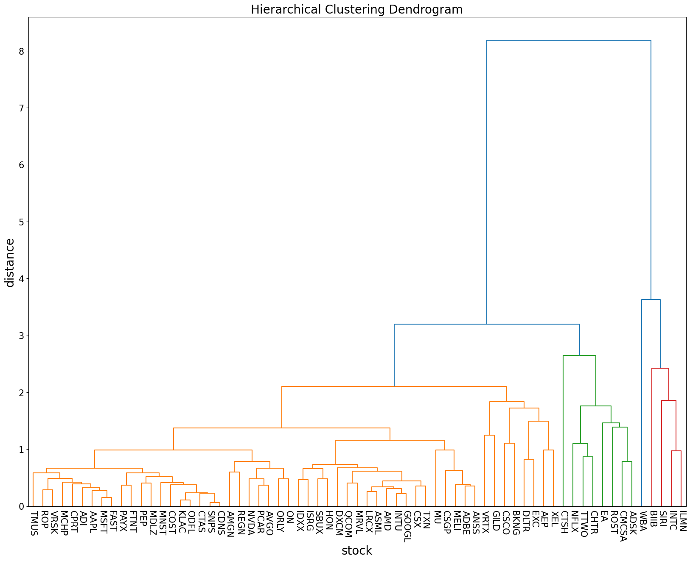
    


```python

```


```python
# # ...............................
# Portfolio_df = stockDf[["TMUS","ROP","VRSK","CTSH","NFLX","TTWO","WBA","BIIB","SIRI","INTC"]]
# Portfolio_df.head()
```


```python
# # ..................
# Portfolio_df.to_csv("portfolio.csv", index=False)
```


```python
# ....................
# Portfolio_df= pd.read_csv("portfolio.csv")
```

Mean Variance Optimization


```python

```

Now, let’s calculate the covariance matrix and store the calculated returns in variables S and mu, respectively:


```python
# from pypfopt.expected_returns import mean_historical_return
# from pypfopt.risk_models import CovarianceShrinkage


# mu = mean_historical_return(Portfolio_df)
# S = CovarianceShrinkage(Portfolio_df).ledoit_wolf()
```

Next, let’s import the EfficientFrontier module and calculate the weights. Here, we will use the max Sharpe statistic. The Sharpe ratio is the ratio between returns and risk. The lower the risk and the higher the returns, the higher the Sharpe ratio. The algorithm looks for the maximum Sharpe ratio, which translates to the portfolio with the highest return and lowest risk. Ultimately, the higher the Sharpe ratio, the better the performance of the portfolio.


```python
# from pypfopt.efficient_frontier import EfficientFrontier

# ef = EfficientFrontier(mu, S)
# weights = ef.max_sharpe()

# cleaned_weights = ef.clean_weights()
# print(dict(cleaned_weights))
```

We can also display portfolio performance:


```python
# ef.portfolio_performance(verbose=True)
```

Finally, let’s convert the weights into actual allocations values (i.e., how many of each stock to buy). For our allocation, let’s consider an investment amount of $100,000:


```python
# from pypfopt.discrete_allocation import DiscreteAllocation, get_latest_prices

# latest_prices = get_latest_prices(Portfolio_df)

# da = DiscreteAllocation(weights, latest_prices, total_portfolio_value=100000)

# allocation, leftover = da.greedy_portfolio()
# print("Discrete allocation:", allocation)
# print("Funds remaining: ${:.2f}".format(leftover))
```

NEW


```python
# ...............
# stocks=["TMUS","ROP","VRSK","CTSH","NFLX","TTWO","WBA","BIIB","SIRI","INTC"]
# number_of_portfolios = 2000

# RF = 0

# portfolio_returns = []

# portfolio_risk = []

# sharpe_ratio_port = []

# portfolio_weights = []

# for portfolio in range (number_of_portfolios):

#   weights = np.random.random_sample((len(stocks)))
#   weights = weights / np.sum(weights)
#   print(type(weights))

#   print(weights)
```


```python

```


```python
# .......................
# portfolio_df = stockDf[["TMUS","ROP","VRSK","CTSH","NFLX","TTWO","WBA","BIIB","SIRI","INTC"]]
# portfolio_df.head()
```


```python
# ..................
# portfolio_df.reset_index(inplace=True)
# portfolio_df.head()
```


```python
# ...............................
# # reanming the DataFrame columns
# portfolio_df.rename(columns = {'index':'Date'},
#             inplace = True)

# # displaying the DataFrame
# print(portfolio_df)
```


```python
# ....................
# return_stocks=Portfolio_df.pct_change()
```


```python
# .........................................
# annualize_return = np.sum((return_stocks.mean() * weights) * 252)

# Portfolio_returns=np.append(annualize_return,annualize_return)

```


```python

```

CREATING PORTFOLIO


```python
# matrix_covariance_portfolio = (return_stocks.cov())*252

# Portfolio_variance = np.dot(weights.T,np.dot(matrix_covariance_portfolio, weights))

# Portfolio_standard_deviation= np.sqrt(Portfolio_variance)

# Portfolio_risk=np.append(Portfolio_standard_deviation)
```


```python
# ......................
# #sharpe_ratio

# sharpe_ratio = ((annualize_return- RF)/portfolio_standard_deviation)

# sharpe_ratio_port.append(sharpe_ratio)
```


```python
# .....................
# portfolio_weights.append(weights)
```


```python
# .................
# #convert to arrays
# portfolio_risk = np.array(portfolio_risk)

# portfolio_returns = np.array(portfolio_returns)

# sharpe_ratio_port = np.array(sharpe_ratio_port)
```


```python
# .................
# # Visualizing portfolios with Matplotlib
# # Now that we have created 2000 random portfolios, we can visualize them using a Scatter plot in Matplotlib:

# plt.figure(figsize=(10, 5))

# plt.scatter(portfolio_risk, portfolio_returns, c=portfolio_returns / portfolio_risk)

# plt.xlabel('volatility')

# plt.ylabel('returns')

# plt.colorbar(label='Sharpe ratio')

```


```python
# .................
# portfolio_risk
# portfolio_returns
```


```python
# .....................
# from scipy.cluster import hierarchy
# from scipy.cluster.hierarchy import dendrogram
# import numpy as np
# import matplotlib.pyplot as plt
```


```python

```


```python
# ............................
# # Creating Dendrogram for our data
# # max_d = cut-off/ Threshold value
# max_d = 3
# plt.figure(figsize=(20,25))
# Z = hierarchy.linkage(corr, method='average')
# labels = corr.columns
# plt.figure()
# plt.title("Dendrograms")


# plt.xlabel('stock', fontsize=labelsize)


# dendrogram = hierarchy.dendrogram(Z)

# # Cutting the dendrogram at max_d
# plt.axhline(y=max_d, c='k')
```


```python
# # Init
# import pandas as pd
# import numpy as np
# import matplotlib.pyplot as plt
# import seaborn as sns; sns.set()

# # Load data
# from sklearn.datasets import load_diabetes

# # Clustering
# from scipy.cluster.hierarchy import dendrogram, fcluster, leaves_list
# from scipy.spatial import distance
# from fastcluster import linkage # You can use SciPy one too

# %matplotlib inline

# # Dataset
# A_data = load_diabetes().data
# DF_diabetes = pd.DataFrame(A_data, columns = ["attr_%d" % j for j in range(A_data.shape[1])])

# # Absolute value of correlation matrix, then subtract from 1 for disimilarity
# DF_dism = 1 - np.abs(DF_diabetes.corr())

# # Compute average linkage
# A_dist = distance.squareform(DF_dism.as_matrix())
# Z = linkage(A_dist,method="average")

# # Dendrogram
# D = dendrogram(Z=Z, labels=DF_dism.index, color_threshold=0.7, leaf_font_size=12, leaf_rotation=45)

```


```python
# importing time-series data
AAPL = pd.read_csv('AAPL.csv', index_col='Date',
                       parse_dates=True)

# Printing dataFrame
AAPL.head()
# importing time-series data
CPRT = pd.read_csv('CPRT.csv', index_col='Date',
                       parse_dates=True)

# Printing dataFrame
CPRT.head()
# importing time-series data
AMGN = pd.read_csv('AMGN.csv', index_col='Date',
                       parse_dates=True)

# Printing dataFrame
AMGN.head()
# importing time-series data
PCAR = pd.read_csv('PCAR.csv', index_col='Date',
                       parse_dates=True)

# Printing dataFrame
PCAR.head()
```


<div>
<style scoped>
    .dataframe tbody tr th:only-of-type {
        vertical-align: middle;
    }

    .dataframe tbody tr th {
        vertical-align: top;
    }

    .dataframe thead th {
        text-align: right;
    }
</style>
<table border="1" class="dataframe">
  <thead>
    <tr style="text-align: right;">
      <th></th>
      <th>Open</th>
      <th>High</th>
      <th>Low</th>
      <th>Close</th>
      <th>Volume</th>
      <th>Dividends</th>
      <th>Stock Splits</th>
    </tr>
    <tr>
      <th>Date</th>
      <th></th>
      <th></th>
      <th></th>
      <th></th>
      <th></th>
      <th></th>
      <th></th>
    </tr>
  </thead>
  <tbody>
    <tr>
      <th>2018-01-02 00:00:00-05:00</th>
      <td>37.822053</td>
      <td>38.343231</td>
      <td>37.764723</td>
      <td>38.056583</td>
      <td>3377250</td>
      <td>0.0</td>
      <td>0.0</td>
    </tr>
    <tr>
      <th>2018-01-03 00:00:00-05:00</th>
      <td>37.769937</td>
      <td>38.536072</td>
      <td>37.743879</td>
      <td>38.520439</td>
      <td>2142900</td>
      <td>0.0</td>
      <td>0.0</td>
    </tr>
    <tr>
      <th>2018-01-04 00:00:00-05:00</th>
      <td>38.666361</td>
      <td>39.448131</td>
      <td>38.567336</td>
      <td>39.010342</td>
      <td>4642650</td>
      <td>0.0</td>
      <td>0.0</td>
    </tr>
    <tr>
      <th>2018-01-05 00:00:00-05:00</th>
      <td>39.255301</td>
      <td>39.281359</td>
      <td>38.796662</td>
      <td>39.140640</td>
      <td>3036750</td>
      <td>0.0</td>
      <td>0.0</td>
    </tr>
    <tr>
      <th>2018-01-08 00:00:00-05:00</th>
      <td>39.015560</td>
      <td>39.213609</td>
      <td>38.942594</td>
      <td>39.015560</td>
      <td>3113400</td>
      <td>0.0</td>
      <td>0.0</td>
    </tr>
  </tbody>
</table>
</div>


```python
# Extract 'Close' column and convert to DataFrame
AAPL = AAPL['Close'].to_frame()

# Calculate 30-day Simple Moving Average (SMA)
AAPL['SMA30'] = AAPL['Close'].rolling(30).mean()

# Remove NULL values
AAPL.dropna(inplace=True)

# Print DataFrame
AAPL

# Extract 'Close' column and convert to DataFrame
CPRT = CPRT['Close'].to_frame()

# Calculate 30-day Simple Moving Average (SMA)
CPRT['SMA30'] = AAPL['Close'].rolling(30).mean()

# Remove NULL values
CPRT.dropna(inplace=True)

# Print DataFrame
CPRT

# Extract 'Close' column and convert to DataFrame
AMGN = AMGN['Close'].to_frame()

# Calculate 30-day Simple Moving Average (SMA)
AMGN['SMA30'] = AMGN['Close'].rolling(30).mean()

# Remove NULL values
AMGN.dropna(inplace=True)

# Print DataFrame
AMGN

# Extract 'Close' column and convert to DataFrame
PCAR = PCAR['Close'].to_frame()

# Calculate 30-day Simple Moving Average (SMA)
PCAR['SMA30'] = PCAR['Close'].rolling(30).mean()

# Remove NULL values
PCAR.dropna(inplace=True)

# Print DataFrame
PCAR
```


<div>
<style scoped>
    .dataframe tbody tr th:only-of-type {
        vertical-align: middle;
    }

    .dataframe tbody tr th {
        vertical-align: top;
    }

    .dataframe thead th {
        text-align: right;
    }
</style>
<table border="1" class="dataframe">
  <thead>
    <tr style="text-align: right;">
      <th></th>
      <th>Close</th>
      <th>SMA30</th>
    </tr>
    <tr>
      <th>Date</th>
      <th></th>
      <th></th>
    </tr>
  </thead>
  <tbody>
    <tr>
      <th>2018-02-13 00:00:00-05:00</th>
      <td>35.645241</td>
      <td>38.640602</td>
    </tr>
    <tr>
      <th>2018-02-14 00:00:00-05:00</th>
      <td>36.157894</td>
      <td>38.577312</td>
    </tr>
    <tr>
      <th>2018-02-15 00:00:00-05:00</th>
      <td>36.084663</td>
      <td>38.496119</td>
    </tr>
    <tr>
      <th>2018-02-16 00:00:00-05:00</th>
      <td>35.980034</td>
      <td>38.395109</td>
    </tr>
    <tr>
      <th>2018-02-20 00:00:00-05:00</th>
      <td>36.089890</td>
      <td>38.293417</td>
    </tr>
    <tr>
      <th>...</th>
      <td>...</td>
      <td>...</td>
    </tr>
    <tr>
      <th>2023-12-22 00:00:00-05:00</th>
      <td>97.219818</td>
      <td>90.988686</td>
    </tr>
    <tr>
      <th>2023-12-26 00:00:00-05:00</th>
      <td>97.469177</td>
      <td>91.407684</td>
    </tr>
    <tr>
      <th>2023-12-27 00:00:00-05:00</th>
      <td>97.539001</td>
      <td>91.838628</td>
    </tr>
    <tr>
      <th>2023-12-28 00:00:00-05:00</th>
      <td>97.578896</td>
      <td>92.175057</td>
    </tr>
    <tr>
      <th>2023-12-29 00:00:00-05:00</th>
      <td>97.399361</td>
      <td>92.512577</td>
    </tr>
  </tbody>
</table>
<p>1480 rows × 2 columns</p>
</div>


```python
AAPL
```


<div>
<style scoped>
    .dataframe tbody tr th:only-of-type {
        vertical-align: middle;
    }

    .dataframe tbody tr th {
        vertical-align: top;
    }

    .dataframe thead th {
        text-align: right;
    }
</style>
<table border="1" class="dataframe">
  <thead>
    <tr style="text-align: right;">
      <th></th>
      <th>Close</th>
      <th>SMA30</th>
    </tr>
    <tr>
      <th>Date</th>
      <th></th>
      <th></th>
    </tr>
  </thead>
  <tbody>
    <tr>
      <th>2018-02-13 00:00:00-05:00</th>
      <td>38.959240</td>
      <td>40.153372</td>
    </tr>
    <tr>
      <th>2018-02-14 00:00:00-05:00</th>
      <td>39.677547</td>
      <td>40.120258</td>
    </tr>
    <tr>
      <th>2018-02-15 00:00:00-05:00</th>
      <td>41.009861</td>
      <td>40.131790</td>
    </tr>
    <tr>
      <th>2018-02-16 00:00:00-05:00</th>
      <td>40.877110</td>
      <td>40.132601</td>
    </tr>
    <tr>
      <th>2018-02-20 00:00:00-05:00</th>
      <td>40.739601</td>
      <td>40.113325</td>
    </tr>
    <tr>
      <th>...</th>
      <td>...</td>
      <td>...</td>
    </tr>
    <tr>
      <th>2023-12-22 00:00:00-05:00</th>
      <td>193.353287</td>
      <td>191.848196</td>
    </tr>
    <tr>
      <th>2023-12-26 00:00:00-05:00</th>
      <td>192.803986</td>
      <td>192.069581</td>
    </tr>
    <tr>
      <th>2023-12-27 00:00:00-05:00</th>
      <td>192.903839</td>
      <td>192.347559</td>
    </tr>
    <tr>
      <th>2023-12-28 00:00:00-05:00</th>
      <td>193.333298</td>
      <td>192.551965</td>
    </tr>
    <tr>
      <th>2023-12-29 00:00:00-05:00</th>
      <td>192.284637</td>
      <td>192.702440</td>
    </tr>
  </tbody>
</table>
<p>1480 rows × 2 columns</p>
</div>


```python

# code
# Visualizing The Open Price of all the stocks

# to set the plot size
plt.figure(figsize=(16, 8))

# using plot method to plot open prices.
# in plot method we set the label and color of the curve.

AAPL['SMA30'].plot(label='AAPL', color='orange')
CPRT['SMA30'].plot(label='CPRM')
AMGN['SMA30'].plot(label='AMGN')
PCAR['SMA30'].plot(label='PCAR')


# adding title to the plot
plt.title('Close Price Plot')

# adding Label to the x-axis
plt.xlabel('Years')

# adding legend to the curve
plt.legend()
```


    <matplotlib.legend.Legend at 0x22143366750>


    
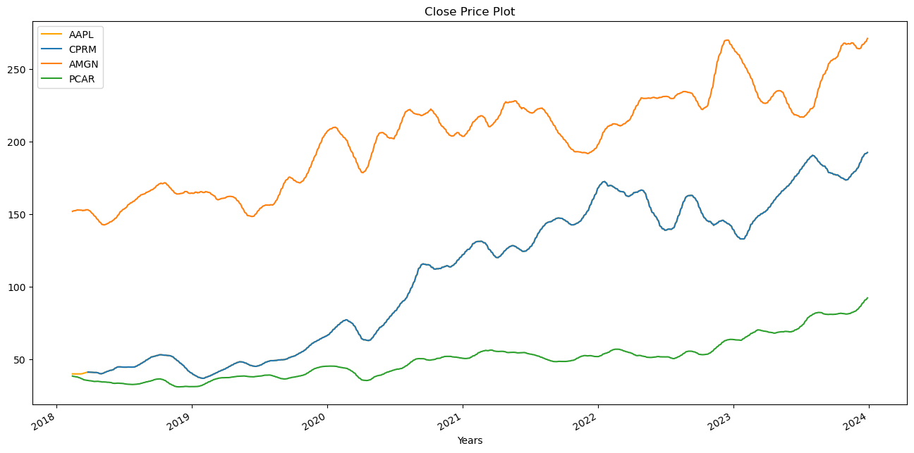
    


```python
import dash
from dash import dcc, html
from dash.dependencies import Input, Output
import plotly.graph_objs as go
import pandas as pd

# Assuming you have your dataframes AAPL, CPRT, AMGN, and PCAR defined already

# Combine all the data into a single DataFrame
combined_data = pd.concat([AAPL['SMA30'], CPRT['SMA30'], AMGN['SMA30'], PCAR['SMA30']], axis=1)
combined_data.columns = ['AAPL', 'CPRT', 'AMGN', 'PCAR']
combined_data.dropna(inplace=True)

# Initialize the Dash app
app = dash.Dash(__name__)

# Define the layout of the app
app.layout = html.Div([
    html.H1("Interactive SMA30 Plot"),
    dcc.Dropdown(
        id='stock-dropdown',
        options=[
            {'label': 'AAPL', 'value': 'AAPL'},
            {'label': 'CPRT', 'value': 'CPRT'},
            {'label': 'AMGN', 'value': 'AMGN'},
            {'label': 'PCAR', 'value': 'PCAR'}
        ],
        value='AAPL'
    ),
    dcc.Graph(id='sma30-plot')
])

# Define callback to update the plot based on dropdown selection
@app.callback(
    Output('sma30-plot', 'figure'),
    [Input('stock-dropdown', 'value')]
)
def update_plot(selected_stock):
    trace = go.Scatter(
        x=combined_data.index,
        y=combined_data[selected_stock],
        mode='lines',
        name=selected_stock,
        marker=dict(color='orange')  # You can change the color here
    )

    layout = go.Layout(
        title='SMA30 Plot',
        xaxis=dict(title='Years'),
        yaxis=dict(title='SMA30'),
        showlegend=True
    )

    return {'data': [trace], 'layout': layout}

# Run the app
if __name__ == '__main__':
    app.run_server(debug=True)

```


<iframe
    width="100%"
    height="650"
    src="http://127.0.0.1:8050/"
    frameborder="0"
    allowfullscreen

></iframe>


```python
# # *******************************88888888
import matplotlib.pyplot as plt
import pandas as pd
import seaborn as sns
import datetime


# Combine all the data into a single DataFrame
combined_data = pd.concat([AAPL['SMA30'], CPRT['SMA30'], AMGN['SMA30'], PCAR['SMA30']], axis=1)

combined_data.columns = ['AAPL', 'CPRT', 'AMGN', 'PCAR']
combined_data.dropna(inplace = True)

combined_data = combined_data.loc[combined_data.index >= datetime.datetime.strptime('2000-01-01 00:00:00-05:00', '%Y-%m-%d %H:%M:%S%z')]
combined_data = combined_data.reset_index()
combined_data = combined_data.melt(id_vars='Date',var_name='Stock', value_name='SMA30')
combined_data.set_index('Date', inplace=True)
combined_data = combined_data.reset_index()
# Create a facet grid with each stock's SMA30 values
g = sns.FacetGrid(combined_data, col='Stock', col_wrap=2, sharex=False, sharey=False)
g.map(plt.plot,'Date', 'SMA30', color='orange')

# Set plot size
g.fig.set_size_inches(16, 8)

# Set title and labels
g.set_titles('Open Price Plot - {col_name}')
g.set_xlabels('Years')
g.set_ylabels('SMA30')

# Add legend with each stock's name
for ax in g.axes.flat:
    ax.legend([ax.get_title().split()[-1]])

plt.show()

```

    C:\Users\91998\anaconda3\Lib\site-packages\seaborn\axisgrid.py:118: UserWarning:
    
    The figure layout has changed to tight
    
    


    
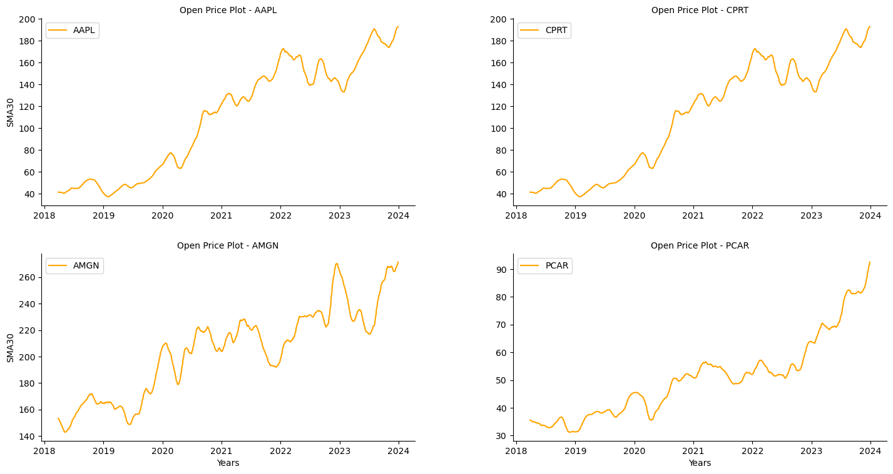
    


```python


```

Line Plot:

The line plot is commonly used to visualize the trend of a variable over time. In this case, the line plot shows the trend of the SMA30 (Simple Moving Average over 30 days) for different stocks over time.

Trend Comparison of AAPL, CPRT, AMGN, and PCAR from Year 2000:
By observing the lines representing SMA30 values for AAPL, CPRT, AMGN, and PCAR over the years since 2000, we can compare their trends.
For instance,  AAPL consistently shows an upward trend in SMA30 values from 2000 onwards, it may indicate sustained positive momentum in AAPL's performance.

Comparing the slopes and movements of the lines for each stock can provide insights into their relative performance. For example, AMGN exhibits less volatility in SMA30 values compared to CPRT over the years, it might be considered a more stable investment.


```python
# Concatenate the 'Close' columns of the four stocks into a single DataFrame
stock_data = pd.concat([AAPL['Close'], CPRT['Close'], AMGN['Close'], PCAR['Close']], axis=1)

# Calculate the correlation matrix
correlation_matrix = stock_data.corr()

# Display the correlation matrix
print(correlation_matrix)
```

              Close     Close     Close     Close
    Close  1.000000  0.939425  0.843266  0.875315
    Close  0.939425  1.000000  0.797350  0.924170
    Close  0.843266  0.797350  1.000000  0.845905
    Close  0.875315  0.924170  0.845905  1.000000
    


```python
plt.figure(figsize=(8, 6))
sns.heatmap(correlation_matrix, annot=True, cmap='coolwarm', fmt=".2f")
plt.title('Correlation Matrix of Stock Prices')
plt.xlabel('Stocks')
plt.ylabel('Stocks')
plt.show()
```


    
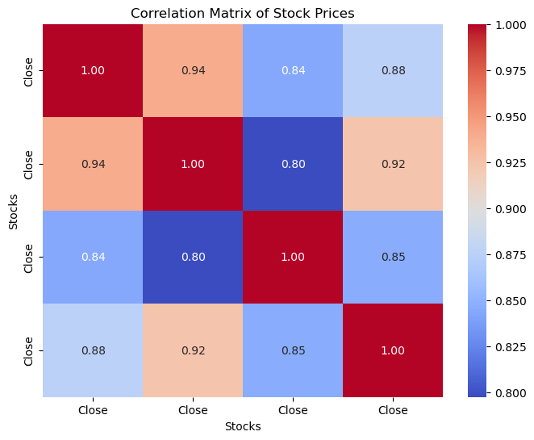
    


```python
returnList = []
riskList = []
for c in tickerClose["Close"]:
  returnList.append(np.mean(pd.Series(c).pct_change())*252)
  riskList.append(np.std(pd.Series(c).pct_change())*np.sqrt(252))
tempdf = pd.DataFrame()
tempdf["Ticker"] = list(tickerClose["tickerName"])
tempdf["return"] = returnList
tempdf["risk"] = riskList
tempdf["sr"] = tempdf["return"]/tempdf["risk"]
returnList.extend(returnList)
combined_data = tempdf[["risk","sr"]].melt(var_name='Stock', value_name='Metric')
combined_data["return"] = returnList
```


```python
combined_data.head()
```


<div>
<style scoped>
    .dataframe tbody tr th:only-of-type {
        vertical-align: middle;
    }

    .dataframe tbody tr th {
        vertical-align: top;
    }

    .dataframe thead th {
        text-align: right;
    }
</style>
<table border="1" class="dataframe">
  <thead>
    <tr style="text-align: right;">
      <th></th>
      <th>Stock</th>
      <th>Metric</th>
      <th>return</th>
    </tr>
  </thead>
  <tbody>
    <tr>
      <th>0</th>
      <td>risk</td>
      <td>0.302536</td>
      <td>0.297182</td>
    </tr>
    <tr>
      <th>1</th>
      <td>risk</td>
      <td>0.235010</td>
      <td>0.253875</td>
    </tr>
    <tr>
      <th>2</th>
      <td>risk</td>
      <td>0.316665</td>
      <td>0.309906</td>
    </tr>
    <tr>
      <th>3</th>
      <td>risk</td>
      <td>0.250510</td>
      <td>0.143011</td>
    </tr>
    <tr>
      <th>4</th>
      <td>risk</td>
      <td>0.278929</td>
      <td>0.072020</td>
    </tr>
  </tbody>
</table>
</div>


```python
# ***************************
# g = sns.FacetGrid(combined_data, col='Stock', col_wrap=2, sharex=False, sharey=False)
# g.map(plt.scatter,'return', 'Metric', color='orange')

# # Set plot size
# g.fig.set_size_inches(16, 8)

# # Set title and labels
# g.set_titles('Open Price Plot - {col_name}')
# g.set_xlabels('Return')
# g.set_ylabels('Metric')

# # Add legend with each stock's name
# for ax in g.axes.flat:
#     ax.legend([ax.get_title().split()[-1]])

# plt.show()
```

Risk-Return Trade-off:

The scatterplot illustrates the trade-off between return and risk for each stock. Typically, higher returns are associated with higher levels of risk. Therefore, clusters of points with higher returns tend to have higher levels of risk as well.
Sharpe Ratio Analysis:

Points representing stocks with higher return Sharpe ratios (return per unit of risk) are considered more desirable investments, as they indicate superior risk-adjusted performance. Stocks located towards the upper right quadrant (higher return, higher Sharpe ratio) are particularly attractive


```python

value_A =returnList
value_B =riskList


box_plot_data=[value_A,value_B]
plt.title(" Distribution")
plt.boxplot(box_plot_data,patch_artist=True,labels=['Return','Risk'])
plt.show()
```


    
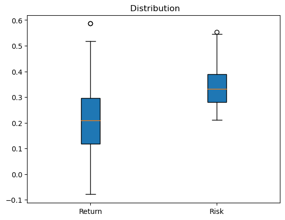
    


```python
# ***********************


# # Create a DataFrame for box plot data
# box_plot_data = pd.DataFrame({"Return": tempdf["return"], "Risk": tempdf["risk"]})

# # Melt the DataFrame for FacetGrid
# melted_df = box_plot_data.melt(var_name="Variable", value_name="Value")

# # Create a FacetGrid with two columns
# g = sns.FacetGrid(melted_df, col="Variable", col_wrap=2)
# g.map(sns.boxplot, "Value", palette="Set3")

# # Set plot size
# g.fig.set_size_inches(12, 6)

# # Set labels
# g.set_axis_labels("Value", "Density")

# # Convert Matplotlib figure to Plotly figure
# plotly_fig = go.Figure()
# for ax in g.axes.flat:
#     plotly_fig.add_trace(go.Box(y=ax.lines[0].get_ydata(), name=ax.get_title().split()[-1]))

# # Define the Dash app
# app = dash.Dash(__name__)

# # Define the layout of the app
# app.layout = html.Div([
#     dcc.Graph(
#         id='facetgrid-plot',
#         figure=plotly_fig  # Set the Plotly figure
#     )
# ])

# # Run the Dash app
# if __name__ == '__main__':
#     app.run_server(debug=True)


```


```python
import matplotlib.pyplot as plt
import pandas as pd
import seaborn as sns

# Assuming returnList and riskList are already defined as lists of return and risk values

# Create a DataFrame for box plot data
box_plot_data = pd.DataFrame({"Return": tempdf["return"], "Risk": tempdf["risk"]})

# Melt the DataFrame for FacetGrid
melted_df = box_plot_data.melt(var_name="Variable", value_name="Value")

# Create a FacetGrid with two columns
g = sns.FacetGrid(melted_df, col="Variable", col_wrap=2)
g.map(sns.boxplot, "Value", palette="Set3")

# Set plot size
g.fig.set_size_inches(12, 6)

# Set labels
g.set_axis_labels("Value", "Density")

plt.show()

```

    C:\Users\91998\anaconda3\Lib\site-packages\seaborn\axisgrid.py:712: UserWarning:
    
    Using the boxplot function without specifying `order` is likely to produce an incorrect plot.
    
    C:\Users\91998\anaconda3\Lib\site-packages\seaborn\axisgrid.py:118: UserWarning:
    
    The figure layout has changed to tight
    
    


    
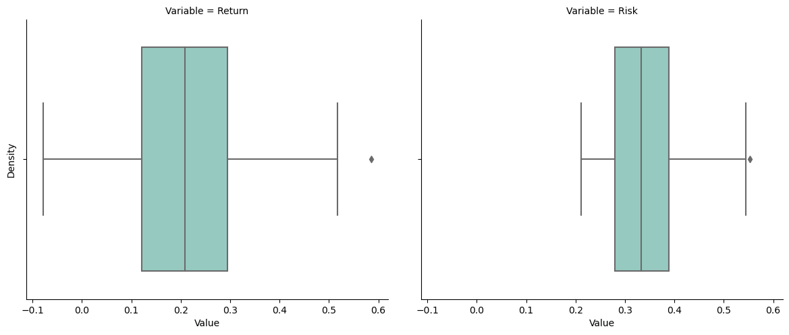
    


Return Distribution:

The returns exhibit a moderate spread, with the majority of returns concentrated between the 1st and 3rd quartiles (0.22 to 0.29).
The median return of approximately 0.288 suggests that half of the returns fall below this value, indicating a central tendency in the dataset.
The presence of outliers with return values around 0.5 indicates the presence of extreme positive returns, which may be attributed to exceptional performance or anomalies in specific stocks.

Risk Distribution:

The distribution of risk values shows a wider spread compared to returns, with the majority of risks concentrated between the 1st and 3rd quartiles (0.34 to 0.52).
The median risk value of approximately 0.42 suggests a central tendency in the dataset, indicating a moderate level of risk.
The presence of outliers with risk values around 0.8 indicates the presence of extreme risk levels, which may be associated with specific stocks or market conditions.
Risk-Return Relationship:

The moderate spread in returns and risks suggests a balanced risk-return relationship in the dataset, with returns generally commensurate with the level of risk.
However, the presence of outliers with significantly higher returns and risks indicates the presence of stocks with exceptional performance or elevated risk levels that may deviate from the overall trend.


```python
AAPL = pd.read_csv('AAPL.csv')
#pandas.Dataframe.shift(# lags)
#Using shift(1), we can get the row just above the present row. Here, # lags is 1.
#log() is a function given in numpy package in python. It calculates the natural log of the value given inside it.
AAPL['Log Return'] = np.log(AAPL['Close']/AAPL['Close'].shift(1))

#print() function prints the value inside it on the console.
print(AAPL['Log Return'])
```

    0            NaN
    1      -0.000174
    2       0.004634
    3       0.011321
    4      -0.003721
              ...   
    1504   -0.005563
    1505   -0.002845
    1506    0.000518
    1507    0.002224
    1508   -0.005439
    Name: Log Return, Length: 1509, dtype: float64
    


```python
# Plotting the Simple Return series using matplotlib.pyplot
AAPL['Log Return'].plot(figsize=(8,5))
plt.show()
```


    
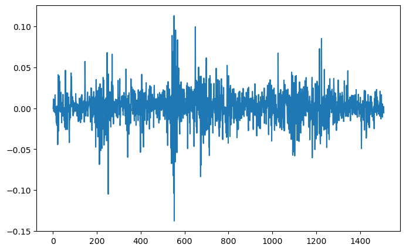
    


```python
# Daily Average Returns are given by computing the mean of the log rate of return series.
daily_log_returns = AAPL['Log Return'].mean()
daily_log_returns
```


    0.0010301473264420866


```python
# Annual Average Returns are given by computing the mean of the log rate of return series
# and then multiplying the value by 250 since 250 days exist in a business day system.
annual_log_returns = AAPL['Log Return'].mean() * 250
annual_log_returns
```


    0.25753683161052165


```python
# print(AAPL.std())
```


```python
daily_sd_AAPL = AAPL['Log Return'].std()
print(daily_sd_AAPL)
```

    0.019965263883326423
    


```python
annualized_sd_AAPL = daily_sd_AAPL * np.sqrt(252)
print(annualized_sd_AAPL)
print ("annualized_sd_AAPL in %  {:.2%}".format(annualized_sd_AAPL))
```

    0.3169387385703684
    annualized_sd_AAPL in %  31.69%
    


```python
def calculate_mean_std(close):
  log_returns = np.log(close/close.shift(1))
  daily_log_returns = log_returns.mean()
  annual_mean = log_returns.mean() * 250
  daily_sd = log_returns.std()
  annualized_sd = daily_sd * np.sqrt(252)
  return annual_mean,annualized_sd,daily_log_returns
```


```python
meanList = [];stdList = []; dailylogreturnList=[]
for i in range(0,len(tickerClose["Close"])):
  closeList = tickerClose["Close"][i]
  annual_mean,annual_std,daily_log_returns = calculate_mean_std(pd.Series(closeList))
  meanList.append(annual_mean);stdList.append(annual_std);dailylogreturnList.append(daily_log_returns)
```


```python
mean_std_df = pd.DataFrame()
mean_std_df["symbol"] = tickerClose["tickerName"]
mean_std_df["mean"] = meanList
mean_std_df["std"] = stdList


```


```python
daily_log_returns
```


    7.146578382434848e-05


```python
mean_std_df.head()
```


<div>
<style scoped>
    .dataframe tbody tr th:only-of-type {
        vertical-align: middle;
    }

    .dataframe tbody tr th {
        vertical-align: top;
    }

    .dataframe thead th {
        text-align: right;
    }
</style>
<table border="1" class="dataframe">
  <thead>
    <tr style="text-align: right;">
      <th></th>
      <th>symbol</th>
      <th>mean</th>
      <th>std</th>
    </tr>
  </thead>
  <tbody>
    <tr>
      <th>0</th>
      <td>CPRT</td>
      <td>0.249181</td>
      <td>0.303259</td>
    </tr>
    <tr>
      <th>1</th>
      <td>COST</td>
      <td>0.224311</td>
      <td>0.235421</td>
    </tr>
    <tr>
      <th>2</th>
      <td>AAPL</td>
      <td>0.257537</td>
      <td>0.316939</td>
    </tr>
    <tr>
      <th>3</th>
      <td>AMGN</td>
      <td>0.110859</td>
      <td>0.249782</td>
    </tr>
    <tr>
      <th>4</th>
      <td>CMCSA</td>
      <td>0.032796</td>
      <td>0.279380</td>
    </tr>
  </tbody>
</table>
</div>


```python
plt.title("Mean Vs Std")
plt.scatter(meanList,stdList)

```


    <matplotlib.collections.PathCollection at 0x22143453710>


    
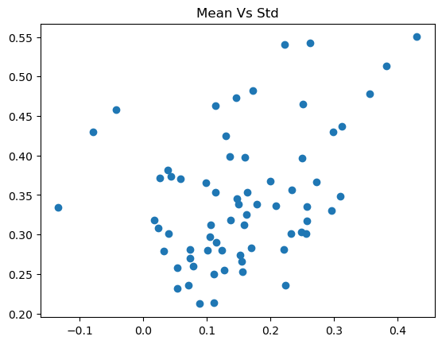
    


```python
import dash
from dash import dcc, html, Input, Output
import matplotlib.pyplot as plt
import plotly.graph_objs as go

# Assuming meanList and stdList are already defined as lists of mean and standard deviation values

# Define the Dash app
app = dash.Dash(__name__)

# Define the layout of the app
app.layout = html.Div([
    html.H1("Mean Vs Std"),
    dcc.Graph(id='mean-std-plot')
])

# Define callback to update the plot
@app.callback(
    Output('mean-std-plot', 'figure'),
    [Input('mean-std-plot', 'clickData')]
)
def update_mean_std_plot(click_data):
    try:
        # Create the scatter plot
        scatter_trace = go.Scatter(
            x=meanList,
            y=stdList,
            mode='markers',
            marker=dict(color='blue'),
            name='Mean Vs Std'
        )

        # Create layout
        layout = go.Layout(
            title="Mean Vs Std",
            xaxis=dict(title="Mean"),
            yaxis=dict(title="Std"),
            hovermode='closest'
        )

        # Combine trace and layout into a figure
        fig = go.Figure(data=[scatter_trace], layout=layout)

        return fig

    except Exception as e:
        print("Error:", str(e))
        return go.Figure()

# Run the Dash app
if __name__ == '__main__':
    app.run_server(debug=True)


```


<iframe
    width="100%"
    height="650"
    src="http://127.0.0.1:8050/"
    frameborder="0"
    allowfullscreen

></iframe>


K-Means: Inertia
Inertia measures how well a dataset was clustered by K-Means. It is calculated by measuring the distance between each data point and its centroid, squaring this distance, and summing these squares across one cluster. A good model is one with low inertia AND a low number of clusters ( K ).


```python
from sklearn.cluster import KMeans

data = list(zip(meanList,stdList))
inertias = []

for i in range(1,11):
    kmeans = KMeans(n_clusters=i)
    kmeans.fit(data)
    inertias.append(kmeans.inertia_)

plt.plot(range(1,11), inertias, marker='o')
plt.title('Elbow method')
plt.xlabel('Number of clusters')
plt.ylabel('Inertia')
plt.show()
```

    ---------------------------------------------------------------------------
    KeyError                                  Traceback (most recent call last)
    File ~\anaconda3\Lib\site-packages\pandas\core\indexes\base.py:3653, in Index.get_loc(
        self=Index(['Date', 'Stock', 'SMA30'], dtype='object'),
        key='AAPL'
    )
       3652 try:
    -> 3653     return self._engine.get_loc(casted_key)
            casted_key = 'AAPL'
            self = Index(['Date', 'Stock', 'SMA30'], dtype='object')
       3654 except KeyError as err:
    
    File ~\anaconda3\Lib\site-packages\pandas\_libs\index.pyx:147, in pandas._libs.index.IndexEngine.get_loc()
    
    File ~\anaconda3\Lib\site-packages\pandas\_libs\index.pyx:176, in pandas._libs.index.IndexEngine.get_loc()
    
    File pandas\_libs\hashtable_class_helper.pxi:7080, in pandas._libs.hashtable.PyObjectHashTable.get_item()
    
    File pandas\_libs\hashtable_class_helper.pxi:7088, in pandas._libs.hashtable.PyObjectHashTable.get_item()
    
    KeyError: 'AAPL'
    
    The above exception was the direct cause of the following exception:
    
    KeyError                                  Traceback (most recent call last)
    Cell In[42], line 41, in update_plot(selected_stock='AAPL')
         34 @app.callback(
         35     Output('sma30-plot', 'figure'),
         36     [Input('stock-dropdown', 'value')]
         37 )
         38 def update_plot(selected_stock):
         39     trace = go.Scatter(
         40         x=combined_data.index,
    ---> 41         y=combined_data[selected_stock],
            go = <module 'plotly.graph_objs' from 'C:\\Users\\91998\\anaconda3\\Lib\\site-packages\\plotly\\graph_objs\\__init__.py'>
            combined_data =     Stock    Metric    return
    0    risk  0.302536  0.297182
    1    risk  0.235010  0.253875
    2    risk  0.316665  0.309906
    3    risk  0.250510  0.143011
    4    risk  0.278929  0.072020
    ..    ...       ...       ...
    129    sr  0.756637  0.412347
    130    sr  0.936768  0.341554
    131    sr  0.754089  0.189908
    132    sr  0.949514  0.410242
    133    sr  0.216337  0.068324
    
    [134 rows x 3 columns]
            selected_stock = 'AAPL'
         42         mode='lines',
         43         name=selected_stock,
         44         marker=dict(color='orange')  # You can change the color here
         45     )
         47     layout = go.Layout(
         48         title='SMA30 Plot',
         49         xaxis=dict(title='Years'),
         50         yaxis=dict(title='SMA30'),
         51         showlegend=True
         52     )
         54     return {'data': [trace], 'layout': layout}
    
    File ~\anaconda3\Lib\site-packages\pandas\core\frame.py:3761, in DataFrame.__getitem__(
        self=                           Date Stock      SMA30...0-05:00  PCAR  92.512577
    
    [5804 rows x 3 columns],
        key='AAPL'
    )
       3759 if self.columns.nlevels > 1:
       3760     return self._getitem_multilevel(key)
    -> 3761 indexer = self.columns.get_loc(key)
            key = 'AAPL'
            self =                            Date Stock      SMA30
    0     2018-03-27 00:00:00-04:00  AAPL  41.357472
    1     2018-03-28 00:00:00-04:00  AAPL  41.374383
    2     2018-03-29 00:00:00-04:00  AAPL  41.377622
    3     2018-04-02 00:00:00-04:00  AAPL  41.327760
    4     2018-04-03 00:00:00-04:00  AAPL  41.295834
    ...                         ...   ...        ...
    5799  2023-12-22 00:00:00-05:00  PCAR  90.988686
    5800  2023-12-26 00:00:00-05:00  PCAR  91.407684
    5801  2023-12-27 00:00:00-05:00  PCAR  91.838628
    5802  2023-12-28 00:00:00-05:00  PCAR  92.175057
    5803  2023-12-29 00:00:00-05:00  PCAR  92.512577
    
    [5804 rows x 3 columns]
       3762 if is_integer(indexer):
       3763     indexer = [indexer]
    
    File ~\anaconda3\Lib\site-packages\pandas\core\indexes\base.py:3655, in Index.get_loc(
        self=Index(['Date', 'Stock', 'SMA30'], dtype='object'),
        key='AAPL'
    )
       3653     return self._engine.get_loc(casted_key)
       3654 except KeyError as err:
    -> 3655     raise KeyError(key) from err
            key = 'AAPL'
       3656 except TypeError:
       3657     # If we have a listlike key, _check_indexing_error will raise
       3658     #  InvalidIndexError. Otherwise we fall through and re-raise
       3659     #  the TypeError.
       3660     self._check_indexing_error(key)
    
    KeyError: 'AAPL'
    
    

    C:\Users\91998\anaconda3\Lib\site-packages\sklearn\cluster\_kmeans.py:1412: FutureWarning:
    
    The default value of `n_init` will change from 10 to 'auto' in 1.4. Set the value of `n_init` explicitly to suppress the warning
    
    C:\Users\91998\anaconda3\Lib\site-packages\sklearn\cluster\_kmeans.py:1436: UserWarning:
    
    KMeans is known to have a memory leak on Windows with MKL, when there are less chunks than available threads. You can avoid it by setting the environment variable OMP_NUM_THREADS=1.
    
    C:\Users\91998\anaconda3\Lib\site-packages\sklearn\cluster\_kmeans.py:1412: FutureWarning:
    
    The default value of `n_init` will change from 10 to 'auto' in 1.4. Set the value of `n_init` explicitly to suppress the warning
    
    C:\Users\91998\anaconda3\Lib\site-packages\sklearn\cluster\_kmeans.py:1436: UserWarning:
    
    KMeans is known to have a memory leak on Windows with MKL, when there are less chunks than available threads. You can avoid it by setting the environment variable OMP_NUM_THREADS=1.
    
    C:\Users\91998\anaconda3\Lib\site-packages\sklearn\cluster\_kmeans.py:1412: FutureWarning:
    
    The default value of `n_init` will change from 10 to 'auto' in 1.4. Set the value of `n_init` explicitly to suppress the warning
    
    C:\Users\91998\anaconda3\Lib\site-packages\sklearn\cluster\_kmeans.py:1436: UserWarning:
    
    KMeans is known to have a memory leak on Windows with MKL, when there are less chunks than available threads. You can avoid it by setting the environment variable OMP_NUM_THREADS=1.
    
    C:\Users\91998\anaconda3\Lib\site-packages\sklearn\cluster\_kmeans.py:1412: FutureWarning:
    
    The default value of `n_init` will change from 10 to 'auto' in 1.4. Set the value of `n_init` explicitly to suppress the warning
    
    C:\Users\91998\anaconda3\Lib\site-packages\sklearn\cluster\_kmeans.py:1436: UserWarning:
    
    KMeans is known to have a memory leak on Windows with MKL, when there are less chunks than available threads. You can avoid it by setting the environment variable OMP_NUM_THREADS=1.
    
    C:\Users\91998\anaconda3\Lib\site-packages\sklearn\cluster\_kmeans.py:1412: FutureWarning:
    
    The default value of `n_init` will change from 10 to 'auto' in 1.4. Set the value of `n_init` explicitly to suppress the warning
    
    C:\Users\91998\anaconda3\Lib\site-packages\sklearn\cluster\_kmeans.py:1436: UserWarning:
    
    KMeans is known to have a memory leak on Windows with MKL, when there are less chunks than available threads. You can avoid it by setting the environment variable OMP_NUM_THREADS=1.
    
    C:\Users\91998\anaconda3\Lib\site-packages\sklearn\cluster\_kmeans.py:1412: FutureWarning:
    
    The default value of `n_init` will change from 10 to 'auto' in 1.4. Set the value of `n_init` explicitly to suppress the warning
    
    C:\Users\91998\anaconda3\Lib\site-packages\sklearn\cluster\_kmeans.py:1436: UserWarning:
    
    KMeans is known to have a memory leak on Windows with MKL, when there are less chunks than available threads. You can avoid it by setting the environment variable OMP_NUM_THREADS=1.
    
    C:\Users\91998\anaconda3\Lib\site-packages\sklearn\cluster\_kmeans.py:1412: FutureWarning:
    
    The default value of `n_init` will change from 10 to 'auto' in 1.4. Set the value of `n_init` explicitly to suppress the warning
    
    C:\Users\91998\anaconda3\Lib\site-packages\sklearn\cluster\_kmeans.py:1436: UserWarning:
    
    KMeans is known to have a memory leak on Windows with MKL, when there are less chunks than available threads. You can avoid it by setting the environment variable OMP_NUM_THREADS=1.
    
    C:\Users\91998\anaconda3\Lib\site-packages\sklearn\cluster\_kmeans.py:1412: FutureWarning:
    
    The default value of `n_init` will change from 10 to 'auto' in 1.4. Set the value of `n_init` explicitly to suppress the warning
    
    C:\Users\91998\anaconda3\Lib\site-packages\sklearn\cluster\_kmeans.py:1436: UserWarning:
    
    KMeans is known to have a memory leak on Windows with MKL, when there are less chunks than available threads. You can avoid it by setting the environment variable OMP_NUM_THREADS=1.
    
    C:\Users\91998\anaconda3\Lib\site-packages\sklearn\cluster\_kmeans.py:1412: FutureWarning:
    
    The default value of `n_init` will change from 10 to 'auto' in 1.4. Set the value of `n_init` explicitly to suppress the warning
    
    C:\Users\91998\anaconda3\Lib\site-packages\sklearn\cluster\_kmeans.py:1436: UserWarning:
    
    KMeans is known to have a memory leak on Windows with MKL, when there are less chunks than available threads. You can avoid it by setting the environment variable OMP_NUM_THREADS=1.
    
    C:\Users\91998\anaconda3\Lib\site-packages\sklearn\cluster\_kmeans.py:1412: FutureWarning:
    
    The default value of `n_init` will change from 10 to 'auto' in 1.4. Set the value of `n_init` explicitly to suppress the warning
    
    C:\Users\91998\anaconda3\Lib\site-packages\sklearn\cluster\_kmeans.py:1436: UserWarning:
    
    KMeans is known to have a memory leak on Windows with MKL, when there are less chunks than available threads. You can avoid it by setting the environment variable OMP_NUM_THREADS=1.
    
    


    
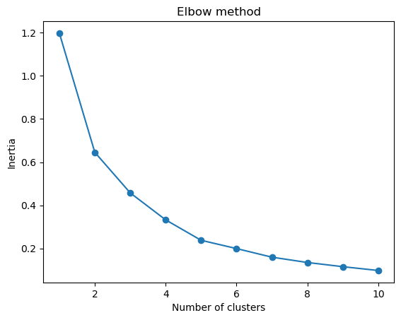
    


```python
kmeans = KMeans(n_clusters=2)
kmeans.fit(data)

plt.scatter(meanList,stdList, c=kmeans.labels_)
plt.title("Scattered plot with K-means Clustering")
plt.xlabel("Mean Values")
plt.ylabel("Standard deviation Values")
plt.show()
```

    C:\Users\91998\anaconda3\Lib\site-packages\sklearn\cluster\_kmeans.py:1412: FutureWarning:
    
    The default value of `n_init` will change from 10 to 'auto' in 1.4. Set the value of `n_init` explicitly to suppress the warning
    
    C:\Users\91998\anaconda3\Lib\site-packages\sklearn\cluster\_kmeans.py:1436: UserWarning:
    
    KMeans is known to have a memory leak on Windows with MKL, when there are less chunks than available threads. You can avoid it by setting the environment variable OMP_NUM_THREADS=1.
    
    


    
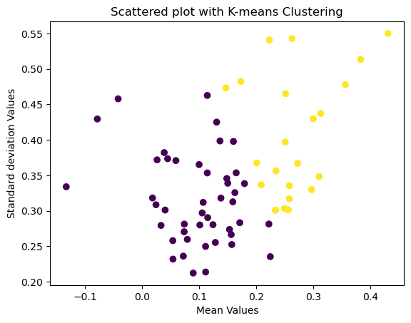
    


```python
kmeans = KMeans(n_clusters=3)
kmeans.fit(data)

plt.scatter(meanList,stdList, c=kmeans.labels_)
plt.title('Scatter Plot with KMeans Clustering')
plt.xlabel('Return')
plt.ylabel('Risk')
plt.show()
```

    C:\Users\91998\anaconda3\Lib\site-packages\sklearn\cluster\_kmeans.py:1412: FutureWarning:
    
    The default value of `n_init` will change from 10 to 'auto' in 1.4. Set the value of `n_init` explicitly to suppress the warning
    
    C:\Users\91998\anaconda3\Lib\site-packages\sklearn\cluster\_kmeans.py:1436: UserWarning:
    
    KMeans is known to have a memory leak on Windows with MKL, when there are less chunks than available threads. You can avoid it by setting the environment variable OMP_NUM_THREADS=1.
    
    


    
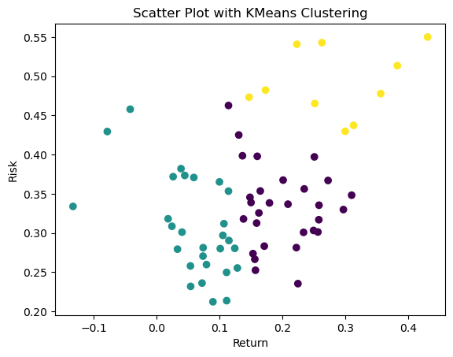
    


```python

# Perform element-wise division
sharpe_ratio = mean_std_df["mean"] / mean_std_df["std"]


mean_std_df["sharpe_ratio"] = sharpe_ratio
```


```python
# mean_std_df.head()
# print(mean_std_df)
rslt_df = mean_std_df[mean_std_df['sharpe_ratio'] > 0.6]
print(rslt_df)
```

       symbol      mean       std  sharpe_ratio
    0    CPRT  0.249181  0.303259      0.821677
    1    COST  0.224311  0.235421      0.952807
    2    AAPL  0.257537  0.316939      0.812576
    6    KLAC  0.299470  0.429754      0.696840
    8    CTAS  0.233289  0.300836      0.775468
    14   MSFT  0.256103  0.301306      0.849975
    16   FAST  0.170833  0.283254      0.603109
    20   IDXX  0.208499  0.336781      0.619095
    23   ODFL  0.257811  0.335484      0.768477
    26   SNPS  0.296634  0.329911      0.899134
    29   INTU  0.234364  0.356238      0.657886
    31   ORLY  0.221825  0.281369      0.788379
    33   ASML  0.250474  0.397122      0.630722
    38   NVDA  0.382430  0.513483      0.744777
    46    AMD  0.430561  0.550066      0.782743
    47   CDNS  0.309732  0.348257      0.889378
    60   DXCM  0.355940  0.477840      0.744894
    63   AVGO  0.272220  0.367037      0.741671
    64   VRSK  0.156801  0.252498      0.620997
    65   FTNT  0.312809  0.437311      0.715301
    


```python
kmeans = KMeans(n_clusters=4)
kmeans.fit(data)

plt.scatter(meanList,stdList, c=kmeans.labels_)
plt.title("Scatter Plot with KMeans Clustering")
plt.xlabel("Mean Values")
plt.ylabel("Standard Deviation Values")
plt.show()
```

    C:\Users\91998\anaconda3\Lib\site-packages\sklearn\cluster\_kmeans.py:1412: FutureWarning:
    
    The default value of `n_init` will change from 10 to 'auto' in 1.4. Set the value of `n_init` explicitly to suppress the warning
    
    C:\Users\91998\anaconda3\Lib\site-packages\sklearn\cluster\_kmeans.py:1436: UserWarning:
    
    KMeans is known to have a memory leak on Windows with MKL, when there are less chunks than available threads. You can avoid it by setting the environment variable OMP_NUM_THREADS=1.
    
    


    
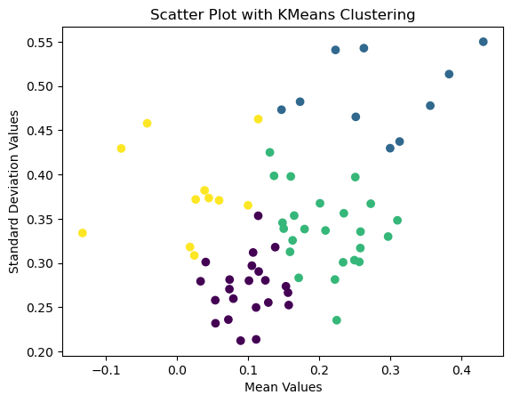
    


```python
from sklearn.cluster import KMeans
from sklearn import metrics
from scipy.spatial.distance import cdist
```


```python
X = np.array(list(zip(meanList,stdList))).reshape(len(meanList), 2)

# Visualizing the data
plt.plot()
plt.xlim([0, .3])
plt.ylim([0, 1])
plt.title('Dataset')
plt.scatter(meanList,stdList)
plt.show()
```


    
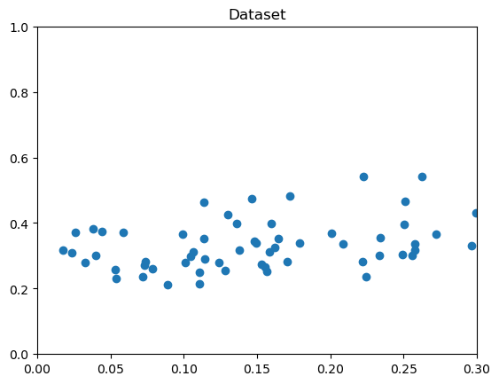
    


```python

distortions = []
inertias = []
mapping1 = {}
mapping2 = {}
K = range(1, 10)

for k in K:
    # Building and fitting the model
    kmeanModel = KMeans(n_clusters=k).fit(X)
    kmeanModel.fit(X)

    distortions.append(sum(np.min(cdist(X, kmeanModel.cluster_centers_,
                                        'euclidean'), axis=1)) / X.shape[0])
    inertias.append(kmeanModel.inertia_)

    mapping1[k] = sum(np.min(cdist(X, kmeanModel.cluster_centers_,
                                   'euclidean'), axis=1)) / X.shape[0]
    mapping2[k] = kmeanModel.inertia_
```

    C:\Users\91998\anaconda3\Lib\site-packages\sklearn\cluster\_kmeans.py:1412: FutureWarning:
    
    The default value of `n_init` will change from 10 to 'auto' in 1.4. Set the value of `n_init` explicitly to suppress the warning
    
    C:\Users\91998\anaconda3\Lib\site-packages\sklearn\cluster\_kmeans.py:1436: UserWarning:
    
    KMeans is known to have a memory leak on Windows with MKL, when there are less chunks than available threads. You can avoid it by setting the environment variable OMP_NUM_THREADS=1.
    
    C:\Users\91998\anaconda3\Lib\site-packages\sklearn\cluster\_kmeans.py:1412: FutureWarning:
    
    The default value of `n_init` will change from 10 to 'auto' in 1.4. Set the value of `n_init` explicitly to suppress the warning
    
    C:\Users\91998\anaconda3\Lib\site-packages\sklearn\cluster\_kmeans.py:1436: UserWarning:
    
    KMeans is known to have a memory leak on Windows with MKL, when there are less chunks than available threads. You can avoid it by setting the environment variable OMP_NUM_THREADS=1.
    
    C:\Users\91998\anaconda3\Lib\site-packages\sklearn\cluster\_kmeans.py:1412: FutureWarning:
    
    The default value of `n_init` will change from 10 to 'auto' in 1.4. Set the value of `n_init` explicitly to suppress the warning
    
    C:\Users\91998\anaconda3\Lib\site-packages\sklearn\cluster\_kmeans.py:1436: UserWarning:
    
    KMeans is known to have a memory leak on Windows with MKL, when there are less chunks than available threads. You can avoid it by setting the environment variable OMP_NUM_THREADS=1.
    
    C:\Users\91998\anaconda3\Lib\site-packages\sklearn\cluster\_kmeans.py:1412: FutureWarning:
    
    The default value of `n_init` will change from 10 to 'auto' in 1.4. Set the value of `n_init` explicitly to suppress the warning
    
    C:\Users\91998\anaconda3\Lib\site-packages\sklearn\cluster\_kmeans.py:1436: UserWarning:
    
    KMeans is known to have a memory leak on Windows with MKL, when there are less chunks than available threads. You can avoid it by setting the environment variable OMP_NUM_THREADS=1.
    
    C:\Users\91998\anaconda3\Lib\site-packages\sklearn\cluster\_kmeans.py:1412: FutureWarning:
    
    The default value of `n_init` will change from 10 to 'auto' in 1.4. Set the value of `n_init` explicitly to suppress the warning
    
    C:\Users\91998\anaconda3\Lib\site-packages\sklearn\cluster\_kmeans.py:1436: UserWarning:
    
    KMeans is known to have a memory leak on Windows with MKL, when there are less chunks than available threads. You can avoid it by setting the environment variable OMP_NUM_THREADS=1.
    
    C:\Users\91998\anaconda3\Lib\site-packages\sklearn\cluster\_kmeans.py:1412: FutureWarning:
    
    The default value of `n_init` will change from 10 to 'auto' in 1.4. Set the value of `n_init` explicitly to suppress the warning
    
    C:\Users\91998\anaconda3\Lib\site-packages\sklearn\cluster\_kmeans.py:1436: UserWarning:
    
    KMeans is known to have a memory leak on Windows with MKL, when there are less chunks than available threads. You can avoid it by setting the environment variable OMP_NUM_THREADS=1.
    
    C:\Users\91998\anaconda3\Lib\site-packages\sklearn\cluster\_kmeans.py:1412: FutureWarning:
    
    The default value of `n_init` will change from 10 to 'auto' in 1.4. Set the value of `n_init` explicitly to suppress the warning
    
    C:\Users\91998\anaconda3\Lib\site-packages\sklearn\cluster\_kmeans.py:1436: UserWarning:
    
    KMeans is known to have a memory leak on Windows with MKL, when there are less chunks than available threads. You can avoid it by setting the environment variable OMP_NUM_THREADS=1.
    
    C:\Users\91998\anaconda3\Lib\site-packages\sklearn\cluster\_kmeans.py:1412: FutureWarning:
    
    The default value of `n_init` will change from 10 to 'auto' in 1.4. Set the value of `n_init` explicitly to suppress the warning
    
    C:\Users\91998\anaconda3\Lib\site-packages\sklearn\cluster\_kmeans.py:1436: UserWarning:
    
    KMeans is known to have a memory leak on Windows with MKL, when there are less chunks than available threads. You can avoid it by setting the environment variable OMP_NUM_THREADS=1.
    
    C:\Users\91998\anaconda3\Lib\site-packages\sklearn\cluster\_kmeans.py:1412: FutureWarning:
    
    The default value of `n_init` will change from 10 to 'auto' in 1.4. Set the value of `n_init` explicitly to suppress the warning
    
    C:\Users\91998\anaconda3\Lib\site-packages\sklearn\cluster\_kmeans.py:1436: UserWarning:
    
    KMeans is known to have a memory leak on Windows with MKL, when there are less chunks than available threads. You can avoid it by setting the environment variable OMP_NUM_THREADS=1.
    
    C:\Users\91998\anaconda3\Lib\site-packages\sklearn\cluster\_kmeans.py:1412: FutureWarning:
    
    The default value of `n_init` will change from 10 to 'auto' in 1.4. Set the value of `n_init` explicitly to suppress the warning
    
    C:\Users\91998\anaconda3\Lib\site-packages\sklearn\cluster\_kmeans.py:1436: UserWarning:
    
    KMeans is known to have a memory leak on Windows with MKL, when there are less chunks than available threads. You can avoid it by setting the environment variable OMP_NUM_THREADS=1.
    
    C:\Users\91998\anaconda3\Lib\site-packages\sklearn\cluster\_kmeans.py:1412: FutureWarning:
    
    The default value of `n_init` will change from 10 to 'auto' in 1.4. Set the value of `n_init` explicitly to suppress the warning
    
    C:\Users\91998\anaconda3\Lib\site-packages\sklearn\cluster\_kmeans.py:1436: UserWarning:
    
    KMeans is known to have a memory leak on Windows with MKL, when there are less chunks than available threads. You can avoid it by setting the environment variable OMP_NUM_THREADS=1.
    
    C:\Users\91998\anaconda3\Lib\site-packages\sklearn\cluster\_kmeans.py:1412: FutureWarning:
    
    The default value of `n_init` will change from 10 to 'auto' in 1.4. Set the value of `n_init` explicitly to suppress the warning
    
    C:\Users\91998\anaconda3\Lib\site-packages\sklearn\cluster\_kmeans.py:1436: UserWarning:
    
    KMeans is known to have a memory leak on Windows with MKL, when there are less chunks than available threads. You can avoid it by setting the environment variable OMP_NUM_THREADS=1.
    
    C:\Users\91998\anaconda3\Lib\site-packages\sklearn\cluster\_kmeans.py:1412: FutureWarning:
    
    The default value of `n_init` will change from 10 to 'auto' in 1.4. Set the value of `n_init` explicitly to suppress the warning
    
    C:\Users\91998\anaconda3\Lib\site-packages\sklearn\cluster\_kmeans.py:1436: UserWarning:
    
    KMeans is known to have a memory leak on Windows with MKL, when there are less chunks than available threads. You can avoid it by setting the environment variable OMP_NUM_THREADS=1.
    
    C:\Users\91998\anaconda3\Lib\site-packages\sklearn\cluster\_kmeans.py:1412: FutureWarning:
    
    The default value of `n_init` will change from 10 to 'auto' in 1.4. Set the value of `n_init` explicitly to suppress the warning
    
    C:\Users\91998\anaconda3\Lib\site-packages\sklearn\cluster\_kmeans.py:1436: UserWarning:
    
    KMeans is known to have a memory leak on Windows with MKL, when there are less chunks than available threads. You can avoid it by setting the environment variable OMP_NUM_THREADS=1.
    
    C:\Users\91998\anaconda3\Lib\site-packages\sklearn\cluster\_kmeans.py:1412: FutureWarning:
    
    The default value of `n_init` will change from 10 to 'auto' in 1.4. Set the value of `n_init` explicitly to suppress the warning
    
    C:\Users\91998\anaconda3\Lib\site-packages\sklearn\cluster\_kmeans.py:1436: UserWarning:
    
    KMeans is known to have a memory leak on Windows with MKL, when there are less chunks than available threads. You can avoid it by setting the environment variable OMP_NUM_THREADS=1.
    
    C:\Users\91998\anaconda3\Lib\site-packages\sklearn\cluster\_kmeans.py:1412: FutureWarning:
    
    The default value of `n_init` will change from 10 to 'auto' in 1.4. Set the value of `n_init` explicitly to suppress the warning
    
    C:\Users\91998\anaconda3\Lib\site-packages\sklearn\cluster\_kmeans.py:1436: UserWarning:
    
    KMeans is known to have a memory leak on Windows with MKL, when there are less chunks than available threads. You can avoid it by setting the environment variable OMP_NUM_THREADS=1.
    
    C:\Users\91998\anaconda3\Lib\site-packages\sklearn\cluster\_kmeans.py:1412: FutureWarning:
    
    The default value of `n_init` will change from 10 to 'auto' in 1.4. Set the value of `n_init` explicitly to suppress the warning
    
    C:\Users\91998\anaconda3\Lib\site-packages\sklearn\cluster\_kmeans.py:1436: UserWarning:
    
    KMeans is known to have a memory leak on Windows with MKL, when there are less chunks than available threads. You can avoid it by setting the environment variable OMP_NUM_THREADS=1.
    
    C:\Users\91998\anaconda3\Lib\site-packages\sklearn\cluster\_kmeans.py:1412: FutureWarning:
    
    The default value of `n_init` will change from 10 to 'auto' in 1.4. Set the value of `n_init` explicitly to suppress the warning
    
    C:\Users\91998\anaconda3\Lib\site-packages\sklearn\cluster\_kmeans.py:1436: UserWarning:
    
    KMeans is known to have a memory leak on Windows with MKL, when there are less chunks than available threads. You can avoid it by setting the environment variable OMP_NUM_THREADS=1.
    
    


```python
for key, val in mapping1.items():
    print(f'{key} : {val}')
```

    1 : 0.11546156678873709
    2 : 0.08684584452485043
    3 : 0.07354925596914012
    4 : 0.061517941238672436
    5 : 0.05345325657807501
    6 : 0.0478579895088749
    7 : 0.04412811609300307
    8 : 0.0405990030052399
    9 : 0.03823760355819277
    


```python

plt.plot(K, distortions, 'bx-')
plt.xlabel('Values of K')
plt.ylabel('Distortion')
plt.title('The Elbow Method using Distortion')
plt.show()
```


    
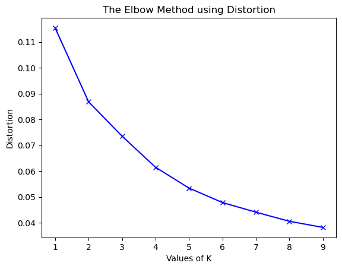
    


```python

for key, val in mapping2.items():
    print(f'{key} : {val}')
```

    1 : 1.19790143928499
    2 : 0.6448991333887291
    3 : 0.45758102926055133
    4 : 0.3277184175270954
    5 : 0.23769069293156792
    6 : 0.19663525677757665
    7 : 0.1628488271033225
    8 : 0.13440169622521064
    9 : 0.11537387731742338
    


```python

plt.plot(K, inertias, 'bx-')
plt.xlabel('Values of K')
plt.ylabel('Inertia')
plt.title('The Elbow Method using Inertia')
plt.show()
```


    
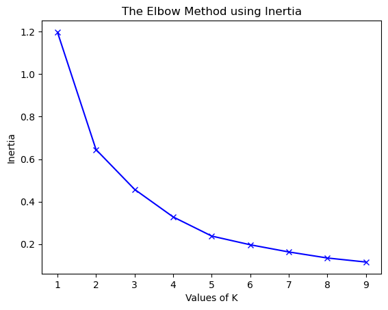
    


```python

import matplotlib.pyplot as plt

# Create a range of values for k
k_range = range(1, 5)

# Initialize an empty list to
# store the inertia values for each k
inertia_values = []

# Fit and plot the data for each k value
for k in k_range:
    kmeans = KMeans(n_clusters=k, \
                    init='k-means++', random_state=42)
    y_kmeans = kmeans.fit_predict(X)
    inertia_values.append(kmeans.inertia_)
    plt.scatter(X[:, 0], X[:, 1], c=y_kmeans)
    plt.scatter(kmeans.cluster_centers_[:, 0],\
                kmeans.cluster_centers_[:, 1], \
                s=100, c='red')
    plt.title('K-means clustering (k={})'.format(k))
    plt.xlabel('Feature 1')
    plt.ylabel('Feature 2')
    plt.show()

# Plot the inertia values for each k
plt.plot(k_range, inertia_values, 'bo-')
plt.title('Elbow Method')
plt.xlabel('Number of clusters (k)')
plt.ylabel('Inertia')
plt.show()
```

    C:\Users\91998\anaconda3\Lib\site-packages\sklearn\cluster\_kmeans.py:1412: FutureWarning:
    
    The default value of `n_init` will change from 10 to 'auto' in 1.4. Set the value of `n_init` explicitly to suppress the warning
    
    C:\Users\91998\anaconda3\Lib\site-packages\sklearn\cluster\_kmeans.py:1436: UserWarning:
    
    KMeans is known to have a memory leak on Windows with MKL, when there are less chunks than available threads. You can avoid it by setting the environment variable OMP_NUM_THREADS=1.
    
    


    
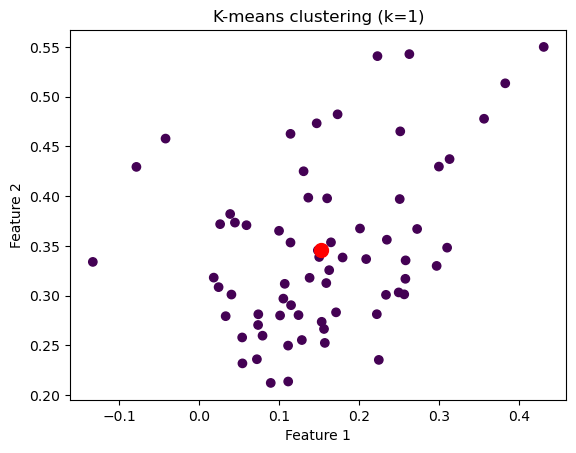
    


    C:\Users\91998\anaconda3\Lib\site-packages\sklearn\cluster\_kmeans.py:1412: FutureWarning:
    
    The default value of `n_init` will change from 10 to 'auto' in 1.4. Set the value of `n_init` explicitly to suppress the warning
    
    C:\Users\91998\anaconda3\Lib\site-packages\sklearn\cluster\_kmeans.py:1436: UserWarning:
    
    KMeans is known to have a memory leak on Windows with MKL, when there are less chunks than available threads. You can avoid it by setting the environment variable OMP_NUM_THREADS=1.
    
    


    
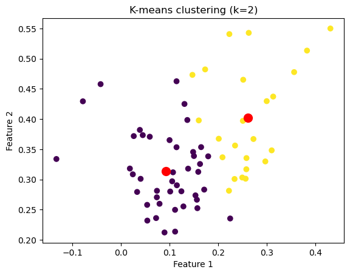
    


    C:\Users\91998\anaconda3\Lib\site-packages\sklearn\cluster\_kmeans.py:1412: FutureWarning:
    
    The default value of `n_init` will change from 10 to 'auto' in 1.4. Set the value of `n_init` explicitly to suppress the warning
    
    C:\Users\91998\anaconda3\Lib\site-packages\sklearn\cluster\_kmeans.py:1436: UserWarning:
    
    KMeans is known to have a memory leak on Windows with MKL, when there are less chunks than available threads. You can avoid it by setting the environment variable OMP_NUM_THREADS=1.
    
    


    

    


    C:\Users\91998\anaconda3\Lib\site-packages\sklearn\cluster\_kmeans.py:1412: FutureWarning:
    
    The default value of `n_init` will change from 10 to 'auto' in 1.4. Set the value of `n_init` explicitly to suppress the warning
    
    C:\Users\91998\anaconda3\Lib\site-packages\sklearn\cluster\_kmeans.py:1436: UserWarning:
    
    KMeans is known to have a memory leak on Windows with MKL, when there are less chunks than available threads. You can avoid it by setting the environment variable OMP_NUM_THREADS=1.
    
    


    
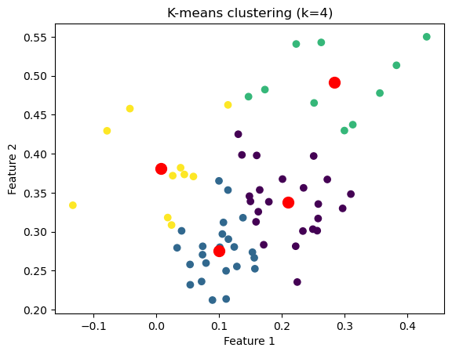
    


    
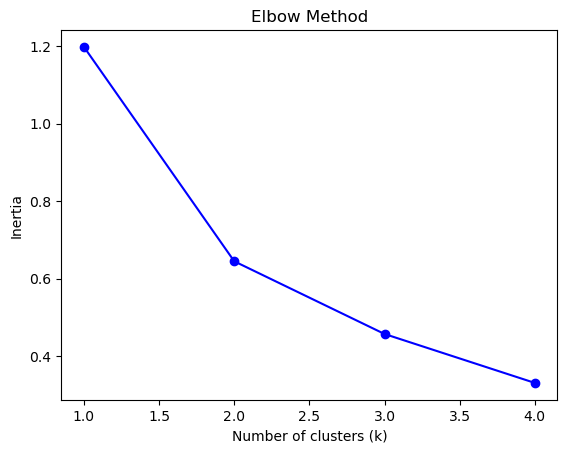
    


```python

```
